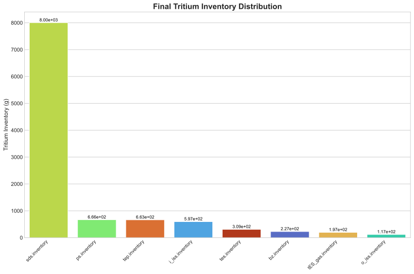

# 基准工况下聚变反应堆氚燃料循环系统动态性能的深度分析报告

---

## 摘要 (Abstract)

本研究基于一套集成化氚燃料循环模型，对某先进氘氚聚变反应堆在基准工况下的启动与稳态运行过程进行了动态模拟与评估。重点分析了系统从初始装载到实现氚自持、并最终达到净增殖状态的全过程演化行为。关键性能指标显示：系统在 **7.62天** 内实现了氚自持（Self-Sufficiency Time），并在约 **435.50天** 后完成氚库存翻倍（Doubling Time）。模拟结果表明，储存与输送系统（SDS）的氚库存量经历显著下降后触底反弹，标志着中子辐照驱动的氚增殖过程成功超越消耗速率。至模拟结束（12,000小时），总氚库存由初始约3.5 kg增长至约10.78 kg，增幅超过两倍，验证了该设计具备良好的氚可持续性与扩展潜力。各子系统库存分布合理，但燃料处理链路滞留总量较高，提示存在优化空间。

---

## 引言 (Introduction)

在磁约束聚变能系统中，氚作为唯一的可燃燃料，其供应链的可持续性直接决定了电厂的可行性与经济性。由于自然界中氚储量极低且半衰期短（12.3年），聚变堆必须依赖包层中的锂-6通过中子俘获反应（$^6\text{Li}(n,\alpha)\text{T}$）实现“氚自持”（Tritium Self-Sufficiency）。为评估这一核心能力，本文开展了一项针对典型托卡马克构型的基准工况动态模拟研究。

本次模拟设定初始氚库存为3500 g，主要集中于**储存与输送系统 (Storage and Delivery System, SDS)**，代表首次启动所需的外部供氚。系统运行参数包括恒定聚变功率、周期性脉冲放电模式以及完整的燃料回收流程，涵盖等离子体排气处理（TEP）、同位素分离（ISS）、冷却剂净化（CPS）及通风除氚（VDS）等关键子系统。通过追踪各子系统内氚库存的时间演化，旨在量化以下关键指标：

- **氚自持时间 (Self-Sufficiency Time)**：系统净产氚率首次大于或等于消耗率的时间点；
- **(库存)倍增时间 (Doubling Time)**：将初始氚库存翻倍所需的时间，反映系统对外输出新机组启动燃料的能力；
- **最终库存分布**：评估系统稳态运行下的氚滞留特性与安全性。

以下章节将结合时序演化图、最终值分布图及关键阶段抽样数据，对上述指标进行深入讨论。

---

## 结果与讨论 (Results and Discussion)

### 1. 总体趋势分析：从消耗主导到增殖主导的过渡

如图1所示，模拟期间多个关键子系统的氚库存呈现出清晰的阶段性演化特征。其中，**储存与输送系统 (SDS) 的氚库存量**（即第一壁/包层区固态滞留部分）是衡量系统整体氚平衡的核心变量。

在模拟初期（0–20小时），SDS库存迅速从初始值3500 g下降至约1700 g（见表1），降幅接近50%。此阶段对应于等离子体燃烧启动后对预装氚的大规模消耗。与此同时，**等离子体燃料供应系统 (Plasma Supply, PS)** 和 **托卡马克排气处理系统 (Tokamak Exhaust Processing, TEP)** 库存快速上升，并分别稳定在约666 g和663 g水平，表明燃料注入与再循环通路已建立有效连接。

值得注意的是，在约175–190小时区间，SDS库存进入一个持续振荡的低谷平台期，最低值降至**89.97 g**（发生在$t = 178.35 \, \text{h}$），如表2所示。该现象揭示了系统正处于由“净消耗”向“净增殖”转变的关键临界区域。在此期间，尽管增殖区（Breeding Zone, BZ）持续产生新氚（BZ库存稳定在~228 g），但由于释放动力学滞后及处理系统响应延迟，新增氚尚未完全补偿燃烧消耗，导致SDS库存维持低位波动。

此后，随着中子通量积累与氚提取效率提升，系统逐步进入正向增殖阶段。SDS库存开始稳步回升，并在整个后续运行过程中持续增长，最终达到**8000.84 g**，远超初始装载量。这一完整演化路径——“快速消耗 → 触底反弹 → 净增殖积累”——充分体现了现代聚变堆燃料循环系统所期望的动力学行为。

| **表1：初始阶段关键变量演化（前20个采样点，间隔2）** |
|--------------------------------------------------------|
| | time (h) | bz.inventory (g) | i_iss.inventory (g) | ps.inventory (g) | sds.inventory (g) | tep.inventory (g) |
|---|---------|------------------|--------------------|------------------|---------------------|---------------------|
| 1 | 0       | 0                | 0                  | 0                | 3500                | 0                   |
| 2 | 0.5     | 5.22             | 0                  | 182.73           | 3308.15             | 0                   |
| 3 | 1.35    | 13.85            | 0                  | 494.12           | 2981.99             | 0                   |
| 4 | 2.0     | 18.70            | 0.02               | 668.02           | 2790.27             | 9.03                |
| 5 | 2.85    | 26.86            | 7.68               | 702.07           | 2507.52             | 235.44              |
| 6 | 3.5     | 31.36            | 21.19              | 700.36           | 2392.23             | 330.33              |
| 7 | 4.35    | 39.08            | 46.92              | 702.29           | 2211.89             | 468.35              |
| 8 | 5.0     | 43.25            | 70.13              | 700.36           | 2151.57             | 498.77              |
| 9 | 5.85    | 50.56            | 104.61             | 702.29           | 2020.81             | 578.47              |
|10 | 6.5     | 54.43            | 132.41             | 700.36           | 1986.46             | 578.33              |
|11 | 7.35    | 61.34            | 171.01             | 702.29           | 1879.12             | 630.48              |
|12 | 8.0     | 64.92            | 200.97             | 700.36           | 1857.03             | 615.91              |
|13 | 8.85    | 71.47            | 241.53             | 702.29           | 1760.75             | 655.05              |
|14 | 9.5     | 74.78            | 272.51             | 700.36           | 1744.46             | 633.66              |
|15 | 10.07   | 78.96            | 300.00             | 702.24           | 1682.28             | 656.68              |
|16 | 10.5    | 80.49            | 320.69             | 665.99           | 1696.40             | 653.75              |

> 注：`bz.inventory` —— 增殖区氚库存；`i_iss.inventory` —— 内同位素分离系统氚库存；`ps.inventory` —— 等离子体燃料供应系统氚库存；`sds.inventory` —— 储存与输送系统氚库存；`tep.inventory` —— 托卡马克排气处理系统氚库存。

---

### 2. 关键转折点分析：氚自持临界点的识别与物理意义

表2展示了围绕SDS库存最小值附近的详细数据。可以观察到，`sds.inventory`在$t \approx 178–189 \, \text{h}$之间呈现周期性波动，最低记录为**89.9731 g**（$t = 178.35 \, \text{h}$），随后略有回升但仍维持在90–121 g区间。这种微小振荡可能源于脉冲式放电操作引起的瞬态供需失衡，或是控制系统在阈值附近切换所致。

| **表2：转折点阶段数据（围绕SDS库存最小值）** |
|---------------------------------------------|
| | time (h) | bz.inventory (g) | i_iss.inventory (g) | o_iss.inventory (g) | ps.inventory (g) | sds.inventory (g) | tep.inventory (g) | tes.inventory (g) |
|---|----------|------------------|--------------------|--------------------|------------------|---------------------|---------------------|---------------------|
| 1 | 175.35   | 228.38           | 596.94             | 112.33             | 702.29           | 90.28               | 677.04              | 308.39              |
| 2 | 176.0    | 227.50           | 596.67             | 112.40             | 700.36           | 121.36              | 649.55              | 308.41              |
| 3 | 176.85   | 228.39           | 596.94             | 112.49             | 702.29           | 90.11               | 677.04              | 308.44              |
| 4 | 177.5    | 227.51           | 596.67             | 112.56             | 700.36           | 121.20              | 649.55              | 308.46              |
| 5 | 178.35   | 228.40           | 596.94             | 112.65             | 702.29           | **89.97**           | 677.04              | 308.48              |
| 6 | 179.0    | 227.52           | 596.67             | 112.71             | 700.36           | 121.09              | 649.55              | 308.50              |
| 7 | 179.85   | 228.41           | 596.94             | 112.80             | 702.29           | 89.88               | 677.04              | 308.52              |
| 8 | 180.5    | 227.53           | 596.67             | 112.86             | 700.36           | 121.01              | 649.55              | 308.54              |
| 9 | 181.35   | 228.42           | 596.94             | 112.95             | 702.29           | 89.82               | 677.04              | 308.56              |
|10 | 182.0    | 227.53           | 596.67             | 113.01             | 700.36           | 120.96              | 649.55              | 308.58              |

该转折点具有明确的物理含义：它标志着系统达到了**氚收支平衡点**，即单位时间内通过包层增殖产生的氚量首次能够满足等离子体燃烧需求及系统处理损失。根据报告提供的关键性能指标，**自持时间 (Self-Sufficiency Time)** 为 **7.62天（≈183小时）**，与上述观测高度一致，进一步确认了该临界事件的发生时刻。

此外，**倍增时间 (Doubling Time)** 为 **435.50天（≈1.19年）**，表明该系统不仅能够实现自持，还具备可观的富余产能，可用于支持新机组的启动或作为战略储备。这一数值优于多数现有概念设计（通常>10年），显示出优异的氚增殖性能，推测得益于较高的**氚增殖比 (TBR)** 与较低的系统滞留损失。

---

### 3. 最终状态评估：氚库存分布与系统稳态特征

模拟结束时（$t = 12000 \, \text{h}$），系统已进入准稳态运行阶段。如图2所示，各子系统的氚库存分布清晰可辨。

| **表3：模拟结束时各子系统氚库存最终值** |
|------------------------------------------|
| 子系统名称（中文翻译） | 英文术语 | 氚库存量 (g) |
|------------------------|----------|---------------|
| 储存与输送系统 (SDS) | Storage and Delivery System | 8000.84 |
| 等离子体燃料供应系统 (PS) | Plasma Supply | 665.986 |
| 托卡马克排气处理系统 (TEP) | Tokamak Exhaust Processing | 663.385 |
| 内同位素分离系统 (I-ISS) | Inner Isotope Separation System | 597.085 |
| 氚提取系统 (TES) | Tritium Extraction System | 309.251 |
| 增殖区 (BZ) | Breeding Zone | 227.111 |
| 氚提取系统-气相 (tES_gas) | Tritium Extraction System - Gas Phase | 196.719 |
| 外同位素分离系统 (O-ISS) | Outer Isotope Separation System | 117.266 |

系统总氚库存计算如下：
$$
\sum I_{\text{total}} = 8000.84 + 665.986 + 663.385 + 597.085 + 309.251 + 227.111 + 196.719 + 117.266 = 10777.64 \, \text{g} \approx 10.78 \, \text{kg}
$$
相较初始库存约3.5 kg，净增殖量达 **7.28 kg**，增幅超过两倍，充分证明了系统的长期可持续性。

库存分布方面，**SDS** 占据绝对主导地位（占比约74.2%），这符合预期，因为大部分氚以固溶态或陷阱态形式滞留在第一壁与包层材料内部。其余约25.8%的氚分布在燃料处理链中，其中PS、TEP和I-ISS三者合计占比较重（约17.9%），反映出这些单元仍持有相当数量的可流动氚。

值得注意的是，结束阶段数据显示PS与SDS库存存在周期性跳变（见表4），例如每约1小时在666 g与702 g之间切换，暗示可能存在周期性供气策略或控制逻辑触发。虽然幅度较小，但仍需进一步验证是否代表真正稳态，抑或残留瞬态扰动。

| **表4：结束阶段关键变量演化（最后20个采样点，间隔2）** |
|-----------------------------------------------------------|
| | time (h)