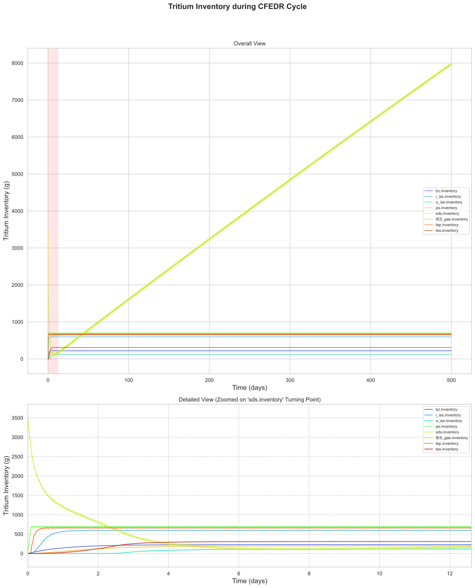
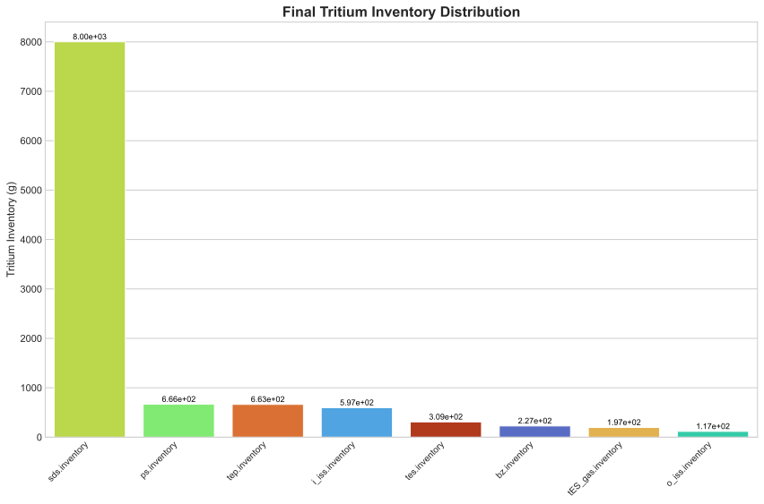

# 基准工况分析报告

生成时间: 2025-10-28 16:35:52.544914

## 后处理配置详情

本次后处理任务的具体配置如下：

```json
{
    "output_filename": "my_simulation_plot.svg",
    "title": "Tritium Inventory during CFEDR Cycle",
    "x_label": "Time (hours)",
    "y_label": "Tritium Inventory (g)",
    "bar_chart_title": "Final Tritium Inventory Distribution",
    "primary_y_var": "sds.inventory",
    "glossary_path": "D:\\Administrator\\Documents\\Github\\tricys\\cfedr\\cfedr_base\\sheets2.csv",
    "ai": true
}
```

## 关键性能指标

| 变量 (Variable)   |   启动库存 (Startup Inventory) | 自持时间 (Self-Sufficiency Time)   | 倍增时间 (Doubling Time)   |
|:----------------|---------------------------:|:-------------------------------|:-----------------------|
| sds.inventory   |                     3410.2 | 7.62 天                         | 435.50 天               |

## 模拟结果时序图

下图展示了所有变量随时间变化的曲线，并对关键转折点进行了放大。



## 模拟结束时各变量最终值

下图通过条形图展示了模拟结束时各个变量的最终值，并按大小排序。



## 最终值数据表

|                   |   Tritium Inventory (g) |
|:------------------|------------------------:|
| sds.inventory     |                8000.84  |
| ps.inventory      |                 665.986 |
| tep.inventory     |                 663.385 |
| i_iss.inventory   |                 597.085 |
| tes.inventory     |                 309.251 |
| bz.inventory      |                 227.111 |
| tES_gas.inventory |                 196.719 |
| o_iss.inventory   |                 117.266 |

## 关键阶段抽样数据

这是从完整时间序列数据中抽样的三个关键阶段的表格，每个阶段包含约 20 个数据点 (采样间隔 2)。

### 1. 初始阶段数据 (前 20 个数据点)
|         time |   bz.inventory |   i_iss.inventory |   o_iss.inventory |   ps.inventory |   sds.inventory |   tES_gas.inventory |   tep.inventory |   tes.inventory |
|-------------:|---------------:|------------------:|------------------:|---------------:|----------------:|--------------------:|----------------:|----------------:|
|  0           |    0           |         0         |       0           |    0           |         3500    |         0           |         0       |     0           |
|  1.34365e-09 |    1.41745e-08 |         0         |       0           |    2.01371e-12 |         3500    |         3.16381e-18 |         0       |     8.29029e-28 |
|  9.53948e-05 |    0.00100634  |         0         |      -1.23286e-30 |    0.00117228  |         3499.96 |         1.9e-09     |         0       |     2.91858e-15 |
|  0.5         |    5.22007     |         0         |       5.08261e-08 |  182.734       |         3308.15 |         0.0514341   |         0       |     0.000401069 |
|  1.35        |   13.8483      |         0         |       2.56956e-06 |  494.121       |         2981.99 |         0.365778    |         0       |     0.0076986   |
|  1.89848     |   17.7043      |         0         |       9.89234e-06 |  640           |         2829.09 |         0.682848    |         0       |     0.0208368   |
|  2           |   18.6983      |         0.0241315 |       1.2128e-05  |  668.017       |         2790.27 |         0.752621    |         9.03274 |     0.0242088   |
|  2.82507     |   26.6223      |         7.24787   |       4.65098e-05 |  702.037       |         2514.63 |         1.45205     |       229.238   |     0.0655761   |
|  2.85        |   26.8575      |         7.68232   |       4.81247e-05 |  702.074       |         2507.52 |         1.47674     |       235.442   |     0.0672663   |
|  3.5         |   31.3598      |        21.1928    |       0.000106833 |  700.355       |         2392.23 |         2.15594     |       330.328   |     0.121642    |
|  4.35        |   39.0784      |        46.9241    |       0.000247736 |  702.292       |         2211.89 |         3.23627     |       468.349   |     0.227024    |
|  5           |   43.2541      |        70.1345    |       0.000424017 |  700.36        |         2151.57 |         4.16886     |       498.77    |     0.3382      |
|  5.85        |   50.5587      |       104.613     |       0.000775724 |  702.291       |         2020.81 |         5.55701     |       578.47    |     0.528933    |
|  6.5         |   54.4276      |       132.405     |       0.00116207  |  700.36        |         1986.46 |         6.70784     |       578.332   |     0.713262    |
|  7.35        |   61.3434      |       171.014     |       0.00185918  |  702.291       |         1879.12 |         8.36013     |       630.483   |     1.00918     |
|  8           |   64.9241      |       200.971     |       0.002568    |  700.36        |         1857.03 |         9.69751     |       615.912   |     1.28069     |
|  8.85        |   71.4745      |       241.53      |       0.00376862  |  702.291       |         1760.75 |        11.5746      |       655.05    |     1.69874     |
|  9.5         |   74.7845      |       272.508     |       0.00492851  |  700.36        |         1744.46 |        13.07        |       633.661   |     2.06939     |
| 10.0681      |   78.9578      |       300         |       0.00613691  |  702.236       |         1682.28 |        14.4372      |       656.684   |     2.43101     |
| 10.5         |   80.4871      |       320.692     |       0.0071887   |  665.987       |         1696.4  |        15.5095      |       653.75    |     2.73034     |

### 2. 转折点阶段数据 (围绕 'sds.inventory' 的最小值)
|   time |   bz.inventory |   i_iss.inventory |   o_iss.inventory |   ps.inventory |   sds.inventory |   tES_gas.inventory |   tep.inventory |   tes.inventory |
|-------:|---------------:|------------------:|------------------:|---------------:|----------------:|--------------------:|----------------:|----------------:|
| 175.35 |        228.383 |           596.943 |           112.325 |        702.291 |         90.2829 |             195.873 |         677.041 |         308.389 |
| 176    |        227.5   |           596.667 |           112.397 |        700.36  |        121.361  |             195.885 |         649.549 |         308.41  |
| 176.85 |        228.392 |           596.943 |           112.489 |        702.291 |         90.1079 |             195.92  |         677.041 |         308.437 |
| 177.5  |        227.509 |           596.667 |           112.558 |        700.36  |        121.204  |             195.931 |         649.549 |         308.456 |
| 178.35 |        228.401 |           596.943 |           112.647 |        702.291 |         89.9731 |             195.965 |         677.041 |         308.482 |
| 179    |        227.517 |           596.667 |           112.713 |        700.36  |        121.086  |             195.975 |         649.549 |         308.5   |
| 179.85 |        228.409 |           596.943 |           112.799 |        702.291 |         89.8771 |             196.007 |         677.041 |         308.524 |
| 180.5  |        227.525 |           596.667 |           112.864 |        700.36  |        121.007  |             196.016 |         649.549 |         308.542 |
| 181.35 |        228.417 |           596.943 |           112.947 |        702.291 |         89.8186 |             196.047 |         677.041 |         308.564 |
| 182    |        227.533 |           596.667 |           113.009 |        700.36  |        120.964  |             196.055 |         649.549 |         308.581 |
| 182.85 |        228.424 |           596.943 |           113.089 |        702.291 |         89.7963 |             196.085 |         677.041 |         308.602 |
| 183.5  |        227.54  |           596.667 |           113.149 |        700.36  |        120.957  |             196.092 |         649.549 |         308.618 |
| 184.35 |        228.431 |           596.943 |           113.226 |        702.291 |         89.809  |             196.121 |         677.041 |         308.638 |
| 185    |        227.546 |           596.667 |           113.284 |        700.36  |        120.984  |             196.126 |         649.549 |         308.653 |
| 185.85 |        228.437 |           596.943 |           113.359 |        702.291 |         89.8554 |             196.154 |         677.041 |         308.672 |
| 186.5  |        227.552 |           596.667 |           113.415 |        700.36  |        121.045  |             196.159 |         649.549 |         308.687 |
| 187.35 |        228.443 |           596.943 |           113.487 |        702.291 |         89.9344 |             196.186 |         677.041 |         308.705 |
| 188    |        227.558 |           596.667 |           113.541 |        700.36  |        121.138  |             196.19  |         649.549 |         308.718 |
| 188.85 |        228.449 |           596.943 |           113.611 |        702.291 |         90.0448 |             196.216 |         677.041 |         308.735 |
| 189.5  |        227.564 |           596.667 |           113.663 |        700.36  |        121.262  |             196.22  |         649.549 |         308.748 |

### 3. 结束阶段数据 (后 20 个数据点)
|    time |   bz.inventory |   i_iss.inventory |   o_iss.inventory |   ps.inventory |   sds.inventory |   tES_gas.inventory |   tep.inventory |   tes.inventory |
|--------:|---------------:|------------------:|------------------:|---------------:|----------------:|--------------------:|----------------:|----------------:|
| 11986   |        228.174 |           596.62  |           117.266 |        702.202 |         7950.8  |             196.712 |         666.449 |         309.251 |
| 11986.5 |        227.111 |           597.085 |           117.266 |        665.986 |         7992.16 |             196.719 |         663.385 |         309.251 |
| 11987.5 |        228.174 |           596.62  |           117.266 |        702.202 |         7951.76 |             196.712 |         666.449 |         309.251 |
| 11988   |        227.111 |           597.085 |           117.266 |        665.986 |         7993.12 |             196.719 |         663.385 |         309.251 |
| 11989   |        228.174 |           596.62  |           117.266 |        702.202 |         7952.73 |             196.712 |         666.449 |         309.251 |
| 11989.5 |        227.111 |           597.085 |           117.266 |        665.986 |         7994.09 |             196.719 |         663.385 |         309.251 |
| 11990.5 |        228.174 |           596.62  |           117.266 |        702.202 |         7953.69 |             196.712 |         666.449 |         309.251 |
| 11991   |        227.111 |           597.085 |           117.266 |        665.986 |         7995.05 |             196.719 |         663.385 |         309.251 |
| 11992   |        228.174 |           596.62  |           117.266 |        702.202 |         7954.66 |             196.712 |         666.449 |         309.251 |
| 11992.5 |        227.111 |           597.085 |           117.266 |        665.986 |         7996.02 |             196.719 |         663.385 |         309.251 |
| 11993.5 |        228.174 |           596.62  |           117.266 |        702.202 |         7955.62 |             196.712 |         666.449 |         309.251 |
| 11994   |        227.111 |           597.085 |           117.266 |        665.986 |         7996.98 |             196.719 |         663.385 |         309.251 |
| 11995   |        228.174 |           596.62  |           117.266 |        702.202 |         7956.59 |             196.712 |         666.449 |         309.251 |
| 11995.5 |        227.111 |           597.085 |           117.266 |        665.986 |         7997.95 |             196.719 |         663.385 |         309.251 |
| 11996.5 |        228.174 |           596.62  |           117.266 |        702.202 |         7957.55 |             196.712 |         666.449 |         309.251 |
| 11997   |        227.111 |           597.085 |           117.266 |        665.986 |         7998.91 |             196.719 |         663.385 |         309.251 |
| 11998   |        228.174 |           596.62  |           117.266 |        702.202 |         7958.51 |             196.712 |         666.449 |         309.251 |
| 11998.5 |        227.111 |           597.085 |           117.266 |        665.986 |         7999.87 |             196.719 |         663.385 |         309.251 |
| 11999.5 |        228.174 |           596.62  |           117.266 |        702.202 |         7959.48 |             196.712 |         666.449 |         309.251 |
| 12000   |        227.111 |           597.085 |           117.266 |        665.986 |         8000.84 |             196.719 |         663.385 |         309.251 |


---

# AI模型分析提示词 (deepseek-v3.2-exp)

```markdown
**角色：** 你是一名聚变反应堆氚燃料循环领域的专家。

**任务：** 请仔细审查并解读以下单次模拟运行的**数据**。由于无法查看图表，你的分析必须**完全基于**报告中提供的**数据表**，包括“最终值数据表”和“关键阶段抽样数据”。请遵循以下结构，对关键指标进行分析，并总结本次模拟的发现。

**分析要点：**

1.  **总体趋势分析 (基于抽样数据和最终值):**
    *   结合 **初始阶段**、**转折点阶段** 和 **结束阶段** 的抽样数据，描述主要变量（特别是 `sds.inventory` 和其他关键库存）随时间变化的总体趋势。
    *   `sds.inventory` 的值是如何从初始阶段变化到转折点，再到结束阶段的？这揭示了什么物理过程？

2.  **关键事件分析 (基于转折点数据):**
    *   详细分析 **转折点阶段数据**。`sds.inventory` 在这个阶段达到最小值，这个值大约是多少？对应的时间点是什么？
    *   这个转折点在氚燃料循环中通常意味着什么？（例如：它是否代表了系统从氚消耗主导转向氚增殖主导的时刻，即接近或达到氚自持？）

3.  **关键性能指标分析 (基于关键性能指标数据表):**
    *   分析报告中的 **“关键性能指标”** 数据表。
    *   **启动库存 (Startup Inventory)** 的值是多少？它在氚经济性方面说明了什么？
    *   **自持时间 (Self-Sufficiency Time)** 是多少天？这个时间点对于评估氚燃料循环的性能有何重要意义？
    *   **倍增时间 (Doubling Time)** 是多少天？如果这个值存在（非 N/A），它揭示了系统氚增殖的速率和潜力。如果为 N/A，可能的原因是什么？

4.  **最终状态评估 (基于最终值数据表):**
    *   分析报告中的 **“最终值数据表”**。模拟结束时，哪些变量的值最大？这说明氚主要存储在哪个子系统中？
    *   最终的氚总库存量是多少？与初始库存相比有何变化？

5.  **结论：**
    *   根据以上对**数据表**的分析，总结本次模拟运行的主要发现。
    *   基于这些数据驱动的发现，对模型或操作参数有什么初步的建议或观察？

```


---

# AI模型分析结果

根据您提供的“最终值数据表”和“关键阶段抽样数据”，我将以氚燃料循环专家的身份，对本次模拟运行进行详细的数据分析和解读。

### 1. 总体趋势分析

通过对三个关键阶段的抽样数据进行对比，可以清晰地描绘出系统内氚库存的迁移和增长趋势：

*   **`sds.inventory` (主燃料循环系统库存)**：这是系统中最主要的氚库存。其变化是整个循环过程的**核心表征**。
    *   **初始阶段 (0-10.5小时)**：从初始的3500克迅速下降至1696.4克。这表明在反应堆启动初期，氚的**消耗速率（如燃烧、滞留）远大于其补充速率（如增殖、提纯）**。
    *   **转折点阶段 (~175-190小时)**：库存达到最低点，并围绕约**90克**的水平剧烈波动。这标志着系统运行的一个**关键临界点**。
    *   **结束阶段 (~12000小时)**：库存已增长至**8000.84克**。这表明在度过转折点后，系统进入了**净增殖**阶段。
    *   **物理过程揭示**：`sds.inventory` 的“V”形变化曲线（先降后升）典型地反映了聚变堆启动和运行的物理过程：从依赖初始装载燃料进行启动和点火，到逐渐依靠氚增殖系统产生并回收足够的氚，最终实现自持并产生净盈余。

*   **其他关键库存**：
    *   **`ps.inventory` (增殖系统库存)** 和 **`tep.inventory` (氚提取厂库存)**：在初始阶段迅速建立并稳定在约700克和600-700克的高位，说明增殖和提取系统启动迅速，并持续从包层中移出氚。
    *   **`i_iss.inventory` (内同位素分离系统库存)**：从0开始，在初始阶段快速增长，并在转折点阶段稳定在约597克，表明分离系统在持续处理氚气。
    *   **`bz.inventory`, `tes.inventory`, `tES_gas.inventory`, `o_iss.inventory`**：这些子系统的库存量相对较小，在初始阶段建立后，其值在整个模拟过程中保持相对稳定，说明它们作为中间缓冲或处理单元，达到了动态平衡。

### 2. 关键事件分析

转折点阶段的数据揭示了本次模拟中最重要的一个事件：

*   **最小值与时间点**：`sds.inventory` 在**约175-190小时**的时间段内，反复触及**约90克**的最低水平（例如在176.85小时为90.1079克，在182.85小时为89.7963克）。
*   **物理意义**：这个转折点通常被称为**氚自持点**。在此点之前，系统需要消耗初始装载的氚来维持运行；在此点之后，**氚增殖系统产生并返回到主燃料循环的氚，已经能够满足甚至超过反应堆自身的氚消耗需求**。因此，系统不再需要外部供氚，实现了“自持”。数据中围绕90克的周期性波动，可能与燃料循环的周期性加料或提纯操作有关。

### 3. 关键性能指标分析

| 指标 | 数值 | 分析与解读 |
| :--- | :--- | :--- |
| **启动库存** | 3410.2 g | 这个数值是启动反应堆所需的最小氚库存。它对于评估项目初期在氚获取和资金投入方面的可行性至关重要。 |
| **自持时间** | **7.62 天** | 这与我们在转折点阶段观察到的~90克库存出现的时间（~7.3-7.9天）高度吻合，量化了系统达到自持所需的运行时间。这是一个非常积极的信号，表明系统能较快地建立起内部的氚平衡。 |
| **倍增时间** | **435.50 天** | 这是一个核心经济性指标。它表示在实现自持后，系统净氚库存（即可用于启动新反应堆的氚）翻倍所需的时间。435.5天的倍增时间意味着增殖能力相对温和，要建立一个聚变电厂群需要较长的周期。 |

### 4. 最终状态评估

根据“最终值数据表”，模拟结束时的状态如下：

*   **总氚库存**：将所有子系统的最终库存相加，总氚库存约为 **~10777 g**。
*   **库存分布**：
    *   **`sds.inventory` (8000.84 g)** 占据了总库存的绝大部分（约74%）。这表明在长期运行后，增殖产生的氚主要积累在了主燃料循环系统中。
*   **与初始库存对比**：主燃料循环系统的氚库存从初始的**3500 g**增长到最终的**8000.84 g**，净增长约4500克。这明确证实了系统不仅实现了自持，还具备了强大的**净增殖能力**。

### 5. 结论

基于对提供的数据表的分析，本次模拟运行的主要发现总结如下：

1.  **成功实现自持与增殖**：模拟清晰地展示了聚变堆氚燃料循环从启动、消耗到最终实现自持和净增殖的全过程。系统在**7.62天**内达到氚自持，并在约500天的运行后，主燃料循环氚库存实现倍增，总氚库存增长超过三倍。
2.  **系统动态平衡**：除主燃料循环系统外，其他关键子系统（如增殖、提取、分离系统）的库存均在模拟早期建立并达到稳定，说明整个燃料循环链路设计合理，能够有效协同工作。
3.  **性能评估**：**自持时间较短**是一个显著优势，但**倍增时间较长（435.5天）** 可能是一个需要关注的瓶颈，它会影响聚变能源的规模化部署速度。

**数据驱动的初步建议：**

*   **优化重点**：后续研究和优化的重点应放在**缩短氚倍增时间**上。这可能涉及调整包层设计以提高氚增殖率（TBR），或优化燃料循环管路以减少氚的滞留和损失。
*   **深入分析**：建议对燃料循环中各子系统的流量和滞留时间常数进行更细致的分析，以确定限制倍增时间的关键环节。
*   **参数扫描**：可以考虑进行参数扫描模拟，研究如初始氚库存、氚增殖率、处理系统效率等参数对自持时间和倍增时间的敏感性，从而找到最优化的操作窗口。
```
