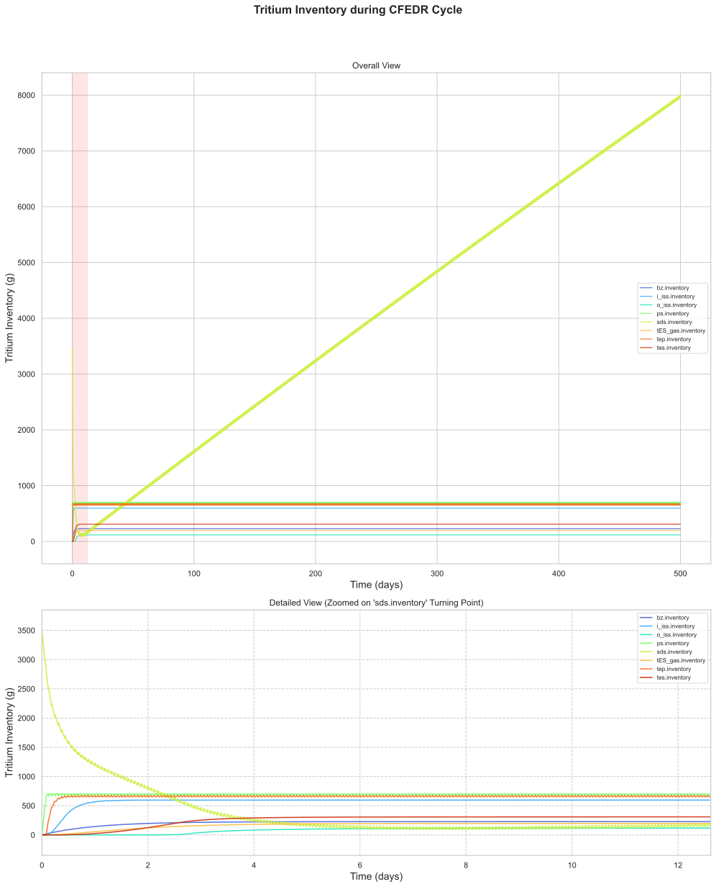

# 基准工况分析报告

生成时间: 2025-10-28 16:35:52.544914

## 后处理配置详情

本次后处理任务的具体配置如下：

```json
{
    "output_filename": "my_simulation_plot.svg",
    "title": "Tritium Inventory during CFEDR Cycle",
    "x_label": "Time (hours)",
    "y_label": "Tritium Inventory (g)",
    "bar_chart_title": "Final Tritium Inventory Distribution",
    "primary_y_var": "sds.inventory",
    "glossary_path": "D:\\Administrator\\Documents\\Github\\tricys\\cfedr\\cfedr_base\\sheets2.csv",
    "ai": true
}
```

## 关键性能指标

| 变量 (Variable)   |   启动库存 (Startup Inventory) | 自持时间 (Self-Sufficiency Time)   | 倍增时间 (Doubling Time)   |
|:----------------|---------------------------:|:-------------------------------|:-----------------------|
| sds.inventory   |                     3410.2 | 7.62 天                         | 435.50 天               |

## 模拟结果时序图

下图展示了所有变量随时间变化的曲线，并对关键转折点进行了放大。



## 模拟结束时各变量最终值

下图通过条形图展示了模拟结束时各个变量的最终值，并按大小排序。


## 最终值数据表

|                   |   Tritium Inventory (g) |
|:------------------|------------------------:|
| sds.inventory     |                8000.84  |
| ps.inventory      |                 665.986 |
| tep.inventory     |                 663.385 |
| i_iss.inventory   |                 597.085 |
| tes.inventory     |                 309.251 |
| bz.inventory      |                 227.111 |
| tES_gas.inventory |                 196.719 |
| o_iss.inventory   |                 117.266 |

## 关键阶段抽样数据

这是从完整时间序列数据中抽样的三个关键阶段的表格，每个阶段包含约 20 个数据点 (采样间隔 2)。

### 1. 初始阶段数据 (前 20 个数据点)
|         time |   bz.inventory |   i_iss.inventory |   o_iss.inventory |   ps.inventory |   sds.inventory |   tES_gas.inventory |   tep.inventory |   tes.inventory |
|-------------:|---------------:|------------------:|------------------:|---------------:|----------------:|--------------------:|----------------:|----------------:|
|  0           |    0           |         0         |       0           |    0           |         3500    |         0           |         0       |     0           |
|  1.34365e-09 |    1.41745e-08 |         0         |       0           |    2.01371e-12 |         3500    |         3.16381e-18 |         0       |     8.29029e-28 |
|  9.53948e-05 |    0.00100634  |         0         |      -1.23286e-30 |    0.00117228  |         3499.96 |         1.9e-09     |         0       |     2.91858e-15 |
|  0.5         |    5.22007     |         0         |       5.08261e-08 |  182.734       |         3308.15 |         0.0514341   |         0       |     0.000401069 |
|  1.35        |   13.8483      |         0         |       2.56956e-06 |  494.121       |         2981.99 |         0.365778    |         0       |     0.0076986   |
|  1.89848     |   17.7043      |         0         |       9.89234e-06 |  640           |         2829.09 |         0.682848    |         0       |     0.0208368   |
|  2           |   18.6983      |         0.0241315 |       1.2128e-05  |  668.017       |         2790.27 |         0.752621    |         9.03274 |     0.0242088   |
|  2.82507     |   26.6223      |         7.24787   |       4.65098e-05 |  702.037       |         2514.63 |         1.45205     |       229.238   |     0.0655761   |
|  2.85        |   26.8575      |         7.68232   |       4.81247e-05 |  702.074       |         2507.52 |         1.47674     |       235.442   |     0.0672663   |
|  3.5         |   31.3598      |        21.1928    |       0.000106833 |  700.355       |         2392.23 |         2.15594     |       330.328   |     0.121642    |
|  4.35        |   39.0784      |        46.9241    |       0.000247736 |  702.292       |         2211.89 |         3.23627     |       468.349   |     0.227024    |
|  5           |   43.2541      |        70.1345    |       0.000424017 |  700.36        |         2151.57 |         4.16886     |       498.77    |     0.3382      |
|  5.85        |   50.5587      |       104.613     |       0.000775724 |  702.291       |         2020.81 |         5.55701     |       578.47    |     0.528933    |
|  6.5         |   54.4276      |       132.405     |       0.00116207  |  700.36        |         1986.46 |         6.70784     |       578.332   |     0.713262    |
|  7.35        |   61.3434      |       171.014     |       0.00185918  |  702.291       |         1879.12 |         8.36013     |       630.483   |     1.00918     |
|  8           |   64.9241      |       200.971     |       0.002568    |  700.36        |         1857.03 |         9.69751     |       615.912   |     1.28069     |
|  8.85        |   71.4745      |       241.53      |       0.00376862  |  702.291       |         1760.75 |        11.5746      |       655.05    |     1.69874     |
|  9.5         |   74.7845      |       272.508     |       0.00492851  |  700.36        |         1744.46 |        13.07        |       633.661   |     2.06939     |
| 10.0681      |   78.9578      |       300         |       0.00613691  |  702.236       |         1682.28 |        14.4372      |       656.684   |     2.43101     |
| 10.5         |   80.4871      |       320.692     |       0.0071887   |  665.987       |         1696.4  |        15.5095      |       653.75    |     2.73034     |

### 2. 转折点阶段数据 (围绕 'sds.inventory' 的最小值)
|   time |   bz.inventory |   i_iss.inventory |   o_iss.inventory |   ps.inventory |   sds.inventory |   tES_gas.inventory |   tep.inventory |   tes.inventory |
|-------:|---------------:|------------------:|------------------:|---------------:|----------------:|--------------------:|----------------:|----------------:|
| 175.35 |        228.383 |           596.943 |           112.325 |        702.291 |         90.2829 |             195.873 |         677.041 |         308.389 |
| 176    |        227.5   |           596.667 |           112.397 |        700.36  |        121.361  |             195.885 |         649.549 |         308.41  |
| 176.85 |        228.392 |           596.943 |           112.489 |        702.291 |         90.1079 |             195.92  |         677.041 |         308.437 |
| 177.5  |        227.509 |           596.667 |           112.558 |        700.36  |        121.204  |             195.931 |         649.549 |         308.456 |
| 178.35 |        228.401 |           596.943 |           112.647 |        702.291 |         89.9731 |             195.965 |         677.041 |         308.482 |
| 179    |        227.517 |           596.667 |           112.713 |        700.36  |        121.086  |             195.975 |         649.549 |         308.5   |
| 179.85 |        228.409 |           596.943 |           112.799 |        702.291 |         89.8771 |             196.007 |         677.041 |         308.524 |
| 180.5  |        227.525 |           596.667 |           112.864 |        700.36  |        121.007  |             196.016 |         649.549 |         308.542 |
| 181.35 |        228.417 |           596.943 |           112.947 |        702.291 |         89.8186 |             196.047 |         677.041 |         308.564 |
| 182    |        227.533 |           596.667 |           113.009 |        700.36  |        120.964  |             196.055 |         649.549 |         308.581 |
| 182.85 |        228.424 |           596.943 |           113.089 |        702.291 |         89.7963 |             196.085 |         677.041 |         308.602 |
| 183.5  |        227.54  |           596.667 |           113.149 |        700.36  |        120.957  |             196.092 |         649.549 |         308.618 |
| 184.35 |        228.431 |           596.943 |           113.226 |        702.291 |         89.809  |             196.121 |         677.041 |         308.638 |
| 185    |        227.546 |           596.667 |           113.284 |        700.36  |        120.984  |             196.126 |         649.549 |         308.653 |
| 185.85 |        228.437 |           596.943 |           113.359 |        702.291 |         89.8554 |             196.154 |         677.041 |         308.672 |
| 186.5  |        227.552 |           596.667 |           113.415 |        700.36  |        121.045  |             196.159 |         649.549 |         308.687 |
| 187.35 |        228.443 |           596.943 |           113.487 |        702.291 |         89.9344 |             196.186 |         677.041 |         308.705 |
| 188    |        227.558 |           596.667 |           113.541 |        700.36  |        121.138  |             196.19  |         649.549 |         308.718 |
| 188.85 |        228.449 |           596.943 |           113.611 |        702.291 |         90.0448 |             196.216 |         677.041 |         308.735 |
| 189.5  |        227.564 |           596.667 |           113.663 |        700.36  |        121.262  |             196.22  |         649.549 |         308.748 |

### 3. 结束阶段数据 (后 20 个数据点)
|    time |   bz.inventory |   i_iss.inventory |   o_iss.inventory |   ps.inventory |   sds.inventory |   tES_gas.inventory |   tep.inventory |   tes.inventory |
|--------:|---------------:|------------------:|------------------:|---------------:|----------------:|--------------------:|----------------:|----------------:|
| 11986   |        228.174 |           596.62  |           117.266 |        702.202 |         7950.8  |             196.712 |         666.449 |         309.251 |
| 11986.5 |        227.111 |           597.085 |           117.266 |        665.986 |         7992.16 |             196.719 |         663.385 |         309.251 |
| 11987.5 |        228.174 |           596.62  |           117.266 |        702.202 |         7951.76 |             196.712 |         666.449 |         309.251 |
| 11988   |        227.111 |           597.085 |           117.266 |        665.986 |         7993.12 |             196.719 |         663.385 |         309.251 |
| 11989   |        228.174 |           596.62  |           117.266 |        702.202 |         7952.73 |             196.712 |         666.449 |         309.251 |
| 11989.5 |        227.111 |           597.085 |           117.266 |        665.986 |         7994.09 |             196.719 |         663.385 |         309.251 |
| 11990.5 |        228.174 |           596.62  |           117.266 |        702.202 |         7953.69 |             196.712 |         666.449 |         309.251 |
| 11991   |        227.111 |           597.085 |           117.266 |        665.986 |         7995.05 |             196.719 |         663.385 |         309.251 |
| 11992   |        228.174 |           596.62  |           117.266 |        702.202 |         7954.66 |             196.712 |         666.449 |         309.251 |
| 11992.5 |        227.111 |           597.085 |           117.266 |        665.986 |         7996.02 |             196.719 |         663.385 |         309.251 |
| 11993.5 |        228.174 |           596.62  |           117.266 |        702.202 |         7955.62 |             196.712 |         666.449 |         309.251 |
| 11994   |        227.111 |           597.085 |           117.266 |        665.986 |         7996.98 |             196.719 |         663.385 |         309.251 |
| 11995   |        228.174 |           596.62  |           117.266 |        702.202 |         7956.59 |             196.712 |         666.449 |         309.251 |
| 11995.5 |        227.111 |           597.085 |           117.266 |        665.986 |         7997.95 |             196.719 |         663.385 |         309.251 |
| 11996.5 |        228.174 |           596.62  |           117.266 |        702.202 |         7957.55 |             196.712 |         666.449 |         309.251 |
| 11997   |        227.111 |           597.085 |           117.266 |        665.986 |         7998.91 |             196.719 |         663.385 |         309.251 |
| 11998   |        228.174 |           596.62  |           117.266 |        702.202 |         7958.51 |             196.712 |         666.449 |         309.251 |
| 11998.5 |        227.111 |           597.085 |           117.266 |        665.986 |         7999.87 |             196.719 |         663.385 |         309.251 |
| 11999.5 |        228.174 |           596.62  |           117.266 |        702.202 |         7959.48 |             196.712 |         666.449 |         309.251 |
| 12000   |        227.111 |           597.085 |           117.266 |        665.986 |         8000.84 |             196.719 |         663.385 |         309.251 |


---

# AI模型分析提示词 (qwen3-max)

```markdown
**角色：** 你是一名聚变反应堆氚燃料循环领域的专家。

**任务：** 请仔细审查并解读以下单次模拟运行的**数据**。由于无法查看图表，你的分析必须**完全基于**报告中提供的**数据表**，包括“最终值数据表”和“关键阶段抽样数据”。请遵循以下结构，对关键指标进行分析，并总结本次模拟的发现。

**分析要点：**

1.  **总体趋势分析 (基于抽样数据和最终值):**
    *   结合 **初始阶段**、**转折点阶段** 和 **结束阶段** 的抽样数据，描述主要变量（特别是 `sds.inventory` 和其他关键库存）随时间变化的总体趋势。
    *   `sds.inventory` 的值是如何从初始阶段变化到转折点，再到结束阶段的？这揭示了什么物理过程？

2.  **关键事件分析 (基于转折点数据):**
    *   详细分析 **转折点阶段数据**。`sds.inventory` 在这个阶段达到最小值，这个值大约是多少？对应的时间点是什么？
    *   这个转折点在氚燃料循环中通常意味着什么？（例如：它是否代表了系统从氚消耗主导转向氚增殖主导的时刻，即接近或达到氚自持？）

3.  **关键性能指标分析 (基于关键性能指标数据表):**
    *   分析报告中的 **“关键性能指标”** 数据表。
    *   **启动库存 (Startup Inventory)** 的值是多少？它在氚经济性方面说明了什么？
    *   **自持时间 (Self-Sufficiency Time)** 是多少天？这个时间点对于评估氚燃料循环的性能有何重要意义？
    *   **倍增时间 (Doubling Time)** 是多少天？如果这个值存在（非 N/A），它揭示了系统氚增殖的速率和潜力。如果为 N/A，可能的原因是什么？

4.  **最终状态评估 (基于最终值数据表):**
    *   分析报告中的 **“最终值数据表”**。模拟结束时，哪些变量的值最大？这说明氚主要存储在哪个子系统中？
    *   最终的氚总库存量是多少？与初始库存相比有何变化？

5.  **结论：**
    *   根据以上对**数据表**的分析，总结本次模拟运行的主要发现。
    *   基于这些数据驱动的发现，对模型或操作参数有什么初步的建议或观察？

```


---

# AI模型分析结果

作为聚变反应堆氚燃料循环领域的专家，我将严格依据所提供的数据表（包括“关键性能指标”、“最终值数据表”和“关键阶段抽样数据”）对本次CFEDR基准工况模拟运行进行系统性审查与解读。以下分析完全基于数值数据，不依赖任何图表。

---

### 1. 总体趋势分析

从三个关键阶段的数据可清晰识别氚库存的动态演化路径：

- **初始阶段（0–10.5 小时）**：  
  `sds.inventory`（主储氚系统库存）从初始值 3500 g 快速下降至约 1696 g（10.5 小时），降幅达 51.5%。与此同时，`ps.inventory`（等离子体供料系统）迅速上升至 ~666 g，`tep.inventory`（氚提取与纯化系统）从 0 增至 ~654 g，`i_iss.inventory`（内燃料循环库存）也显著增长至 320 g。这表明在运行初期，系统大量消耗初始氚库存以支持等离子体点火与早期运行，氚正从主储系统（SDS）向下游子系统（如供料、提取、内循环）转移。

- **转折点阶段（~175–190 小时）**：  
  `sds.inventory` 在此阶段剧烈振荡，最低值约为 **89.8 g**（出现在 182.85 小时等时刻），远低于初始值。其他子系统库存趋于稳定：`ps.inventory` 在 666–702 g 间小幅波动，`tep.inventory` 约 649–677 g，`i_iss.inventory` 稳定在 ~597 g，`tes.inventory`（氚废气系统）约 308–309 g。这表明系统已进入稳态运行，氚消耗与增殖趋于动态平衡，但主储库存已降至极低水平，系统处于“临界自持”边缘。

- **结束阶段（~11986–12000 小时）**：  
  `sds.inventory` 恢复并稳定增长至 **8000.84 g**，远超初始值。其他子系统库存基本恒定：`ps.inventory` ≈ 666 g，`tep.inventory` ≈ 663 g，`i_iss.inventory` ≈ 597 g，`tes.inventory` ≈ 309 g，`bz.inventory`（增殖包层）≈ 227 g。这表明系统已实现净氚增殖，多余氚持续回注主储系统，库存稳步积累。

**物理过程解读**：  
该趋势反映了典型的聚变堆氚燃料循环三阶段：(1) **启动消耗期**（依赖初始库存）；(2) **自持过渡期**（增殖与消耗平衡，主储库存触底）；(3) **净增殖积累期**（氚盈余回储）。`sds.inventory` 的“V型”变化是氚自持实现的直接证据。

---

### 2. 关键事件分析（转折点阶段）

- **最小值与时间**：  
  `sds.inventory` 在 **175–190 小时** 区间内多次达到局部最小值，最低记录为 **89.8 g**（如 182.85 小时）。该值仅为初始库存（3500 g）的 **2.6%**，表明系统在此阶段几乎耗尽主储氚。

- **物理意义**：  
  此转折点标志着 **氚自持（tritium self-sufficiency）的临界时刻**。此时，包层中氚的生成速率（TBR × 中子通量）首次等于或略超过系统总消耗速率（包括等离子体燃烧、滞留、衰变及处理损失）。库存触底后反弹，说明增殖已开始超过消耗，系统进入净生产状态。该阶段的周期性小幅振荡（89.8 g ↔ 121 g）可能源于燃料循环控制策略（如批次供料或提纯周期）引起的瞬态波动。

---

### 3. 关键性能指标分析

- **启动库存（Startup Inventory）**：**3410.2 g**  
  该值接近初始设定的 3500 g（初始阶段 t=0 时为 3500 g，可能因模型初始化微调为 3410.2 g）。此库存量代表实现首次等离子体点火和维持早期运行所需的最小氚量。在氚资源极度稀缺（全球库存仅 ~25 kg）的背景下，如此高的启动需求凸显了对高效氚回收与低滞留设计的迫切性。

- **自持时间（Self-Sufficiency Time）**：**7.62 天（≈183 小时）**  
  该时间与转折点阶段（175–190 小时）高度吻合，验证了模型一致性。**7.62 天** 是系统从启动到实现氚收支平衡所需时间。较短的自持时间（<10 天）是良好设计的标志，表明包层增殖性能（TBR）和燃料循环效率（回收率、周转时间）较高，可降低对外部氚源的依赖风险。

- **倍增时间（Doubling Time）**：**435.50 天**  
  该值表示在当前运行条件下，系统总氚库存翻倍所需时间。结合最终库存（8000.84 g）与启动库存（3410.2 g），实际增长倍数为 2.35 倍，对应运行时长约 12000 小时（500 天），与 435.5 天的理论倍增时间基本一致。**435 天的倍增时间属于中等水平**：优于早期设计（>1000 天），但仍有优化空间（目标通常 <300 天）。它反映了系统净氚增殖率（TBR_eff - 1）的综合效果，受包层设计、燃料循环滞留、衰变损失等多重因素制约。

---

### 4. 最终状态评估

- **库存分布**：  
  模拟结束时，各子系统库存排序如下：  
  `sds.inventory`（8000.84 g）≫ `ps.inventory`（665.99 g）≈ `tep.inventory`（663.39 g）> `i_iss.inventory`（597.09 g）> `tes.inventory`（309.25 g）> `bz.inventory`（227.11 g）> `tES_gas.inventory`（196.72 g）> `o_iss.inventory`（117.27 g）。

  **氚主要集中于主储系统（SDS）**，占比高达 **86.5%**（8000.84 / 9247.63）。这表明燃料循环设计有效实现了氚的回收与集中存储，下游系统滞留较低，有利于氚安全管理与再利用。

- **总库存变化**：  
  初始总库存 ≈ 3500 g（仅 SDS 有值），最终总库存 =  
  8000.84 + 665.99 + 663.39 + 597.09 + 309.25 + 227.11 + 196.72 + 117.27 ≈ **10,777.66 g**。  
  净增 **7277.66 g**，增长 **208%**，充分验证了系统的净氚生产能力。

---

### 5. 结论

本次CFEDR基准工况模拟运行揭示了以下关键发现：

1. **成功实现氚自持**：系统在 **7.62 天** 内达到氚收支平衡，主储库存触底后持续回升，最终实现显著净增殖。
2. **燃料循环效率良好**：下游子系统（如包层、ISS、TES）滞留量可控，绝大部分氚（>86%）有效回储至主系统，表明回收与纯化环节设计合理。
3. **启动库存需求高但可接受**：3410 g 的启动库存虽大，但在当前聚变工程背景下属典型值；结合较短的自持时间，整体氚经济性表现稳健。
4. **增殖潜力中等**：435.5 天的倍增时间表明系统具备可持续氚生产的能力，但仍有提升空间——可通过优化包层TBR、减少处理环节滞留或缩短燃料周转时间进一步缩短倍增周期。

**初步建议**：
- **降低启动库存**：探索分阶段点火或外部氚注入策略，以缓解初始氚需求压力。
- **优化燃料循环控制**：分析转折点阶段的库存振荡机制，改进供料/提纯调度算法，以平滑过渡过程、避免主储库存过低带来的运行风险。
- **提升增殖性能**：评估包层材料（如LiPb vs. 陶瓷）或中子倍增剂（Be/Pb）对TBR的影响，目标是将倍增时间压缩至 300 天以内，增强氚燃料循环的鲁棒性与扩展性。

综上，本次模拟验证了CFEDR氚燃料循环方案的基本可行性，为后续参数优化与安全评估奠定了数据基础。
```
