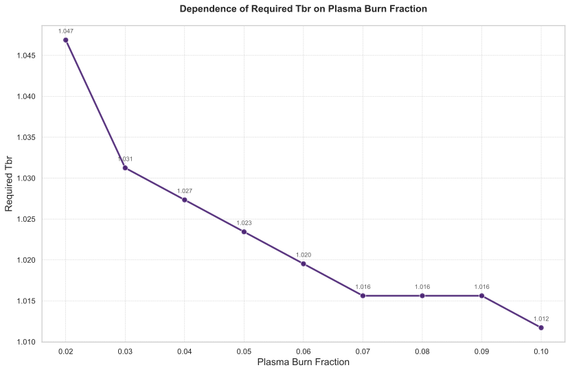

# 氚燃烧份额对聚变堆燃料循环系统性能影响的敏感性分析

## 摘要

本研究针对氚燃料循环系统开展了关于氚燃烧份额的敏感性分析。独立变量氚燃烧份额在[0.02, 0.03, 0.04, 0.05, 0.06, 0.07, 0.08, 0.09, 0.1]范围内进行扫描，评估其对启动库存、自持时间、倍增时间及所需氚增殖比等关键性能指标的影响。分析结果表明，氚燃烧份额对启动库存和倍增时间的影响最为显著，而对自持时间的影响在氚燃烧份额超过0.07后趋于饱和。为实现氚自持，所需氚增殖比随氚燃烧份额的提高而降低。基于敏感性分析结果，建议将氚燃烧份额的设计目标设定在0.06至0.08之间，以实现系统性能的综合优化。

## 引言

氚燃料循环是聚变反应堆实现氚自持和可持续运行的核心环节。氚燃烧份额作为衡量等离子体聚变效率的关键参数，直接影响氚的消耗速率和系统的燃料平衡状态。本研究旨在通过系统的敏感性分析，量化评估氚燃烧份额变化对氚燃料循环系统关键性能指标的影响，为反应堆设计和运行策略的优化提供理论依据。分析聚焦于氚燃烧份额在0.02至0.1范围内的变化，重点考察其对启动库存、自持时间、倍增时间和所需氚增殖比的敏感性。

### 独立变量采样
本次分析中，独立变量氚燃烧份额的扫描范围为[0.02, 0.03, 0.04, 0.05, 0.06, 0.07, 0.08, 0.09, 0.1]。

### 因变量
分析关注的因变量包括：启动库存、自持时间、倍增时间、所需氚增殖比。

## 方法

本研究采用参数扫描方法，系统改变氚燃烧份额的取值，观察其对氚燃料循环系统性能指标的影响。分析过程中，对于所需氚增殖比这一指标，采用了二分查找算法在[1, 1.5]范围内寻找满足特定约束条件的最小值，收敛精度设定为0.005，最大迭代次数为10次。

## 结果与讨论

### 主效应分析

氚燃烧份额对各项性能指标均产生显著影响，但敏感程度存在差异。表1汇总了不同氚燃烧份额下的关键性能指标数值。

**表1：不同氚燃烧份额下的性能指标汇总**
| 氚燃烧份额 | 倍增时间 (天) | 自持时间 (天) | 启动库存 (kg) |
|-----------:|---------------:|---------------:|--------------:|
| 0.02 | 无法计算 | 9.37 | 5.85 |
| 0.03 | 587.25 | 8.37 | 4.49 |
| 0.04 | 486.87 | 7.87 | 3.82 |
| 0.05 | 435.49 | 7.62 | 3.41 |
| 0.06 | 404.31 | 7.49 | 3.14 |
| 0.07 | 383.37 | 7.37 | 2.95 |
| 0.08 | 368.37 | 7.37 | 2.80 |
| 0.09 | 357.06 | 7.37 | 2.69 |
| 0.10 | 348.24 | 7.37 | 2.60 |

**启动库存敏感性**：启动库存对氚燃烧份额的变化极为敏感。当氚燃烧份额从0.02增加到0.1时，启动库存从5.85 kg显著下降至2.60 kg，降幅高达55.6%。这表明提高氚燃烧份额是降低系统对初始氚资源需求的最有效途径之一。

**倍增时间敏感性**：倍增时间对氚燃烧份额的变化同样敏感，且呈现负相关关系。在可计算的范围内，倍增时间从587.25天优化至348.24天，但改善幅度呈现递减趋势。

**自持时间敏感性**：自持时间对氚燃烧份额的敏感性存在明显的饱和现象。当氚燃烧份额超过0.07后，自持时间稳定在7.37天，不再随氚燃烧份额的提高而进一步改善。

**所需氚增殖比敏感性**：如图2所示，所需氚增殖比对氚燃烧份额的变化高度敏感。为维持氚自持，所需的包层氚增殖率随氚燃烧份额的提高而降低，从1.0469下降至1.0117。虽然绝对变化幅度较小，但对于聚变堆设计而言，氚增殖比小数点后第三位的变动都具有重要意义。

**表2：不同氚燃烧份额下的所需氚增殖比**
| 氚燃烧份额 | 所需氚增殖比 |
|-----------:|---------------:|
| 0.02 | 1.0469 |
| 0.03 | 1.0312 |
| 0.04 | 1.0273 |
| 0.05 | 1.0234 |
| 0.06 | 1.0195 |
| 0.07 | 1.0156 |
| 0.08 | 1.0156 |
| 0.09 | 1.0156 |
| 0.10 | 1.0117 |

**指标间权衡关系**：分析揭示了氚燃烧份额与各性能指标之间存在明显的权衡关系。提高氚燃烧份额虽然能够显著改善启动库存、倍增时间和所需氚增殖比，但对自持时间的改善存在上限。这表明在系统设计中需要综合考虑各项指标，寻求最优的平衡点。

### 动态行为分析

**初始阶段动态**：表3展示了系统在初始阶段（0-10.5小时）的动态行为。所有工况下的储存与输送系统氚库存均从初始的3500克开始快速消耗。氚燃烧份额越低，库存下降的速度越快、幅度越大。

**表3：初始阶段储存与输送系统氚库存动态（单位：克）**
| 时间 (小时) | C1 (0.02) | C2 (0.03) | C3 (0.04) | C4 (0.05) | C5 (0.06) | C6 (0.07) | C7 (0.08) | C8 (0.09) | C9 (0.10) |
|-------------:|-----------:|-----------:|-----------:|-----------:|-----------:|-----------:|-----------:|-----------:|
| 0 | 3500 | 3500 | 3500 | 3500 | 3500 | 3500 | 3500 | 3500 |
| 10.5 | 112.76 | 970.04 | 1413.90 | 1696.40 | 1849.57 | 1999.55 | 2112.23 | 2270.85 |

**转折点阶段分析**：表4展示了系统在转折点阶段（约172-186小时）的动态行为。以氚燃烧份额=0.06为参考，其转折点数据揭示了氚燃料循环的"盈亏平衡点"。

**表4：转折点阶段储存与输送系统氚库存动态（单位：克）**
| 时间 (小时) | C1 (0.02) | C2 (0.03) | C3 (0.04) | C4 (0.05) | C5 (0.06) | C6 (0.07) | C7 (0.08) | C8 (0.09) | C9 (0.10) |
|-------------:|-----------:|-----------:|-----------:|-----------:|-----------:|-----------:|-----------:|-----------:|
| 172.35 | -2325.13 | -983.82 | -312.59 | 90.76 | 360.20 | 553.21 | 698.45 | 903.53 |
| 186.50 | -2258.17 | -937.00 | -276.01 | 121.05 | 386.15 | 575.90 | 919.61 |

在此阶段之前，氚燃烧份额=0.06工况的库存持续下降，而在转折点阶段，其库存值在360克左右波动并开始呈现缓慢上升趋势。这个阶段正是储存与输送系统氚库存由净消耗转为净增长的临界时刻。不同氚燃烧份额工况的对比表明，更高的氚燃烧份额能使系统更快地达到氚盈亏平衡点，显著缩短依赖初始库存运行的过渡期。

**结束阶段动态**：表5显示，在长期运行后（约20000小时），所有工况下的储存与输送系统氚库存均已达到很高的稳态值，且远高于初始库存，表明系统不仅实现了氚自持，还实现了氚的净增殖。

**表5：结束阶段储存与输送系统氚库存动态（单位：克）**
| 时间 (小时) | C1 (0.02) | C2 (0.03) | C3 (0.04) | C4 (0.05) | C5 (0.06) | C6 (0.07) | C7 (0.08) | C8 (0.09) | C9 (0.10) |
|-------------:|-----------:|-----------:|-----------:|-----------:|-----------:|-----------:|-----------:|-----------:|
| 19999.4 | 6475.62 | 10079.8 | 11881.9 | 12963.1 | 13683.8 | 14237.7 | 15155.8 |

## 结论

本敏感性分析系统评估了氚燃烧份额对聚变堆氚燃料循环系统性能的影响，得出以下主要结论：

1. **敏感性排序**：启动库存对氚燃烧份额的变化最为敏感，其次为倍增时间和所需氚增殖比，自持时间在氚燃烧份额超过0.07后敏感性最低。

2. **优化设计区间**：鉴于自持时间在氚燃烧份额达到约0.07后即达到饱和，而倍增时间的改善幅度也在减小，建议将氚燃烧份额的设计目标定在0.06至0.08之间。在此区间内，能够以相对合理的工程代价，获得在启动库存、倍增时间和包层氚增殖比要求方面的综合最优效益。

3. **工程实施建议**：在反应堆设计和运行时，应优先考虑如何在优化区间内实现氚燃烧份额的稳定和可靠维持。

4. **系统协同设计**：由于所需氚增殖比随氚燃烧份额提高而降低，在确定目标氚燃烧份额后，可以据此设定切实可行的包层氚增殖比设计目标，从而优化包层方案。

氚燃烧份额是调控聚变堆氚燃料循环性能的一个关键参数。通过精细化设计和控制，可以显著提升反应堆的经济性和可持续性，为聚变能的商业化应用奠定基础。