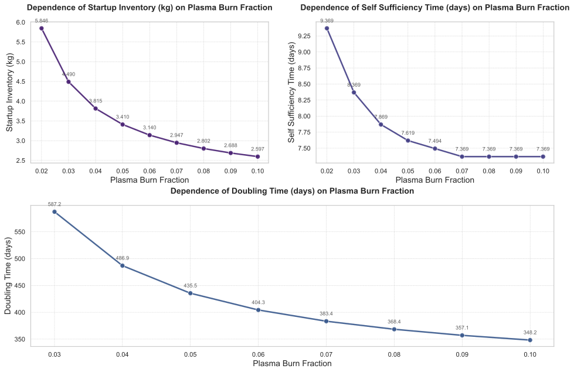
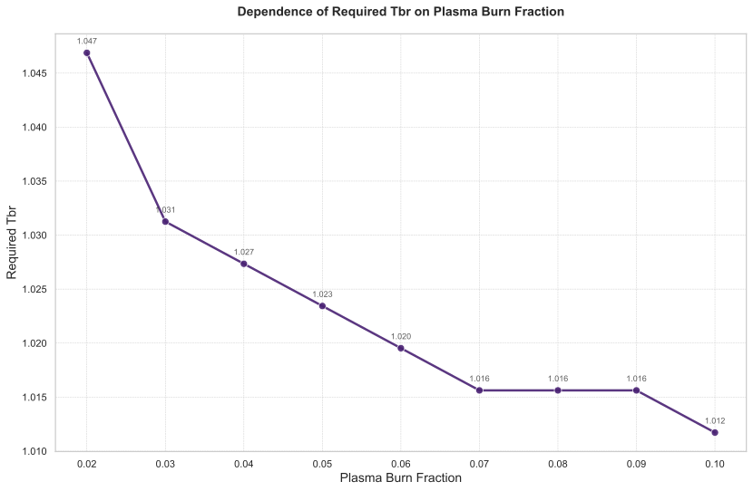

# 氚燃料循环中等离子体燃烧份额（plasma.Burn_Fraction）的敏感性分析

## 摘要

本研究针对聚变反应堆氚燃料循环系统中的关键参数——**等离子体燃烧份额（plasma.Burn_Fraction）**，开展了一项系统的全局敏感性分析。以 `plasma.Burn_Fraction` 为独立变量，在区间 [0.02, 0.1] 内进行离散采样，评估其对启动库存（Startup Inventory）、自持时间（Self-Sufficiency Time）、倍增时间（Doubling Time）以及所需氚增殖比（Required TBR）等核心性能指标的影响。结果表明，`plasma.Burn_Fraction` 的提升显著改善了系统的氚平衡性能：随着该参数从 0.02 增至 0.1，启动库存由 5.85 kg 降至 2.60 kg（降幅达 55.5%），倍增时间由 587.25 天缩短至 348.24 天（缩短约 40.7%），同时实现氚自持所需的最低增殖比（TBR）从 1.0469 降低至 1.0117。其中，**启动库存对燃烧份额的变化最为敏感**，而自持时间在 `plasma.Burn_Fraction > 0.06` 后趋于饱和。动态行为分析进一步揭示，较高的燃烧份额虽导致初期库存消耗加剧，但通过增强中子通量加速了增殖包层的启动，从而更早实现氚库存的净增长拐点。综合结论表明，将 `plasma.Burn_Fraction` 优化至 0.06–0.08 范围内可在工程可行性与系统性能之间取得最佳平衡。

---

## 引言

在磁约束聚变能的发展进程中，实现并维持氚燃料的自持循环是商业化部署的核心挑战之一。由于天然氚资源极其有限且半衰期较短（12.3年），聚变电站必须依赖自身增殖区（Breeding Zone, BZ）产生的氚来补偿运行消耗、处理过程损失及衰变，并支持新机组的启动。在此背景下，**等离子体燃烧份额（Tritium Burn Fraction, $f_b$）**，即注入等离子体的氚原子中实际发生D-T聚变反应的比例，成为决定整个燃料循环效率的关键物理参数。

较高的 $f_b$ 意味着单位时间内更多的聚变能量产出和更高的中子产额，从而有望提升氚的增殖速率。然而，其对系统级性能指标（如初始氚需求、达到自持的时间、长期库存稳定性等）的具体影响机制尚需量化评估。因此，本研究旨在通过对 `plasma.Burn_Fraction` 进行参数扫描，系统地分析其变化对氚燃料循环动态行为与稳态性能的敏感性，识别关键权衡关系，为未来聚变反应堆的设计与运行策略提供科学依据。

### 独立变量采样
本次敏感性分析中，独立变量 `plasma.Burn_Fraction` 在 `[0.02, 0.03, 0.04, 0.05, 0.06, 0.07, 0.08, 0.09, 0.1]` 范围内进行采样。该范围覆盖了当前实验装置到先进商用堆预期性能的典型区间。

### 因变量
被评估的关键性能指标包括：
- **启动库存（Startup_Inventory）**
- **自持时间（Self_Sufficiency_Time）**
- **倍增时间（Doubling_Time）**
- **所需氚增殖比（Required_TBR）**

---

## 方法论

本研究采用基于系统动力学模型的数值仿真方法，对一个完整的托卡马克氚燃料循环系统进行长时间尺度（~20,000小时）的动态模拟。模型涵盖了主要子系统，包括储存与输送系统（SDS）、燃料注入系统（FS）、真空泵系统（PS）、托卡马克排气处理系统（TEP）、同位素分离系统（ISS）、增殖区（BZ）、氚提取系统（TES）以及各材料滞留区域（如第一壁、偏滤器及其冷却剂回路）。

分析流程如下：
1. 对每个预设的 `plasma.Burn_Fraction` 值，执行一次独立仿真，记录系统随时间演化的状态变量。
2. 从仿真结果中提取四项核心性能指标作为因变量。
3. 针对“所需氚增殖比（Required_TBR）”这一特殊指标，采用二分查找算法自动搜索满足特定性能约束（此处为实现氚自持）的最小 `bz.TBR` 值，搜索范围为 [1.0, 1.5]，收敛容差为 0.005。
4. 综合分析各项指标随 `plasma.Burn_Fraction` 变化的趋势，并结合储存与输送系统（SDS）的氚库存动态曲线，解析系统内部的物理过程演变。

---

## 结果与讨论

### 主效应分析

图1展示了 `plasma.Burn_Fraction` 变化对三项关键性能指标的影响趋势。总体而言，所有指标均表现出对燃烧份额提升的积极响应，但其敏感度和变化模式存在显著差异。

  
*图1：`plasma.Burn_Fraction` 对启动库存、自持时间和倍增时间的影响趋势*

#### （1）启动库存（Startup Inventory）
启动库存指反应堆首次启动前必须装载于储存与输送系统（SDS）中的初始氚质量，是衡量全球氚资源压力的关键指标。如图1所示，启动库存随 `plasma.Burn_Fraction` 的增加呈现单调递减趋势。具体数据见表1：

| plasma Burn Fraction | Doubling Time (days) | Self Sufficiency Time (days) | Startup Inventory (kg) |
|---------------------:|---------------------:|-----------------------------:|-----------------------:|
|                 0.02 |                  NaN |                         9.37 |                   5.85 |
|                 0.03 |               587.25 |                         8.37 |                   4.49 |
|                 0.04 |               486.87 |                         7.87 |                   3.82 |
|                 0.05 |               435.49 |                         7.62 |                   3.41 |
|                 0.06 |               404.31 |                         7.49 |                   3.14 |
|                 0.07 |               383.37 |                         7.37 |                   2.95 |
|                 0.08 |               368.37 |                         7.37 |                   2.80 |
|                 0.09 |               357.06 |                         7.37 |                   2.69 |
|                 0.10 |               348.24 |                         7.37 |                   2.60 |

当 `plasma.Burn_Fraction` 从 0.02 提升至 0.10 时，启动库存从 5.85 kg 显著降低至 2.60 kg，绝对降幅达 3.25 kg，相对降幅高达 **55.5%**。这表明高燃烧效率可极大缓解聚变电站群部署初期面临的氚短缺瓶颈。

#### （2）倍增时间（Doubling Time）
倍增时间定义为单个反应堆积累足够氚库存以支持另一台同等规模反应堆启动所需的时间，是评估聚变能扩张速度的核心指标。由表1可见，倍增时间随 `plasma.Burn_Fraction` 增加而持续缩短。从 `f_b = 0.03` 时的 587.25 天降至 `f_b = 0.10` 时的 348.24 天，总缩短 **239.01 天（约 40.7%）**。值得注意的是，该指标在低燃烧份额区间（< 0.05）下降更为陡峭，表明在较低效率起点上提升燃烧份额带来的边际效益更高。

#### （3）自持时间（Self-Sufficiency Time）
自持时间指系统氚库存由净消耗转为净积累的转折时刻。如图1及表1所示，该时间随 `plasma.Burn_Fraction` 增加而减少，从 `f_b = 0.02` 时的 9.37 天降至 `f_b ≥ 0.07` 时的 7.37 天，最大改善幅度为 2.00 天（约 21.3%）。然而，当 `plasma.Burn_Fraction` 超过 0.06 后，自持时间不再进一步缩短，呈现出明显的平台效应，说明在此条件下其他子系统（如增殖区提取动力学或处理延迟）可能成为限制因素。

#### （4）所需氚增殖比（Required TBR）
图2展示了为实现氚自持所必需的最小 `bz.TBR` 值随 `plasma.Burn_Fraction` 的变化。随着燃烧份额提高，所需TBR从 `f_b = 0.02` 时的 1.0469 单调下降至 `f_b = 0.10` 时的 1.0117，绝对降幅为 0.0352。尤其在 `f_b ≤ 0.07` 区间，每提升 0.01 的燃烧份额可使所需TBR降低约 0.0039；而在更高燃烧份额下，下降速率趋缓。此结果意味着，高燃烧效率可显著放宽对增殖包层设计的严苛要求，有利于采用结构更简单、可靠性更高的包层方案。

  
*图2：实现氚自持所需的最小氚增殖比（Required TBR）随等离子体燃烧份额的变化*

#### 性能指标敏感性排序
基于相对变化率评估，各性能指标对 `plasma.Burn_Fraction` 的敏感性排序如下：
- **最高敏感度**：**启动库存（Startup Inventory）** —— 其55.5%的相对降幅远超其他指标，是系统对燃烧效率最直接的响应。
- **高敏感度**：**倍增时间（Doubling Time）** —— 40.7%的缩短体现了其对长期部署战略的重大影响。
- **中等偏低敏感度**：**所需TBR（Required TBR）** —— 尽管绝对降幅较小（3.36%），但对工程设计具有重要指导意义。
- **最低敏感度**：**自持时间（Self-Sufficiency Time）** —— 存在明显饱和阈值，超过 `f_b ≈ 0.06` 后不再响应。

---

### 动态行为分析

为深入理解系统内部的物理过程，图3展示了不同 `plasma.Burn_Fraction` 条件下，储存与输送系统（SDS）中氚库存的完整时间演化曲线。

  
*图3：不同等离子体燃烧份额下，储存与输送系统（SDS）氚库存的动态演化*

#### （1）初始阶段（t < 10 h）
如图3所示，在运行初期，所有工况下的SDS库存均经历快速下降。这是由于反应堆启动后立即开始消耗氚进行聚变，而增殖区尚未产生足量的新氚。值得注意的是，较高 `plasma.Burn_Fraction` 工况下的库存下降斜率更大，例如在 t = 10.5 h 时，`f_b = 0.02` 的库存为 112.76 g，而 `f_b = 0.10` 仍维持在 2270.85 g。这表明虽然高燃烧份额单次消耗更多燃料，但由于其更快的能量释放速率，反而延缓了库存的绝对下降速度。

#### （2）转折点阶段（t ≈ 170–185 h）
系统在约170–185小时区间内达到库存最低点并开始回升，标志着从**氚净消耗向净生产转变的关键物理过程**。表2提供了围绕 `plasma.Burn_Fraction = 0.06` 最小值附近的详细数据切片。

|   time (h) |     C1 (0.02) |     C2 (0.03) |     C3 (0.04) |     C4 (0.05) |     C5 (0.06) |     C6 (0.07) |     C7 (0.08) |     C8 (0.09) |     C9 (0.10) |
|-----------:|--------------:|--------------:|--------------:|--------------:|--------------:|--------------:|--------------:|--------------:|--------------:|
|      172.35 |     -2325.13 |      -983.82 |      -312.59 |        90.76 |       360.20 |       553.21 |       698.45 |       812.05 |       903.53 |
|      173.00 |     -2247.91 |      -932.24 |      -273.84 |       121.80 |       386.10 |       575.42 |       717.90 |       829.33 |       919.07 |
|      173.85 |     -2326.55 |      -984.57 |      -313.02 |        90.50 |       360.04 |       553.09 |       698.36 |       811.96 |       903.42 |
|      174.50 |     -2249.30 |      -932.97 |      -274.25 |       121.56 |       385.96 |       575.33 |       717.83 |       829.26 |       918.98 |
|      175.35 |     -2327.90 |      -985.26 |      -313.41 |        90.28 |       359.92 |       553.02 |       698.31 |       811.91 |       903.35 |
|      176.00 |     -2250.63 |      -933.64 |      -274.62 |       121.36 |       385.85 |       575.27 |       717.79 |       829.22 |       918.93 |
|      176.85 |     -2329.19 |      -985.90 |      -313.75 |        90.11 |       359.84 |       552.99 |       698.30 |       811.89 |       903.32 |
|      177.50 |     -2251.88 |      -934.26 |      -274.94 |       121.20 |       385.79 |       575.26 |       717.80 |       829.23 |       918.92 |
|      178.35 |     -2330.41 |      -986.49 |      -314.04 |        89.97 |       359.79 |       553.00 |       698.33 |       811.92 |       903.33 |
|      179.00 |     -2253.08 |      -934.83 |      -275.22 |       121.09 |       385.76 |       575.28 |       717.84 |       829.27 |       918.94 |

观察发现，`plasma.Burn_Fraction` 越高，库存触底反弹的时间越早。例如，`f_b = 0.10` 在 t ≈ 173 h 时已明确进入上升通道，而 `f_b = 0.02` 至 t = 179 h 仍处于深度亏损状态。这一现象源于高燃烧份额带来的更高功率密度和