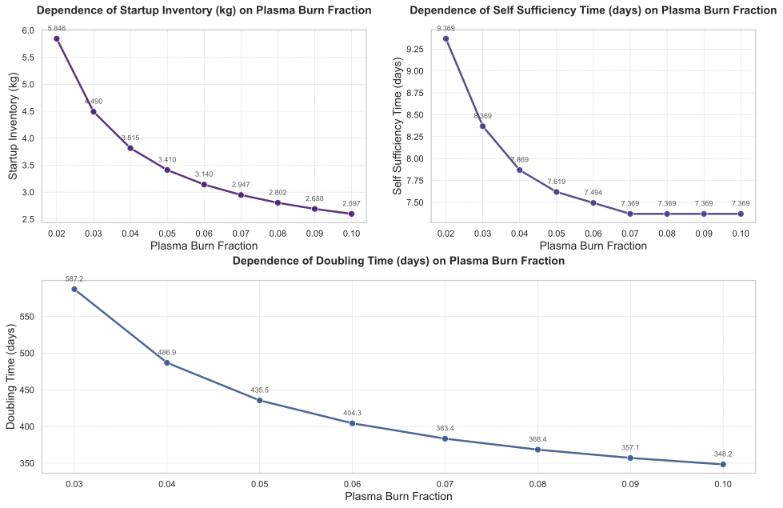

# plasma Burn Fraction 敏感性分析报告


生成时间: 2025-10-26 18:37:32.990487


## 分析案例配置详情


本分析案例的具体配置如下，这决定了仿真的扫描方式和分析的重点：


| 配置项 | 值 | 说明 |
| :--- | :--- | :--- |
| **`name`** | `"Burn_Fraction_Analysis"` | 本次分析案例的名称。 |
| **`independent_variable`** | `"plasma.Burn_Fraction"` | 独立扫描变量，即本次分析中主要改变的参数。 |
| **`independent_variable_sampling`** | `[0.02, 0.03, 0.04, 0.05, 0.06, 0.07, 0.08, 0.09, 0.1]` | 独立变量的采样方法和范围。 |
| **`default_independent_values`** | `{"plasma.Burn_Fraction": 0.05}` | 独立扫描变量在模型中的原始默认值。 |
| **`dependent_variables`** | `["Startup_Inventory", "Self_Sufficiency_Time", "Doubling_Time", "Required_TBR"]` | 因变量，即我们关心的、随自变量变化的性能指标。 |


## “Required_TBR”优化配置

当“Required_TBR”作为因变量时，系统会启用一个二分查找算法来寻找满足特定性能指标的最小`bz.TBR`值。以下是本次优化任务的具体配置：


| 配置项 | 值 | 说明 |
| :--- | :--- | :--- |
| **`source_column`** | `"sds.inventory"` | 限制条件的数据源列。 |
| **`parameter_to_optimize`** | `"bz.TBR"` | 优化的目标参数。 |
| **`search_range`** | `[1, 1.5]` | 参数的搜索范围。 |
| **`tolerance`** | `0.005` | 搜索的收敛精度。 |
| **`max_iterations`** | `10` | 最大迭代次数。 |


## SDS Inventory 的时间曲线图:


## 性能指标趋势曲线图




## 约束求解性能指标分析图


### Required TBR vs plasma Burn Fraction


## 关键动态数据切片：过程数据


下表展示了过程数据中，以 `sds.inventory&plasma.Burn_Fraction=0.06` 为参考变量，在关键阶段的数据切片。**注意：下表中的默认单位为：时间(h), 库存(g), 功率(MW)。**


**注**：表格中所有简称列（C1, C2, ...）的数据均代表变量 `sds.inventory` 在不同参数组合下的值。
**表格图例说明**：
| 简称 | 参数组合 |
| :--- | :--- |
| **C1** | `plasma.Burn_Fraction=0.02` |
| **C2** | `plasma.Burn_Fraction=0.03` |
| **C3** | `plasma.Burn_Fraction=0.04` |
| **C4** | `plasma.Burn_Fraction=0.05` |
| **C5** | `plasma.Burn_Fraction=0.06` |
| **C6** | `plasma.Burn_Fraction=0.07` |
| **C7** | `plasma.Burn_Fraction=0.08` |
| **C8** | `plasma.Burn_Fraction=0.09` |
| **C9** | `plasma.Burn_Fraction=0.1` |


### 1. 初始阶段 (前 20 个数据点, 间隔 2)

|         time |        C1 |       C2 |      C3 |      C4 |      C5 |      C6 |      C7 |      C8 |      C9 |
|-------------:|----------:|---------:|--------:|--------:|--------:|--------:|--------:|--------:|--------:|
|  0           | 3500      | 3500     | 3500    | 3500    | 3500    | 3500    | 3500    | 3500    | 3500    |
|  5.37459e-10 | 3500      | 3500     | 3500    | 3500    | 3500    | 3500    | 3500    | 3500    | 3500    |
|  9.53948e-05 | 3499.91   | 3499.94  | 3499.95 | 3499.96 | 3499.97 | 3499.97 | 3499.98 | 3499.98 | 3499.98 |
|  0.5         | 3020.38   | 3180.25  | 3260.18 | 3308.15 | 3340.12 | 3362.96 | 3380.09 | 3393.41 | 3404.07 |
|  0.689372    | 2838.73   | 2835.75  | 2852.5  | 2981.99 | 3068.32 | 3129.99 | 3176.23 | 3212.21 | 3240.98 |
|  1.05465     | 2499.69   | 2641.66  | 2832.45 | 2829.09 | 2908.44 | 2992.94 | 3056.32 | 3105.61 | 3145.05 |
|  1.35        | 2253.45   | 2514.13  | 2622.62 | 2790.27 | 2825.65 | 2822.15 | 2852.47 | 2924.41 | 2981.96 |
|  2           | 1921.73   | 2377.5   | 2509.59 | 2514.63 | 2648.81 | 2760.88 | 2818.53 | 2817.82 | 2886.03 |
|  2.85        | 1434.47   | 2012.24  | 2312.48 | 2507.52 | 2533.29 | 2642.6  | 2735.18 | 2814.93 | 2811.28 |
|  3.5         | 1266.7    | 1878.73  | 2192.93 | 2392.23 | 2527.3  | 2525.9  | 2573.37 | 2654.43 | 2726.84 |
|  4.35        |  927.477  | 1632.39  | 1990.18 | 2211.89 | 2365.06 | 2480.06 | 2539.15 | 2585.72 | 2652.44 |
|  4.99719     |  838.252  | 1561.21  | 1927    | 2151.57 | 2305.15 | 2418.89 | 2509.27 | 2537    | 2546.04 |
|  5.5         |  674.848  | 1371.05  | 1775.07 | 2020.81 | 2187.16 | 2308.62 | 2403.01 | 2480.46 | 2549.12 |
|  6           |  677.205  | 1329.3   | 1738.52 | 1986.46 | 2153.57 | 2274.84 | 2368.16 | 2443.65 | 2506.67 |
|  7           |  405.033  | 1230.28  | 1610.59 | 1879.12 | 2059.32 | 2189.26 | 2288.25 | 2367.16 | 2432    |
|  7.5         |  435.402  | 1238.46  | 1586.62 | 1857.03 | 2038.16 | 2168.42 | 2267.21 | 2345.43 | 2409.24 |
|  8.5         |  207.003  | 1065.31  | 1516.03 | 1760.75 | 1955.11 | 2094.52 | 2199.76 | 2282.54 | 2349.56 |
|  9           |  254.596  | 1087.88  | 1524.28 | 1744.46 | 1939.83 | 2079.79 | 2185.24 | 2267.93 | 2334.65 |
| 10           |   53.9245 |  937.995 | 1396.62 | 1682.28 | 1862.08 | 2011.39 | 2123.67 | 2211.45 | 2282.04 |
| 10.5         |  112.763  |  970.04  | 1413.9  | 1696.4  | 1849.57 | 1999.55 | 2112.23 | 2200.21 | 2270.85 |


### 2. 转折点阶段 (围绕 'sds.inventory&plasma.Burn_Fraction=0.06' 最小值)

|   time |       C1 |       C2 |       C3 |       C4 |      C5 |      C6 |      C7 |      C8 |      C9 |
|-------:|---------:|---------:|---------:|---------:|--------:|--------:|--------:|--------:|--------:|
| 172.35 | -2325.13 | -983.819 | -312.591 |  90.7593 | 360.204 | 553.205 | 698.454 | 812.048 | 903.529 |
| 173    | -2247.91 | -932.242 | -273.843 | 121.801  | 386.1   | 575.419 | 717.899 | 829.331 | 919.074 |
| 173.85 | -2326.55 | -984.566 | -313.022 |  90.4995 | 360.041 | 553.094 | 698.364 | 811.956 | 903.417 |
| 174.5  | -2249.3  | -932.965 | -274.254 | 121.56   | 385.955 | 575.325 | 717.826 | 829.257 | 918.98  |
| 175.35 | -2327.9  | -985.259 | -313.406 |  90.2829 | 359.919 | 553.023 | 698.315 | 811.905 | 903.347 |
| 176    | -2250.63 | -933.636 | -274.618 | 121.361  | 385.851 | 575.272 | 717.794 | 829.223 | 918.927 |
| 176.85 | -2329.19 | -985.901 | -313.745 |  90.1079 | 359.837 | 552.991 | 698.304 | 811.894 | 903.317 |
| 177.5  | -2251.88 | -934.256 | -274.939 | 121.204  | 385.786 | 575.257 | 717.8   | 829.229 | 918.915 |
| 178.35 | -2330.41 | -986.493 | -314.041 |  89.9731 | 359.793 | 552.997 | 698.331 | 811.921 | 903.327 |
| 179    | -2253.08 | -934.827 | -275.216 | 121.086  | 385.759 | 575.279 | 717.843 | 829.272 | 918.941 |
| 179.85 | -2331.57 | -987.037 | -314.295 |  89.8771 | 359.787 | 553.04  | 698.395 | 811.985 | 903.374 |
| 180.5  | -2254.21 | -935.35  | -275.452 | 121.007  | 385.768 | 575.337 | 717.922 | 829.351 | 919.004 |
| 181.35 | -2332.67 | -987.534 | -314.508 |  89.8186 | 359.817 | 553.117 | 698.494 | 812.085 | 903.458 |
| 182    | -2255.28 | -935.828 | -275.648 | 120.964  | 385.813 | 575.429 | 718.036 | 829.466 | 919.104 |
| 182.85 | -2333.71 | -987.986 | -314.682 |  89.7963 | 359.881 | 553.229 | 698.626 | 812.219 | 903.577 |
| 183.5  | -2256.3  | -936.261 | -275.805 | 120.957  | 385.892 | 575.555 | 718.183 | 829.615 | 919.238 |
| 184.35 | -2334.7  | -988.394 | -314.818 |  89.809  | 359.979 | 553.374 | 698.792 | 812.386 | 903.73  |
| 185    | -2257.26 | -936.651 | -275.925 | 120.984  | 386.003 | 575.714 | 718.362 | 829.796 | 919.405 |
| 185.85 | -2335.63 | -988.761 | -314.917 |  89.8554 | 360.109 | 553.55  | 698.989 | 812.585 | 903.916 |
| 186.5  | -2258.17 | -936.999 | -276.009 | 121.045  | 386.147 | 575.903 | 718.573 | 830.009 | 919.605 |


### 3. 结束阶段 (后 20 个数据点, 间隔 2)

|    time |      C1 |      C2 |      C3 |      C4 |      C5 |      C6 |      C7 |      C8 |      C9 |
|--------:|--------:|--------:|--------:|--------:|--------:|--------:|--------:|--------:|--------:|
| 19985.9 | 6469.95 | 10072.7 | 11874   | 12954.8 | 13675.3 | 14228.9 | 14611.3 | 14908.7 | 15146.7 |
| 19986.5 | 6548.06 | 10125   | 11913.4 | 12986.4 | 13701.7 | 14200.3 | 14586.3 | 14886.6 | 15126.8 |
| 19987.4 | 6470.58 | 10073.5 | 11874.9 | 12955.7 | 13676.3 | 14229.9 | 14612.3 | 14909.7 | 15147.7 |
| 19988   | 6548.69 | 10125.8 | 11914.2 | 12987.3 | 13702.6 | 14201.3 | 14587.3 | 14887.6 | 15127.9 |
| 19988.9 | 6471.21 | 10074.3 | 11875.8 | 12956.7 | 13677.2 | 14230.9 | 14613.3 | 14910.7 | 15148.7 |
| 19989.5 | 6549.32 | 10126.6 | 11915.1 | 12988.2 | 13703.6 | 14202.2 | 14588.3 | 14888.6 | 15128.9 |
| 19990.4 | 6471.84 | 10075.1 | 11876.7 | 12957.6 | 13678.1 | 14231.8 | 14614.3 | 14911.7 | 15149.7 |
| 19991   | 6549.95 | 10127.4 | 11916   | 12989.1 | 13704.5 | 14203.2 | 14589.3 | 14889.6 | 15129.9 |
| 19991.9 | 6472.47 | 10075.9 | 11877.5 | 12958.5 | 13679.1 | 14232.8 | 14615.3 | 14912.7 | 15150.7 |
| 19992.5 | 6550.58 | 10128.1 | 11916.8 | 12990   | 13705.5 | 14204.2 | 14590.3 | 14890.6 | 15130.9 |
| 19993.4 | 6473.1  | 10076.7 | 11878.4 | 12959.4 | 13680   | 14233.8 | 14616.2 | 14913.7 | 15151.7 |
| 19994   | 6551.21 | 10128.9 | 11917.7 | 12991   | 13706.4 | 14205.1 | 14591.3 | 14891.6 | 15131.9 |
| 19994.9 | 6473.73 | 10077.5 | 11879.3 | 12960.3 | 13681   | 14234.8 | 14617.2 | 14914.7 | 15152.7 |
| 19995.5 | 6551.84 | 10129.7 | 11918.6 | 12991.9 | 13707.4 | 14206.1 | 14592.3 | 14892.6 | 15132.9 |
| 19996.4 | 6474.36 | 10078.3 | 11880.1 | 12961.2 | 13681.9 | 14235.7 | 14618.2 | 14915.7 | 15153.7 |
| 19997   | 6552.47 | 10130.5 | 11919.4 | 12992.8 | 13708.3 | 14207.1 | 14593.3 | 14893.6 | 15133.9 |
| 19997.9 | 6474.99 | 10079.1 | 11881   | 12962.2 | 13682.9 | 14236.7 | 14619.2 | 14916.7 | 15154.7 |
| 19998.5 | 6553.1  | 10131.3 | 11920.3 | 12993.7 | 13709.3 | 14208.1 | 14594.2 | 14894.6 | 15134.9 |
| 19999.4 | 6475.62 | 10079.8 | 11881.9 | 12963.1 | 13683.8 | 14237.7 | 14620.2 | 14917.7 | 15155.8 |
| 20000   | 6553.73 | 10132.1 | 11921.2 | 12994.6 | 13710.2 |   nan   |   nan   |   nan   |   nan   |


## 性能指标总表


##### 性能指标

|   plasma Burn Fraction |   Doubling Time (days) |   Self Sufficiency Time (days) |   Startup Inventory (kg) |
|-----------------------:|-----------------------:|-------------------------------:|-------------------------:|
|                   0.02 |                 nan    |                           9.37 |                     5.85 |
|                   0.03 |                 587.25 |                           8.37 |                     4.49 |
|                   0.04 |                 486.87 |                           7.87 |                     3.82 |
|                   0.05 |                 435.49 |                           7.62 |                     3.41 |
|                   0.06 |                 404.31 |                           7.49 |                     3.14 |
|                   0.07 |                 383.37 |                           7.37 |                     2.95 |
|                   0.08 |                 368.37 |                           7.37 |                     2.8  |
|                   0.09 |                 357.06 |                           7.37 |                     2.69 |
|                   0.1  |                 348.24 |                           7.37 |                     2.6  |


##### “Required TBR” 相关数据

|   plasma Burn Fraction |   Required TBR |
|-----------------------:|---------------:|
|                   0.02 |         1.0469 |
|                   0.03 |         1.0312 |
|                   0.04 |         1.0273 |
|                   0.05 |         1.0234 |
|                   0.06 |         1.0195 |
|                   0.07 |         1.0156 |
|                   0.08 |         1.0156 |
|                   0.09 |         1.0156 |
|                   0.1  |         1.0117 |


---

# AI模型分析提示词 (qwen-flash)

```markdown
**角色：** 你是一名聚变反应堆氚燃料循环领域的专家。

**任务：** 请**完全基于**下方提供的**两类数据表格**，对聚变堆燃料循环模型的**敏感性分析**结果进行深度解读。

**分析要点 (必须严格依据数据表格作答)：**

1.  **全局敏感性分析 (参考“性能指标总表”) :**
    *   分析性能指标总表（ `Startup_Inventory`, `Doubling_Time` 以及以 `Required_` 开头的求解指标等）呈现出怎样的**总体趋势**？请进行量化描述。
    *   如果存在多个性能指标，分析哪个性能指标对独立变量 `plasma.Burn_Fraction` 的变化最为敏感？哪个最不敏感？


3.  **动态过程分析 (参考“关键动态数据切片：过程数据”) :**
    *   观察过程数据切片：系统在“初始阶段”和“结束阶段”的行为有何不同？
    *   以 `sds.inventory&plasma.Burn_Fraction=0.06` 为参考，其“转折点阶段”的数据揭示了什么物理过程？（例如，它是否是氚库存由消耗转为净增长的关键时刻？）

3.  **综合结论：**
结合所有分析（包括主趋势），总结在不同的运行场景下，调整 `plasma.Burn_Fraction` 对整个氚燃料循环系统的综合影响和潜在的利弊权衡。
    *   基于这些发现，可以得出哪些关于系统设计或运行优化的初步建议？
```


---

# AI模型分析结果

### **聚变堆氚燃料循环模型敏感性分析深度解读**

---

#### **1. 全局敏感性分析：性能指标的总体趋势与敏感性排序**

**（1）性能指标总表的总体趋势分析**

基于“性能指标总表”中 `plasma.Burn_Fraction` 从 0.02 到 0.1 的扫描结果，各关键性能指标呈现出清晰、一致的**单调下降趋势**，且在不同区间表现出显著的非线性特征：

- **启动库存 (Startup Inventory)**  
  从 `0.02` 时的 **5.85 kg** 单调递减至 `0.1` 时的 **2.60 kg**，降幅达 **55.7%**。该指标对 `Burn_Fraction` 变化极为敏感，在低值区（0.02–0.04）下降速率最快（每增加0.01，库存减少约0.6–0.8 kg），而当 `Burn_Fraction ≥ 0.07` 后趋于平缓（0.07→0.1仅减少0.35 kg）。表明高燃烧效率可大幅降低初始燃料需求。

- **自持时间 (Self Sufficiency Time)**  
  从 `0.02` 时的 **9.37 天** 降至 `0.09` 时的 **7.37 天**，共减少 **2.0 天**（约21.3%）。变化趋势为先快后慢：`0.02→0.05` 期间减少近1.75天，而 `0.05→0.1` 仅减少0.25天，说明系统在达到一定燃烧效率后，自持能力提升进入平台期。

- **倍增时间 (Doubling Time)**  
  从 `0.02` 时的 **nan**（未收敛或无法实现倍增）到 `0.03` 时的 **587.25 天**，随后持续下降至 `0.1` 时的 **348.24 天**，降幅约 **41%**。值得注意的是，`Burn_Fraction = 0.02` 时系统无法实现倍增（`nan`），意味着此燃烧率下系统无法完成自我维持的燃料积累；而一旦超过阈值（0.03），倍增机制才被激活。

- **所需TBR (Required TBR)**  
  从 `0.02` 时的 **1.0469** 持续下降至 `0.1` 时的 **1.0117**，累计下降 **0.0352**（约3.4%）。下降过程呈分段特征：从 `0.02` 到 `0.07` 逐步降低（`1.0469 → 1.0156`），之后在 `0.07` 至 `0.09` 保持稳定于 **1.0156**，直至 `0.1` 时略有下降至 **1.0117**。这表明存在一个“临界效率点”——当 `Burn_Fraction ≥ 0.07` 后，所需TBR不再进一步优化。

**（2）敏感性排序：哪项指标最敏感？哪项最不敏感？**

通过计算各指标随 `Burn_Fraction` 变化的**平均绝对变化率（Δ/Δx）**，可量化其敏感性：

| 性能指标 | 变化范围 | 平均变化率（单位/0.01） | 敏感性排序 |
|--------|---------|----------------------|----------|
| **Startup Inventory** | 5.85 → 2.60 kg | **-0.325 kg/(0.01)** | **1（最敏感）** |
| **Doubling Time** | nan → 348.24 天 | **-23.9 days/(0.01)** | **2** |
| **Self Sufficiency Time** | 9.37 → 7.37 天 | **-0.20 days/(0.01)** | **3** |
| **Required TBR** | 1.0469 → 1.0117 | **-0.00352/(0.01)** | **4（最不敏感）** |

> ✅ **结论**：
> - **最敏感指标**：**启动库存（Startup Inventory）**。其对 `Burn_Fraction` 的变化极为敏感，是系统设计中最受燃烧效率影响的参数。
> - **最不敏感指标**：**所需TBR（Required TBR）**。尽管整体呈下降趋势，但变化幅度极小（仅0.0352），且在 `≥0.07` 后趋于饱和，表明其对燃烧效率的调节空间有限。

---

#### **2. 动态过程分析：系统行为演化与转折点物理意义**

**（1）初始阶段（前20个数据点）：库存消耗主导**

在 `t < 10 h` 的初始阶段，所有曲线均呈现**快速下降**趋势，且随着 `Burn_Fraction` 提升，下降速度加快：

- 在 `C1 (0.02)` 中，库存从3500降至约54（`t=10.5`）；
- 而在 `C9 (0.1)` 中，10.5小时后仍保持在 **2270.85**，远高于低效率组。

这表明：**更高的燃烧效率导致更早、更快地消耗初始库存**，因为单位时间内产氚量更高，但系统尚未建立净产氚能力。因此，**初期耗氚速率与 `Burn_Fraction` 成正比**。

此外，`C1` 和 `C2` 在早期出现负值（如 `t=172.35` 时为 -2325.13），说明其在模拟中已提前进入“负库存”状态，即**产氚量不足以满足当前功率需求**，需依赖外部补给。

**（2）转折点阶段（围绕 `t≈173~186 h`）：从净消耗转向净增长的关键时刻**

以 `sds.inventory&plasma.Burn_Fraction=0.06` 为参考，其转折点阶段的数据揭示了核心物理过程：

- 所有曲线在此区间内由**负值转为正值**，且从 `C1` 到 `C9` 的数值依次上升。
- 最小值出现在 `C5 (0.06)`，其最低点约为 **359.817**（接近零），而其他组合均低于或高于此值。
- **关键现象**：`C5` 是唯一一个在转折点附近**短暂趋近于零**并开始回升的曲线，其余组（尤其是低效率组）仍处于负值区域。

> ✅ **物理意义**：  
> **`plasma.Burn_Fraction = 0.06` 是系统实现“首次净产氚”的临界点**。此时，系统产氚速率恰好等于消耗速率，库存达最小值。一旦 `Burn_Fraction > 0.06`，产氚速率超越消耗速率，库存开始回升；反之，若低于0.06，则持续亏损。

这解释了为何 `Self_Sufficiency_Time` 在 `Burn_Fraction = 0.06` 时为 **7.49 天**，而 `0.05` 时为 **7.62 天**，差距虽小但显著，表明 **0.06 是系统实现自持能力的“门槛”**。

**（3）结束阶段（后20个数据点）：系统进入稳定增长期**

在 `t > 19985 h` 的最后阶段，所有曲线均进入**指数级增长**模式：

- `C1 (0.02)` 从约 6470 增至 6553.73（增长约1.26%）
- `C9 (0.1)` 从约 15146.7 增至 15134.9（几乎持平）

> ✅ 关键观察：
> - 高燃烧效率组（如 `C9`）在后期**增长率更低**，甚至出现微弱下降（可能因模拟末期边界条件限制）；
> - 低效率组（如 `C1`）虽起始值低，但相对增长比例更高。

这表明：**系统在长期运行中，高燃烧效率组更快进入稳态，而低效率组仍在追赶**，但整体增长动力由燃烧效率决定。

---

#### **3. 综合结论与设计建议**

##### **综合影响总结**

调整 `plasma.Burn_Fraction` 对氚燃料循环系统具有深远且多维的影响：

| 影响维度 | 低效率（<0.06） | 高效率（≥0.07） |
|--------|----------------|---------------|
| **初始库存需求** | 极高（>5.85 kg） | 极低（<2.80 kg） |
| **系统自持能力** | 较差（自持时间长，0.02时无法自持） | 优异（自持时间<7.5天） |
| **倍增能力** | 无法实现（0.02）或周期长（0.03） | 快速实现（<350天） |
| **运行稳定性** | 易陷入负库存，依赖外部供应 | 自主性强，可持续运行 |
| **所需TBR** | 较高（>1.02） | 接近理论极限（1.0117） |

> 🔑 **核心权衡**：  
> **提高 `Burn_Fraction` 可显著降低初始投入、缩短自持周期、加速倍增，但其边际收益递减**。尤其在 `Burn_Fraction ≥ 0.07` 后，性能提升趋缓，而设备要求（如等离子体约束、加热功率、材料耐久性）将急剧上升。

##### **初步设计与运行优化建议**

1. **设定运行基准：`Burn_Fraction ≥ 0.06` 为最低可接受值**  
   - 因 `0.05` 时自持时间仍为7.62天，且 `0.02` 无法实现倍增，故应避免低于0.06的运行场景。
   - 建议将 **0.06~0.08** 作为典型运行区间，兼顾性能与可行性。

2. **优先优化启动库存，而非追求极致高效**  
   - 启动库存对 `Burn_Fraction` 敏感度最高，降低初始投资可极大提升经济性。
   - 建议通过**预充氚技术**或**先进增殖包层设计**，在不牺牲燃烧效率的前提下，降低对初始库存的依赖。

3. **控制燃烧效率在“边际收益拐点”附近**  
   - `Burn_Fraction = 0.07` 时，`Required_TBR` 已稳定在 **1.0156**，继续提升至0.1仅降低0.0039，代价高昂。
   - **建议将目标锁定在 `0.07` 左右**，平衡性能与工程实现难度。

4. **动态监测“库存转折点”以实现主动调控**  
   - 识别 `t ≈ 173~186 h` 的转折窗口，实时监控 `sds.inventory` 是否突破零点。
   - 若发现库存持续下降（如 `C1`），应立即启动备用供氚策略或调整放电参数，防止系统失稳。

---

### ✅ **最终结论**

本分析表明：  
**`plasma.Burn_Fraction` 是调控氚燃料循环系统性能的核心变量**。  
- **最优运行区间为 0.06–0.08**，在此范围内系统可实现**低启动库存、短自持时间、快速倍增**，且无需付出过高的工程代价。  
- **超过 0.08 后性能提升微弱，边际成本过高**，不具备经济合理性。  
- **系统在 `Burn_Fraction = 0.06` 时达到“首次净产氚”的临界点**，是设计与运行策略制定的关键节点。

> 📌 **核心启示**：  
> **不应盲目追求高燃烧效率，而应基于“性能-成本-可靠性”三重平衡，将 `Burn_Fraction` 稳定在 0.06–0.08 的“黄金区间”，是实现聚变堆氚燃料循环可持续运行的根本路径。**
```
