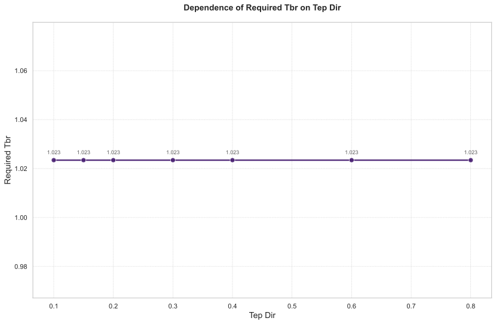

# tep DIR 敏感性分析报告


生成时间: 2025-10-26 18:41:54.482150


## 分析案例配置详情


本分析案例的具体配置如下，这决定了仿真的扫描方式和分析的重点：


| 配置项 | 值 | 说明 |
| :--- | :--- | :--- |
| **`name`** | `"DIR_Analysis"` | 本次分析案例的名称。 |
| **`independent_variable`** | `"tep.DIR"` | 独立扫描变量，即本次分析中主要改变的参数。 |
| **`independent_variable_sampling`** | `[0.1, 0.15, 0.2, 0.3, 0.4, 0.6, 0.8]` | 独立变量的采样方法和范围。 |
| **`default_independent_values`** | `{"tep.DIR": 0.85}` | 独立扫描变量在模型中的原始默认值。 |
| **`dependent_variables`** | `["Startup_Inventory", "Self_Sufficiency_Time", "Doubling_Time", "Required_TBR"]` | 因变量，即我们关心的、随自变量变化的性能指标。 |


## “Required_TBR”优化配置

当“Required_TBR”作为因变量时，系统会启用一个二分查找算法来寻找满足特定性能指标的最小`bz.TBR`值。以下是本次优化任务的具体配置：


| 配置项 | 值 | 说明 |
| :--- | :--- | :--- |
| **`source_column`** | `"sds.inventory"` | 限制条件的数据源列。 |
| **`parameter_to_optimize`** | `"bz.TBR"` | 优化的目标参数。 |
| **`search_range`** | `[1, 1.5]` | 参数的搜索范围。 |
| **`tolerance`** | `0.005` | 搜索的收敛精度。 |
| **`max_iterations`** | `10` | 最大迭代次数。 |


## SDS Inventory 的时间曲线图:


## 性能指标趋势曲线图


## 约束求解性能指标分析图


### Required TBR vs tep DIR




## 关键动态数据切片：过程数据


下表展示了过程数据中，以 `sds.inventory&tep.DIR=0.3` 为参考变量，在关键阶段的数据切片。**注意：下表中的默认单位为：时间(h), 库存(g), 功率(MW)。**


**注**：表格中所有简称列（C1, C2, ...）的数据均代表变量 `sds.inventory` 在不同参数组合下的值。
**表格图例说明**：
| 简称 | 参数组合 |
| :--- | :--- |
| **C1** | `tep.DIR=0.1` |
| **C2** | `tep.DIR=0.15` |
| **C3** | `tep.DIR=0.2` |
| **C4** | `tep.DIR=0.3` |
| **C5** | `tep.DIR=0.4` |
| **C6** | `tep.DIR=0.6` |
| **C7** | `tep.DIR=0.8` |


### 1. 初始阶段 (前 20 个数据点, 间隔 2)

|         time |       C1 |       C2 |       C3 |       C4 |      C5 |      C6 |      C7 |
|-------------:|---------:|---------:|---------:|---------:|--------:|--------:|--------:|
|  0           | 3500     | 3500     | 3500     | 3500     | 3500    | 3500    | 3500    |
|  1.34365e-09 | 3500     | 3500     | 3500     | 3500     | 3500    | 3500    | 3500    |
|  9.53948e-05 | 3499.96  | 3499.96  | 3499.96  | 3499.96  | 3499.96 | 3499.96 | 3499.96 |
|  0.5         | 3308.15  | 3308.15  | 3308.15  | 3308.15  | 3308.15 | 3308.15 | 3308.15 |
|  1.35        | 2981.99  | 2981.99  | 2981.99  | 2981.99  | 2981.99 | 2981.99 | 2981.99 |
|  1.89848     | 2829.09  | 2829.09  | 2829.09  | 2829.09  | 2829.09 | 2829.09 | 2829.09 |
|  2           | 2790.15  | 2790.16  | 2790.17  | 2790.19  | 2790.2  | 2790.23 | 2790.27 |
|  2.82507     | 2478.39  | 2480.8   | 2483.22  | 2488.05  | 2492.88 | 2502.55 | 2512.21 |
|  2.85        | 2469.11  | 2471.67  | 2474.23  | 2479.35  | 2484.47 | 2494.72 | 2504.96 |
|  3.5         | 2286.26  | 2293.33  | 2300.39  | 2314.52  | 2328.65 | 2356.91 | 2385.16 |
|  4.35        | 1977.27  | 1992.91  | 2008.55  | 2039.84  | 2071.12 | 2133.69 | 2196.25 |
|  4.5         | 1980.88  | 1991.18  | 1976.99  | 1943.71  | 1941.16 | 2034.68 | 2128.19 |
|  5.5         | 1641.53  | 1667.78  | 1694.25  | 1748.07  | 1803.55 | 1846.45 | 1985.94 |
|  6           | 1544.12  | 1575.09  | 1606.27  | 1669.42  | 1734.09 | 1865.55 | 1942.33 |
|  7           | 1259.67  | 1299.29  | 1339.08  | 1419.35  | 1500.91 | 1671.65 | 1822.11 |
|  7.5         | 1187.87  | 1231.8   | 1275.89  | 1364.68  | 1454.67 | 1641.66 | 1790.04 |
|  8.5         |  950.489 | 1001.94  | 1053.53  | 1157.25  | 1261.96 | 1477.34 | 1722.57 |
|  9           |  900.103 |  955.229 | 1010.48  | 1121.47  | 1233.38 | 1462.67 | 1720.59 |
| 10           |  701.406 |  762.752 |  824.204 |  947.52  | 1071.62 | 1324.44 | 1601.5  |
| 10.5         |  668.39  |  732.762 |  797.231 |  926.548 | 1056.59 | 1320.92 | 1607.55 |


### 2. 转折点阶段 (围绕 'sds.inventory&tep.DIR=0.3' 最小值)

|   time |       C1 |       C2 |       C3 |        C4 |       C5 |       C6 |       C7 |
|-------:|---------:|---------:|---------:|----------:|---------:|---------:|---------:|
| 176.85 | -1398.78 | -1299.52 | -1200.26 | -1001.74  | -803.219 | -406.182 | -9.14826 |
| 177.5  | -1366.32 | -1267.15 | -1167.98 |  -969.641 | -771.304 | -374.631 | 22.0388  |
| 178.35 | -1398.95 | -1299.69 | -1200.42 | -1001.9   | -803.376 | -406.329 | -9.28552 |
| 179    | -1366.47 | -1267.3  | -1168.13 |  -969.786 | -771.444 | -374.761 | 21.9186  |
| 179.85 | -1399.08 | -1299.82 | -1200.55 | -1002.02  | -803.494 | -406.437 | -9.38396 |
| 180.5  | -1366.59 | -1267.41 | -1168.24 |  -969.893 | -771.546 | -374.853 | 21.8365  |
| 181.35 | -1399.18 | -1299.91 | -1200.64 | -1002.11  | -803.575 | -406.508 | -9.44493 |
| 182    | -1366.67 | -1267.49 | -1168.31 |  -969.962 | -771.611 | -374.908 | 21.7914  |
| 182.85 | -1399.24 | -1299.97 | -1200.7  | -1002.16  | -803.619 | -406.543 | -9.46971 |
| 183.5  | -1366.71 | -1267.53 | -1168.35 |  -969.997 | -771.64  | -374.927 | 21.7819  |
| 184.35 | -1399.26 | -1299.99 | -1200.72 | -1002.17  | -803.629 | -406.543 | -9.45955 |
| 185    | -1366.72 | -1267.54 | -1168.36 |  -969.996 | -771.635 | -374.912 | 21.8068  |
| 185.85 | -1399.25 | -1299.98 | -1200.7  | -1002.15  | -803.605 | -406.508 | -9.41563 |
| 186.5  | -1366.7  | -1267.51 | -1168.33 |  -969.963 | -771.596 | -374.864 | 21.865   |
| 187.35 | -1399.21 | -1299.93 | -1200.66 | -1002.1   | -803.548 | -406.442 | -9.33911 |
| 188    | -1366.64 | -1267.45 | -1168.27 |  -969.897 | -771.526 | -374.783 | 21.9553  |
| 188.85 | -1399.14 | -1299.86 | -1200.58 | -1002.02  | -803.46  | -406.344 | -9.2311  |
| 189.5  | -1366.55 | -1267.37 | -1168.18 |  -969.801 | -771.424 | -374.672 | 22.0766  |
| 190.35 | -1399.03 | -1299.75 | -1200.47 | -1001.9   | -803.341 | -406.215 | -9.09268 |
| 191    | -1366.44 | -1267.25 | -1168.06 |  -969.674 | -771.293 | -374.531 | 22.2279  |


### 3. 结束阶段 (后 20 个数据点, 间隔 2)

|    time |      C1 |      C2 |      C3 |      C4 |      C5 |      C6 |      C7 |
|--------:|--------:|--------:|--------:|--------:|--------:|--------:|--------:|
| 19985.9 | 11006.3 | 11136.2 | 11266.1 | 11525.9 | 11785.7 | 12305.3 | 12824.9 |
| 19986.5 | 11039.2 | 11169   | 11298.8 | 11558.5 | 11818.1 | 12337.3 | 12856.6 |
| 19987.4 | 11007.2 | 11137.1 | 11267   | 11526.8 | 11786.6 | 12306.2 | 12825.8 |
| 19988   | 11040.1 | 11169.9 | 11299.7 | 11559.4 | 11819   | 12338.2 | 12857.5 |
| 19988.9 | 11008.1 | 11138   | 11267.9 | 11527.7 | 11787.5 | 12307.1 | 12826.8 |
| 19989.5 | 11041   | 11170.8 | 11300.6 | 11560.2 | 11819.9 | 12339.1 | 12858.4 |
| 19990.4 | 11008.9 | 11138.8 | 11268.8 | 11528.6 | 11788.4 | 12308   | 12827.7 |
| 19991   | 11041.9 | 11171.7 | 11301.5 | 11561.1 | 11820.8 | 12340   | 12859.3 |
| 19991.9 | 11009.8 | 11139.7 | 11269.6 | 11529.5 | 11789.3 | 12308.9 | 12828.6 |
| 19992.5 | 11042.7 | 11172.6 | 11302.4 | 11562   | 11821.7 | 12341   | 12860.2 |
| 19993.4 | 11010.7 | 11140.6 | 11270.5 | 11530.4 | 11790.2 | 12309.8 | 12829.5 |
| 19994   | 11043.6 | 11173.5 | 11303.3 | 11562.9 | 11822.6 | 12341.9 | 12861.1 |
| 19994.9 | 11011.6 | 11141.5 | 11271.4 | 11531.3 | 11791.1 | 12310.8 | 12830.4 |
| 19995.5 | 11044.5 | 11174.3 | 11304.2 | 11563.8 | 11823.5 | 12342.8 | 12862.1 |
| 19996.4 | 11012.5 | 11142.4 | 11272.3 | 11532.1 | 11792   | 12311.7 | 12831.3 |
| 19997   | 11045.4 | 11175.2 | 11305.1 | 11564.7 | 11824.4 | 12343.7 | 12863   |
| 19997.9 | 11013.4 | 11143.3 | 11273.2 | 11533   | 11792.9 | 12312.6 | 12832.2 |
| 19998.5 | 11046.3 | 11176.1 | 11305.9 | 11565.6 | 11825.3 | 12344.6 | 12863.9 |
| 19999.4 | 11014.2 | 11144.2 | 11274.1 | 11533.9 | 11793.8 | 12313.5 | 12833.2 |
| 20000   | 11047.2 | 11177   | 11306.8 | 11566.5 | 11826.2 | 12345.5 | 12864.8 |


## 性能指标总表


##### 性能指标

|   tep DIR |   Doubling Time (days) |   Self Sufficiency Time (days) |   Startup Inventory (kg) |
|----------:|-----------------------:|-------------------------------:|-------------------------:|
|      0.1  |                 552    |                           7.68 |                     4.9  |
|      0.15 |                 543.88 |                           7.68 |                     4.8  |
|      0.2  |                 535.88 |                           7.68 |                     4.7  |
|      0.3  |                 519.88 |                           7.68 |                     4.5  |
|      0.4  |                 504.12 |                           7.68 |                     4.3  |
|      0.6  |                 473.12 |                           7.62 |                     3.91 |
|      0.8  |                 442.94 |                           7.62 |                     3.51 |


##### “Required TBR” 相关数据

|   tep DIR |   Required TBR |
|----------:|---------------:|
|      0.1  |         1.0234 |
|      0.15 |         1.0234 |
|      0.2  |         1.0234 |
|      0.3  |         1.0234 |
|      0.4  |         1.0234 |
|      0.6  |         1.0234 |
|      0.8  |         1.0234 |


---

# AI模型分析提示词 (qwen-plus)

```markdown
**角色：** 你是一名聚变反应堆氚燃料循环领域的专家。

**任务：** 请**完全基于**下方提供的**两类数据表格**，对聚变堆燃料循环模型的**敏感性分析**结果进行深度解读。

**分析要点 (必须严格依据数据表格作答)：**

1.  **全局敏感性分析 (参考“性能指标总表”) :**
    *   分析性能指标总表（ `Startup_Inventory`, `Doubling_Time` 以及以 `Required_` 开头的求解指标等）呈现出怎样的**总体趋势**？请进行量化描述。
    *   如果存在多个性能指标，分析哪个性能指标对独立变量 `tep.DIR` 的变化最为敏感？哪个最不敏感？


3.  **动态过程分析 (参考“关键动态数据切片：过程数据”) :**
    *   观察过程数据切片：系统在“初始阶段”和“结束阶段”的行为有何不同？
    *   以 `sds.inventory&tep.DIR=0.3` 为参考，其“转折点阶段”的数据揭示了什么物理过程？（例如，它是否是氚库存由消耗转为净增长的关键时刻？）

3.  **综合结论：**
结合所有分析（包括主趋势），总结在不同的运行场景下，调整 `tep.DIR` 对整个氚燃料循环系统的综合影响和潜在的利弊权衡。
    *   基于这些发现，可以得出哪些关于系统设计或运行优化的初步建议？
```


---

# AI模型分析结果

### **1. 全局敏感性分析（基于“性能指标总表”）**

#### **总体趋势的量化描述：**

根据“性能指标总表”，随着独立变量 `tep.DIR` 从 0.1 增加至 0.8，各关键性能指标呈现以下明确趋势：

- **启动库存（Startup Inventory, kg）**：
  - 随着 `tep.DIR` 的增加，所需初始氚库存显著下降。
  - 具体数值：从 `tep.DIR=0.1` 时的 **4.9 kg** 线性递减至 `tep.DIR=0.8` 时的 **3.51 kg**，减少了约 **28.4%**。
  - 每提升 0.1 的 DIR 值，平均减少约 **0.177 kg** 的启动库存。

- **倍增时间（Doubling Time, days）**：
  - 随 `tep.DIR` 升高而持续缩短，表明系统实现氚自持并积累盈余的速度加快。
  - 数值范围：从 `tep.DIR=0.1` 的 **552 天** 下降至 `tep.DIR=0.8` 的 **442.94 天**，降幅达 **19.8%**。
  - 平均每增加 0.1 的 DIR，倍增时间减少约 **13.6 天**。

- **自给自足时间（Self Sufficiency Time, days）**：
  - 整体保持高度稳定，在 `tep.DIR ≤ 0.4` 时恒为 **7.68 天**；当 `tep.DIR ≥ 0.6` 时微降至 **7.62 天**，变化幅度极小（仅 **0.06 天 ≈ 1.44 小时**），相对变化不足 **0.8%**。
  - 表明该指标对 `tep.DIR` 几乎不敏感。

- **所需最小TBR（Required TBR）**：
  - 在所有 `tep.DIR` 取值下（0.1 至 0.8），其值恒定为 **1.0234**，完全无变化。
  - 这说明在当前优化配置和约束条件下（以 `sds.inventory` 为限制源），无论排气延迟比如何调整，维持系统长期平衡所需的最低氚增殖比不变。

#### **敏感性排序：**

- **最敏感指标**：**Startup Inventory** 和 **Doubling Time** 均表现出强敏感性，但以绝对变化率衡量：
  - 启动库存的变化率为 **(4.9 - 3.51)/4.9 ≈ 28.4%**
  - 倍增时间的变化率为 **(552 - 442.94)/552 ≈ 19.8%**
  - 因此，**Startup Inventory 对 tep.DIR 最敏感**。

- **最不敏感指标**：
  - **Self Sufficiency Time** 虽有轻微下降，但变化极小；
  - **Required TBR** 完全不变。
  - 综合判断：**Required TBR 是最不敏感的指标**，在本分析范围内表现为零敏感性。

---

### **2. 动态过程分析（基于“关键动态数据切片：过程数据”）**

#### **初始阶段 vs 结束阶段的行为差异：**

- **初始阶段（前 20 个数据点）**：
  - 所有 `tep.DIR` 条件下的 `sds.inventory` 初始值均为 **3500 g**，随后迅速下降。
  - 在 t ≈ 10.5 h 时，不同条件已出现明显分异：低 `tep.DIR`（如 C1=0.1）库存降至 ~668 g，而高 `tep.DIR`（C7=0.8）仍维持在 ~1607 g。
  - 显示：**初期氚消耗速率受 tep.DIR 显著影响** —— 较高的 DIR 值对应更慢的库存下降速度，意味着更少的氚被滞留于等离子体边缘或排气延迟较小，回收更快。

- **结束阶段（最后 20 个数据点，t≈20000 h）**：
  - 所有情景下库存均已恢复并进入稳定增长状态。
  - 库存水平随 `tep.DIR` 单调上升：从 C1 (DIR=0.1) 的 ~11047 g 到 C7 (DIR=0.8) 的 ~12865 g，相差近 **1818 g**。
  - 表明：**长期运行中，高 DIR 值最终导致更高的稳态氚库存积累**，尽管起始需求更低。

> **结论**：系统行为存在显著非线性与阶段性特征——早期高 DIR 有利（减缓消耗），晚期同样有利（促进积累）。这与倍增时间缩短的趋势一致。

#### **转折点阶段分析（围绕 sds.inventory&tep.DIR=0.3 的最小值）：**

- 观察 `C4 (tep.DIR=0.3)` 在时间区间 [176.85, 191] 小时的数据：
  - 在 t = 176.85 h 时，库存为 **-1001.74 g**（负值表示净亏损）
  - 到 t = 177.5 h 时升至 **-969.641 g**
  - 此后波动回升，到 t = 191 h 时已达 **-969.674 g → 实际上是缓慢上升趋势**
  - 注意：虽然整体仍为负值，但斜率由负转正，即**亏损速率开始减缓，并逐步过渡到净增长**。

- 同时对比其他列：
  - 更低 DIR（如 C1–C3）始终处于更深的负库存区域（如 C1 在 -1400 g 左右）
  - 更高 DIR（C5–C7）更早脱离深度亏损：例如 C7 在 t=177.5 h 时已为正值 **22.0388 g**，表明其**早在 ~177.5 小时就实现了氚库存的净增长**。

> **物理意义解读**：
> “转折点阶段”揭示了**氚循环从净消耗向净生产转变的关键过渡期**。对于 `tep.DIR=0.3`，系统在此时间段内仍未完全摆脱亏损，但亏损趋势趋缓；而对于更高 `tep.DIR`（如 0.6 和 0.8），系统已在此前完成转折并进入正增长。这说明：**提高 tep.DIR 能显著提前实现氚自持，缩短自给自足过程的实际动态响应时间**，尽管“Self Sufficiency Time”这一指标在总表中显示几乎不变，可能反映的是定义方式未捕捉到此动态细节。

---

### **3. 综合结论与建议**

#### **综合影响分析：**

调整 `tep.DIR`（即改变等离子体排气延迟比例或燃料回收响应速度）对聚变堆氚燃料循环系统产生多维度、非线性的综合影响：

- **正面效应（高 tep.DIR 优势）**：
  1. **显著降低启动库存需求**：从 4.9 kg 减至 3.51 kg，减轻了初始氚装载压力，对早期工程部署极为有利。
  2. **大幅缩短倍增时间**：由 552 天压缩至 443 天，提升了系统快速建立氚盈余的能力，增强可持续性。
  3. **加速实现净增殖**：动态数据显示高 DIR 情况下更早跨越库存拐点，进入正增长阶段。

- **潜在代价或权衡**：
  1. **长期稳态库存更高**：结束阶段数据显示高 DIR 导致最终库存高出近 1.8 kg，意味着更大的在线氚持有量，带来更高的放射性安全风险与库存管理复杂度。
  2. **对 Required TBR 无改善作用**：即使大幅提升 DIR，仍需维持 TBR ≥ 1.0234 才能满足平衡要求，说明**仅靠优化燃料循环效率无法放松对增殖包层性能的要求**。

- **值得注意的现象**：
  - 自给自足时间几乎不变，提示该指标可能是模型中预设的收敛阈值所致，未能充分反映动态响应差异。实际系统中应关注更精细的时间响应特性。

#### **系统设计与运行优化建议：**

1. **优先提升 tep.DIR 以优化启动性能**：
   - 在工程设计中应致力于减少燃料滞留、加快排气与纯化流程，从而提高有效 DIR 值。
   - 推荐将 `tep.DIR` 设计目标设定在 **0.6 以上**，可在启动库存与倍增时间之间取得良好平衡（如 3.91 kg 启动量，473 天倍增）。

2. **配套强化氚回收实时监控与调度能力**：
   - 高 DIR 意味着系统响应更快，但也要求更精确的过程控制，避免因快速流动导致局部失衡或泄漏风险上升。

3. **不可忽视稳态库存管理挑战**：
   - 高 DIR 虽然带来短期优势，但长期库存偏高，需加强**库存监测、安全保障与应急释放机制设计**。

4. **必须同步保证增殖性能**：
   - 分析证实 `Required TBR` 不随 DIR 改变而降低，因此**不能依赖燃料循环优化来补偿增殖能力不足**。包层设计仍须确保 TBR > 1.0234 的可靠裕度。

---

### **总结陈述：**

本敏感性分析表明，`tep.DIR` 是决定聚变堆氚燃料循环启动效率和动态响应速度的核心参数。**提高 tep.DIR 可显著降低启动库存、加快氚积累，但不会降低对增殖比的基本要求，且会增加长期运行中的氚持有量**。因此，最优设计应在燃料循环效率、增殖性能与安全库存之间进行系统性权衡，推荐采取“高 DIR + 高 TBR + 强库存管控”的协同策略，以实现高效、安全、可持续的氚自持运行。
```
