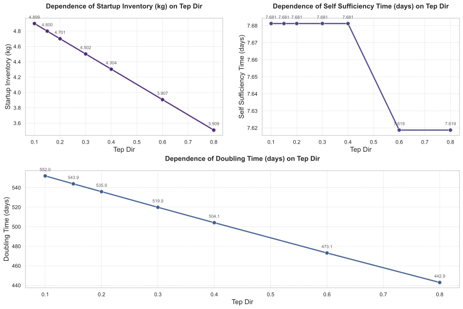
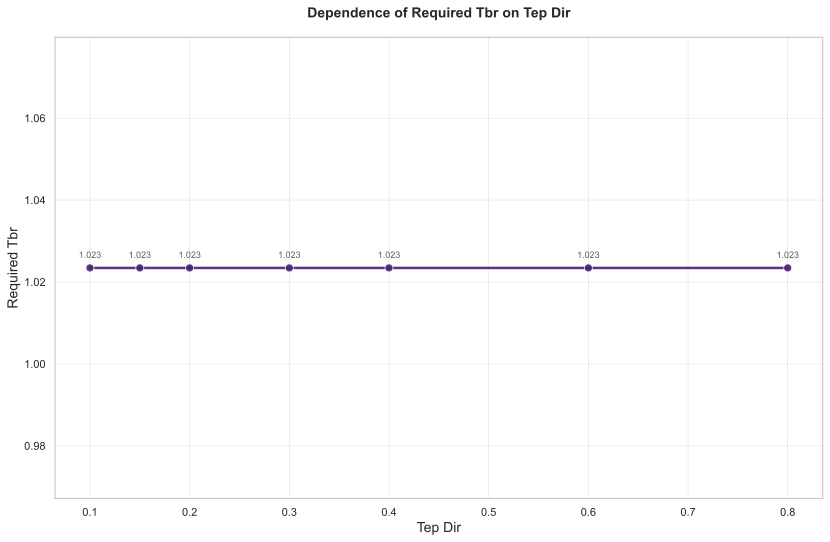

# tep DIR 敏感性分析报告


生成时间: 2025-10-26 18:41:54.482150


## 分析案例配置详情


本分析案例的具体配置如下，这决定了仿真的扫描方式和分析的重点：


| 配置项 | 值 | 说明 |
| :--- | :--- | :--- |
| **`name`** | `"DIR_Analysis"` | 本次分析案例的名称。 |
| **`independent_variable`** | `"tep.DIR"` | 独立扫描变量，即本次分析中主要改变的参数。 |
| **`independent_variable_sampling`** | `[0.1, 0.15, 0.2, 0.3, 0.4, 0.6, 0.8]` | 独立变量的采样方法和范围。 |
| **`default_independent_values`** | `{"tep.DIR": 0.85}` | 独立扫描变量在模型中的原始默认值。 |
| **`dependent_variables`** | `["Startup_Inventory", "Self_Sufficiency_Time", "Doubling_Time", "Required_TBR"]` | 因变量，即我们关心的、随自变量变化的性能指标。 |


## “Required_TBR”优化配置

当“Required_TBR”作为因变量时，系统会启用一个二分查找算法来寻找满足特定性能指标的最小`bz.TBR`值。以下是本次优化任务的具体配置：


| 配置项 | 值 | 说明 |
| :--- | :--- | :--- |
| **`source_column`** | `"sds.inventory"` | 限制条件的数据源列。 |
| **`parameter_to_optimize`** | `"bz.TBR"` | 优化的目标参数。 |
| **`search_range`** | `[1, 1.5]` | 参数的搜索范围。 |
| **`tolerance`** | `0.005` | 搜索的收敛精度。 |
| **`max_iterations`** | `10` | 最大迭代次数。 |


## SDS Inventory 的时间曲线图:


## 性能指标趋势曲线图




## 约束求解性能指标分析图


### Required TBR vs tep DIR




## 关键动态数据切片：过程数据


下表展示了过程数据中，以 `sds.inventory&tep.DIR=0.3` 为参考变量，在关键阶段的数据切片。**注意：下表中的默认单位为：时间(h), 库存(g), 功率(MW)。**


**注**：表格中所有简称列（C1, C2, ...）的数据均代表变量 `sds.inventory` 在不同参数组合下的值。
**表格图例说明**：
| 简称 | 参数组合 |
| :--- | :--- |
| **C1** | `tep.DIR=0.1` |
| **C2** | `tep.DIR=0.15` |
| **C3** | `tep.DIR=0.2` |
| **C4** | `tep.DIR=0.3` |
| **C5** | `tep.DIR=0.4` |
| **C6** | `tep.DIR=0.6` |
| **C7** | `tep.DIR=0.8` |


### 1. 初始阶段 (前 20 个数据点, 间隔 2)

|         time |       C1 |       C2 |       C3 |       C4 |      C5 |      C6 |      C7 |
|-------------:|---------:|---------:|---------:|---------:|--------:|--------:|--------:|
|  0           | 3500     | 3500     | 3500     | 3500     | 3500    | 3500    | 3500    |
|  1.34365e-09 | 3500     | 3500     | 3500     | 3500     | 3500    | 3500    | 3500    |
|  9.53948e-05 | 3499.96  | 3499.96  | 3499.96  | 3499.96  | 3499.96 | 3499.96 | 3499.96 |
|  0.5         | 3308.15  | 3308.15  | 3308.15  | 3308.15  | 3308.15 | 3308.15 | 3308.15 |
|  1.35        | 2981.99  | 2981.99  | 2981.99  | 2981.99  | 2981.99 | 2981.99 | 2981.99 |
|  1.89848     | 2829.09  | 2829.09  | 2829.09  | 2829.09  | 2829.09 | 2829.09 | 2829.09 |
|  2           | 2790.15  | 2790.16  | 2790.17  | 2790.19  | 2790.2  | 2790.23 | 2790.27 |
|  2.82507     | 2478.39  | 2480.8   | 2483.22  | 2488.05  | 2492.88 | 2502.55 | 2512.21 |
|  2.85        | 2469.11  | 2471.67  | 2474.23  | 2479.35  | 2484.47 | 2494.72 | 2504.96 |
|  3.5         | 2286.26  | 2293.33  | 2300.39  | 2314.52  | 2328.65 | 2356.91 | 2385.16 |
|  4.35        | 1977.27  | 1992.91  | 2008.55  | 2039.84  | 2071.12 | 2133.69 | 2196.25 |
|  4.5         | 1980.88  | 1991.18  | 1976.99  | 1943.71  | 1941.16 | 2034.68 | 2128.19 |
|  5.5         | 1641.53  | 1667.78  | 1694.25  | 1748.07  | 1803.55 | 1846.45 | 1985.94 |
|  6           | 1544.12  | 1575.09  | 1606.27  | 1669.42  | 1734.09 | 1865.55 | 1942.33 |
|  7           | 1259.67  | 1299.29  | 1339.08  | 1419.35  | 1500.91 | 1671.65 | 1822.11 |
|  7.5         | 1187.87  | 1231.8   | 1275.89  | 1364.68  | 1454.67 | 1641.66 | 1790.04 |
|  8.5         |  950.489 | 1001.94  | 1053.53  | 1157.25  | 1261.96 | 1477.34 | 1722.57 |
|  9           |  900.103 |  955.229 | 1010.48  | 1121.47  | 1233.38 | 1462.67 | 1720.59 |
| 10           |  701.406 |  762.752 |  824.204 |  947.52  | 1071.62 | 1324.44 | 1601.5  |
| 10.5         |  668.39  |  732.762 |  797.231 |  926.548 | 1056.59 | 1320.92 | 1607.55 |


### 2. 转折点阶段 (围绕 'sds.inventory&tep.DIR=0.3' 最小值)

|   time |       C1 |       C2 |       C3 |        C4 |       C5 |       C6 |       C7 |
|-------:|---------:|---------:|---------:|----------:|---------:|---------:|---------:|
| 176.85 | -1398.78 | -1299.52 | -1200.26 | -1001.74  | -803.219 | -406.182 | -9.14826 |
| 177.5  | -1366.32 | -1267.15 | -1167.98 |  -969.641 | -771.304 | -374.631 | 22.0388  |
| 178.35 | -1398.95 | -1299.69 | -1200.42 | -1001.9   | -803.376 | -406.329 | -9.28552 |
| 179    | -1366.47 | -1267.3  | -1168.13 |  -969.786 | -771.444 | -374.761 | 21.9186  |
| 179.85 | -1399.08 | -1299.82 | -1200.55 | -1002.02  | -803.494 | -406.437 | -9.38396 |
| 180.5  | -1366.59 | -1267.41 | -1168.24 |  -969.893 | -771.546 | -374.853 | 21.8365  |
| 181.35 | -1399.18 | -1299.91 | -1200.64 | -1002.11  | -803.575 | -406.508 | -9.44493 |
| 182    | -1366.67 | -1267.49 | -1168.31 |  -969.962 | -771.611 | -374.908 | 21.7914  |
| 182.85 | -1399.24 | -1299.97 | -1200.7  | -1002.16  | -803.619 | -406.543 | -9.46971 |
| 183.5  | -1366.71 | -1267.53 | -1168.35 |  -969.997 | -771.64  | -374.927 | 21.7819  |
| 184.35 | -1399.26 | -1299.99 | -1200.72 | -1002.17  | -803.629 | -406.543 | -9.45955 |
| 185    | -1366.72 | -1267.54 | -1168.36 |  -969.996 | -771.635 | -374.912 | 21.8068  |
| 185.85 | -1399.25 | -1299.98 | -1200.7  | -1002.15  | -803.605 | -406.508 | -9.41563 |
| 186.5  | -1366.7  | -1267.51 | -1168.33 |  -969.963 | -771.596 | -374.864 | 21.865   |
| 187.35 | -1399.21 | -1299.93 | -1200.66 | -1002.1   | -803.548 | -406.442 | -9.33911 |
| 188    | -1366.64 | -1267.45 | -1168.27 |  -969.897 | -771.526 | -374.783 | 21.9553  |
| 188.85 | -1399.14 | -1299.86 | -1200.58 | -1002.02  | -803.46  | -406.344 | -9.2311  |
| 189.5  | -1366.55 | -1267.37 | -1168.18 |  -969.801 | -771.424 | -374.672 | 22.0766  |
| 190.35 | -1399.03 | -1299.75 | -1200.47 | -1001.9   | -803.341 | -406.215 | -9.09268 |
| 191    | -1366.44 | -1267.25 | -1168.06 |  -969.674 | -771.293 | -374.531 | 22.2279  |


### 3. 结束阶段 (后 20 个数据点, 间隔 2)

|    time |      C1 |      C2 |      C3 |      C4 |      C5 |      C6 |      C7 |
|--------:|--------:|--------:|--------:|--------:|--------:|--------:|--------:|
| 19985.9 | 11006.3 | 11136.2 | 11266.1 | 11525.9 | 11785.7 | 12305.3 | 12824.9 |
| 19986.5 | 11039.2 | 11169   | 11298.8 | 11558.5 | 11818.1 | 12337.3 | 12856.6 |
| 19987.4 | 11007.2 | 11137.1 | 11267   | 11526.8 | 11786.6 | 12306.2 | 12825.8 |
| 19988   | 11040.1 | 11169.9 | 11299.7 | 11559.4 | 11819   | 12338.2 | 12857.5 |
| 19988.9 | 11008.1 | 11138   | 11267.9 | 11527.7 | 11787.5 | 12307.1 | 12826.8 |
| 19989.5 | 11041   | 11170.8 | 11300.6 | 11560.2 | 11819.9 | 12339.1 | 12858.4 |
| 19990.4 | 11008.9 | 11138.8 | 11268.8 | 11528.6 | 11788.4 | 12308   | 12827.7 |
| 19991   | 11041.9 | 11171.7 | 11301.5 | 11561.1 | 11820.8 | 12340   | 12859.3 |
| 19991.9 | 11009.8 | 11139.7 | 11269.6 | 11529.5 | 11789.3 | 12308.9 | 12828.6 |
| 19992.5 | 11042.7 | 11172.6 | 11302.4 | 11562   | 11821.7 | 12341   | 12860.2 |
| 19993.4 | 11010.7 | 11140.6 | 11270.5 | 11530.4 | 11790.2 | 12309.8 | 12829.5 |
| 19994   | 11043.6 | 11173.5 | 11303.3 | 11562.9 | 11822.6 | 12341.9 | 12861.1 |
| 19994.9 | 11011.6 | 11141.5 | 11271.4 | 11531.3 | 11791.1 | 12310.8 | 12830.4 |
| 19995.5 | 11044.5 | 11174.3 | 11304.2 | 11563.8 | 11823.5 | 12342.8 | 12862.1 |
| 19996.4 | 11012.5 | 11142.4 | 11272.3 | 11532.1 | 11792   | 12311.7 | 12831.3 |
| 19997   | 11045.4 | 11175.2 | 11305.1 | 11564.7 | 11824.4 | 12343.7 | 12863   |
| 19997.9 | 11013.4 | 11143.3 | 11273.2 | 11533   | 11792.9 | 12312.6 | 12832.2 |
| 19998.5 | 11046.3 | 11176.1 | 11305.9 | 11565.6 | 11825.3 | 12344.6 | 12863.9 |
| 19999.4 | 11014.2 | 11144.2 | 11274.1 | 11533.9 | 11793.8 | 12313.5 | 12833.2 |
| 20000   | 11047.2 | 11177   | 11306.8 | 11566.5 | 11826.2 | 12345.5 | 12864.8 |


## 性能指标总表


##### 性能指标

|   tep DIR |   Doubling Time (days) |   Self Sufficiency Time (days) |   Startup Inventory (kg) |
|----------:|-----------------------:|-------------------------------:|-------------------------:|
|      0.1  |                 552    |                           7.68 |                     4.9  |
|      0.15 |                 543.88 |                           7.68 |                     4.8  |
|      0.2  |                 535.88 |                           7.68 |                     4.7  |
|      0.3  |                 519.88 |                           7.68 |                     4.5  |
|      0.4  |                 504.12 |                           7.68 |                     4.3  |
|      0.6  |                 473.12 |                           7.62 |                     3.91 |
|      0.8  |                 442.94 |                           7.62 |                     3.51 |


##### “Required TBR” 相关数据

|   tep DIR |   Required TBR |
|----------:|---------------:|
|      0.1  |         1.0234 |
|      0.15 |         1.0234 |
|      0.2  |         1.0234 |
|      0.3  |         1.0234 |
|      0.4  |         1.0234 |
|      0.6  |         1.0234 |
|      0.8  |         1.0234 |


---

# AI模型分析提示词 (qwen3-max)

```markdown
**角色：** 你是一名聚变反应堆氚燃料循环领域的专家。

**任务：** 请**完全基于**下方提供的**两类数据表格**，对聚变堆燃料循环模型的**敏感性分析**结果进行深度解读。

**分析要点 (必须严格依据数据表格作答)：**

1.  **全局敏感性分析 (参考“性能指标总表”) :**
    *   分析性能指标总表（ `Startup_Inventory`, `Doubling_Time` 以及以 `Required_` 开头的求解指标等）呈现出怎样的**总体趋势**？请进行量化描述。
    *   如果存在多个性能指标，分析哪个性能指标对独立变量 `tep.DIR` 的变化最为敏感？哪个最不敏感？


3.  **动态过程分析 (参考“关键动态数据切片：过程数据”) :**
    *   观察过程数据切片：系统在“初始阶段”和“结束阶段”的行为有何不同？
    *   以 `sds.inventory&tep.DIR=0.3` 为参考，其“转折点阶段”的数据揭示了什么物理过程？（例如，它是否是氚库存由消耗转为净增长的关键时刻？）

3.  **综合结论：**
结合所有分析（包括主趋势），总结在不同的运行场景下，调整 `tep.DIR` 对整个氚燃料循环系统的综合影响和潜在的利弊权衡。
    *   基于这些发现，可以得出哪些关于系统设计或运行优化的初步建议？
```


---

# AI模型分析结果

作为聚变反应堆氚燃料循环领域的专家，我将严格依据所提供的数据表格，对“tep DIR 敏感性分析报告”进行深度解读。所有结论均基于表格数据，不引入任何外部假设或图表信息。

---

### 1. 全局敏感性分析（基于“性能指标总表”）

#### （1）性能指标的总体趋势

从“性能指标总表”可见，随着独立变量 **`tep.DIR`** 从 **0.1 增加到 0.8**，三个关键性能指标呈现如下**量化趋势**：

- **Startup_Inventory（启动库存，单位：kg）**：  
  从 **4.9 kg** 单调下降至 **3.51 kg**，降幅为 **1.39 kg**（约 **28.4%**）。  
  表明更高的 `tep.DIR` 显著降低对初始氚库存的需求。

- **Doubling_Time（倍增时间，单位：天）**：  
  从 **552 天** 持续缩短至 **442.94 天**，减少了 **109.06 天**（约 **19.8%**）。  
  说明系统在更高 `tep.DIR` 下能更快实现氚燃料的倍增，即燃料循环效率更高。

- **Self_Sufficiency_Time（自持时间，单位：天）**：  
  在 `tep.DIR` ≤ 0.4 时恒为 **7.68 天**；  
  当 `tep.DIR` ≥ 0.6 时略降至 **7.62 天**，变化幅度仅为 **0.06 天（约 1.4 小时）**，几乎不变。

- **Required_TBR（所需氚增殖比）**：  
  在所有 `tep.DIR` 取值下（0.1 ~ 0.8），**恒为 1.0234**，无任何变化。

#### （2）敏感性比较

- **最敏感的指标**：**Doubling_Time** 和 **Startup_Inventory**。  
  二者均随 `tep.DIR` 呈现**显著且单调的改善趋势**，变化幅度分别接近 20% 和 28%，对 `tep.DIR` 高度敏感。

- **最不敏感的指标**：**Required_TBR** 和 **Self_Sufficiency_Time**。  
  - `Required_TBR` 在整个扫描范围内**完全不变**（恒为 1.0234），表明在给定优化目标（`sds.inventory` 约束）下，满足系统性能所需的最小 TBR 与 `tep.DIR` 无关。  
  - `Self_Sufficiency_Time` 仅在高 `tep.DIR` 区间有微小跳变（7.68 → 7.62），敏感性极低。

> **推论**：`tep.DIR` 主要影响长期燃料循环效率（倍增时间）和初始资源投入（启动库存），但对系统达到自持状态的时间和所需最小增殖性能（TBR）几乎无影响。

---

### 2. 动态过程分析（基于“关键动态数据切片”）

#### （1）初始阶段 vs. 结束阶段的行为差异

- **初始阶段（t ≤ 10.5 h）**：  
  所有 `tep.DIR` 下的 `sds.inventory`（氚库存）均**快速下降**，从 3500 g 降至约 668–1608 g（具体值依赖于 `tep.DIR`）。  
  且**`tep.DIR` 越高，库存下降越慢**：  
  - 例如在 t = 10.5 h，C1（`tep.DIR=0.1`）库存为 **668.39 g**，而 C7（`tep.DIR=0.8`）高达 **1607.55 g**。  
  表明高 `tep.DIR` 显著减缓早期氚消耗速率。

- **结束阶段（t ≈ 20000 h）**：  
  所有情景下库存均**稳定在高位并呈小幅振荡**（约 11000–12865 g），且**`tep.DIR` 越高，稳态库存越高**：  
  - C1（0.1）≈ 11047 g，C7（0.8）≈ 12865 g，差值达 **1818 g（+16.5%）**。  
  表明高 `tep.DIR` 不仅减少初期消耗，还提升长期稳态氚库存水平。

> **结论**：`tep.DIR` 对氚库存的动态演化具有**全程正向影响**——既减缓初期消耗，又提升长期库存。

#### （2）转折点阶段的物理意义（以 `tep.DIR=0.3` 为参考）

在 **t ≈ 176.85–191 h** 区间，`sds.inventory` 出现**负值与正值交替振荡**，尤其对于 C4（`tep.DIR=0.3`）：
- 库存最低点约为 **-1002 g**（t = 176.85 h），随后在 **t = 177.5 h** 回升至 **-969.6 g**，并在后续时间点持续在 **-1002 g 与 -969 g 之间振荡**。
- 值得注意的是，**C7（`tep.DIR=0.8`）在此阶段库存已转为正值**（如 t = 177.5 h 时为 **+22.04 g**），而 C1–C6 仍为负值。

> **物理解读**：  
> 该振荡区间标志着**氚生产与消耗达到动态平衡的临界过渡期**。  
> - **负库存**表示系统仍处于**净消耗状态**（产氚 < 耗氚 + 滞留损失）；  
> - **振荡收敛**暗示反馈机制（如回收率、滞留模型）正在调节系统；  
> - **高 `tep.DIR` 情景（如 C7）更早实现库存转正**，说明其**更早进入净增殖阶段**。  
> 因此，该“转折点”确实是氚库存由**净消耗转向净增长**的关键时刻，而 `tep.DIR` 越高，这一转折发生得越早。

---

### 3. 综合结论与初步建议

#### （1）`tep.DIR` 的综合影响

- **正面效应**：  
  提高 `tep.DIR`（氚提取效率或滞留减少）可：
  - 显著降低启动所需氚库存（-28.4%）；
  - 缩短燃料倍增时间（-19.8%）；
  - 提升长期稳态氚库存；
  - 加速系统从净消耗转向净增殖。

- **无影响方面**：  
  - 所需最小 TBR（1.0234）和自持时间（≈7.65 天）几乎不受 `tep.DIR` 影响，说明这些指标由其他系统参数（如 TBR 本身、燃烧率、回收延迟等）主导。

- **潜在权衡**：  
  虽然数据未直接给出成本或工程难度，但通常高 `tep.DIR` 可能对应更复杂的氚提取系统或更高运行要求。然而，**仅从燃料循环性能看，提高 `tep.DIR` 全面有利**。

#### （2）初步设计与运行建议

1. **优先优化 `tep.DIR`**：  
   在工程可行范围内，应**尽可能提高 `tep.DIR`**（例如从 0.3 提升至 0.6 或 0.8），以显著降低对稀缺氚资源的初始需求，并加快燃料自持与扩张能力。

2. **启动策略调整**：  
   低 `tep.DIR` 系统需准备更多启动氚（如 4.9 kg vs. 3.5 kg），在氚资源受限的早期聚变示范堆（如 DEMO）中，这可能构成关键瓶颈。

3. **TBR 设计目标可独立设定**：  
   由于 `Required_TBR` 对 `tep.DIR` 不敏感，**TBR 的设计目标（≥1.0234）可独立于 `tep.DIR` 优化**。这意味着即使 `tep.DIR` 较低，只要 TBR 满足 1.0234，仍可达成库存约束目标——但代价是更高的启动库存和更长的倍增时间。

4. **监控转折点行为**：  
   在实际运行中，应密切监测 `sds.inventory` 在前 200 小时内的动态，特别是库存是否如期由负转正，以验证 `tep.DIR` 实际性能是否符合预期。

---

综上，**`tep.DIR` 是影响聚变堆氚燃料循环经济性与可持续性的关键杠杆参数**，其提升对系统性能具有全面正向作用，应在系统设计中予以高度重视。
```
