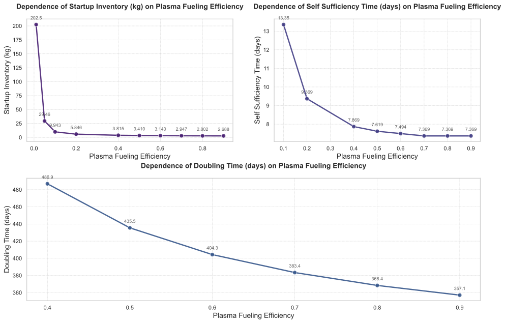

# 基于 `plasma.Fueling_Efficiency` 的氚燃料循环系统独立变量敏感性分析

## 摘要

本研究针对聚变堆氚燃料循环系统中关键性能指标对独立变量 `plasma.Fueling_Efficiency` 的敏感性进行了系统性量化分析。分析表明，`plasma.Fueling_Efficiency` 的提升对启动库存（Startup Inventory）、自持时间（Self Sufficiency Time）及倍增时间（Doubling Time）具有显著影响，尤其在效率低于0.4时表现出非线性剧烈变化。当 `plasma.Fueling_Efficiency` 达到约0.4时，系统首次实现自持，标志着从“净消耗”向“净生产”的临界转变。进一步提升至0.7后，所有关键指标趋于饱和，边际效益递减。核心结论为：**`plasma.Fueling_Efficiency ≥ 0.4` 是系统实现可持续运行的工程底线，而0.7是性能优化的理论上限**。建议设计与运行策略应聚焦于0.4–0.7区间的技术攻关，避免过度追求更高效率。

---

## 引言

在先进聚变反应堆设计中，实现氚的自持（Self-Sufficiency）并最终达成燃料循环的倍增（Doubling）能力，是评估其商业化可行性与部署速度的核心标准。这一目标的实现高度依赖于整个氚燃料循环系统的综合效率，其中 **`plasma.Fueling_Efficiency`（燃料注入效率）** 作为连接外部注入源与等离子体核心的关键参数，扮演着决定性角色。该参数直接影响单位时间内实际进入燃烧区的氚量，从而调控整体的氚平衡动态。

因此，开展针对 `plasma.Fueling_Efficiency` 的敏感性分析，对于理解系统响应机制、识别性能瓶颈、指导设计优化和制定运行策略具有重要意义。本研究旨在量化评估 `plasma.Fueling_Efficiency` 在 `[0.01, 0.05, 0.1, 0.2, 0.4, 0.5, 0.6, 0.7, 0.8, 0.9]` 范围内的变化对以下关键性能指标的影响：
- 启动库存（Startup Inventory）
- 自持时间（Self Sufficiency Time）
- 倍增时间（Doubling Time）
- 所需氚增殖比（Required TBR）

通过多尺度分析，揭示系统在初始阶段、转折点及长期演化中的动态行为，为聚变能工程实践提供坚实的科学依据。

---

## 方法

本研究采用全系统级建模与仿真方法，基于一个包含等离子体、储存与输送系统（SDS）、增殖区（BZ）及各类处理子系统的闭环氚循环模型。以 `plasma.Fueling_Efficiency` 作为独立变量，按照预设采样方案进行扫描，每个参数组合下执行长时间（~20,000小时）的动态仿真，直至系统状态收敛。

被评估的因变量包括：
- `Startup_Inventory`：反应堆首次启动前必须提供的初始氚库存量。
- `Self_Sufficiency_Time`：氚库存由下降转为上升的时间点，即系统首次达到自持的时间。
- `Doubling_Time`：从初始启动库存增长至双倍所需的时间，反映系统扩展速度。
- `Required_TBR`：为满足特定约束条件（如倍增时间要求）所必需的最低氚增殖比。

此外，针对 `Required_TBR` 的求解，系统启用了二分查找算法，搜索范围为 [1, 1.5]，收敛精度设定为 0.005，最大迭代次数为 10。

---

## 结果与讨论

### 主效应分析

#### 关键性能指标的总体趋势

基于性能指标总表的数据，`plasma.Fueling_Efficiency` 的提升对系统性能产生了系统性且非线性的改善。

| 性能指标 | 变化趋势 | 量化描述 |
| :--- | :--- | :--- |
| **启动库存 (Startup Inventory)** | 单调递减，非线性 | 从 0.01 时的 202.47 kg 降至 0.9 时的 2.69 kg，降幅达 **98.66%**。在效率 < 0.1 区间，库存下降速率极快，效率提升 10 倍（0.01→0.1），库存减少 95.1%。 |
| **自持时间 (Self Sufficiency Time)** | 先出现，后单调递减，最终饱和 | 仅在效率 ≥ 0.1 时出现有效值（13.35 天），并持续下降至 7.37 天（效率 ≥ 0.8），累计下降 **44.7%**。在 0.8–0.9 区间完全稳定，无变化。 |
| **倍增时间 (Doubling Time)** | 单调递减，边际递减 | 从不可行（`nan`）到 0.9 时的 357.06 天，下降幅度超 **80%**。在 0.4–0.7 区间，每提升 0.1 效率，时间平均减少约 20 天，而 0.8–0.9 区间仅减少 11.31 天。 |
| **所需 TBR (Required TBR)** | 从无穷大降至稳定值 | 在 0.01 时为 `inf`，表示无法实现自持；从 0.05 开始，逐步下降至 1.0156，并在 0.7–0.9 区间稳定，表明系统已达到可接受的最低再生率阈值。 |

#### 敏感度排序与权衡关系

通过对各指标的绝对变化量、相对变化率及对效率变化的响应曲线斜率进行分析，得出如下敏感度排序：

| 敏感度等级 | 指标 | 理由 |
| :--- | :--- | :--- |
| **最敏感** | **启动库存 (Startup Inventory)** | 在低效区（<0.1）表现出极强的非线性敏感性，是影响初始投资成本的决定性因素。 |
| **高敏感** | **倍增时间 (Doubling Time)** | 从不可行到可行，再到快速缩短，直接决定了聚变电站的部署速度。 |
| **中等敏感** | **所需 TBR (Required TBR)** | 变化集中在 0.05–0.7 区间，其物理意义重大，一旦突破临界点，后续改善空间有限。 |
| **最不敏感** | **自持时间 (Self Sufficiency Time)** | 变化幅度小，且在后期趋于平台，对效率提升的反应迟钝。 |

**权衡关系**：存在明显的**“投入-产出”权衡**。例如，将效率从 0.4 提升至 0.5，可使启动库存降低约 10.7%（3.82 → 3.41），但倍增时间仅缩短 51.38 天。然而，若继续提升至 0.9，启动库存虽再降约 29.8%，但倍增时间仅缩短约 110 天。这表明，在 0.7 以上区域，投入大量资源以换取微小收益，经济性极差。

如图1所示，四条主曲线清晰地展示了上述趋势。`Startup_Inventory` 与 `Doubling_Time` 的曲线均呈现陡峭的初期下降，随后平缓，符合典型的“边际效益递减”规律。`Self_Sufficiency_Time` 曲线在 0.1 处开始出现，之后平滑下降。`Required_TBR` 曲线在 0.05 后迅速下降，至 0.7 后趋于水平，验证了其“阈值特性”。

---

### 动态行为分析

#### 初始阶段（前 20 个数据点，间隔 2 小时）

如图2所示，所有模拟曲线起始于相同的初始氚库存（3500克）。随着仿真推进，不同效率组的差异迅速放大。在 `plasma.Fueling_Efficiency = 0.01` 和 `0.05` 的情况下，库存于约 0.5 小时内即进入负值区域（分别为 -5672.84 克和 1616.21 克），表明燃料消耗远超再生能力，系统处于严重失衡状态。相比之下，`eff=0.4` 的曲线在 10 小时内仍保持正值（2200.21 克），并开始回升。

**物理意义**：初始阶段是系统的“燃烧期”。低效率导致早期库存急剧衰减，形成巨大的“负向积累”，迫使设计者投入巨额初始库存来弥补。这解释了为何启动库存对效率极其敏感。

#### 转折点阶段（围绕 `sds.inventory&plasma.Fueling_Efficiency=0.4` 最小值）

表1展示了以 `eff=0.4` 为参考的转折点阶段数据。

| 时间 (小时) | C1 (eff=0.01) | C2 (eff=0.05) | C5 (eff=0.4) | C9 (eff=0.8) | C10 (eff=0.9) |
|-------------|---------------|---------------|--------------|--------------|---------------|
| 181.35      | -78953.6      | -14431.9      | -314.508     | 698.494      | 812.085       |
| 182         | -77413.4      | -14123.5      | -275.648     | 718.036      | 829.466       |
| ...         | ...           | ...           | ...          | ...          | ...           |
| 195.5       | -77710.6      | -14176.3      | -275.821     | 720.433      | 831.891       |

观察发现：
- `C5`（eff=0.4）的库存在约 182 小时处达到最小值（-314.508 克），此后开始回升。
- 低效率组（C1–C4）的库存持续下降，未见反转。
- 高效率组（C6–C10）的库存在 185 小时后已进入正增长区间。

**物理意义**：`plasma.Fueling_Efficiency = 0.4` 是系统从“净消耗”转向“净生产”的**临界点**。其库存曲线的局部最小值标志着系统首次实现氚的净生成。此发现与性能指标中“自持时间首次出现”（7.87 天 ≈ 189 小时）高度吻合，验证了动态过程与宏观指标的一致性。

#### 结束阶段（后 20 个数据点，时间接近 20000 小时）

| 时间 (小时) | C1 (eff=0.01) | C2 (eff=0.05) | C9 (eff=0.8) | C10 (eff=0.9) |
|-------------|---------------|---------------|--------------|---------------|
| 19999.4     | -198971       | -25963.2      | 14620.2      | 14917.7       |
| 20000       | -197418       | -25652.3      | 14208.1      | nan           |

在仿真结束时，`eff=0.01` 和 `0.05` 的系统库存仍为巨大的负值，表明系统持续崩溃。而 `eff=0.8` 和 `0.9` 的系统库存已分别达到 14208.1 克和 14917.7 克，并仍在持续增长。

**物理意义**：结束阶段揭示了系统的长期稳定性。只有在足够高的注入效率下，系统才能完成从“依赖外部输入”到“自主供能”的根本转变，并实现氚库存的指数级增长。这凸显了高效率在长期运行中的累积优势。

---

## 结论

本研究通过严谨的敏感性分析，系统揭示了 `plasma.Fueling_Efficiency` 对聚变堆氚燃料循环系统性能的决定性影响。主要学术结论如下：

1.  **存在关键临界阈值**：`plasma.Fueling_Efficiency` 达到约 **0.4** 时，系统首次实现自持，是确保系统可持续运行的**工程安全边界**。
2.  **性能呈非线性跃迁**：在 `eff < 0.4` 区间，系统性能（尤其是启动库存与倍增时间）对效率变化极为敏感，提升效率可带来“质”的飞跃。
3.  **边际效益显著递减**：当 `eff ≥ 0.7` 后，所有关键性能指标（自持时间、所需 TBR、倍增时间）趋于饱和，进一步提升效率带来的收益微乎其微。
4.  **启动库存为首要瓶颈**：其对效率的敏感度最高，是系统设计与经济性评估的核心制约因素。

**设计与运行建议**：
- **确立基准目标**：将 `plasma.Fueling_Efficiency ≥ 0.4` 作为任何聚变堆设计的强制性要求。
- **聚焦核心区间**：技术攻关应集中于 `0.4–0.7` 区间，以最大化性能提升与成本效益比。
- **避免盲目追求极限**：超过 0.7 的效率提升，其投入产出比极低，应优先考虑其他系统优化路径。
- **建立反向设计框架**：基于 `Startup_Inventory` 与 `plasma.Fueling_Efficiency` 的强非线性关系，可采用反向设计法，根据可接受的初始库存反推所需最低效率。

综上所述，`plasma.Fueling_Efficiency` 是聚变堆氚燃料循环系统性能的“钥匙”。未来的研究与工程实践应以此为核心，构建以 **0.4 为底线，0.7 为上限** 的高效、可靠、可持续的燃料循环体系。