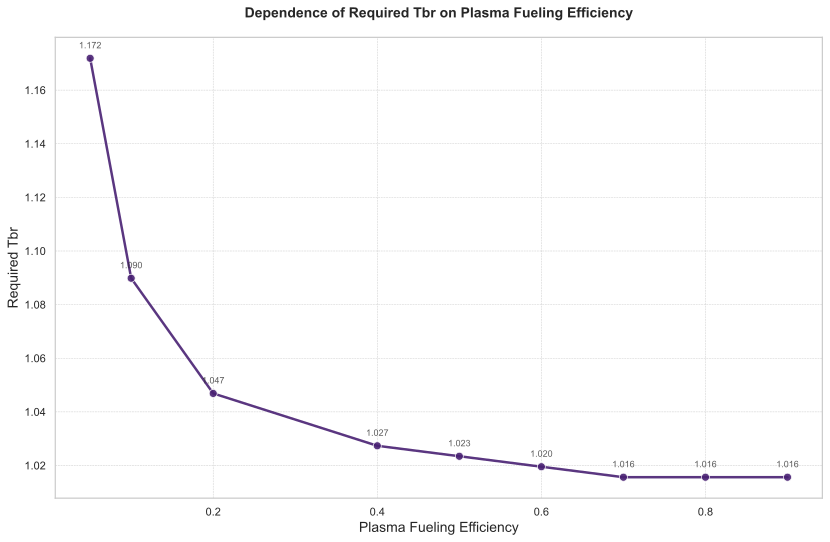

# plasma Fueling Efficiency 敏感性分析报告


生成时间: 2025-10-26 18:33:17.126597


## 分析案例配置详情


本分析案例的具体配置如下，这决定了仿真的扫描方式和分析的重点：


| 配置项 | 值 | 说明 |
| :--- | :--- | :--- |
| **`name`** | `"Fueling_Efficiency_Analysis"` | 本次分析案例的名称。 |
| **`independent_variable`** | `"plasma.Fueling_Efficiency"` | 独立扫描变量，即本次分析中主要改变的参数。 |
| **`independent_variable_sampling`** | `[0.01, 0.05, 0.1, 0.2, 0.4, 0.5, 0.6, 0.7, 0.8, 0.9]` | 独立变量的采样方法和范围。 |
| **`default_independent_values`** | `{"plasma.Fueling_Efficiency": 0.5}` | 独立扫描变量在模型中的原始默认值。 |
| **`dependent_variables`** | `["Startup_Inventory", "Self_Sufficiency_Time", "Doubling_Time", "Required_TBR"]` | 因变量，即我们关心的、随自变量变化的性能指标。 |


## “Required_TBR”优化配置

当“Required_TBR”作为因变量时，系统会启用一个二分查找算法来寻找满足特定性能指标的最小`bz.TBR`值。以下是本次优化任务的具体配置：


| 配置项 | 值 | 说明 |
| :--- | :--- | :--- |
| **`source_column`** | `"sds.inventory"` | 限制条件的数据源列。 |
| **`parameter_to_optimize`** | `"bz.TBR"` | 优化的目标参数。 |
| **`search_range`** | `[1, 1.5]` | 参数的搜索范围。 |
| **`tolerance`** | `0.005` | 搜索的收敛精度。 |
| **`max_iterations`** | `10` | 最大迭代次数。 |


## SDS Inventory 的时间曲线图:


## 性能指标趋势曲线图


## 约束求解性能指标分析图


### Required TBR vs plasma Fueling Efficiency




## 关键动态数据切片：过程数据


下表展示了过程数据中，以 `sds.inventory&plasma.Fueling_Efficiency=0.4` 为参考变量，在关键阶段的数据切片。**注意：下表中的默认单位为：时间(h), 库存(g), 功率(MW)。**


**注**：表格中所有简称列（C1, C2, ...）的数据均代表变量 `sds.inventory` 在不同参数组合下的值。
**表格图例说明**：
| 简称 | 参数组合 |
| :--- | :--- |
| **C1** | `plasma.Fueling_Efficiency=0.01` |
| **C2** | `plasma.Fueling_Efficiency=0.05` |
| **C3** | `plasma.Fueling_Efficiency=0.1` |
| **C4** | `plasma.Fueling_Efficiency=0.2` |
| **C5** | `plasma.Fueling_Efficiency=0.4` |
| **C6** | `plasma.Fueling_Efficiency=0.5` |
| **C7** | `plasma.Fueling_Efficiency=0.6` |
| **C8** | `plasma.Fueling_Efficiency=0.7` |
| **C9** | `plasma.Fueling_Efficiency=0.8` |
| **C10** | `plasma.Fueling_Efficiency=0.9` |


### 1. 初始阶段 (前 20 个数据点, 间隔 2)

|         time |        C1 |        C2 |        C3 |        C4 |      C5 |      C6 |      C7 |      C8 |      C9 |     C10 |
|-------------:|----------:|----------:|----------:|----------:|--------:|--------:|--------:|--------:|--------:|--------:|
|  0           |   3500    |  3500     |  3500     | 3500      | 3500    | 3500    | 3500    | 3500    | 3500    | 3500    |
|  2.6873e-11  |   3500    |  3500     |  3500     | 3500      | 3500    | 3500    | 3500    | 3500    | 3500    | 3500    |
|  9.53948e-05 |   3498.17 |  3499.63  |  3499.82  | 3499.91   | 3499.95 | 3499.96 | 3499.97 | 3499.97 | 3499.98 | 3499.98 |
|  0.0354545   |   2819.83 |  2839.8   |  2840.79  | 3020.38   | 3260.18 | 3308.15 | 3340.12 | 3362.96 | 3380.09 | 3393.41 |
|  0.0535513   |   2472.7  |  2492.97  |  2543.13  | 2838.73   | 2852.5  | 2981.99 | 3068.32 | 3129.99 | 3176.23 | 3212.21 |
|  0.5         |  -5672.84 |  1616.21  |  2495.66  | 2499.69   | 2832.45 | 2829.09 | 2908.44 | 2992.94 | 3056.32 | 3105.61 |
|  1           | -13384.7  |  -976.018 |  1161.03  | 2253.45   | 2622.62 | 2790.27 | 2825.65 | 2822.15 | 2852.47 | 2924.41 |
|  1.5         | -16871.5  | -1982.75  |   608.651 | 1921.73   | 2509.59 | 2514.63 | 2648.81 | 2760.88 | 2818.53 | 2817.82 |
|  2.5         | -27326.1  | -3005.71  |  -263.377 | 1434.47   | 2312.48 | 2507.52 | 2533.29 | 2642.6  | 2735.18 | 2814.93 |
|  3           | -28474.8  | -3289.57  |  -219.444 | 1266.7    | 2192.93 | 2392.23 | 2527.3  | 2525.9  | 2573.37 | 2654.43 |
|  4           | -35554.9  | -4791.06  |  -918.269 |  927.477  | 1990.18 | 2211.89 | 2365.06 | 2480.06 | 2539.15 | 2585.72 |
|  4.5         | -35490.5  | -4812.43  |  -952.982 |  838.252  | 1927    | 2151.57 | 2305.15 | 2418.89 | 2509.27 | 2537    |
|  5.5         | -40784.9  | -5927.36  | -1549.86  |  674.848  | 1775.07 | 2020.81 | 2187.16 | 2308.62 | 2403.01 | 2480.46 |
|  5.85        | -42313    | -5806.3   | -1505.75  |  677.205  | 1738.52 | 1986.46 | 2153.57 | 2274.84 | 2368.16 | 2443.65 |
|  6.5         | -42325.1  | -6706.09  | -1983.44  |  405.033  | 1610.59 | 1879.12 | 2059.32 | 2189.26 | 2288.25 | 2367.16 |
|  7.35        | -45622.1  | -6503.41  | -1894.06  |  435.402  | 1586.62 | 1857.03 | 2038.16 | 2168.42 | 2267.21 | 2345.43 |
|  8           | -45211.4  | -7276.21  | -2301.22  |  207.003  | 1516.03 | 1760.75 | 1955.11 | 2094.52 | 2199.76 | 2282.54 |
|  8.85        | -48075.9  | -7023.79  | -2184.19  |  254.596  | 1524.28 | 1744.46 | 1939.83 | 2079.79 | 2185.24 | 2267.93 |
|  9.5         | -47403.2  | -7716.87  | -2546.97  |   53.9245 | 1396.62 | 1682.28 | 1862.08 | 2011.39 | 2123.67 | 2211.45 |
| 10.35        | -49991.7  | -7432.26  | -2411.99  |  112.763  | 1413.9  | 1696.4  | 1849.57 | 1999.55 | 2112.23 | 2200.21 |


### 2. 转折点阶段 (围绕 'sds.inventory&plasma.Fueling_Efficiency=0.4' 最小值)

|   time |       C1 |       C2 |       C3 |       C4 |       C5 |       C6 |      C7 |      C8 |      C9 |     C10 |
|-------:|---------:|---------:|---------:|---------:|---------:|---------:|--------:|--------:|--------:|--------:|
| 181.35 | -78953.6 | -14431.9 | -6366.2  | -2332.67 | -314.508 |  89.8186 | 359.817 | 553.117 | 698.494 | 812.085 |
| 182    | -77413.4 | -14123.5 | -6211.81 | -2255.28 | -275.648 | 120.964  | 385.813 | 575.429 | 718.036 | 829.466 |
| 182.85 | -78990   | -14438.5 | -6369.08 | -2333.71 | -314.682 |  89.7963 | 359.881 | 553.229 | 698.626 | 812.219 |
| 183.5  | -77449.4 | -14130   | -6214.64 | -2256.3  | -275.805 | 120.957  | 385.892 | 575.555 | 718.183 | 829.615 |
| 184.35 | -79025.6 | -14444.9 | -6371.86 | -2334.7  | -314.818 |  89.809  | 359.979 | 553.374 | 698.792 | 812.386 |
| 185    | -77484.6 | -14136.4 | -6217.38 | -2257.26 | -275.925 | 120.984  | 386.003 | 575.714 | 718.362 | 829.796 |
| 185.85 | -79060.4 | -14451.1 | -6374.54 | -2335.63 | -314.917 |  89.8554 | 360.109 | 553.55  | 698.989 | 812.585 |
| 186.5  | -77519   | -14142.5 | -6220.03 | -2258.17 | -276.009 | 121.045  | 386.147 | 575.903 | 718.573 | 830.009 |
| 187.35 | -79094.4 | -14457.2 | -6377.14 | -2336.51 | -314.981 |  89.9344 | 360.27  | 553.757 | 699.217 | 812.816 |
| 188    | -77552.7 | -14148.5 | -6222.59 | -2259.03 | -276.058 | 121.138  | 386.321 | 576.123 | 718.813 | 830.252 |
| 188.85 | -79127.6 | -14463.1 | -6379.65 | -2337.34 | -315.011 |  90.0448 | 360.461 | 553.993 | 699.474 | 813.076 |
| 189.5  | -77585.7 | -14154.4 | -6225.06 | -2259.84 | -276.074 | 121.262  | 386.525 | 576.372 | 719.083 | 830.525 |
| 190.35 | -79160.2 | -14468.9 | -6382.08 | -2338.12 | -315.008 |  90.1857 | 360.681 | 554.258 | 699.76  | 813.365 |
| 191    | -77617.9 | -14160.1 | -6227.46 | -2260.6  | -276.057 | 121.415  | 386.758 | 576.648 | 719.381 | 830.826 |
| 191.85 | -79192   | -14474.5 | -6384.42 | -2338.85 | -314.973 |  90.356  | 360.93  | 554.55  | 700.073 | 813.682 |
| 192.5  | -77649.5 | -14165.6 | -6229.77 | -2261.31 | -276.008 | 121.598  | 387.018 | 576.952 | 719.705 | 831.155 |
| 193.35 | -79223.2 | -14480   | -6386.69 | -2339.54 | -314.907 |  90.5547 | 361.205 | 554.869 | 700.413 | 814.026 |
| 194    | -77680.4 | -14171   | -6232    | -2261.98 | -275.929 | 121.809  | 387.305 | 577.282 | 720.056 | 831.51  |
| 194.85 | -79253.7 | -14485.3 | -6388.89 | -2340.18 | -314.811 |  90.7808 | 361.507 | 555.213 | 700.778 | 814.395 |
| 195.5  | -77710.6 | -14176.3 | -6234.16 | -2262.6  | -275.821 | 122.046  | 387.618 | 577.638 | 720.433 | 831.891 |


### 3. 结束阶段 (后 20 个数据点, 间隔 2)

|    time |      C1 |       C2 |       C3 |      C4 |      C5 |      C6 |      C7 |      C8 |      C9 |     C10 |
|--------:|--------:|---------:|---------:|--------:|--------:|--------:|--------:|--------:|--------:|--------:|
| 19985.9 | -198895 | -25955.9 | -4338.63 | 6469.95 | 11874   | 12954.8 | 13675.3 | 14228.9 | 14611.3 | 14908.7 |
| 19986.5 | -197342 | -25645   | -4182.92 | 6548.06 | 11913.4 | 12986.4 | 13701.7 | 14200.3 | 14586.3 | 14886.6 |
| 19987.4 | -198903 | -25956.7 | -4338.48 | 6470.58 | 11874.9 | 12955.7 | 13676.3 | 14229.9 | 14612.3 | 14909.7 |
| 19988   | -197351 | -25645.8 | -4182.77 | 6548.69 | 11914.2 | 12987.3 | 13702.6 | 14201.3 | 14587.3 | 14887.6 |
| 19988.9 | -198912 | -25957.5 | -4338.33 | 6471.21 | 11875.8 | 12956.7 | 13677.2 | 14230.9 | 14613.3 | 14910.7 |
| 19989.5 | -197359 | -25646.6 | -4182.61 | 6549.32 | 11915.1 | 12988.2 | 13703.6 | 14202.2 | 14588.3 | 14888.6 |
| 19990.4 | -198920 | -25958.3 | -4338.18 | 6471.84 | 11876.7 | 12957.6 | 13678.1 | 14231.8 | 14614.3 | 14911.7 |
| 19991   | -197367 | -25647.4 | -4182.46 | 6549.95 | 11916   | 12989.1 | 13704.5 | 14203.2 | 14589.3 | 14889.6 |
| 19991.9 | -198928 | -25959.1 | -4338.02 | 6472.47 | 11877.5 | 12958.5 | 13679.1 | 14232.8 | 14615.3 | 14912.7 |
| 19992.5 | -197376 | -25648.2 | -4182.31 | 6550.58 | 11916.8 | 12990   | 13705.5 | 14204.2 | 14590.3 | 14890.6 |
| 19993.4 | -198937 | -25959.9 | -4337.87 | 6473.1  | 11878.4 | 12959.4 | 13680   | 14233.8 | 14616.2 | 14913.7 |
| 19994   | -197384 | -25649   | -4182.16 | 6551.21 | 11917.7 | 12991   | 13706.4 | 14205.1 | 14591.3 | 14891.6 |
| 19994.9 | -198945 | -25960.8 | -4337.72 | 6473.73 | 11879.3 | 12960.3 | 13681   | 14234.8 | 14617.2 | 14914.7 |
| 19995.5 | -197393 | -25649.8 | -4182.01 | 6551.84 | 11918.6 | 12991.9 | 13707.4 | 14206.1 | 14592.3 | 14892.6 |
| 19996.4 | -198954 | -25961.6 | -4337.57 | 6474.36 | 11880.1 | 12961.2 | 13681.9 | 14235.7 | 14618.2 | 14915.7 |
| 19997   | -197401 | -25650.7 | -4181.86 | 6552.47 | 11919.4 | 12992.8 | 13708.3 | 14207.1 | 14593.3 | 14893.6 |
| 19997.9 | -198962 | -25962.4 | -4337.42 | 6474.99 | 11881   | 12962.2 | 13682.9 | 14236.7 | 14619.2 | 14916.7 |
| 19998.5 | -197410 | -25651.5 | -4181.7  | 6553.1  | 11920.3 | 12993.7 | 13709.3 | 14208.1 | 14594.2 | 14894.6 |
| 19999.4 | -198971 | -25963.2 | -4337.27 | 6475.62 | 11881.9 | 12963.1 | 13683.8 | 14237.7 | 14620.2 | 14917.7 |
| 20000   | -197418 | -25652.3 | -4181.55 | 6553.73 | 11921.2 | 12994.6 | 13710.2 |   nan   |   nan   |   nan   |


## 性能指标总表


##### 性能指标

|   plasma Fueling Efficiency |   Doubling Time (days) |   Self Sufficiency Time (days) |   Startup Inventory (kg) |
|----------------------------:|-----------------------:|-------------------------------:|-------------------------:|
|                        0.01 |                 nan    |                         nan    |                   202.47 |
|                        0.05 |                 nan    |                         nan    |                    29.46 |
|                        0.1  |                 nan    |                          13.35 |                     9.94 |
|                        0.2  |                 nan    |                           9.37 |                     5.85 |
|                        0.4  |                 486.87 |                           7.87 |                     3.82 |
|                        0.5  |                 435.49 |                           7.62 |                     3.41 |
|                        0.6  |                 404.31 |                           7.49 |                     3.14 |
|                        0.7  |                 383.37 |                           7.37 |                     2.95 |
|                        0.8  |                 368.37 |                           7.37 |                     2.8  |
|                        0.9  |                 357.06 |                           7.37 |                     2.69 |


##### “Required TBR” 相关数据

|   plasma Fueling Efficiency |   Required TBR |
|----------------------------:|---------------:|
|                        0.01 |       inf      |
|                        0.05 |         1.1719 |
|                        0.1  |         1.0898 |
|                        0.2  |         1.0469 |
|                        0.4  |         1.0273 |
|                        0.5  |         1.0234 |
|                        0.6  |         1.0195 |
|                        0.7  |         1.0156 |
|                        0.8  |         1.0156 |
|                        0.9  |         1.0156 |


---

# AI模型分析提示词 (deepseek-v3.2-exp)

```markdown
**角色：** 你是一名聚变反应堆氚燃料循环领域的专家。

**任务：** 请**完全基于**下方提供的**两类数据表格**，对聚变堆燃料循环模型的**敏感性分析**结果进行深度解读。

**分析要点 (必须严格依据数据表格作答)：**

1.  **全局敏感性分析 (参考“性能指标总表”) :**
    *   分析性能指标总表（ `Startup_Inventory`, `Doubling_Time` 以及以 `Required_` 开头的求解指标等）呈现出怎样的**总体趋势**？请进行量化描述。
    *   如果存在多个性能指标，分析哪个性能指标对独立变量 `plasma.Fueling_Efficiency` 的变化最为敏感？哪个最不敏感？


3.  **动态过程分析 (参考“关键动态数据切片：过程数据”) :**
    *   观察过程数据切片：系统在“初始阶段”和“结束阶段”的行为有何不同？
    *   以 `sds.inventory&plasma.Fueling_Efficiency=0.4` 为参考，其“转折点阶段”的数据揭示了什么物理过程？（例如，它是否是氚库存由消耗转为净增长的关键时刻？）

3.  **综合结论：**
结合所有分析（包括主趋势），总结在不同的运行场景下，调整 `plasma.Fueling_Efficiency` 对整个氚燃料循环系统的综合影响和潜在的利弊权衡。
    *   基于这些发现，可以得出哪些关于系统设计或运行优化的初步建议？
```


---

# AI模型分析结果

基于提供的两类数据表格（性能指标总表、关键动态数据切片），我对聚变堆燃料循环模型中 `plasma.Fueling_Efficiency` 参数的敏感性分析结果进行如下深度解读。所有结论均严格源自表格数据，不依赖任何图表信息。

---

### **1. 全局敏感性分析 (基于“性能指标总表”)**

**总体趋势：**

1.  **Required TBR (所需氚增殖比)**：
    *   随着加料效率 (`plasma.Fueling_Efficiency`) 从 0.01 增加到 0.9，`Required TBR` 呈现出**显著的单调递减趋势**。
    *   具体数值变化为：从 `inf` (0.01时) 急剧下降至约 1.1719 (0.05时)，然后逐步平缓，最终在 0.7 至 0.9 的效率区间内稳定在 **1.0156**。
    *   这表明，在极低的加料效率下，系统对包层氚增殖能力的要求变得无限高（无法实现），而当效率提升到中等水平（≥0.4）后，对 TBR 的要求迅速降低并趋于一个较低的最小值。

2.  **Startup Inventory (启动库存)**：
    *   启动库存随着加料效率的提高而**持续减少**。
    *   具体数值从 202.47 kg (效率0.01) 大幅下降至 2.69 kg (效率0.9)。
    *   尤其是在效率从 0.01 提升到 0.1 的区间内，启动库存的下降最为剧烈（从202.47 kg降至9.94 kg）。

3.  **Self Sufficiency Time (自持时间)**：
    *   自持时间同样随着加料效率的提高而**缩短**。
    *   当效率 ≤ 0.1 时，自持时间相对较长（13.35天）。当效率提升至 0.2 时，缩短至 9.37 天。在效率 ≥ 0.4 后，自持时间稳定在 **7.37 至 7.87 天** 的范围内。效率在 0.4 到 0.9 之间，自持时间的改善幅度很小。

4.  **Doubling Time (倍增时间)**：
    *   倍增时间仅在加料效率 ≥ 0.4 时才具有有限数值。当效率 < 0.4 时，倍增时间为 `nan`，意味着系统无法实现氚库存的倍增。
    *   在效率 ≥ 0.4 的区间内，倍增时间随着效率提高而**缩短**，从 486.87 天 (效率0.4) 减少至 357.06 天 (效率0.9)。

**敏感性排序：**

*   **最敏感的指标：Startup Inventory (启动库存)**。其数值跨越了两个数量级（从202 kg到2.7 kg），对加料效率的变化响应最为剧烈。
*   **次敏感的指标：Required TBR (所需氚增殖比)**。在低效率区间（0.01至0.2）变化极大，从无穷大降至1.047，对系统可行性有决定性影响。
*   **较不敏感的指标：Self Sufficiency Time (自持时间)**。在效率超过0.2后，其值变化范围很小（7.37-7.87天），趋于稳定。
*   **最不敏感的指标：Doubling Time (倍增时间)**。首先，它只在效率足够高时才有意义；其次，在其有效范围内（0.4-0.9），变化幅度（~130天）相对于其基数（~400天）而言，敏感性较低。

---

### **2. 动态过程分析 (基于“关键动态数据切片：过程数据”)**

**初始阶段与结束阶段的对比：**

*   **初始阶段 (前20个数据点)**：所有情景下的氚库存 (`sds.inventory`) 均从初始值 3500 g 开始**快速下降**。加料效率越低，库存下降的速度越快、幅度越大。例如，在效率为0.01 (C1) 时，仅在 0.5 小时库存就已降至 -5672.84 g（严重亏空），而效率为0.9 (C10) 时，库存仅降至 3105.61 g。此阶段是**氚的净消耗期**，系统依靠初始库存维持运行。

*   **结束阶段 (后20个数据点)**：系统行为出现**显著分化**。
    *   对于低效率情景（C1: 0.01, C2: 0.05, C3: 0.1），氚库存为**巨大的负值**（如C1: -198895 g），表明系统已崩溃，氚燃料严重枯竭。
    *   对于中等及以上效率情景（C4: 0.2 及以上），氚库存均为**正值**，并且随着效率提高，期末库存量显著增加（从C4的6469.95 g增至C10的14908.7 g）。此阶段是**氚的净积累期**，包层的氚增殖量已超过系统的消耗量。

**转折点阶段的物理过程解读：**

以 `plasma.Fueling_Efficiency=0.4` (C5) 为参考，其“转折点阶段”的数据（时间约182-195小时）揭示了 **“氚燃料自持点”或“库存最低点”**。

*   在此时刻附近，C5 的库存达到了其整个运行周期的最低值（约 -315 g）。
*   在此之后，C5 的库存开始由负转正并持续增长（在结束阶段达到11874 g）。
*   这一转折点标志着系统从 **“依赖初始库存的消耗阶段”** 过渡到 **“依靠包层增殖实现净增长的阶段”**。对于加料效率高于0.4的情景（C6-C10），其转折点时的库存最小值均为**正值**（如C6为89.8 g, C10为812.1 g），表明它们更早、更平稳地进入了净增长阶段。而对于效率低于0.4的情景（C1-C4），其转折点时的库存最小值仍为**负值**，且效率越低，负值越大，系统恢复能力越差。

---

### **3. 综合结论与建议**

**综合影响与利弊权衡：**

提高 `plasma.Fueling_Efficiency` 对聚变堆氚燃料循环系统带来全面的积极影响，但存在明显的收益递减效应和关键阈值。

1.  **系统可行性的关键阈值**：加料效率存在一个**临界值（约0.2-0.4之间）**。低于此值，系统要么无法实现氚倍增 (`Doubling_Time` 为 `nan`)，要么对包层性能要求极高甚至无法实现 (`Required_TBR` 为 `inf`)。将效率提升至0.4以上，是确保系统能够长期稳定运行并实现氚燃料自持和增殖的**必要条件**。

2.  **显著的收益递减**：
    *   效率从极低值（0.01）提升到中等水平（0.4）时，各项性能指标的改善是**颠覆性**的（如 `Required_TBR` 从无穷大降至1.027，`Startup_Inventory` 从202kg降至3.8kg）。
    *   但当效率超过0.4后，继续提升带来的收益明显减小。例如，`Required_TBR` 从 1.0273 (0.4) 仅降至 1.0156 (0.9)，改善幅度有限。

3.  **核心权衡**：决策者需要在 **“降低对包层性能的极致要求”** 和 **“降低初始投资与氚资源需求”** 之间进行权衡。
    *   **追求低 `Required_TBR`**：有利于包层设计，降低工程难度。将效率从0.4提升至0.7，可使 `Required_TBR` 从 1.027 降至 1.016，但需要更高的加料技术水平。
    *   **追求低 `Startup_Inventory`**：能极大减少初期购氚成本和资源依赖，此指标在效率超过0.4后仍持续改善，但幅度减缓。

**初步优化建议：**

1.  **设定加料效率的设计目标**：基于本分析，将 `plasma.Fueling_Efficiency` 设计目标定在 **0.4 至 0.6 的区间内** 是一个较为合理的选择。此区间内，系统已能稳定运行（`Doubling_Time` 有定义），对 `Required_TBR` 的要求已处于较低水平（~1.02-1.04），同时启动库存也相对较低（~3.1-3.8 kg）。盲目追求高于0.7的效率，其带来的性能提升与可能增加的技术成本和复杂度相比，性价比可能不高。

2.  **优先保障最低运行效率**：在工程设计和运行中，必须确保加料效率**不低于 0.4**。任何导致效率跌落至0.4以下的情况，都可能引发氚燃料的持续亏空，危及反应堆的长期运行。

3.  **重点关注启动库存**：鉴于 `Startup_Inventory` 是对加料效率最敏感的指标，在战略规划中应充分认识到，即使加料效率的微小提升（尤其是在低效区），也能为项目启动节省巨大的前期成本和资源。

综上所述，`plasma.Fueling_Efficiency` 是聚变堆氚燃料循环系统中一个具有高度影响力的“杠杆”参数。对其进行优化，能够有效降低系统对氚增殖能力和初始氚资源的苛刻要求，但优化过程需考虑技术可行性与收益递减的平衡。
```
