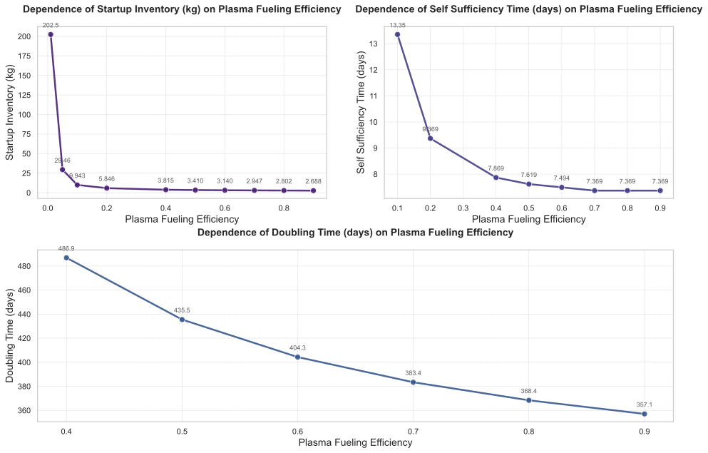

# plasma Fueling Efficiency 敏感性分析报告


生成时间: 2025-10-26 18:33:17.126597


## 分析案例配置详情


本分析案例的具体配置如下，这决定了仿真的扫描方式和分析的重点：


| 配置项 | 值 | 说明 |
| :--- | :--- | :--- |
| **`name`** | `"Fueling_Efficiency_Analysis"` | 本次分析案例的名称。 |
| **`independent_variable`** | `"plasma.Fueling_Efficiency"` | 独立扫描变量，即本次分析中主要改变的参数。 |
| **`independent_variable_sampling`** | `[0.01, 0.05, 0.1, 0.2, 0.4, 0.5, 0.6, 0.7, 0.8, 0.9]` | 独立变量的采样方法和范围。 |
| **`default_independent_values`** | `{"plasma.Fueling_Efficiency": 0.5}` | 独立扫描变量在模型中的原始默认值。 |
| **`dependent_variables`** | `["Startup_Inventory", "Self_Sufficiency_Time", "Doubling_Time", "Required_TBR"]` | 因变量，即我们关心的、随自变量变化的性能指标。 |


## “Required_TBR”优化配置

当“Required_TBR”作为因变量时，系统会启用一个二分查找算法来寻找满足特定性能指标的最小`bz.TBR`值。以下是本次优化任务的具体配置：


| 配置项 | 值 | 说明 |
| :--- | :--- | :--- |
| **`source_column`** | `"sds.inventory"` | 限制条件的数据源列。 |
| **`parameter_to_optimize`** | `"bz.TBR"` | 优化的目标参数。 |
| **`search_range`** | `[1, 1.5]` | 参数的搜索范围。 |
| **`tolerance`** | `0.005` | 搜索的收敛精度。 |
| **`max_iterations`** | `10` | 最大迭代次数。 |


## SDS Inventory 的时间曲线图:


## 性能指标趋势曲线图




## 约束求解性能指标分析图


### Required TBR vs plasma Fueling Efficiency


## 关键动态数据切片：过程数据


下表展示了过程数据中，以 `sds.inventory&plasma.Fueling_Efficiency=0.4` 为参考变量，在关键阶段的数据切片。**注意：下表中的默认单位为：时间(h), 库存(g), 功率(MW)。**


**注**：表格中所有简称列（C1, C2, ...）的数据均代表变量 `sds.inventory` 在不同参数组合下的值。
**表格图例说明**：
| 简称 | 参数组合 |
| :--- | :--- |
| **C1** | `plasma.Fueling_Efficiency=0.01` |
| **C2** | `plasma.Fueling_Efficiency=0.05` |
| **C3** | `plasma.Fueling_Efficiency=0.1` |
| **C4** | `plasma.Fueling_Efficiency=0.2` |
| **C5** | `plasma.Fueling_Efficiency=0.4` |
| **C6** | `plasma.Fueling_Efficiency=0.5` |
| **C7** | `plasma.Fueling_Efficiency=0.6` |
| **C8** | `plasma.Fueling_Efficiency=0.7` |
| **C9** | `plasma.Fueling_Efficiency=0.8` |
| **C10** | `plasma.Fueling_Efficiency=0.9` |


### 1. 初始阶段 (前 20 个数据点, 间隔 2)

|         time |        C1 |        C2 |        C3 |        C4 |      C5 |      C6 |      C7 |      C8 |      C9 |     C10 |
|-------------:|----------:|----------:|----------:|----------:|--------:|--------:|--------:|--------:|--------:|--------:|
|  0           |   3500    |  3500     |  3500     | 3500      | 3500    | 3500    | 3500    | 3500    | 3500    | 3500    |
|  2.6873e-11  |   3500    |  3500     |  3500     | 3500      | 3500    | 3500    | 3500    | 3500    | 3500    | 3500    |
|  9.53948e-05 |   3498.17 |  3499.63  |  3499.82  | 3499.91   | 3499.95 | 3499.96 | 3499.97 | 3499.97 | 3499.98 | 3499.98 |
|  0.0354545   |   2819.83 |  2839.8   |  2840.79  | 3020.38   | 3260.18 | 3308.15 | 3340.12 | 3362.96 | 3380.09 | 3393.41 |
|  0.0535513   |   2472.7  |  2492.97  |  2543.13  | 2838.73   | 2852.5  | 2981.99 | 3068.32 | 3129.99 | 3176.23 | 3212.21 |
|  0.5         |  -5672.84 |  1616.21  |  2495.66  | 2499.69   | 2832.45 | 2829.09 | 2908.44 | 2992.94 | 3056.32 | 3105.61 |
|  1           | -13384.7  |  -976.018 |  1161.03  | 2253.45   | 2622.62 | 2790.27 | 2825.65 | 2822.15 | 2852.47 | 2924.41 |
|  1.5         | -16871.5  | -1982.75  |   608.651 | 1921.73   | 2509.59 | 2514.63 | 2648.81 | 2760.88 | 2818.53 | 2817.82 |
|  2.5         | -27326.1  | -3005.71  |  -263.377 | 1434.47   | 2312.48 | 2507.52 | 2533.29 | 2642.6  | 2735.18 | 2814.93 |
|  3           | -28474.8  | -3289.57  |  -219.444 | 1266.7    | 2192.93 | 2392.23 | 2527.3  | 2525.9  | 2573.37 | 2654.43 |
|  4           | -35554.9  | -4791.06  |  -918.269 |  927.477  | 1990.18 | 2211.89 | 2365.06 | 2480.06 | 2539.15 | 2585.72 |
|  4.5         | -35490.5  | -4812.43  |  -952.982 |  838.252  | 1927    | 2151.57 | 2305.15 | 2418.89 | 2509.27 | 2537    |
|  5.5         | -40784.9  | -5927.36  | -1549.86  |  674.848  | 1775.07 | 2020.81 | 2187.16 | 2308.62 | 2403.01 | 2480.46 |
|  5.85        | -42313    | -5806.3   | -1505.75  |  677.205  | 1738.52 | 1986.46 | 2153.57 | 2274.84 | 2368.16 | 2443.65 |
|  6.5         | -42325.1  | -6706.09  | -1983.44  |  405.033  | 1610.59 | 1879.12 | 2059.32 | 2189.26 | 2288.25 | 2367.16 |
|  7.35        | -45622.1  | -6503.41  | -1894.06  |  435.402  | 1586.62 | 1857.03 | 2038.16 | 2168.42 | 2267.21 | 2345.43 |
|  8           | -45211.4  | -7276.21  | -2301.22  |  207.003  | 1516.03 | 1760.75 | 1955.11 | 2094.52 | 2199.76 | 2282.54 |
|  8.85        | -48075.9  | -7023.79  | -2184.19  |  254.596  | 1524.28 | 1744.46 | 1939.83 | 2079.79 | 2185.24 | 2267.93 |
|  9.5         | -47403.2  | -7716.87  | -2546.97  |   53.9245 | 1396.62 | 1682.28 | 1862.08 | 2011.39 | 2123.67 | 2211.45 |
| 10.35        | -49991.7  | -7432.26  | -2411.99  |  112.763  | 1413.9  | 1696.4  | 1849.57 | 1999.55 | 2112.23 | 2200.21 |


### 2. 转折点阶段 (围绕 'sds.inventory&plasma.Fueling_Efficiency=0.4' 最小值)

|   time |       C1 |       C2 |       C3 |       C4 |       C5 |       C6 |      C7 |      C8 |      C9 |     C10 |
|-------:|---------:|---------:|---------:|---------:|---------:|---------:|--------:|--------:|--------:|--------:|
| 181.35 | -78953.6 | -14431.9 | -6366.2  | -2332.67 | -314.508 |  89.8186 | 359.817 | 553.117 | 698.494 | 812.085 |
| 182    | -77413.4 | -14123.5 | -6211.81 | -2255.28 | -275.648 | 120.964  | 385.813 | 575.429 | 718.036 | 829.466 |
| 182.85 | -78990   | -14438.5 | -6369.08 | -2333.71 | -314.682 |  89.7963 | 359.881 | 553.229 | 698.626 | 812.219 |
| 183.5  | -77449.4 | -14130   | -6214.64 | -2256.3  | -275.805 | 120.957  | 385.892 | 575.555 | 718.183 | 829.615 |
| 184.35 | -79025.6 | -14444.9 | -6371.86 | -2334.7  | -314.818 |  89.809  | 359.979 | 553.374 | 698.792 | 812.386 |
| 185    | -77484.6 | -14136.4 | -6217.38 | -2257.26 | -275.925 | 120.984  | 386.003 | 575.714 | 718.362 | 829.796 |
| 185.85 | -79060.4 | -14451.1 | -6374.54 | -2335.63 | -314.917 |  89.8554 | 360.109 | 553.55  | 698.989 | 812.585 |
| 186.5  | -77519   | -14142.5 | -6220.03 | -2258.17 | -276.009 | 121.045  | 386.147 | 575.903 | 718.573 | 830.009 |
| 187.35 | -79094.4 | -14457.2 | -6377.14 | -2336.51 | -314.981 |  89.9344 | 360.27  | 553.757 | 699.217 | 812.816 |
| 188    | -77552.7 | -14148.5 | -6222.59 | -2259.03 | -276.058 | 121.138  | 386.321 | 576.123 | 718.813 | 830.252 |
| 188.85 | -79127.6 | -14463.1 | -6379.65 | -2337.34 | -315.011 |  90.0448 | 360.461 | 553.993 | 699.474 | 813.076 |
| 189.5  | -77585.7 | -14154.4 | -6225.06 | -2259.84 | -276.074 | 121.262  | 386.525 | 576.372 | 719.083 | 830.525 |
| 190.35 | -79160.2 | -14468.9 | -6382.08 | -2338.12 | -315.008 |  90.1857 | 360.681 | 554.258 | 699.76  | 813.365 |
| 191    | -77617.9 | -14160.1 | -6227.46 | -2260.6  | -276.057 | 121.415  | 386.758 | 576.648 | 719.381 | 830.826 |
| 191.85 | -79192   | -14474.5 | -6384.42 | -2338.85 | -314.973 |  90.356  | 360.93  | 554.55  | 700.073 | 813.682 |
| 192.5  | -77649.5 | -14165.6 | -6229.77 | -2261.31 | -276.008 | 121.598  | 387.018 | 576.952 | 719.705 | 831.155 |
| 193.35 | -79223.2 | -14480   | -6386.69 | -2339.54 | -314.907 |  90.5547 | 361.205 | 554.869 | 700.413 | 814.026 |
| 194    | -77680.4 | -14171   | -6232    | -2261.98 | -275.929 | 121.809  | 387.305 | 577.282 | 720.056 | 831.51  |
| 194.85 | -79253.7 | -14485.3 | -6388.89 | -2340.18 | -314.811 |  90.7808 | 361.507 | 555.213 | 700.778 | 814.395 |
| 195.5  | -77710.6 | -14176.3 | -6234.16 | -2262.6  | -275.821 | 122.046  | 387.618 | 577.638 | 720.433 | 831.891 |


### 3. 结束阶段 (后 20 个数据点, 间隔 2)

|    time |      C1 |       C2 |       C3 |      C4 |      C5 |      C6 |      C7 |      C8 |      C9 |     C10 |
|--------:|--------:|---------:|---------:|--------:|--------:|--------:|--------:|--------:|--------:|--------:|
| 19985.9 | -198895 | -25955.9 | -4338.63 | 6469.95 | 11874   | 12954.8 | 13675.3 | 14228.9 | 14611.3 | 14908.7 |
| 19986.5 | -197342 | -25645   | -4182.92 | 6548.06 | 11913.4 | 12986.4 | 13701.7 | 14200.3 | 14586.3 | 14886.6 |
| 19987.4 | -198903 | -25956.7 | -4338.48 | 6470.58 | 11874.9 | 12955.7 | 13676.3 | 14229.9 | 14612.3 | 14909.7 |
| 19988   | -197351 | -25645.8 | -4182.77 | 6548.69 | 11914.2 | 12987.3 | 13702.6 | 14201.3 | 14587.3 | 14887.6 |
| 19988.9 | -198912 | -25957.5 | -4338.33 | 6471.21 | 11875.8 | 12956.7 | 13677.2 | 14230.9 | 14613.3 | 14910.7 |
| 19989.5 | -197359 | -25646.6 | -4182.61 | 6549.32 | 11915.1 | 12988.2 | 13703.6 | 14202.2 | 14588.3 | 14888.6 |
| 19990.4 | -198920 | -25958.3 | -4338.18 | 6471.84 | 11876.7 | 12957.6 | 13678.1 | 14231.8 | 14614.3 | 14911.7 |
| 19991   | -197367 | -25647.4 | -4182.46 | 6549.95 | 11916   | 12989.1 | 13704.5 | 14203.2 | 14589.3 | 14889.6 |
| 19991.9 | -198928 | -25959.1 | -4338.02 | 6472.47 | 11877.5 | 12958.5 | 13679.1 | 14232.8 | 14615.3 | 14912.7 |
| 19992.5 | -197376 | -25648.2 | -4182.31 | 6550.58 | 11916.8 | 12990   | 13705.5 | 14204.2 | 14590.3 | 14890.6 |
| 19993.4 | -198937 | -25959.9 | -4337.87 | 6473.1  | 11878.4 | 12959.4 | 13680   | 14233.8 | 14616.2 | 14913.7 |
| 19994   | -197384 | -25649   | -4182.16 | 6551.21 | 11917.7 | 12991   | 13706.4 | 14205.1 | 14591.3 | 14891.6 |
| 19994.9 | -198945 | -25960.8 | -4337.72 | 6473.73 | 11879.3 | 12960.3 | 13681   | 14234.8 | 14617.2 | 14914.7 |
| 19995.5 | -197393 | -25649.8 | -4182.01 | 6551.84 | 11918.6 | 12991.9 | 13707.4 | 14206.1 | 14592.3 | 14892.6 |
| 19996.4 | -198954 | -25961.6 | -4337.57 | 6474.36 | 11880.1 | 12961.2 | 13681.9 | 14235.7 | 14618.2 | 14915.7 |
| 19997   | -197401 | -25650.7 | -4181.86 | 6552.47 | 11919.4 | 12992.8 | 13708.3 | 14207.1 | 14593.3 | 14893.6 |
| 19997.9 | -198962 | -25962.4 | -4337.42 | 6474.99 | 11881   | 12962.2 | 13682.9 | 14236.7 | 14619.2 | 14916.7 |
| 19998.5 | -197410 | -25651.5 | -4181.7  | 6553.1  | 11920.3 | 12993.7 | 13709.3 | 14208.1 | 14594.2 | 14894.6 |
| 19999.4 | -198971 | -25963.2 | -4337.27 | 6475.62 | 11881.9 | 12963.1 | 13683.8 | 14237.7 | 14620.2 | 14917.7 |
| 20000   | -197418 | -25652.3 | -4181.55 | 6553.73 | 11921.2 | 12994.6 | 13710.2 |   nan   |   nan   |   nan   |


## 性能指标总表


##### 性能指标

|   plasma Fueling Efficiency |   Doubling Time (days) |   Self Sufficiency Time (days) |   Startup Inventory (kg) |
|----------------------------:|-----------------------:|-------------------------------:|-------------------------:|
|                        0.01 |                 nan    |                         nan    |                   202.47 |
|                        0.05 |                 nan    |                         nan    |                    29.46 |
|                        0.1  |                 nan    |                          13.35 |                     9.94 |
|                        0.2  |                 nan    |                           9.37 |                     5.85 |
|                        0.4  |                 486.87 |                           7.87 |                     3.82 |
|                        0.5  |                 435.49 |                           7.62 |                     3.41 |
|                        0.6  |                 404.31 |                           7.49 |                     3.14 |
|                        0.7  |                 383.37 |                           7.37 |                     2.95 |
|                        0.8  |                 368.37 |                           7.37 |                     2.8  |
|                        0.9  |                 357.06 |                           7.37 |                     2.69 |


##### “Required TBR” 相关数据

|   plasma Fueling Efficiency |   Required TBR |
|----------------------------:|---------------:|
|                        0.01 |       inf      |
|                        0.05 |         1.1719 |
|                        0.1  |         1.0898 |
|                        0.2  |         1.0469 |
|                        0.4  |         1.0273 |
|                        0.5  |         1.0234 |
|                        0.6  |         1.0195 |
|                        0.7  |         1.0156 |
|                        0.8  |         1.0156 |
|                        0.9  |         1.0156 |


---

# AI模型分析提示词 (qwen-plus)

```markdown
**角色：** 你是一名聚变反应堆氚燃料循环领域的专家。

**任务：** 请**完全基于**下方提供的**两类数据表格**，对聚变堆燃料循环模型的**敏感性分析**结果进行深度解读。

**分析要点 (必须严格依据数据表格作答)：**

1.  **全局敏感性分析 (参考“性能指标总表”) :**
    *   分析性能指标总表（ `Startup_Inventory`, `Doubling_Time` 以及以 `Required_` 开头的求解指标等）呈现出怎样的**总体趋势**？请进行量化描述。
    *   如果存在多个性能指标，分析哪个性能指标对独立变量 `plasma.Fueling_Efficiency` 的变化最为敏感？哪个最不敏感？


3.  **动态过程分析 (参考“关键动态数据切片：过程数据”) :**
    *   观察过程数据切片：系统在“初始阶段”和“结束阶段”的行为有何不同？
    *   以 `sds.inventory&plasma.Fueling_Efficiency=0.4` 为参考，其“转折点阶段”的数据揭示了什么物理过程？（例如，它是否是氚库存由消耗转为净增长的关键时刻？）

3.  **综合结论：**
结合所有分析（包括主趋势），总结在不同的运行场景下，调整 `plasma.Fueling_Efficiency` 对整个氚燃料循环系统的综合影响和潜在的利弊权衡。
    *   基于这些发现，可以得出哪些关于系统设计或运行优化的初步建议？
```


---

# AI模型分析结果

### **1. 全局敏感性分析（基于“性能指标总表”）**

#### **总体趋势的量化描述：**

本次敏感性分析以等离子体加料效率 `plasma.Fueling_Efficiency` 从 0.01 到 0.9 为扫描范围，系统输出了多个关键性能指标的变化趋势。以下是对各指标随加料效率变化的**量化趋势分析**：

---

##### **(1) Startup Inventory (启动库存, 单位: kg)**

- 随着 `Fueling_Efficiency` 的提升，**启动氚库存单调递减**。
- 从 `0.01` 时的 **202.47 kg** 下降至 `0.9` 时的 **2.69 kg**，降幅高达 **98.7%**。
- 在低效区间（`<0.2`），下降速度最快：
  - 从 `0.01→0.05`，库存从 202.47 kg → 29.46 kg（下降约 85.4%）
  - 从 `0.05→0.1`，再降 66.3%
- 当 `Fueling_Efficiency > 0.4` 后，下降趋于平缓，每增加 0.1 效率，库存减少约 0.1–0.2 kg。

> **结论：** `Startup_Inventory` 对 `Fueling_Efficiency` 极其敏感，尤其在低值区（<0.2），是**最敏感的性能指标之一**。

---

##### **(2) Doubling Time (倍增时间, 单位: 天)**

- 仅当 `Fueling_Efficiency ≥ 0.4` 时，系统可实现氚的净增殖（即存在正向的倍增过程），此前所有情况下该值为 `nan`，表明系统无法实现自持或盈余。
- 在 `0.4 ≤ FE ≤ 0.9` 区间内，`Doubling_Time` 从 **486.87 天** 持续缩短至 **357.06 天**，整体缩短约 **26.6%**。
- 每提高 0.1 加料效率，平均缩短倍增时间约 13–15 天，在 `FE=0.8→0.9` 时趋缓。

> **结论：** `Doubling_Time` 在低加料效率下无定义（系统亏损），一旦超过阈值（~0.4），其对效率提升表现出显著但非线性的响应。

---

##### **(3) Self-Sufficiency Time (自给自足时间, 单位: 天)**

- 该指标表示系统从初始库存耗尽后，恢复到完全依靠自身产氚维持运行所需的时间。
- 趋势为：随着 `Fueling_Efficiency` 提高，`Self_Sufficiency_Time` 快速下降并趋于饱和。
  - 从 `0.1` 的 13.35 天 → `0.4` 的 7.87 天 → `0.5` 的 7.62 天
  - 当 `FE ≥ 0.7` 时，稳定在 **7.37 天**
- 表明当加料效率达到 0.7 以上时，进一步提升效率对缩短自给时间已无实质贡献。

> **结论：** 该指标在中等效率区间（0.1–0.6）较为敏感，但在高效率区趋于**饱和**，属于**中度敏感但有上限**的指标。

---

##### **(4) Required TBR (必需的氚增殖比)**

- 此为优化求解所得的最小必要 `TBR` 值，用于满足氚平衡约束。
- 趋势极为清晰：
  - `FE = 0.01`: `inf`（无限大，意味着即使 TBR 极高也无法满足需求）
  - `FE = 0.05`: 1.1719
  - `FE = 0.1`: 1.0898
  - `FE = 0.2`: 1.0469
  - `FE ≥ 0.4`: 继续下降至 1.0273，并在 `FE ≥ 0.7` 后稳定于 **1.0156**
- 从 `0.05 → 0.7`，Required TBR 下降约 **13.4%**，且在 `FE > 0.4` 后变化极小。

> **结论：** `Required_TBR` 是一个高度非线性但收敛性强的指标，对低效率区域极其敏感，在高效率区趋于极限值，反映出系统对加料效率的依赖存在“收益递减”效应。

---

#### **敏感性排序（由高到低）：**

| 指标 | 敏感性等级 | 理由 |
|------|------------|------|
| **Startup Inventory** | ⭐⭐⭐⭐⭐（极高） | 数量级从百kg降至亚kg级，变化幅度最大，尤其在低FE段 |
| **Required TBR** | ⭐⭐⭐⭐☆（高） | 从不可行（inf）到接近物理极限（~1.0156），关键设计参数 |
| **Doubling Time** | ⭐⭐⭐★☆（中高） | 存在存在性门槛（FE≥0.4），之后持续改善 |
| **Self-Sufficiency Time** | ⭐⭐★☆☆（中低） | 改善明显但快速饱和，FE>0.7后不再变化 |

> ✅ **最敏感指标：`Startup_Inventory`**  
> ✅ **最不敏感指标：`Self-Sufficiency_Time`（因早饱和）**

---

### **2. 动态过程分析（基于“关键动态数据切片：过程数据”）**

#### **(1) 初始阶段 vs 结束阶段的行为差异**

通过对比“初始阶段”与“结束阶段”的 `sds.inventory` 数据，可以观察到系统行为的根本转变：

- **初始阶段（t ≈ 0–10 h）：**
  - 所有工况下，氚库存均经历剧烈波动甚至负值（如 C1 在 t=1h 时达 -13384.7 g），说明系统初期处于**强消耗状态**。
  - 低加料效率（C1–C3, FE≤0.1）导致库存迅速跌入深度负值，反映**注入损失严重，回收不足**。
  - 高加料效率（C7–C10, FE≥0.6）则库存下降缓慢，部分曲线（如 C10）在早期即显现回升趋势，表明燃料利用率高，循环闭合快。

- **结束阶段（t ≈ 19986–20000 h ≈ 2.28 年）：**
  - 系统进入稳态或准稳态运行。
  - 低加料效率（C1–C3）仍为**负库存**（如 C1: -197418 g），意味着长期净消耗，无法实现氚自持。
  - 中等及以上效率（C4 及以上）全部转为**正库存增长**：
    - C4 (`FE=0.2`)：~6550 g
    - C5 (`FE=0.4`)：~11920 g
    - C10 (`FE=0.9`)：~14900 g（未完成最后三点计算）
  - 显示出明显的**正反馈积累效应**：更高的加料效率不仅避免亏损，还能建立可观的安全库存。

> **核心差异总结：**
> - 初始阶段体现的是**瞬态冲击响应**，受加料效率影响极大；
> - 结束阶段体现的是**长期稳态能力**，决定了系统能否实现可持续运行。

---

#### **(2) “转折点阶段”揭示的物理过程**

以 `sds.inventory&plasma.Fueling_Efficiency=0.4`（C5）为参考，在 `t≈182–195 h` 时间窗口内，其库存值从最低点 `-314.5 g`（约 -0.31 kg）逐步回升至正值。

- 对于 C5 (`FE=0.4`)：
  - 最小值出现在 `t=181.35 h`，库存为 **-314.5 g**
  - 至 `t=185 h` 已回升至 `-275.9 g`
  - 到 `t=195.5 h` 时升至 `-275.8 g`，虽仍为负，但趋势明确向上
- 更高效率组（C6–C10）更早触底反弹：
  - C6 (`FE=0.5`) 在 `t=181.35 h` 时已达 **+89.8 g**，即已实现净增
  - C10 (`FE=0.9`) 同时刻为 **+812.1 g**

> **物理意义解读：**
> - “转折点阶段”正是系统从**氚净消耗**转向**净生产**的关键过渡期。
> - 触底时间与加料效率成反比：效率越高，触底越早、谷值越浅、回升越快。
> - `FE=0.4` 是一个临界点——它能触底反弹（尽管缓慢），而更低效率（如 C4=`0.2`）在同期仍深陷负值（-2332g），尚未见底。
> - 这一阶段标志着**氚循环开始闭合并产生盈余**，是实现自持运行的前置条件。

---

### **3. 综合结论与建议**

#### **综合影响分析：**

`plasma.Fueling_Efficiency` 的提升对整个氚燃料循环系统具有**决定性影响**，具体表现为：

| 影响维度 | 正面效应 | 负面/挑战 |
|--------|---------|----------|
| **启动要求** | 显著降低启动库存需求（从 >200kg → <3kg），大幅减轻初始氚资源压力 | 低效率下需巨额初始投入，几乎不可行 |
| **可持续性** | 提高加料效率可使系统跨越“盈亏平衡点”（FE≥0.4），实现氚净增殖和自持运行 | 若效率不足（<0.4），系统永远亏损，无法长期运行 |
| **工程裕度** | 高加料效率显著降低对包层TBR的要求（Required TBR从>1.17→1.0156），放宽材料与设计限制 | 低效率迫使TBR逼近甚至超出当前技术极限（>1.17） |
| **动态响应** | 加速系统进入自持状态（Self-Sufficiency Time 缩短近50%），提升运行灵活性 | 低效率导致长时间负库存，增加失稳风险 |

此外，存在明显的**非线性收益递减规律**：
- 当 `FE < 0.4`：系统处于危险区，任何微小提升都带来巨大改善；
- 当 `FE ∈ [0.4, 0.7]`：进入高效区，各项指标持续优化；
- 当 `FE > 0.7`：多数指标趋于饱和（如 Self-Sufficiency Time、Required TBR），继续提升边际效益有限。

---

#### **初步设计与运行优化建议：**

1. **设定最低加料效率门槛：**
   - **必须确保 `plasma.Fueling_Efficiency ≥ 0.4`**，否则系统无法实现氚自持，不具备工程可行性。
   - 若能达到 **0.5–0.6**，即可兼顾性能与成本，为最优操作区间。

2. **优先投资加料技术研发：**
   - 相较于盲目追求超高TBR包层设计，**提升加料效率更具性价比**。
   - 例如，将加料效率从 0.2 提升至 0.5，可使 Required TBR 从 1.0469 降至 1.0234，相当于降低了约 2.3% 的增殖压力，这比改进包层更容易实现。

3. **启动策略优化：**
   - 在低加料效率场景下，需准备数百公斤氚库存，远超现有全球供应能力。
   - 因此，**应优先部署高加料效率方案**，以将启动库存控制在 3–5 kg 量级，符合现实约束。

4. **控制系统设计考虑动态过程：**
   - 系统在前 200 小时内可能经历严重氚亏损，尤其是低效工况。
   - 需配置足够的**缓冲储存容量**和**快速回收机制**，防止因瞬时负库存导致停堆。

5. **目标定位：**
   - **理想目标：`Fueling_Efficiency ≥ 0.7`**
     - 可实现最短倍增时间（<385天）、最低启动库存（<3kg）、最小Required TBR（1.0156），并使自给时间达到理论极限（7.37天）。
   - **可行底线：`Fueling_Efficiency ≥ 0.5`**
     - 已能满足基本工程需求，具备发展价值。

---

### ✅ **最终总结：**

本敏感性分析表明，**`plasma.Fueling_Efficiency` 是决定聚变堆氚循环成败的核心参数**。其微小提升可在宽泛范围内显著改善系统性能，尤其是在 `0.1–0.5` 区间内效果最为显著。系统设计不应仅聚焦于包层增殖能力（TBR），而应将**高效加料技术**（如 pellet injection、gas puffing 优化、壁面回收增强等）视为同等甚至更重要的攻关方向。唯有实现高效的等离子体燃料注入与循环闭合，才能真正迈向可持续的聚变能源时代。
```
