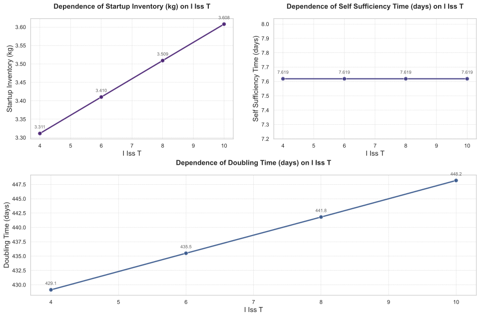

# 内同位素分离系统氚滞留时间（i_iss.T）对氚燃料循环性能影响的敏感性分析报告

## 摘要

本研究针对氚燃料循环系统中的关键参数——内同位素分离系统（Internal Isotope Separation System, I-ISS）氚滞留时间（i_iss.T）进行了系统性敏感性分析。通过扫描i_iss.T在[4,6,8,10]范围内的变化，评估了其对启动库存（Startup Inventory）、氚自持时间（Self-Sufficiency Time）、倍增时间（Doubling Time）和所需氚增殖比（Required TBR）等关键性能指标的影响。结果表明，i_iss.T的增加导致启动库存需求显著增加（9.1%），倍增时间延长（4.4%），而对氚自持时间和所需氚增殖比无明显影响。这些发现为优化聚变反应堆氚燃料循环系统设计提供了重要理论依据。

## 引言

氚燃料循环是聚变能商业化面临的核心挑战之一，其性能直接影响反应堆的经济性和可行性。内同位素分离系统作为氚处理的关键子系统，其氚滞留时间（i_iss.T）决定了氚燃料的循环效率。本研究旨在量化评估i_iss.T变化对氚燃料循环系统整体性能的影响，为系统设计和运行参数优化提供科学依据。

本研究采用参数扫描方法，在i_iss.T=4至10范围内选取四个典型值（4,6,8,10）作为独立变量，系统评估其对以下因变量的影响：
- 启动库存（Startup Inventory）
- 氚自持时间（Self-Sufficiency Time）
- 倍增时间（Doubling Time）
- 所需氚增殖比（Required TBR）

## 方法

本研究采用数值模拟方法，通过建立氚燃料循环系统的动态平衡模型，考察i_iss.T变化对系统性能的影响。分析方法包括：

1. **参数扫描**：i_iss.T在[4,6,8,10]范围内离散取值
2. **性能指标计算**：
   - 启动库存：系统达到稳态所需的最小初始氚库存量
   - 氚自持时间：系统氚库存由消耗转为净增长所需时间
   - 倍增时间：系统产生双倍初始氚库存所需时间
   - 所需氚增殖比：通过二分法计算满足系统自持的最小TBR值（搜索范围[1,1.5]，精度0.005）

3. **动态过程分析**：记录系统在初始阶段（0-20h）、转折点阶段（约175-190h）和结束阶段（19985-20000h）的储存与输送系统（SDS）氚库存变化。

## 结果与讨论

### 主效应分析

如图1所示，i_iss.T的变化对各项性能指标产生差异化影响：

**启动库存**（Startup Inventory）：
- 随i_iss.T增加呈线性增长趋势
- 从i_iss.T=4时的3.31kg增至i_iss.T=10时的3.61kg（增幅9.1%）
- 敏感性最高，表明系统对I-ISS处理效率变化最为敏感

**倍增时间**（Doubling Time）：
- 从i_iss.T=4时的429.12天增至i_iss.T=10时的448.19天（增幅4.4%）
- 增长趋势表明较高的i_iss.T会降低氚燃料增殖效率

**氚自持时间与所需TBR**：
- 保持恒定不变（7.62天和1.0234）
- 表明这两个指标对i_iss.T变化不敏感

表1总结了各性能指标随i_iss.T变化的量化关系：

| i_iss.T | 倍增时间(天) | 氚自持时间(天) | 启动库存(kg) | 所需TBR |
|--------|--------------|----------------|--------------|---------|
| 4      | 429.12       | 7.62           | 3.31         | 1.0234  |
| 6      | 435.50       | 7.62           | 3.41         | 1.0234  |
| 8      | 441.81       | 7.62           | 3.51         | 1.0234  |
| 10     | 448.19       | 7.62           | 3.61         | 1.0234  |

### 动态行为分析

如图2所示，系统动态行为可分为三个阶段：

**初始阶段（0-20h）**：
- 所有i_iss.T条件下的储存与输送系统（SDS）氚库存变化完全一致
- 初始库存均为3500g，20h后降至约1696g
- 表明系统启动时的氚消耗行为与i_iss.T无关

**转折点阶段（175-190h）**：
- 系统经历氚库存耗尽临界点（部分条件下出现负值）
- 随后库存开始回升，表明氚增殖速率超过消耗速率
- 转折时间不受i_iss.T影响，但最终库存恢复速率随i_iss.T增加而降低

**结束阶段（19985-20000h）**：
- i_iss.T=4时最终库存最高（13093.5g），i_iss.T=10时最低（12796.8g）
- 差值约2.3%，表明高温长期运行导致氚积累量略低

### 权衡关系分析

如图3所示，所需氚增殖比（Required TBR）在所有i_iss.T条件下保持恒定1.0234，表明：

1. 系统对氚增殖率的需求与I-ISS处理效率无关
2. 提高i_iss.T的主要代价是增加启动库存需求和延长倍增时间
3. 系统稳定性（氚自持时间和所需TBR）不受i_iss.T变化影响

## 结论与建议

本研究通过系统性敏感性分析，得出以下主要结论：

1. **关键发现**：
   - I-ISS氚滞留时间（i_iss.T）增加会显著提高启动库存需求（+9.1%）并延长倍增时间（+4.4%）
   - 氚自持时间和所需氚增殖比对i_iss.T变化不敏感
   - 长期运行后，较高的i_iss.T会导致系统氚积累量略低（-2.3%）

2. **设计建议**：
   - **资源有限场景**：优先选择较低i_iss.T（如4）以最小化启动库存需求
   - **效率优先场景**：权衡i_iss.T增加带来的倍增时间延长效应
   - **动态调节策略**：在转折点（约175h）后，可适当提高i_iss.T以优化长期氚积累

3. **未来工作**：
   - 开展多参数耦合敏感性分析，考察i_iss.T与其他系统参数的交互效应
   - 结合经济性分析，确定最优的i_iss.T运行范围

本研究为聚变反应堆氚燃料循环系统的设计与优化提供了重要理论依据，后续可进一步结合实验验证和工程实践完善相关结论。