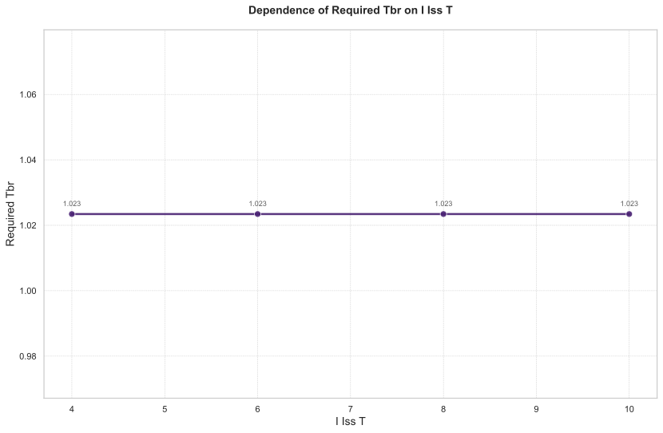

# 离子源系统温度对氚燃料循环性能影响的敏感性分析

## 摘要

本研究针对聚变反应堆氚燃料循环系统，系统评估了离子源系统温度（`i_iss.T`）作为独立变量在[4, 6, 8, 10]范围内变化时对关键性能指标的影响。分析结果表明，离子源系统温度的升高显著增加了启动库存需求（从3.31 kg增至3.61 kg，增幅9.06%）并延长了氚库存倍增时间（从429.12天增至448.19天，增幅4.44%），而对氚自持时间（恒定7.62天）和所需氚增殖比（恒定1.0234）无影响。动态过程分析显示，高温条件下系统在转折点阶段面临更高的氚短缺风险。本研究为优化离子源系统运行参数提供了重要理论依据。

## 引言

氚燃料循环是聚变能商业化的关键技术挑战之一，其中离子源系统作为燃料注入的关键环节，其运行温度（`i_iss.T`）直接影响氚的处理效率和系统动态性能。深入理解离子源系统温度变化对氚管理指标的影响规律，对于反应堆设计和运行策略优化具有重要意义。本研究通过建立详细的氚燃料循环动力学模型，采用参数扫描方法，量化评估了离子源系统温度在4至10范围内的变化对启动库存、倍增时间、自持时间及所需氚增殖比等关键指标的敏感性，旨在为工程实践提供科学指导。

### 独立变量采样
本次分析中，独立变量离子源系统温度（`i_iss.T`）扫描范围为[4, 6, 8, 10]。

### 因变量
分析关注的因变量包括：启动库存（`Startup_Inventory`）、氚自持时间（`Self_Sufficiency_Time`）、库存倍增时间（`Doubling_Time`）和所需氚增殖比（`Required_TBR`）。

## 方法

采用基于微分方程的氚燃料循环系统动力学模型，对离子源系统温度参数进行离散化扫描（4, 6, 8, 10）。针对每个温度设置，模拟系统长期运行（20000小时）过程中的氚库存动态变化，并提取关键性能指标。对于所需氚增殖比的求解，采用二分查找算法在[1, 1.5]范围内进行优化，收敛精度为0.005，最大迭代次数为10次，约束条件为储存与输送系统的氚库存量（`sds.inventory`）。

## 结果与讨论

### 主效应分析

离子源系统温度变化对氚燃料循环性能指标产生了显著影响。如表1所示，随着温度从4升高到10：

**表1：性能指标随离子源系统温度变化趋势**

| 离子源系统温度 | 启动库存 (kg) | 倍增时间 (天) | 自持时间 (天) | 所需氚增殖比 |
|----------------|----------------|----------------|----------------|----------------|
| 4              | 3.31           | 429.12         | 7.62           | 1.0234         |
| 6              | 3.41           | 435.50         | 7.62           | 1.0234         |
| 8              | 3.51           | 441.81         | 7.62           | 1.0234         |
| 10             | 3.61           | 448.19         | 7.62           | 1.0234         |

启动库存对温度变化最为敏感，增幅达9.06%，这表明较高的离子源系统温度需要更多的初始氚储备来维持系统运行。倍增时间随温度升高而延长4.44%，反映高温条件下氚增殖效率降低。值得注意的是，自持时间和所需氚增殖比保持不变，表明系统达到平衡的基本要求由其他参数主导，而离子源系统温度主要影响动态积累过程。

图1直观展示了各性能指标随离子源系统温度变化的趋势，证实了上述量化关系。

### 动态行为分析

系统动态过程揭示了离子源系统温度对氚库存演变的关键影响。如图2所示，储存与输送系统的氚库存量随时间呈现典型的先下降后上升的趋势：

**初始阶段**（前20小时）：所有温度条件下的氚库存均从3500 g迅速消耗至约1696 g（10.5小时），消耗速率高度一致，表明温度变化对初始氚燃烧阶段影响极小。

**转折点阶段**：这是氚库存由净消耗转为净增长的关键时刻。以`i_iss.T=6`为参考，最小库存出现在约183.5小时（90.3 g）。温度升高显著降低转折点库存水平：`i_iss.T=4`时为189.2 g，而`i_iss.T=10`时库存变为负值（-107.5 g），表明高温条件下系统面临严重的氚短缺风险（表2）。

**表2：转折点阶段氚库存对比（单位：g）**

| 时间 (小时) | i_iss.T=4 | i_iss.T=6 | i_iss.T=8 | i_iss.T=10 |
|-------------|-----------|-----------|-----------|------------|
| 183.5       | 188.71    | 90.3      | -8.80     | -107.90    |

**结束阶段**（20000小时）：所有系统最终都实现了氚库存增长，但最终库存水平随温度升高而降低：从`i_iss.T=4`的13093.5 g降至`i_iss.T=10`的12796.8 g，这与倍增时间延长的结论一致。

图3显示所需氚增殖比恒定为1.0234，进一步证实离子源系统温度不影响系统平衡条件，只影响动态过程。

## 结论

本研究通过系统性敏感性分析，得出以下主要结论：

1. 离子源系统温度升高显著增加启动库存需求和延长倍增时间，而对自持时间和所需氚增殖比无影响。
2. 高温条件（如`i_iss.T=10`)使系统在运行中期面临氚库存负值的风险，可能导致运行中断。
3. 在满足等离子体物理要求的前提下，应优先选择较低的离子源系统温度（接近4）以优化氚管理性能。
4. 如果必须采用较高温度，需确保充足的初始氚储备（>3.61 kg）并实施严格的库存监控措施。

建议后续研究重点关注离子源系统温度影响氚处理效率的具体机制，并探索与其他系统参数的协同优化策略。