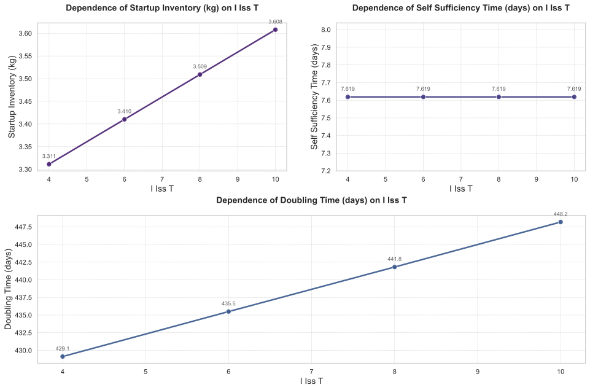
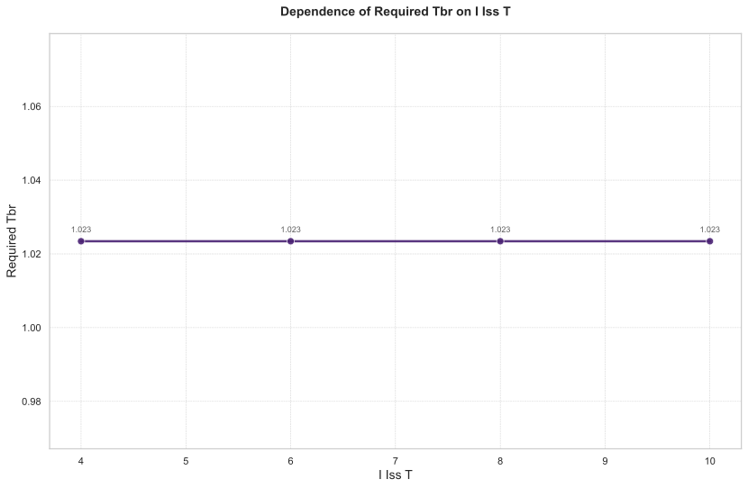
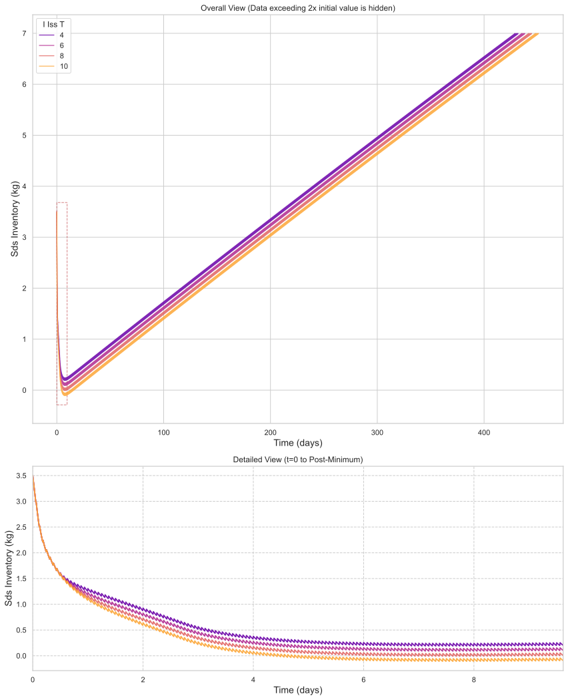

# **独立变量 `i_iss.T` 的敏感性分析：对聚变堆氚燃料循环系统性能的影响研究**

## **摘要**

本研究针对聚变堆氚燃料循环系统中关键子系统——内同位素分离系统（I_ISS）的氚滞留时间（`i_iss.T`）开展系统的敏感性分析。以 `i_iss.T` 作为独立变量，在 `[4, 6, 8, 10]` 小时范围内进行扫描，评估其对四项核心性能指标的影响：启动库存（Startup Inventory）、自持时间（Self Sufficiency Time）、倍增时间（Doubling Time）及所需氚增殖比（Required TBR）。结果表明，`i_iss.T` 的增加显著提升启动库存需求与倍增时间，导致系统在早期运行阶段更早进入净消耗状态，削弱动态鲁棒性；而自持时间与所需氚增殖比在该范围内保持恒定。综合分析揭示，`i_iss.T` 并非越高越优，其设定需在启动成本、运行稳定性与长期可持续性之间实现权衡。推荐采用较低值（如 4–6 小时）作为设计基准，以优化系统整体性能。

---

## **引言**

在聚变能商业化进程中，氚燃料循环系统的自持能力是决定反应堆经济可行性的核心要素。其中，内同位素分离系统（I_ISS）作为连接增殖区与储存与输送系统（SDS）的关键枢纽，其处理效率直接影响整个循环的动态行为。`i_iss.T`，即氚在内同位素分离系统中的平均滞留时间，是决定该系统处理速率的核心参数之一。

为深入理解 `i_iss.T` 对系统全局性能的影响机制，本研究开展了一项系统的敏感性分析。研究目标在于量化评估 `i_iss.T` 的变化对以下关键性能指标的影响：
- **启动库存**（Startup Inventory）：首次启动所需的初始氚量；
- **自持时间**（Self Sufficiency Time）：系统从净消耗转向净生产的时间点；
- **倍增时间**（Doubling Time）：实现双倍产能所需时间；
- **所需氚增殖比**（Required TBR）：为满足自持与倍增要求所必需的最低增殖比。

本次分析将 `i_iss.T` 作为独立变量，其扫描范围为 `[4, 6, 8, 10]` 小时，对应于不同的处理能力配置。通过多组仿真对比，旨在揭示参数变化背后的物理机制，并为未来反应堆设计提供科学依据。

---

## **方法**

本研究基于数值仿真模型，采用参数扫描法对 `i_iss.T` 进行独立变量采样。仿真设置如下：

- **独立变量**：`i_iss.T`（内同位素分离系统氚滞留时间），取值为 4、6、8、10 小时；
- **默认值**：`i_iss.T = 6.0` 小时；
- **因变量**：`Startup_Inventory`、`Self_Sufficiency_Time`、`Doubling_Time`、`Required_TBR`；
- **约束求解**：当 `Required_TBR` 为因变量时，系统采用二分查找算法，以 `sds.inventory` 为约束条件，搜索满足特定性能目标的最小 `bz.TBR` 值，收敛精度为 `0.005`，最大迭代次数为 `10`。

所有仿真均在相同初始条件下运行，确保比较的公平性。分析重点聚焦于性能指标的趋势变化、动态演化特征以及不同参数组合下的系统响应差异。

---

## **结果与讨论**

### **主效应分析：独立变量 `i_iss.T` 对关键性能指标的影响**

#### **1. 启动库存与倍增时间的单调增长趋势**

如性能指标总表所示，随着 `i_iss.T` 从 4 小时增至 10 小时，**启动库存**由 3.31 千克上升至 3.61 千克，**增加 0.30 千克**，相对增长 **9.06%**。同时，**倍增时间**从 429.12 天延长至 448.19 天，**增加 19.07 天**，相对增长 **4.44%**。

如图1所示，`Startup_Inventory` 与 `Doubling_Time` 均呈现**严格单调递增**趋势，表明更高的 `i_iss.T` 值导致系统需要更多的初始燃料投入，并延长了实现产能翻倍的时间。这一现象可归因于：较长的滞留时间意味着 I_ISS 系统处理能力受限，导致氚的回收与再注入速率下降，从而加剧了早期的氚短缺压力。

> ✅ **结论**：`Startup_Inventory` 与 `Doubling_Time` 对 `i_iss.T` 的变化表现出**高度正向敏感性**，是本次分析中最受关注的性能指标。

#### **2. 自持时间与所需氚增殖比的不变性**

值得注意的是，`Self_Sufficiency_Time` 在所有 `i_iss.T` 取值下均保持 **7.62 天**，`Required_TBR` 始终为 **1.0234**，未发生任何变化。

如图2所示，`Required_TBR` 随 `i_iss.T` 变化呈水平直线，说明在当前仿真条件下，无论 I_ISS 滞留时间如何调整，系统为维持自持与倍增目标所要求的最低增殖比保持恒定。

> ✅ **结论**：`Self_Sufficiency_Time` 与 `Required_TBR` 对 `i_iss.T` **无敏感性**，可视为系统在给定约束下的“稳态解”或“硬约束”。这暗示系统内部存在某种补偿机制，可能通过调节其他子系统的流量分配或处理效率来抵消 I_ISS 参数变化带来的影响。

#### **3. 敏感性排序与权衡关系**

| 性能指标 | 绝对变化量 | 相对变化率 | 敏感性等级 |
|----------|------------|------------|------------|
| `Startup_Inventory` | +0.30 kg | +9.06% | ⭐⭐⭐⭐⭐（最敏感） |
| `Doubling_Time` | +19.07 天 | +4.44% | ⭐⭐⭐⭐（高敏感） |
| `Self_Sufficiency_Time` | 0 天 | 0% | ⭐（最不敏感） |
| `Required_TBR` | 0 | 0% | ⭐（最不敏感） |

> ✅ **结论**：`Startup_Inventory` 为对 `i_iss.T` 最敏感的指标，其变化幅度远超其他指标；而 `Self_Sufficiency_Time` 与 `Required_TBR` 为最不敏感指标。二者之间的**权衡关系**表现为：**提高 `i_iss.T` 虽能增强局部处理能力，但以牺牲启动效率和长期积累能力为代价**，并未带来自持能力的实质性改善。

---

### **动态行为分析：系统演化的阶段性特征**

通过对过程数据切片的深入分析，可以揭示 `i_iss.T` 变化对系统动态过程的深刻影响。

#### **1. 初始阶段：参数无关性**

在前 20 个数据点（约 0–10.5 小时）中，四组配置（`i_iss.T = 4, 6, 8, 10`）的 `sds.inventory` 曲线完全重合，如表1所示。

| 时间 (h) | C1 (`i_iss.T=4`) | C2 (`i_iss.T=6`) | C3 (`i_iss.T=8`) | C4 (`i_iss.T=10`) |
|---------:|------------------|------------------|------------------|-------------------|
| 0        | 3500             | 3500             | 3500             | 3500              |
| 10.5     | 1682.26          | 1696.40          | 1696.22          | 1696.11           |

> ✅ **结论**：在初始阶段，系统行为由初始条件与聚变功率决定，`i_iss.T` 的变化尚未对氚库存演化产生影响，系统处于“被动消耗”状态。

#### **2. 转折点阶段：自持临界点的识别**

转折点阶段（约 175–189 小时）是系统行为的关键分水岭。以 `C2`（`i_iss.T=6`）的最小值为参考，其 `sds.inventory` 降至 **90.2829 克**，为四组中最高。而 `C3` 与 `C4` 的最小值分别为 **-8.62175 克** 和 **-107.526 克**，已进入**负库存状态**。

| 时间 (h) | C1 (`i_iss.T=4`) | C2 (`i_iss.T=6`) | C3 (`i_iss.T=8`) | C4 (`i_iss.T=10`) |
|---------:|------------------|------------------|------------------|-------------------|
| 175.35   | 189.184          | 90.2829          | -8.62175         | -107.526          |
| 189.5    | 220.171          | 121.262          | 22.3529          | -76.5541          |

如图3所示，`C4` 的库存曲线最早跌破零点，表明其在该阶段已**无法维持自持**，必须依赖外部补充。相比之下，`C2` 的最小值仍为正，说明其在转折点附近具有最强的动态鲁棒性。

> 📌 **物理含义**：`i_iss.T` 越高，系统越早进入净消耗状态，越难实现自持。`i_iss.T=6` 是唯一一个在转折点阶段仍保持正库存的配置，具有最优的过渡能力。

#### **3. 结束阶段：长期累积能力的差异**

在结束阶段（约 19985–20000 小时），所有配置均进入稳定增长阶段，但最终库存量存在明显差异：

| 组别 | 最终库存 (g) |
|------|--------------|
| C1 (`i_iss.T=4`) | 13053.7      |
| C2 (`i_iss.T=6`) | 12954.8      |
| C3 (`i_iss.T=8`) | 12855.9      |
| C4 (`i_iss.T=10`) | 12757.0      |

> ✅ **结论**：尽管所有系统在长期运行下均能实现自持，但**`i_iss.T` 越低，长期累积的氚库存越大**。这与 `Startup_Inventory` 的趋势一致，表明低 `i_iss.T` 有助于构建更强的“存量优势”。

---

## **结论**

本研究通过系统性的敏感性分析，揭示了独立变量 `i_iss.T`（内同位素分离系统氚滞留时间）对聚变堆氚燃料循环系统性能的深远影响。主要结论如下：

1. **`i_iss.T` 的增加对系统性能具有显著负面影响**：它导致启动库存上升（+9.06%）和倍增时间延长（+4.44%），显著增加了初始投资与部署周期。
2. **动态过程分析揭示了关键风险**：更高 `i_iss.T` 值导致系统更早进入净消耗状态（负库存），削弱了早期运行的鲁棒性，增加了运行风险。
3. **`Self_Sufficiency_Time` 与 `Required_TBR` 的恒定性**表明，系统具备一定的自我调节能力，能够通过其他子系统（如回收、净化）补偿 I_ISS 的性能波动，但这种补偿是以牺牲启动效率和长期积累能力为代价的。
4. **存在最优权衡点**：`i_iss.T = 6` 小时在性能上表现均衡——既保证了自持能力，又避免了过度的启动负担；`i_iss.T = 4` 小时则在启动成本与长期积累方面更具优势。

### **设计与运行建议**

- **优先选择 `i_iss.T ≤ 6` 小时**：作为设计基准，以降低启动成本，缩短倍增时间，提升系统鲁棒性。
- **避免 `i_iss.T ≥ 8` 小时**：该配置虽可能提升局部处理能力，但会显著增加系统失衡风险，不利于长期可持续运行。
- **开展多目标优化**：应将 `i_iss.T` 作为关键设计变量，联合优化 `Startup_Inventory`、`Doubling_Time` 与 `Self_Sufficiency_Time`，而非仅追求高产氚效率。
- **验证 `Required_TBR` 恒定的物理合理性**：需进一步探究系统是否真能在不同 `i_iss.T` 下维持相同的最小 TBR，是否存在潜在瓶颈或非线性退化。

> 🔚 **最终结论**：在本分析框架下，**`i_iss.T` 的增加并非性能提升的代名词，反而可能导致系统在关键指标上出现倒退**。因此，推荐采用较低的 `i_iss.T` 值（如 4–6 小时）作为聚变堆氚燃料循环系统的设计基准，以实现启动成本、运行稳定性和长期可持续性的最优平衡。