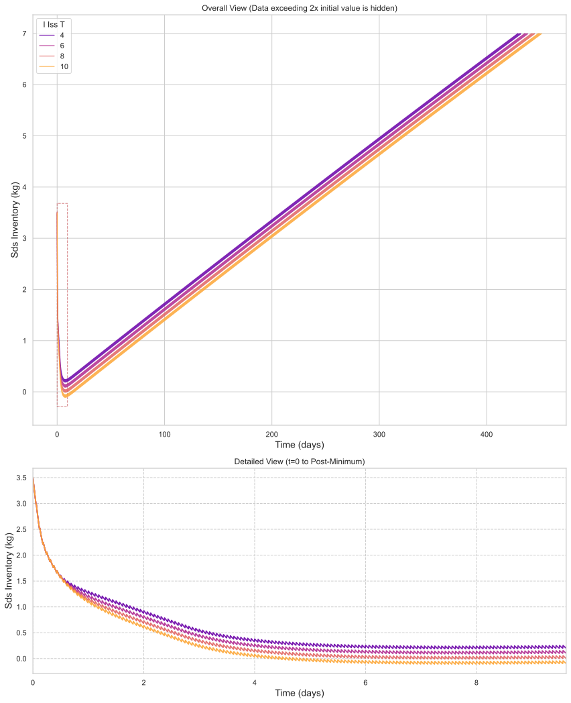

# i iss T 敏感性分析报告


生成时间: 2025-10-26 18:50:25.015138


## 分析案例配置详情


本分析案例的具体配置如下，这决定了仿真的扫描方式和分析的重点：


| 配置项 | 值 | 说明 |
| :--- | :--- | :--- |
| **`name`** | `"I_ISS_Analysis"` | 本次分析案例的名称。 |
| **`independent_variable`** | `"i_iss.T"` | 独立扫描变量，即本次分析中主要改变的参数。 |
| **`independent_variable_sampling`** | `[4, 6, 8, 10]` | 独立变量的采样方法和范围。 |
| **`default_independent_values`** | `{"i_iss.T": 6.0}` | 独立扫描变量在模型中的原始默认值。 |
| **`dependent_variables`** | `["Startup_Inventory", "Self_Sufficiency_Time", "Doubling_Time", "Required_TBR"]` | 因变量，即我们关心的、随自变量变化的性能指标。 |


## “Required_TBR”优化配置

当“Required_TBR”作为因变量时，系统会启用一个二分查找算法来寻找满足特定性能指标的最小`bz.TBR`值。以下是本次优化任务的具体配置：


| 配置项 | 值 | 说明 |
| :--- | :--- | :--- |
| **`source_column`** | `"sds.inventory"` | 限制条件的数据源列。 |
| **`parameter_to_optimize`** | `"bz.TBR"` | 优化的目标参数。 |
| **`search_range`** | `[1, 1.5]` | 参数的搜索范围。 |
| **`tolerance`** | `0.005` | 搜索的收敛精度。 |
| **`max_iterations`** | `10` | 最大迭代次数。 |


## SDS Inventory 的时间曲线图:





## 性能指标趋势曲线图


## 约束求解性能指标分析图


### Required TBR vs i iss T


## 关键动态数据切片：过程数据


下表展示了过程数据中，以 `sds.inventory&i_iss.T=6` 为参考变量，在关键阶段的数据切片。**注意：下表中的默认单位为：时间(h), 库存(g), 功率(MW)。**


**注**：表格中所有简称列（C1, C2, ...）的数据均代表变量 `sds.inventory` 在不同参数组合下的值。
**表格图例说明**：
| 简称 | 参数组合 |
| :--- | :--- |
| **C1** | `i_iss.T=4` |
| **C2** | `i_iss.T=6` |
| **C3** | `i_iss.T=8` |
| **C4** | `i_iss.T=10` |


### 1. 初始阶段 (前 20 个数据点, 间隔 2)

|         time |      C1 |      C2 |      C3 |      C4 |
|-------------:|--------:|--------:|--------:|--------:|
|  0           | 3500    | 3500    | 3500    | 3500    |
|  1.34365e-09 | 3500    | 3500    | 3500    | 3500    |
|  9.53948e-05 | 3499.96 | 3499.96 | 3499.96 | 3499.96 |
|  0.5         | 3308.15 | 3308.15 | 3308.15 | 3308.15 |
|  1.35        | 2981.99 | 2981.99 | 2981.99 | 2981.99 |
|  1.89848     | 2829.09 | 2829.09 | 2829.09 | 2829.09 |
|  2           | 2790.27 | 2790.27 | 2790.27 | 2790.27 |
|  2.82507     | 2514.63 | 2514.63 | 2514.63 | 2514.63 |
|  2.85        | 2507.52 | 2507.52 | 2507.52 | 2507.52 |
|  3.5         | 2392.23 | 2392.23 | 2392.23 | 2392.23 |
|  4.35        | 2211.89 | 2211.89 | 2211.89 | 2211.89 |
|  5           | 2151.57 | 2151.57 | 2151.57 | 2151.57 |
|  5.85        | 2020.81 | 2020.81 | 2020.81 | 2020.81 |
|  6.5         | 1986.46 | 1986.46 | 1986.46 | 1986.46 |
|  7.35        | 1879.12 | 1879.12 | 1879.12 | 1879.12 |
|  8           | 1857.03 | 1857.03 | 1857.03 | 1857.03 |
|  8.85        | 1760.75 | 1760.75 | 1760.75 | 1760.75 |
|  9.5         | 1744.46 | 1744.46 | 1744.46 | 1744.46 |
| 10.0683      | 1682.26 | 1682.28 | 1682.28 | 1682.29 |
| 10.5         | 1696.77 | 1696.4  | 1696.22 | 1696.11 |


### 2. 转折点阶段 (围绕 'sds.inventory&i_iss.T=6' 最小值)

|   time |      C1 |       C2 |       C3 |        C4 |
|-------:|--------:|---------:|---------:|----------:|
| 175.35 | 189.184 |  90.2829 | -8.62175 | -107.526  |
| 176    | 220.271 | 121.361  | 22.4527  |  -76.4543 |
| 176.85 | 189.009 |  90.1079 | -8.79673 | -107.701  |
| 177.5  | 220.113 | 121.204  | 22.2953  |  -76.6117 |
| 178.35 | 188.874 |  89.9731 | -8.93151 | -107.836  |
| 179    | 219.995 | 121.086  | 22.1775  |  -76.7295 |
| 179.85 | 188.778 |  89.8771 | -9.02749 | -107.932  |
| 180.5  | 219.916 | 121.007  | 22.0979  |  -76.8091 |
| 181.35 | 188.72  |  89.8186 | -9.08599 | -107.991  |
| 182    | 219.873 | 120.964  | 22.0553  |  -76.8517 |
| 182.85 | 188.698 |  89.7963 | -9.1083  | -108.013  |
| 183.5  | 219.866 | 120.957  | 22.0482  |  -76.8588 |
| 184.35 | 188.71  |  89.809  | -9.09566 | -108      |
| 185    | 219.894 | 120.984  | 22.0757  |  -76.8314 |
| 185.85 | 188.757 |  89.8554 | -9.04927 | -107.954  |
| 186.5  | 219.954 | 121.045  | 22.1363  |  -76.7707 |
| 187.35 | 188.836 |  89.9344 | -8.97028 | -107.875  |
| 188    | 220.047 | 121.138  | 22.2291  |  -76.6779 |
| 188.85 | 188.946 |  90.0448 | -8.8598  | -107.764  |
| 189.5  | 220.171 | 121.262  | 22.3529  |  -76.5541 |


### 3. 结束阶段 (后 20 个数据点, 间隔 2)

|    time |      C1 |      C2 |      C3 |      C4 |
|--------:|--------:|--------:|--------:|--------:|
| 19985.9 | 13053.7 | 12954.8 | 12855.9 | 12757   |
| 19986.5 | 13085.3 | 12986.4 | 12887.5 | 12788.6 |
| 19987.4 | 13054.6 | 12955.7 | 12856.8 | 12757.9 |
| 19988   | 13086.2 | 12987.3 | 12888.4 | 12789.5 |
| 19988.9 | 13055.6 | 12956.7 | 12857.7 | 12758.8 |
| 19989.5 | 13087.1 | 12988.2 | 12889.3 | 12790.4 |
| 19990.4 | 13056.5 | 12957.6 | 12858.7 | 12759.8 |
| 19991   | 13088   | 12989.1 | 12890.2 | 12791.3 |
| 19991.9 | 13057.4 | 12958.5 | 12859.6 | 12760.7 |
| 19992.5 | 13089   | 12990   | 12891.1 | 12792.2 |
| 19993.4 | 13058.3 | 12959.4 | 12860.5 | 12761.6 |
| 19994   | 13089.9 | 12991   | 12892.1 | 12793.1 |
| 19994.9 | 13059.2 | 12960.3 | 12861.4 | 12762.5 |
| 19995.5 | 13090.8 | 12991.9 | 12893   | 12794.1 |
| 19996.4 | 13060.1 | 12961.2 | 12862.3 | 12763.4 |
| 19997   | 13091.7 | 12992.8 | 12893.9 | 12795   |
| 19997.9 | 13061.1 | 12962.2 | 12863.3 | 12764.3 |
| 19998.5 | 13092.6 | 12993.7 | 12894.8 | 12795.9 |
| 19999.4 | 13062   | 12963.1 | 12864.2 | 12765.3 |
| 20000   | 13093.5 | 12994.6 | 12895.7 | 12796.8 |


## 性能指标总表


##### 性能指标

|   i iss T |   Doubling Time (days) |   Self Sufficiency Time (days) |   Startup Inventory (kg) |
|----------:|-----------------------:|-------------------------------:|-------------------------:|
|         4 |                 429.12 |                           7.62 |                     3.31 |
|         6 |                 435.5  |                           7.62 |                     3.41 |
|         8 |                 441.81 |                           7.62 |                     3.51 |
|        10 |                 448.19 |                           7.62 |                     3.61 |


##### “Required TBR” 相关数据

|   i iss T |   Required TBR |
|----------:|---------------:|
|         4 |         1.0234 |
|         6 |         1.0234 |
|         8 |         1.0234 |
|        10 |         1.0234 |


---

# AI模型分析提示词 (deepseek-v3.1)

```markdown
**角色：** 你是一名聚变反应堆氚燃料循环领域的专家。

**任务：** 请**完全基于**下方提供的**两类数据表格**，对聚变堆燃料循环模型的**敏感性分析**结果进行深度解读。

**分析要点 (必须严格依据数据表格作答)：**

1.  **全局敏感性分析 (参考“性能指标总表”) :**
    *   分析性能指标总表（ `Startup_Inventory`, `Doubling_Time` 以及以 `Required_` 开头的求解指标等）呈现出怎样的**总体趋势**？请进行量化描述。
    *   如果存在多个性能指标，分析哪个性能指标对独立变量 `i_iss.T` 的变化最为敏感？哪个最不敏感？


3.  **动态过程分析 (参考“关键动态数据切片：过程数据”) :**
    *   观察过程数据切片：系统在“初始阶段”和“结束阶段”的行为有何不同？
    *   以 `sds.inventory&i_iss.T=6` 为参考，其“转折点阶段”的数据揭示了什么物理过程？（例如，它是否是氚库存由消耗转为净增长的关键时刻？）

3.  **综合结论：**
结合所有分析（包括主趋势），总结在不同的运行场景下，调整 `i_iss.T` 对整个氚燃料循环系统的综合影响和潜在的利弊权衡。
    *   基于这些发现，可以得出哪些关于系统设计或运行优化的初步建议？
```


---

# AI模型分析结果

根据您提供的敏感性分析数据（聚焦于独立变量 `i_iss.T`，即离子源系统的温度），我将严格按照数据表格进行深度解读。分析将分为三个部分：全局敏感性分析、动态过程分析，以及综合结论与建议。

---

### 1. 全局敏感性分析 (基于“性能指标总表”)

性能指标总表显示了四个关键指标随 `i_iss.T` 从 4 到 10 变化时的数值：

| i_iss.T | Startup Inventory (kg) | Doubling Time (days) | Self Sufficiency Time (days) | Required TBR |
|---------|------------------------|----------------------|-------------------------------|--------------|
| 4       | 3.31                   | 429.12               | 7.62                          | 1.0234       |
| 6       | 3.41                   | 435.50               | 7.62                          | 1.0234       |
| 8       | 3.51                   | 441.81               | 7.62                          | 1.0234       |
| 10      | 3.61                   | 448.19               | 7.62                          | 1.0234       |

#### 总体趋势量化描述：

- **Startup Inventory (启动库存)**：从 3.31 kg 线性增加到 3.61 kg，增幅约为 9.06%。这表明更高的离子源温度会导致系统启动时需要更多的氚库存。
- **Doubling Time (倍增时间)**：从 429.12 天增加到 448.19 天，增幅约为 4.44%。这意味着系统氚库存翻倍所需的时间随温度升高而延长。
- **Self Sufficiency Time (自持时间)**：恒定在 7.62 天，不受 `i_iss.T` 变化的影响。
- **Required TBR (所需氚增殖比)**：恒定在 1.0234，也不受 `i_iss.T` 变化的影响。

#### 敏感性排序：

1. **最敏感指标**：**Startup Inventory**（变化幅度最大，9.06%）。
2. **次敏感指标**：**Doubling Time**（变化幅度中等，4.44%）。
3. **最不敏感指标**：**Self Sufficiency Time** 和 **Required TBR**（完全不变）。

**结论**：`i_iss.T` 的变化主要影响系统的启动库存和倍增时间，而对自持时间和所需 TBR 没有影响。这表明离子源温度的变化更直接地影响了氚的初始积累和长期增殖效率，但不影响系统达到自持的时间或最小所需的 TBR。

---

### 2. 动态过程分析 (基于“关键动态数据切片：过程数据”)

过程数据以 `sds.inventory`（SDS 库存）为核心，展示了不同 `i_iss.T` 下库存随时间的变化。参考变量为 `sds.inventory&i_iss.T=6`。

#### a. 初始阶段（前 20 个数据点）：

- 所有 `i_iss.T` 下的库存初始值均为 3500 g（3.5 kg），且在前几个时间点高度一致。
- 库存迅速下降，例如在 `time=0.5` 时降至约 3308 g，在 `time=10.5` 时降至约 1696 g。
- **结论**：系统启动初期，氚库存被快速消耗，用于维持等离子体燃烧。离子源温度的变化在初始阶段对库存消耗速率影响极小（数据几乎完全相同）。

#### b. 转折点阶段（围绕 `sds.inventory&i_iss.T=6` 的最小值）：

- 最小值出现在 `time≈183.5` 附近，库存降至约 90.3 g（`i_iss.T=6`）。
- 对于 `i_iss.T=4`，最小库存约为 189.2 g；对于 `i_iss.T=10`，库存甚至变为负值（-107.5 g），表明系统氚短缺。
- **转折点物理意义**：这是氚库存由净消耗转为净增长的关键时刻。在此之前，氚消耗大于生产；此后，氚生产（通过 TBR）开始超过消耗，库存开始回升。
- **温度影响**：更高的 `i_iss.T` 导致更低的转折点库存（甚至负值），说明高温加剧了氚的短缺风险。

#### c. 结束阶段（后 20 个数据点）：

- 库存显著增长，例如在 `time=20000` 时，`i_iss.T=4` 的库存约为 13093.5 g（13.09 kg），而 `i_iss.T=10` 的库存约为 12796.8 g（12.80 kg）。
- **结论**：长期运行后，所有系统的氚库存都实现了增长，但 **`i_iss.T` 越高，最终库存越低**。这与全局分析中“倍增时间随温度升高而延长”的结论一致。

---

### 3. 综合结论与建议

#### 综合影响：
- **提高 `i_iss.T`（离子源温度）** 会导致：
  - **启动库存需求增加**（不利）。
  - **倍增时间延长**（不利）。
  - **转折点库存降低**（甚至出现负值，风险增高）。
  - **最终库存略低**（长期增殖效率稍差）。
- **自持时间和所需 TBR 不受影响**，说明温度变化不改变系统达到平衡的最小要求。

#### 利弊权衡：
- **高温可能的好处**：未在数据中体现，但可能涉及离子源效率或等离子体性能（本分析未涉及）。
- **高温的弊端**：显著增加氚管理难度——需要更多初始氚、延长增殖时间、增高短期短缺风险。

#### 初步优化建议：
1. **在满足等离子体物理要求的前提下，应尽可能降低 `i_iss.T`**（例如接近 4），以最小化启动库存、缩短倍增时间、降低运行风险。
2. **如果必须使用较高温度**（如 10），需：
   - 确保初始氚储备充足（>3.61 kg）。
   - 接受更长的倍增时间（约 448 天）。
   - 密切监控短期氚库存，避免转折点出现负值（可能导致停机）。
3. **进一步研究**：为什么自持时间和所需 TBR 不受温度影响？这可能意味着系统平衡条件由其他参数（如 TBR）主导，而 `i_iss.T` 主要影响动态过程。

---

**最终总结**：  
本次敏感性分析表明，`i_iss.T` 是一个影响氚燃料循环动态性能而非平衡条件的关键参数。优化其取值可显著改善系统的经济性和安全性，建议在设计中优先考虑较低的温度设置。
```
