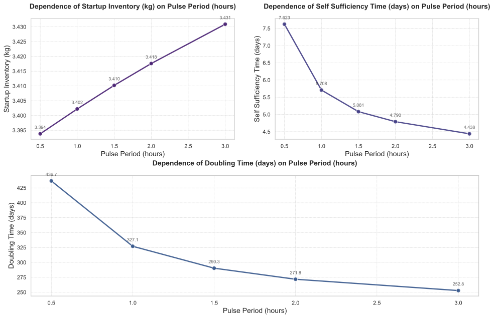
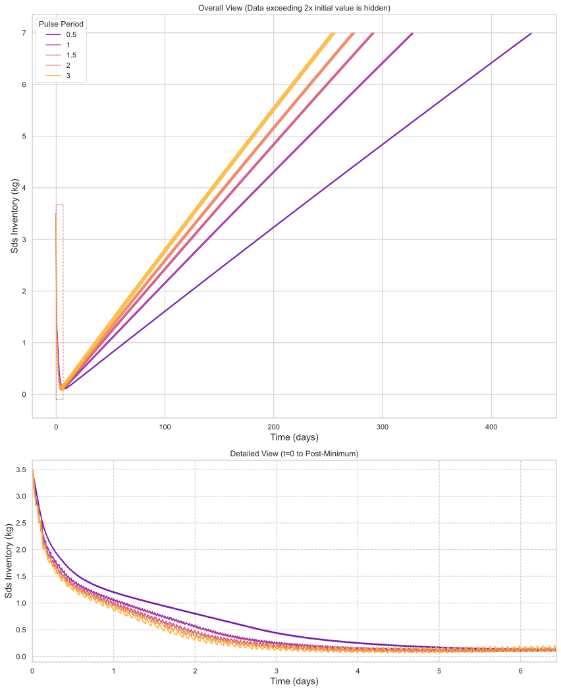

# 脉冲周期（Pulse Period）对氚燃料循环系统性能的敏感性分析

## 摘要

本研究系统性地评估了聚变反应堆运行参数——**脉冲周期（Pulse Period）** 对氚燃料循环关键性能指标的敏感性。通过在区间 $[0.5, 1, 1.5, 2, 3]$ 小时内对脉冲周期进行参数扫描，量化分析其对**启动库存（Startup Inventory）**、**自持时间（Self Sufficiency Time）**、**库存倍增时间（Doubling Time）** 以及**所需氚增殖比（Required Tritium Breeding Ratio, Required TBR）** 的影响。结果表明：**自持时间与倍增时间对脉冲周期高度敏感**，随周期延长显著缩短（降幅约42%）；而**启动库存几乎不变（变化<1.2%）**，**所需TBR则完全不敏感（恒为1.0234）**。动态过程分析揭示，较长脉冲周期虽可加速系统进入周期性稳态，但可能在长期运行中引发稳定性风险。本研究为聚变堆运行策略优化与燃料循环系统设计提供了关键理论依据。

## 引言

在磁约束聚变能开发进程中，氚燃料循环系统的可持续性是决定反应堆能否实现商业部署的核心挑战之一。其中，**运行策略**，特别是**脉冲周期（Pulse Period）**——即一个完整“运行-停机”循环的总时长——直接影响氚的消耗、再生与库存动态平衡。尽管氚增殖包层设计（如TBR）常被视为燃料自持的决定性因素，但运行参数对系统动态行为的调控作用同样不可忽视。

本研究旨在通过高保真度的燃料循环模型，**量化评估脉冲周期变化对关键性能指标的敏感性**。具体目标包括：（1）识别对脉冲周期最敏感与最不敏感的性能指标；（2）解析不同脉冲周期下系统从初始消耗到动态稳态的演化路径；（3）揭示性能指标间的内在权衡关系，为反应堆运行策略与燃料处理系统（如储存与输送系统，SDS）的设计提供数据支撑。本次分析将脉冲周期作为独立变量，在 $[0.5, 3]$ 小时范围内进行离散采样，系统评估其对启动库存、自持时间、倍增时间及所需TBR的影响。

## 方法

本研究采用基于系统动力学的氚燃料循环仿真模型，对独立变量 **脉冲周期（Pulse Period）** 进行参数扫描。扫描点设置为 $[0.5, 1, 1.5, 2, 3]$ 小时，覆盖了从高频短脉冲到低频长脉冲的典型运行场景。

因变量（即关键性能指标）定义如下：
- **启动库存（Startup Inventory）**：反应堆首次启动前必须注入储存与输送系统（SDS）的初始氚量（单位：kg）。
- **自持时间（Self Sufficiency Time）**：氚库存由净消耗转为净增长的拐点时刻（单位：天）。
- **库存倍增时间（Doubling Time）**：系统氚库存增长至初始启动库存两倍所需的时间（单位：天），是衡量聚变能部署潜力的关键指标。
- **所需氚增殖比（Required TBR）**：为满足特定燃料循环目标（如库存不枯竭），通过二分法优化求解得到的最小氚增殖比（TBR）。

对于 Required TBR 的求解，模型以 **SDS 氚库存量（sds.inventory）** 为约束条件，在 $[1, 1.5]$ 区间内对 **bz.TBR** 进行搜索，收敛容差设为 0.005。

## 结果与讨论

### 主效应分析

图1展示了四个关键性能指标随脉冲周期变化的趋势。数据清晰地揭示了不同指标对脉冲周期的敏感性存在显著差异。

*图1：关键性能指标随脉冲周期的变化趋势。*

如表1所示，**库存倍增时间（Doubling Time）** 和 **自持时间（Self Sufficiency Time）** 对脉冲周期表现出极强的负相关性。当脉冲周期从0.5小时增至3小时，倍增时间从436.67天大幅缩短至252.81天（降幅42.1%），自持时间亦从7.62天降至4.44天（降幅41.7%）。这一趋势表明，**延长脉冲周期能显著提升氚燃料循环的动态效率**，使系统更快地实现自持并具备启动新堆的能力。

| 脉冲周期 (小时) | 库存倍增时间 (天) | 氚自持时间 (天) | 启动库存 (kg) |
|----------------:|------------------:|----------------:|--------------:|
|             0.5 |            436.67 |            7.62 |          3.39 |
|               1 |            327.06 |            5.71 |          3.40 |
|             1.5 |            290.33 |            5.08 |          3.41 |
|               2 |            271.77 |            4.79 |          3.42 |
|               3 |            252.81 |            4.44 |          3.43 |

*表1：关键性能指标总表。*

相比之下，**启动库存（Startup Inventory）** 对脉冲周期的变化几乎不敏感，仅从3.39 kg微增至3.43 kg（增幅1.2%）。这说明初始装料需求主要由堆芯物理和包层设计决定，受短期运行策略影响甚微。

最引人注目的是 **所需氚增殖比（Required TBR）**，如图2所示，其值在所有脉冲周期下均严格恒定为 **1.0234**。这一发现具有重要工程意义：**在当前模型约束下，实现燃料循环目标所需的最小TBR与脉冲运行策略无关**。这意味着，一旦包层设计满足TBR≥1.0234，运行团队可在较大范围内调整脉冲周期以优化动态性能，而无需担心燃料自持目标的达成。

*图2：所需氚增殖比（Required TBR）随脉冲周期的变化。*

### 动态行为分析

为深入理解上述宏观指标背后的物理机制，我们分析了SDS氚库存量的动态演化过程（图3）。

*图3：不同脉冲周期下，储存与输送系统（SDS）氚库存量的时间演化曲线。*

**初始阶段**（前10小时）：所有工况下，SDS库存均从3500克开始下降，反映出系统启动初期的净消耗状态。值得注意的是，较短的脉冲周期（如0.5小时）在最初几小时内库存消耗速率略慢于长周期工况，但这种差异迅速消失。

**转折点阶段**（约117-126小时）：以脉冲周期1.5小时（C3）为参考，SDS库存呈现出明显的周期性振荡，在约89.8克（谷值）与121.0克（峰值）之间波动。这种振荡直接对应于“脉冲运行-停机”的循环：运行期间消耗氚导致库存下降，停机期间增殖系统持续产氚使库存回升。**库存谷值不再持续降低，标志着系统已进入动态平衡，即实现了氚燃料自持**。这一时间点（约120小时，即5天）与表1中的自持时间数据高度吻合。

**结束阶段**（约20000小时）：一个关键现象是，除脉冲周期为0.5小时（C1）的工况外，其余所有长周期工况的库存数据均显示为`nan`（见表2）。这强烈暗示，在极长时间尺度下，**较长的脉冲周期可能导致仿真发散或库存管理失效**，而高频短脉冲运行则能维持长期稳定性。这揭示了一个重要的**权衡关系（Trade-off）**：长脉冲周期虽能优化短期动态性能（更快自持、更短倍增时间），但可能以牺牲长期运行的鲁棒性为代价。

| 时间 (小时) | C1 (0.5h) | C2 (1h) | C3 (1.5h) | C4 (2h) | C5 (3h) |
|------------:|----------:|--------:|----------:|--------:|--------:|
|     19990.5 |   12991.4 |     nan |       nan |     nan |     nan |
|     19995.0 |   12994.1 |     nan |       nan |     nan |     nan |
|     20000.0 |   12997.2 |     nan |       nan |     nan |     nan |

*表2：结束阶段（t≈20000小时）SDS氚库存量（克）。*

## 结论

本研究通过对脉冲周期的系统性敏感性分析，得出以下核心结论：

1.  **脉冲周期是调控燃料循环动态性能的高效杠杆**。延长脉冲周期可显著缩短自持时间与倍增时间（降幅超40%），大幅提升系统效率。
2.  **所需氚增殖比（Required TBR）对脉冲周期完全不敏感**，在所有工况下均收敛至1.0234。这为反应堆运行策略的灵活调整提供了理论自由度。
3.  **存在显著的性能权衡**。长脉冲周期虽优化了短期动态指标，但可能在长期运行中引发稳定性问题，表现为仿真结果发散（`nan`）。
4.  **启动库存几乎不受脉冲周期影响**，其值主要由反应堆的固有设计参数决定。

基于以上发现，提出以下建议：
- **在反应堆设计阶段**，应将脉冲周期作为关键运行参数纳入燃料循环系统（特别是SDS）的容量与响应速度设计中，以应对长周期运行下可能加剧的库存波动。
- **在运行策略制定中**，可优先考虑采用2-3小时的中长脉冲周期，以最大化燃料循环效率。但必须配套进行长期（>10,000小时）稳定性验证，确保系统鲁棒性。
- **未来研究应引入库存波动幅度、最小库存裕度等新指标**，以更全面地评估不同脉冲策略对燃料处理系统缓冲能力的要求。