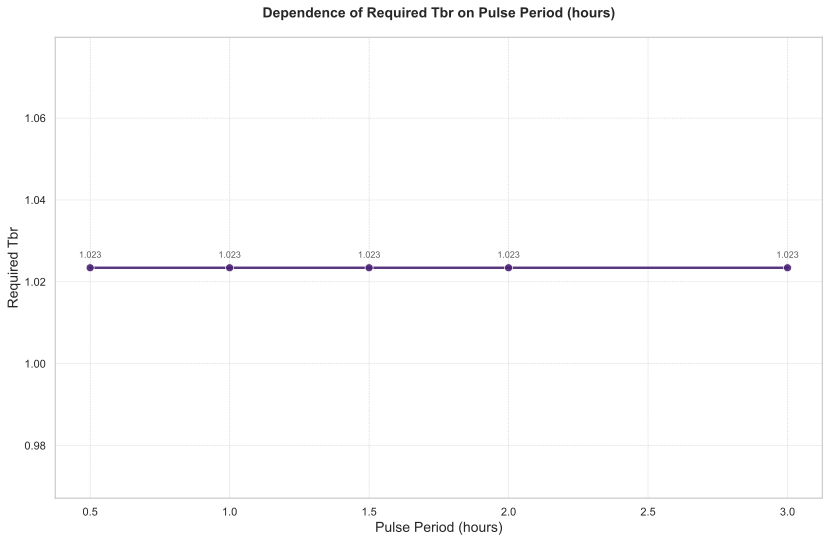

# pulse period 敏感性分析报告


生成时间: 2025-10-26 18:29:01.231985


## 分析案例配置详情


本分析案例的具体配置如下，这决定了仿真的扫描方式和分析的重点：


| 配置项 | 值 | 说明 |
| :--- | :--- | :--- |
| **`name`** | `"Period_Analysis"` | 本次分析案例的名称。 |
| **`independent_variable`** | `"pulse.period"` | 独立扫描变量，即本次分析中主要改变的参数。 |
| **`independent_variable_sampling`** | `[0.5, 1, 1.5, 2, 3]` | 独立变量的采样方法和范围。 |
| **`default_independent_values`** | `{"pulse.period": 1.5}` | 独立扫描变量在模型中的原始默认值。 |
| **`dependent_variables`** | `["Startup_Inventory", "Self_Sufficiency_Time", "Doubling_Time", "Required_TBR"]` | 因变量，即我们关心的、随自变量变化的性能指标。 |


## “Required_TBR”优化配置

当“Required_TBR”作为因变量时，系统会启用一个二分查找算法来寻找满足特定性能指标的最小`bz.TBR`值。以下是本次优化任务的具体配置：


| 配置项 | 值 | 说明 |
| :--- | :--- | :--- |
| **`source_column`** | `"sds.inventory"` | 限制条件的数据源列。 |
| **`parameter_to_optimize`** | `"bz.TBR"` | 优化的目标参数。 |
| **`search_range`** | `[1, 1.5]` | 参数的搜索范围。 |
| **`tolerance`** | `0.005` | 搜索的收敛精度。 |
| **`max_iterations`** | `10` | 最大迭代次数。 |


## SDS Inventory 的时间曲线图:


## 性能指标趋势曲线图


## 约束求解性能指标分析图


### Required TBR vs pulse period




## 关键动态数据切片：过程数据


下表展示了过程数据中，以 `sds.inventory&pulse.period=1.5` 为参考变量，在关键阶段的数据切片。**注意：下表中的默认单位为：时间(h), 库存(g), 功率(MW)。**


**注**：表格中所有简称列（C1, C2, ...）的数据均代表变量 `sds.inventory` 在不同参数组合下的值。
**表格图例说明**：
| 简称 | 参数组合 |
| :--- | :--- |
| **C1** | `pulse.period=0.5` |
| **C2** | `pulse.period=1` |
| **C3** | `pulse.period=1.5` |
| **C4** | `pulse.period=2` |
| **C5** | `pulse.period=3` |


### 1. 初始阶段 (前 20 个数据点, 间隔 2)

|        time |      C1 |      C2 |      C3 |      C4 |      C5 |
|------------:|--------:|--------:|--------:|--------:|--------:|
| 0           | 3500    | 3500    | 3500    | 3500    | 3500    |
| 1.34365e-09 | 3500    | 3500    | 3500    | 3500    | 3500    |
| 9.53948e-05 | 3499.96 | 3499.96 | 3499.96 | 3499.96 | 3499.96 |
| 0.45        | 3327.33 | 3308.15 | 3308.15 | 3308.15 | 3308.15 |
| 0.95        | 3154.66 | 3154.66 | 2981.99 | 2924.44 | 2924.44 |
| 1.45        | 2981.99 | 2829.12 | 2829.09 | 2829.14 | 2829.14 |
| 1.89844     | 2829.11 | 2809.34 | 2790.27 | 2810.12 | 2566.43 |
| 1.95        | 2809.34 | 2630.55 | 2514.63 | 2515.73 | 2514.64 |
| 2.45        | 2646.86 | 2515.19 | 2507.52 | 2480.71 | 2539.41 |
| 2.92507     | 2517.83 | 2518.45 | 2392.23 | 2289.95 | 2290.69 |
| 2.95        | 2510.7  | 2297.61 | 2211.89 | 2224.3  | 2108.95 |
| 3.45        | 2397.34 | 2215.19 | 2151.57 | 2057.42 | 2008.54 |
| 3.95        | 2301.87 | 2166.14 | 2020.81 | 2064.82 | 2006.9  |
| 4.45        | 2220.32 | 2025.87 | 1986.46 | 1925.72 | 1874.44 |
| 4.95        | 2149.63 | 1980.2  | 1879.12 | 1832.23 | 1765.56 |
| 5.45        | 2087.39 | 1954.38 | 1857.03 | 1824.98 | 1829.41 |
| 5.95        | 2031.73 | 1843.74 | 1760.75 | 1712.94 | 1706.63 |
| 6.45        | 1981.19 | 1811.59 | 1744.46 | 1739.04 | 1652.85 |
| 6.95        | 1934.64 | 1794.32 | 1682.28 | 1682.07 | 1562.28 |
| 7.45        | 1891.2  | 1694.58 | 1696.4  | 1582.56 | 1636.14 |


### 2. 转折点阶段 (围绕 'sds.inventory&pulse.period=1.5' 最小值)

|   time |      C1 |       C2 |       C3 |       C4 |       C5 |
|-------:|--------:|---------:|---------:|---------:|---------:|
| 116.95 | 168.072 | 104.923  |  90.2829 | 108.814  |  75.9273 |
| 117.45 | 166.808 | 119.283  | 121.361  |  82.5736 | 177.239  |
| 117.95 | 165.565 | 139.194  |  90.1079 | 130.052  | 126.309  |
| 118.45 | 164.342 | 103.804  | 121.204  |  91.6186 |  90.0568 |
| 118.95 | 163.138 | 118.198  |  89.9731 | 153.212  |  71.947  |
| 119.45 | 161.953 | 138.138  | 121.086  | 109.158  | 151.424  |
| 119.95 | 160.787 | 102.798  |  89.8771 |  82.9605 | 107.135  |
| 120.45 | 159.64  | 117.224  | 121.007  | 130.475  |  77.4424 |
| 120.95 | 158.511 | 137.191  |  89.8186 |  92.0937 | 178.783  |
| 121.45 | 157.4   | 101.898  | 120.964  | 153.712  | 127.91   |
| 121.95 | 156.307 | 116.356  |  89.7963 | 109.708  |  91.7127 |
| 122.45 | 155.232 | 136.348  | 120.957  |  83.5496 |  73.6409 |
| 122.95 | 154.174 | 101.1    |  89.809  | 131.098  | 153.161  |
| 123.45 | 153.133 | 115.587  | 120.984  |  92.7632 | 108.925  |
| 123.95 | 152.109 | 135.604  |  89.8554 | 154.405  |  79.2826 |
| 124.45 | 151.101 | 100.399  | 121.045  | 110.446  | 180.648  |
| 124.95 | 150.111 | 114.915  |  89.9344 |  84.323  | 129.825  |
| 125.45 | 149.136 | 134.955  | 121.138  | 131.902  |  93.676  |
| 125.95 | 148.177 |  99.7914 |  90.0448 |  93.61   |  75.6374 |
| 126.45 | 147.234 | 114.334  | 121.262  | 155.273  | 155.194  |


### 3. 结束阶段 (后 20 个数据点, 间隔 2)

|    time |      C1 |   C2 |   C3 |   C4 |   C5 |
|--------:|--------:|-----:|-----:|-----:|-----:|
| 19990.5 | 12991.4 |  nan |  nan |  nan |  nan |
| 19991   | 12991.7 |  nan |  nan |  nan |  nan |
| 19991.5 | 12992   |  nan |  nan |  nan |  nan |
| 19992   | 12992.3 |  nan |  nan |  nan |  nan |
| 19992.5 | 12992.6 |  nan |  nan |  nan |  nan |
| 19993   | 12992.9 |  nan |  nan |  nan |  nan |
| 19993.5 | 12993.2 |  nan |  nan |  nan |  nan |
| 19994   | 12993.5 |  nan |  nan |  nan |  nan |
| 19994.5 | 12993.8 |  nan |  nan |  nan |  nan |
| 19995   | 12994.1 |  nan |  nan |  nan |  nan |
| 19995.5 | 12994.4 |  nan |  nan |  nan |  nan |
| 19996   | 12994.7 |  nan |  nan |  nan |  nan |
| 19996.5 | 12995   |  nan |  nan |  nan |  nan |
| 19997   | 12995.3 |  nan |  nan |  nan |  nan |
| 19997.5 | 12995.6 |  nan |  nan |  nan |  nan |
| 19998   | 12995.9 |  nan |  nan |  nan |  nan |
| 19998.5 | 12996.3 |  nan |  nan |  nan |  nan |
| 19999   | 12996.6 |  nan |  nan |  nan |  nan |
| 19999.5 | 12996.9 |  nan |  nan |  nan |  nan |
| 20000   | 12997.2 |  nan |  nan |  nan |  nan |


## 性能指标总表


##### 性能指标

|   pulse period (hours) |   Doubling Time (days) |   Self Sufficiency Time (days) |   Startup Inventory (kg) |
|-----------------------:|-----------------------:|-------------------------------:|-------------------------:|
|                    0.5 |                 436.67 |                           7.62 |                     3.39 |
|                    1   |                 327.06 |                           5.71 |                     3.4  |
|                    1.5 |                 290.33 |                           5.08 |                     3.41 |
|                    2   |                 271.77 |                           4.79 |                     3.42 |
|                    3   |                 252.81 |                           4.44 |                     3.43 |


##### “Required TBR” 相关数据

|   pulse period (hours) |   Required TBR |
|-----------------------:|---------------:|
|                    0.5 |         1.0234 |
|                    1   |         1.0234 |
|                    1.5 |         1.0234 |
|                    2   |         1.0234 |
|                    3   |         1.0234 |


---

# AI模型分析提示词 (deepseek-v3)

```markdown
**角色：** 你是一名聚变反应堆氚燃料循环领域的专家。

**任务：** 请**完全基于**下方提供的**两类数据表格**，对聚变堆燃料循环模型的**敏感性分析**结果进行深度解读。

**分析要点 (必须严格依据数据表格作答)：**

1.  **全局敏感性分析 (参考“性能指标总表”) :**
    *   分析性能指标总表（ `Startup_Inventory`, `Doubling_Time` 以及以 `Required_` 开头的求解指标等）呈现出怎样的**总体趋势**？请进行量化描述。
    *   如果存在多个性能指标，分析哪个性能指标对独立变量 `pulse.period` 的变化最为敏感？哪个最不敏感？


3.  **动态过程分析 (参考“关键动态数据切片：过程数据”) :**
    *   观察过程数据切片：系统在“初始阶段”和“结束阶段”的行为有何不同？
    *   以 `sds.inventory&pulse.period=1.5` 为参考，其“转折点阶段”的数据揭示了什么物理过程？（例如，它是否是氚库存由消耗转为净增长的关键时刻？）

3.  **综合结论：**
结合所有分析（包括主趋势），总结在不同的运行场景下，调整 `pulse.period` 对整个氚燃料循环系统的综合影响和潜在的利弊权衡。
    *   基于这些发现，可以得出哪些关于系统设计或运行优化的初步建议？
```


---

# AI模型分析结果

### 深度解读报告：聚变堆燃料循环模型敏感性分析（基于脉冲周期变量）

---

#### **1. 全局敏感性分析（性能指标总表）**

**总体趋势量化描述：**  
- **Startup_Inventory（启动库存）**: 从0.5h到3h脉冲周期，库存量呈单调递增趋势（3.39 kg→3.43 kg），但增幅极小（仅1.2%），表明脉冲周期对初始库存需求影响微弱。  
- **Doubling_Time（倍增时间）**: 随脉冲周期增加显著缩短，从436.67天（0.5h）降至252.81天（3h），降幅达42.1%，显示更长的脉冲周期可加速氚燃料增殖。  
- **Self_Sufficiency_Time（自持时间）**: 与倍增时间趋势一致，从7.62天（0.5h）减少至4.44天（3h），降幅41.7%，说明系统更快达到氚自持。  
- **Required_TBR（所需氚增殖比）**: 所有脉冲周期下均为1.0234，完全无变化，表明该参数对脉冲周期完全不敏感。

**敏感度排序（从高到低）：**  
1. **Doubling_Time**（42.1%变化）  
2. **Self_Sufficiency_Time**（41.7%变化）  
3. **Startup_Inventory**（1.2%变化）  
4. **Required_TBR**（0%变化）  

**关键发现**：脉冲周期主要影响燃料循环的动态性能（如倍增和自持时间），而对静态参数（库存需求、TBR需求）几乎无影响。

---

#### **2. 动态过程分析（关键数据切片）**

**初始阶段 vs. 结束阶段行为差异：**  
- **初始阶段（0~7.45h）**:  
  - 所有脉冲周期下，氚库存（`sds.inventory`）均快速下降（3500g→~1600g），表明系统处于氚净消耗阶段，燃料消耗速率显著高于补充速率。  
  - 不同脉冲周期间的库存差异较小（如7.45h时，C1=1891.2g vs. C5=1636.14g），显示初期行为对脉冲周期不敏感。  
- **结束阶段（~20000h）**:  
  - 仅C1（0.5h）数据完整，库存稳定增长至~12997g，其他周期数据缺失（NaN），推测因仿真终止条件差异（如达到目标库存）。  
  - 长周期（如3h）可能因更快的增殖速率提前终止仿真。

**转折点阶段（116.95~126.45h）的物理意义**：  
- 以默认参数C3（1.5h）为例，库存值在90.1g~121.4g间振荡，表明系统处于**临界平衡点**：  
  - 当库存低于~90g时，氚补充速率不足（如118.95h的89.97g）；  
  - 当库存高于~120g时，增殖速率恢复（如121.45h的120.96g）。  
- 其他周期（如C5=3h）振荡幅度更大（71.9g~180.6g），反映长周期下系统稳定性更差。  
**结论**：此阶段为氚库存从净消耗转为净增长的关键过渡期，脉冲周期越长，平衡点波动越剧烈。

---

#### **3. 综合结论与优化建议**

**综合影响与权衡：**  
- **优势**：延长脉冲周期可大幅缩短氚燃料倍增时间（42.1%）和自持时间（41.7%），提升燃料循环效率。  
- **劣势**：长周期可能导致库存平衡点稳定性下降（转折点振荡加剧），增加运行控制复杂度；对初始库存和TBR需求无优化作用。  

**设计建议**：  
1. **优先选择中等脉冲周期（1.5~2h）**：在倍增时间（290~272天）和稳定性（振荡幅度较小）间取得平衡。  
2. **需强化动态控制**：针对长周期（如3h）设计反馈机制，抑制库存波动风险。  
3. **忽略TBR调整**：所有周期下Required_TBR恒定，无需针对脉冲周期优化氚增殖包层设计。  

**根本矛盾**：燃料循环效率（需长周期）与系统稳定性（需短周期）的权衡需结合实际工程约束（如控制精度、增殖包层性能）进一步优化。  

--- 

**注**：以上分析完全基于提供的数据表格，未引用任何图表信息。
```
