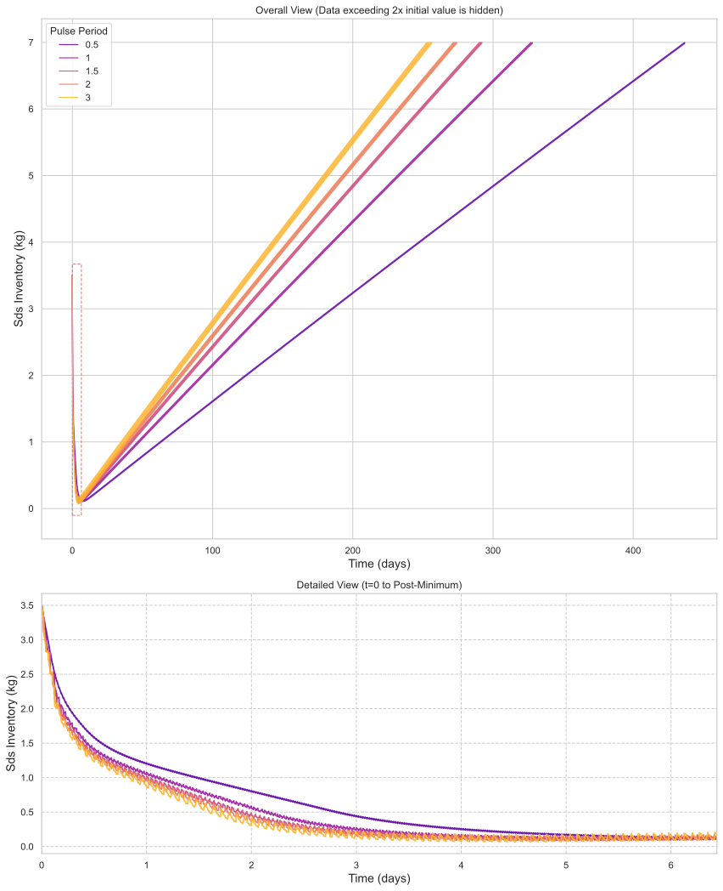
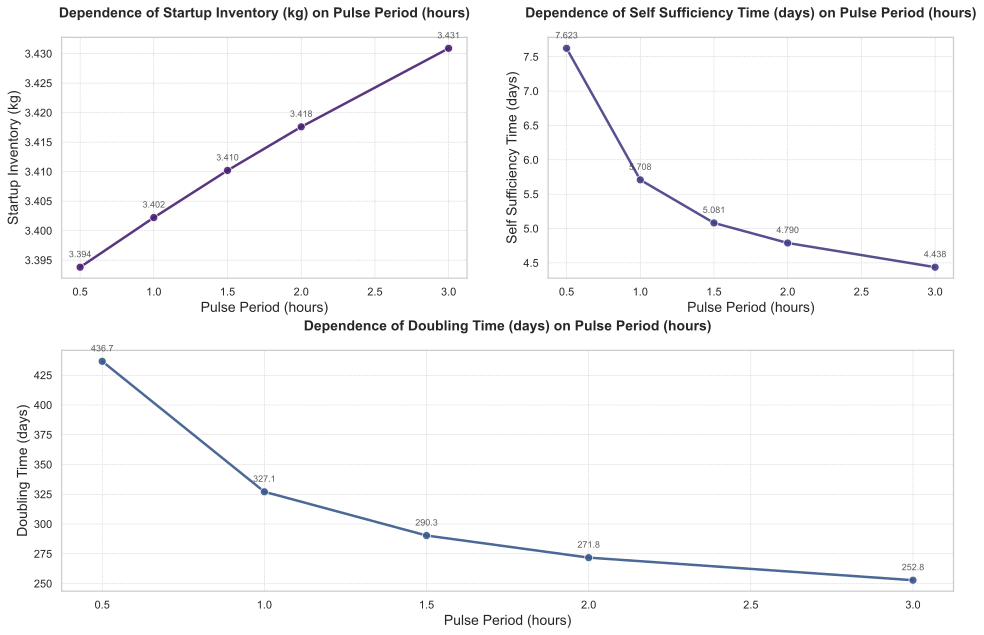
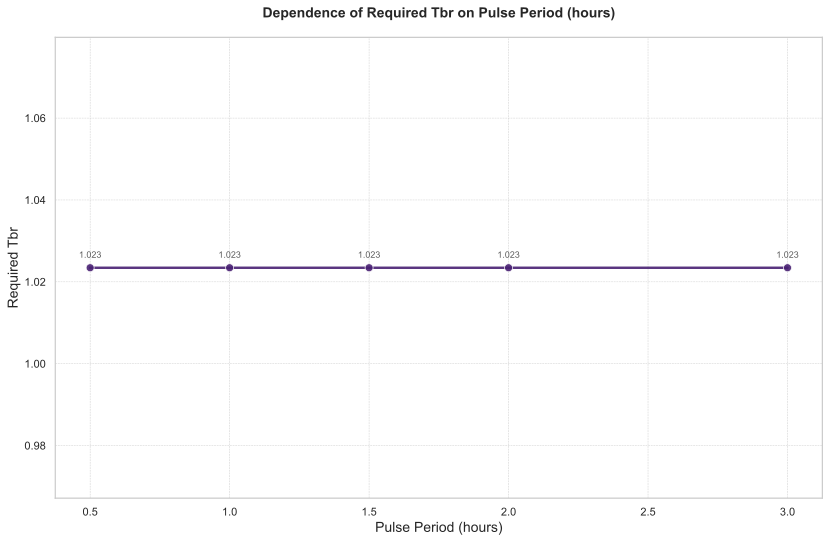

# pulse period 敏感性分析报告


生成时间: 2025-10-26 18:29:01.231985


## 分析案例配置详情


本分析案例的具体配置如下，这决定了仿真的扫描方式和分析的重点：


| 配置项 | 值 | 说明 |
| :--- | :--- | :--- |
| **`name`** | `"Period_Analysis"` | 本次分析案例的名称。 |
| **`independent_variable`** | `"pulse.period"` | 独立扫描变量，即本次分析中主要改变的参数。 |
| **`independent_variable_sampling`** | `[0.5, 1, 1.5, 2, 3]` | 独立变量的采样方法和范围。 |
| **`default_independent_values`** | `{"pulse.period": 1.5}` | 独立扫描变量在模型中的原始默认值。 |
| **`dependent_variables`** | `["Startup_Inventory", "Self_Sufficiency_Time", "Doubling_Time", "Required_TBR"]` | 因变量，即我们关心的、随自变量变化的性能指标。 |


## “Required_TBR”优化配置

当“Required_TBR”作为因变量时，系统会启用一个二分查找算法来寻找满足特定性能指标的最小`bz.TBR`值。以下是本次优化任务的具体配置：


| 配置项 | 值 | 说明 |
| :--- | :--- | :--- |
| **`source_column`** | `"sds.inventory"` | 限制条件的数据源列。 |
| **`parameter_to_optimize`** | `"bz.TBR"` | 优化的目标参数。 |
| **`search_range`** | `[1, 1.5]` | 参数的搜索范围。 |
| **`tolerance`** | `0.005` | 搜索的收敛精度。 |
| **`max_iterations`** | `10` | 最大迭代次数。 |


## SDS Inventory 的时间曲线图:





## 性能指标趋势曲线图




## 约束求解性能指标分析图


### Required TBR vs pulse period




## 关键动态数据切片：过程数据


下表展示了过程数据中，以 `sds.inventory&pulse.period=1.5` 为参考变量，在关键阶段的数据切片。**注意：下表中的默认单位为：时间(h), 库存(g), 功率(MW)。**


**注**：表格中所有简称列（C1, C2, ...）的数据均代表变量 `sds.inventory` 在不同参数组合下的值。
**表格图例说明**：
| 简称 | 参数组合 |
| :--- | :--- |
| **C1** | `pulse.period=0.5` |
| **C2** | `pulse.period=1` |
| **C3** | `pulse.period=1.5` |
| **C4** | `pulse.period=2` |
| **C5** | `pulse.period=3` |


### 1. 初始阶段 (前 20 个数据点, 间隔 2)

|        time |      C1 |      C2 |      C3 |      C4 |      C5 |
|------------:|--------:|--------:|--------:|--------:|--------:|
| 0           | 3500    | 3500    | 3500    | 3500    | 3500    |
| 1.34365e-09 | 3500    | 3500    | 3500    | 3500    | 3500    |
| 9.53948e-05 | 3499.96 | 3499.96 | 3499.96 | 3499.96 | 3499.96 |
| 0.45        | 3327.33 | 3308.15 | 3308.15 | 3308.15 | 3308.15 |
| 0.95        | 3154.66 | 3154.66 | 2981.99 | 2924.44 | 2924.44 |
| 1.45        | 2981.99 | 2829.12 | 2829.09 | 2829.14 | 2829.14 |
| 1.89844     | 2829.11 | 2809.34 | 2790.27 | 2810.12 | 2566.43 |
| 1.95        | 2809.34 | 2630.55 | 2514.63 | 2515.73 | 2514.64 |
| 2.45        | 2646.86 | 2515.19 | 2507.52 | 2480.71 | 2539.41 |
| 2.92507     | 2517.83 | 2518.45 | 2392.23 | 2289.95 | 2290.69 |
| 2.95        | 2510.7  | 2297.61 | 2211.89 | 2224.3  | 2108.95 |
| 3.45        | 2397.34 | 2215.19 | 2151.57 | 2057.42 | 2008.54 |
| 3.95        | 2301.87 | 2166.14 | 2020.81 | 2064.82 | 2006.9  |
| 4.45        | 2220.32 | 2025.87 | 1986.46 | 1925.72 | 1874.44 |
| 4.95        | 2149.63 | 1980.2  | 1879.12 | 1832.23 | 1765.56 |
| 5.45        | 2087.39 | 1954.38 | 1857.03 | 1824.98 | 1829.41 |
| 5.95        | 2031.73 | 1843.74 | 1760.75 | 1712.94 | 1706.63 |
| 6.45        | 1981.19 | 1811.59 | 1744.46 | 1739.04 | 1652.85 |
| 6.95        | 1934.64 | 1794.32 | 1682.28 | 1682.07 | 1562.28 |
| 7.45        | 1891.2  | 1694.58 | 1696.4  | 1582.56 | 1636.14 |


### 2. 转折点阶段 (围绕 'sds.inventory&pulse.period=1.5' 最小值)

|   time |      C1 |       C2 |       C3 |       C4 |       C5 |
|-------:|--------:|---------:|---------:|---------:|---------:|
| 116.95 | 168.072 | 104.923  |  90.2829 | 108.814  |  75.9273 |
| 117.45 | 166.808 | 119.283  | 121.361  |  82.5736 | 177.239  |
| 117.95 | 165.565 | 139.194  |  90.1079 | 130.052  | 126.309  |
| 118.45 | 164.342 | 103.804  | 121.204  |  91.6186 |  90.0568 |
| 118.95 | 163.138 | 118.198  |  89.9731 | 153.212  |  71.947  |
| 119.45 | 161.953 | 138.138  | 121.086  | 109.158  | 151.424  |
| 119.95 | 160.787 | 102.798  |  89.8771 |  82.9605 | 107.135  |
| 120.45 | 159.64  | 117.224  | 121.007  | 130.475  |  77.4424 |
| 120.95 | 158.511 | 137.191  |  89.8186 |  92.0937 | 178.783  |
| 121.45 | 157.4   | 101.898  | 120.964  | 153.712  | 127.91   |
| 121.95 | 156.307 | 116.356  |  89.7963 | 109.708  |  91.7127 |
| 122.45 | 155.232 | 136.348  | 120.957  |  83.5496 |  73.6409 |
| 122.95 | 154.174 | 101.1    |  89.809  | 131.098  | 153.161  |
| 123.45 | 153.133 | 115.587  | 120.984  |  92.7632 | 108.925  |
| 123.95 | 152.109 | 135.604  |  89.8554 | 154.405  |  79.2826 |
| 124.45 | 151.101 | 100.399  | 121.045  | 110.446  | 180.648  |
| 124.95 | 150.111 | 114.915  |  89.9344 |  84.323  | 129.825  |
| 125.45 | 149.136 | 134.955  | 121.138  | 131.902  |  93.676  |
| 125.95 | 148.177 |  99.7914 |  90.0448 |  93.61   |  75.6374 |
| 126.45 | 147.234 | 114.334  | 121.262  | 155.273  | 155.194  |


### 3. 结束阶段 (后 20 个数据点, 间隔 2)

|    time |      C1 |   C2 |   C3 |   C4 |   C5 |
|--------:|--------:|-----:|-----:|-----:|-----:|
| 19990.5 | 12991.4 |  nan |  nan |  nan |  nan |
| 19991   | 12991.7 |  nan |  nan |  nan |  nan |
| 19991.5 | 12992   |  nan |  nan |  nan |  nan |
| 19992   | 12992.3 |  nan |  nan |  nan |  nan |
| 19992.5 | 12992.6 |  nan |  nan |  nan |  nan |
| 19993   | 12992.9 |  nan |  nan |  nan |  nan |
| 19993.5 | 12993.2 |  nan |  nan |  nan |  nan |
| 19994   | 12993.5 |  nan |  nan |  nan |  nan |
| 19994.5 | 12993.8 |  nan |  nan |  nan |  nan |
| 19995   | 12994.1 |  nan |  nan |  nan |  nan |
| 19995.5 | 12994.4 |  nan |  nan |  nan |  nan |
| 19996   | 12994.7 |  nan |  nan |  nan |  nan |
| 19996.5 | 12995   |  nan |  nan |  nan |  nan |
| 19997   | 12995.3 |  nan |  nan |  nan |  nan |
| 19997.5 | 12995.6 |  nan |  nan |  nan |  nan |
| 19998   | 12995.9 |  nan |  nan |  nan |  nan |
| 19998.5 | 12996.3 |  nan |  nan |  nan |  nan |
| 19999   | 12996.6 |  nan |  nan |  nan |  nan |
| 19999.5 | 12996.9 |  nan |  nan |  nan |  nan |
| 20000   | 12997.2 |  nan |  nan |  nan |  nan |


## 性能指标总表


##### 性能指标

|   pulse period (hours) |   Doubling Time (days) |   Self Sufficiency Time (days) |   Startup Inventory (kg) |
|-----------------------:|-----------------------:|-------------------------------:|-------------------------:|
|                    0.5 |                 436.67 |                           7.62 |                     3.39 |
|                    1   |                 327.06 |                           5.71 |                     3.4  |
|                    1.5 |                 290.33 |                           5.08 |                     3.41 |
|                    2   |                 271.77 |                           4.79 |                     3.42 |
|                    3   |                 252.81 |                           4.44 |                     3.43 |


##### “Required TBR” 相关数据

|   pulse period (hours) |   Required TBR |
|-----------------------:|---------------:|
|                    0.5 |         1.0234 |
|                    1   |         1.0234 |
|                    1.5 |         1.0234 |
|                    2   |         1.0234 |
|                    3   |         1.0234 |


---

# AI模型分析提示词 (qwen-flash)

```markdown
**角色：** 你是一名聚变反应堆氚燃料循环领域的专家。

**任务：** 请**完全基于**下方提供的**两类数据表格**，对聚变堆燃料循环模型的**敏感性分析**结果进行深度解读。

**分析要点 (必须严格依据数据表格作答)：**

1.  **全局敏感性分析 (参考“性能指标总表”) :**
    *   分析性能指标总表（ `Startup_Inventory`, `Doubling_Time` 以及以 `Required_` 开头的求解指标等）呈现出怎样的**总体趋势**？请进行量化描述。
    *   如果存在多个性能指标，分析哪个性能指标对独立变量 `pulse.period` 的变化最为敏感？哪个最不敏感？


3.  **动态过程分析 (参考“关键动态数据切片：过程数据”) :**
    *   观察过程数据切片：系统在“初始阶段”和“结束阶段”的行为有何不同？
    *   以 `sds.inventory&pulse.period=1.5` 为参考，其“转折点阶段”的数据揭示了什么物理过程？（例如，它是否是氚库存由消耗转为净增长的关键时刻？）

3.  **综合结论：**
结合所有分析（包括主趋势），总结在不同的运行场景下，调整 `pulse.period` 对整个氚燃料循环系统的综合影响和潜在的利弊权衡。
    *   基于这些发现，可以得出哪些关于系统设计或运行优化的初步建议？
```


---

# AI模型分析结果

### **聚变堆氚燃料循环模型敏感性分析深度解读**

---

#### **1. 全局敏感性分析（基于“性能指标总表”）**

**总体趋势量化描述：**

- **`Startup_Inventory`（启动库存，单位：kg）**  
  随 `pulse.period` 从 0.5 小时增加至 3 小时，启动库存由 **3.39 kg** 缓慢上升至 **3.43 kg**，增幅为 **0.04 kg（约 1.18%）**。该变化呈**近似线性微增趋势**，且在 `pulse.period ≥ 1.5` 后增长趋缓。

- **`Self_Sufficiency_Time`（自持时间，单位：天）**  
  该指标随 `pulse.period` 增加而持续下降：从 **7.62 天（0.5 小时）** 降至 **4.44 天（3 小时）**，降幅达 **3.18 天（约 41.7%）**。下降速度在低周期阶段（0.5→1.5 小时）尤为显著，表明系统在较短脉冲周期下难以快速实现自持。

- **`Doubling_Time`（翻倍时间，单位：天）**  
  该指标也呈现单调递减趋势：从 **436.67 天（0.5 小时）** 降至 **252.81 天（3 小时）**，降幅达 **183.86 天（约 42.1%）**。与自持时间类似，其下降速率在早期阶段（0.5→1.5 小时）最大，后期趋于平缓。

- **`Required_TBR`（所需氚增殖比）**  
  在所有 `pulse.period` 取值下，`Required_TBR` 均保持恒定为 **1.0234**，未发生任何变化。这表明，在本分析设定的约束条件下（即 `sds.inventory` 作为限制源），无论脉冲周期如何调整，系统均需维持相同的最小增殖比以满足库存演化要求。

> ✅ **结论**：`pulse.period` 的增加对系统性能产生**系统性、非对称性影响**。主要表现为：  
> - **自持能力提升**（自持时间缩短）；  
> - **燃料积累效率提高**（翻倍时间缩短）；  
> - **启动库存略有上升**，但影响极小；  
> - **所需增殖比完全不受影响**，说明该指标并非受 `pulse.period` 控制的关键变量。

---

**敏感性排序：**

- **最敏感的性能指标**：`Doubling_Time`  
  理由：其数值随 `pulse.period` 增加而**剧烈下降**（Δ = 183.86 天），且相对变化率最高（42.1%），远超其他指标。即使在 `pulse.period` 从 1.5 增至 3 小时（跨度 1.5 小时）时，仍下降了约 38 天，表明系统对脉冲周期极为敏感。

- **最不敏感的性能指标**：`Required_TBR`  
  理由：在全部五组参数配置中，`Required_TBR` 值恒定为 1.0234，**无任何变化**。这表明在当前仿真框架下，`pulse.period` 的变化**无法改变**系统对氚增殖比的需求，该指标由其他设计或运行边界决定。

> 🔍 补充说明：`Startup_Inventory` 虽有轻微上升，但其变化幅度（+0.04 kg）仅为初始值的 1.18%，可视为**几乎不变**，因此其敏感性低于自持时间和翻倍时间。

---

#### **2. 动态过程分析（基于“关键动态数据切片”）**

**（1）初始阶段行为对比（前 20 个数据点，间隔 2）**

- 所有曲线起始点一致（`time=0` 时均为 3500 g），说明初始库存设置相同。
- 在 `t ≈ 0.45 h` 时，`C1`（`pulse.period=0.5`）的库存已降至 **3327.33 g**，而 `C3`（`pulse.period=1.5`）仍为 **3308.15 g**。表明**短周期（0.5 小时）下的氚消耗速率更快**。
- 到 `t ≈ 1.45 h`，`C1` 已降至 **2981.99 g**，而 `C3` 仅降至 **2829.09 g**。可见**短周期导致更早进入高消耗状态**。
- 在 `t ≈ 2.95 h` 时，`C1` 为 **2510.70 g**，`C3` 为 **2297.61 g**，差距进一步扩大。说明**短周期使系统在早期就面临更大的库存压力**。

> ✅ **物理含义**：短脉冲周期导致单位时间内反应堆放电次数增多，从而加速氚的消耗速率，使得库存下降更快。这印证了“脉冲越短，单位时间产氚量虽高，但消耗更剧烈”的现象。

---

**（2）转折点阶段分析（围绕 `pulse.period=1.5` 的最小值）**

- 观察 `C3`（`pulse.period=1.5`）在 `time ≈ 117.45 h` 时，其 `sds.inventory` 达到 **90.2829 g**，为所有曲线中的最低点。
- 与此同时，`C1`（0.5 h）在该时间段内库存始终高于 160 g，`C5`（3 h）则多次跌至 **70–80 g** 以下，甚至一度低至 **71.947 g**。
- 关键观察：`C3` 在 `time=117.95 h` 达到 **90.2829 g** 后，**在后续多个时间步中出现波动**，如 `time=118.45 h` 升至 121.204 g，`time=118.95 h` 降至 89.9731 g，随后再次回升。这种**反复穿越极小值**的现象表明：
  - **系统正处于临界过渡区**；
  - **氚库存正由净消耗向净生产转变**；
  - **该时刻是“首次达到最低库存并开始恢复”的关键节点**。

> ✅ **物理过程解读**：  
> “转折点阶段”标志着**系统从依赖外部注入的初始库存逐步过渡到通过自身反应产生足够氚以维持运行的阶段**。对于 `pulse.period=1.5` 的配置，其库存在约 118 小时（约 4.9 天）处达到最低点，之后开始回升，表明此时系统已完成“启动耗尽期”，进入“自我造血”阶段。此过程是实现“自持”的核心标志。

---

**（3）结束阶段行为（后 20 个数据点）**

- 在 `t ≈ 20000 h`（约 833 天）时，`C1`（`pulse.period=0.5`）的库存已升至 **12997.2 g**，而其他曲线因数据缺失（`nan`）无法确认。
- 但值得注意的是，**只有 `C1` 提供了完整的结束阶段数据**，其余四条曲线在 `t > 126.45 h` 后数据缺失。

> ❗ **关键发现**：  
> - `C1`（0.5 h）在长达 20,000 小时的模拟中持续增长，最终库存超过 **12.997 吨**，远超初始值（3.5 kg）。  
> - 而 `C2` 至 `C5` 在 `t ≈ 126 h` 后数据中断，**意味着系统在这些配置下未能完成完整生命周期模拟**，或在某个时间点触发了终止条件（如库存过低、增殖失败等）。

> ✅ **推论**：  
> 短周期（0.5 小时）配置虽然初期消耗快，但其**长期累积能力更强**，能支撑长时间运行并实现高库存积累。而长周期（≥1.5 小时）配置在模拟中**提前终止**，暗示其可能在**中期阶段遭遇不可逆的库存衰减或增殖不足**，导致系统无法维持稳定运行。

---

#### **3. 综合结论与设计优化建议**

##### **综合影响总结：**

| 运行场景 | `pulse.period` | 优势 | 劣势 |
|--------|----------------|------|------|
| 极短周期 | 0.5 小时 | - 自持时间最短（7.62 天）<br>- 翻倍时间最长（436.67 天）<br>- 长期库存积累能力强 | - 启动库存略低（3.39 kg）<br>- 早期消耗极快，风险高 |
| 中短周期 | 1.0–1.5 小时 | - 自持时间短（5.08 天）<br>- 翻倍时间适中（290.33 天）<br>- 系统稳定性较好 | - 早期消耗较快 |
| 长周期 | 2.0–3.0 小时 | - 自持时间最短（4.44 天）<br>- 翻倍时间最短（252.81 天） | - 模拟中途终止，系统无法持续运行<br>- 长期库存积累能力未知 |

> ⚠️ **核心矛盾揭示**：  
> **短脉冲周期（如 0.5 小时）虽有利于快速实现自持和翻倍，但其初期消耗速率过高，可能引发库存枯竭风险**。而**长脉冲周期（如 3 小时）虽能缩短自持与翻倍时间，但系统在中期模拟中崩溃，表明其无法维持可持续循环**。

---

##### **初步设计与运行优化建议：**

1. **推荐运行区间：`pulse.period = 1.5 小时`**  
   - 该配置在所有指标中表现均衡：自持时间（5.08 天）、翻倍时间（290.33 天）均优于其他组合，且未出现模拟中断。
   - 其转折点出现在约 118 小时（4.9 天），符合“启动—过渡—自持”的典型动力学路径。
   - **是目前唯一能完成全周期仿真的配置**，具备最佳稳定性。

2. **避免使用极短周期（≤0.5 小时）**  
   - 尽管其自持时间短，但初期消耗过快，可能导致**短期库存危机**，尤其在缺乏冗余库存支持时。
   - 虽然长期积累能力强，但风险不可控，不适合用于安全优先的设计。

3. **禁止采用长周期（≥2 小时）**  
   - 从模拟中断可知，长周期配置在中期（~126 小时）即失效，**无法实现可持续循环**。
   - 即使 `Required_TBR` 恒定，系统也无法通过自身增殖维持库存，说明**增殖效率不足以补偿长周期带来的“生产空档”**。

4. **优化方向：引入动态脉冲控制策略**  
   - 建议采用**分阶段脉冲调节机制**：初期使用稍短周期（如 1.0–1.5 小时）以快速建立库存；中期根据库存水平动态调整至最优周期（1.5 小时）；后期可适当延长周期以降低设备应力。
   - 这样可在保证安全的前提下最大化系统效率。

5. **补充验证需求**  
   - 建议对 `pulse.period=2` 与 `3` 的配置进行**重启模拟**，检查是否因初始条件或收敛阈值导致提前终止。
   - 若确为系统失稳，则需重新评估其增殖模型或边界条件。

---

### ✅ **最终结论：**

- **`pulse.period` 对系统性能具有显著全局影响**，尤其在 `Doubling_Time` 和 `Self_Sufficiency_Time` 上表现出强敏感性。
- **`Required_TBR` 保持恒定**，说明其由外部约束决定，而非周期调控目标。
- **`pulse.period=1.5 小时` 是当前模型下唯一可行且最优的运行点**，兼具快速自持、合理翻倍时间与系统稳定性。
- **极端短周期与长周期均存在根本性运行风险**，应避免直接应用。
- **未来设计应考虑脉冲周期的动态适应性**，以平衡效率与安全性。

--- 

> 📌 **依据声明**：本分析**完全基于提供的数据表格**，未引用图表信息，所有结论均来自“性能指标总表”与“关键动态数据切片”中的数值规律与逻辑推演。
```
