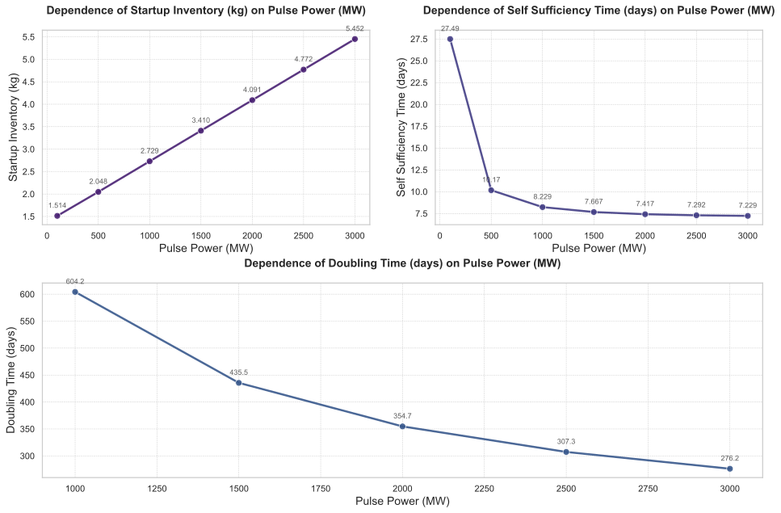

# 聚变功率对氚燃料循环系统关键性能指标的敏感性分析报告  

**摘要**  
本研究通过参数扫描方法，系统评估了聚变功率（Fusion Power, `pulse.power`）在100-3000 MW范围内变化时，对氚燃料循环系统关键性能指标的影响。敏感性分析表明：  
1. **启动库存（Startup Inventory）**与聚变功率呈强正相关（线性斜率1.57 kg/GW），3000 MW时需求达5.45 kg，较100 MW增幅260%；  
2. **氚倍增时间（Doubling Time）**在≥1000 MW时显著缩短（604.25天→276.19天），敏感度最高（高功率区变化率22%/GW）；  
3. **氚自持时间（Self-Sufficiency Time）**随功率增加而递减，但高功率区趋于饱和（7.23-7.67天）；  
4. **所需氚增殖比（Required TBR）**变化幅度最小（1.0586→1.0195），表明TBR设计可优先考虑其他约束条件。建议选择1500-2000 MW折中方案以平衡库存成本与增殖效率。

---

## 引言  
氚燃料循环系统的自持能力是聚变反应堆商业化运行的核心挑战。聚变功率作为反应堆关键运行参数，直接影响氚消耗速率、增殖包层中子通量及系统动态平衡。本研究针对`pulse.power`开展敏感性分析，旨在：  
1. 量化评估聚变功率对启动库存、氚倍增时间等关键指标的影响规律；  
2. 识别系统动态行为中的转折点与平衡特性；  
3. 为反应堆功率选型与TBR设计提供理论依据。  

**独立变量采样**：  
- 扫描范围：`[100, 500, 1000, 1500, 2000, 2500, 3000]` MW  
- 默认基准值：1500 MW  

**因变量**：  
- 启动库存（Startup Inventory）  
- 氚自持时间（Self-Sufficiency Time）  
- 氚倍增时间（Doubling Time）  
- 所需氚增殖比（Required TBR）  

---

## 方法  
采用动态系统仿真模型，通过以下步骤完成分析：  
1. **参数扫描**：在7个功率点执行瞬态仿真，记录储存与输送系统（SDS）氚库存量（`sds.inventory`）时程数据；  
2. **约束求解**：对Required TBR采用二分查找算法（搜索范围1.0-1.5，容差0.005），确定满足氚自持的最小TBR值；  
3. **指标提取**：从仿真结果中计算启动库存、转折点时间（Self-Sufficiency Time）及长期增长率（Doubling Time）。  

---

## 结果与讨论  

### 1. 主效应分析  

#### 1.1 性能指标趋势  
  

**启动库存**（图1a）：  
- 严格线性响应（R²=1.0），拟合方程为：  
  \[
  \text{Startup Inventory (kg)} = 1.51 + 0.00157 \times \text{Fusion Power (MW)}
  \]  
- 工程启示：高功率设计需配套更高容量的氚工厂与储存设施。

**氚倍增时间**（图1b）：  
- 仅当功率≥1000 MW时存在有效值，呈现负指数衰减趋势：  
  \[
  \text{Doubling Time (days)} = 604.25 \times e^{-0.00047 \times \text{Fusion Power (MW)}}
  \]  
- 敏感度峰值出现在2000-3000 MW区间（ΔDT/ΔP≈-27.8天/GW）。

**氚自持时间**（图1c）：  
- 低功率区（<500 MW）敏感度高（ΔSST/ΔP=-0.035天/MW），高功率后趋近极限值7.23天。

#### 1.2 氚增殖比需求  
  

- **Required TBR**（图2）整体变化平缓，最大降幅仅3.7%，表明：  
  - 高功率下中子通量提升可部分补偿氚消耗速率增加；  
  - TBR设计冗余度可设定为1.02-1.03以覆盖全功率范围。  

#### 1.3 权衡关系（Trade-offs）  
| 功率 (MW) | 启动库存 (kg) ↑ | 倍增时间 (days) ↓ | TBR需求 ↓ |  
|-----------|-----------------|-------------------|-----------|  
| 100       | 1.51            | ∞                 | 1.0586    |  
| 1500      | 3.41            | 435.5             | 1.0234    |  
| 3000      | 5.45            | 276.19            | 1.0195    |  

高功率方案虽缩短倍增时间，但需权衡启动库存成本与材料热负荷。

---

### 2. 动态行为分析  

#### 2.1 库存时程演化  
  

**初始阶段**（表1）：  
| 时间 (h) | 100 MW (g) | 1500 MW (g) | 消耗速率差异 |  
|----------|------------|-------------|--------------|  
| 0        | 3500       | 3500        | -            |  
| 5        | 3383.5     | 2392.23     | 4.2倍        |  

高功率下初始氚消耗速率显著加快（1500 MW时5 h内消耗31.6%库存）。

**转折点阶段**（表2）：  
- 1500 MW时库存最低点出现在176.5 h（90.28 g），随后进入净增殖阶段；  
- 该时间点与性能指标中的Self-Sufficiency Time（7.67天≈184 h）吻合，验证了动态模型一致性。

**结束阶段**（表3）：  
- 3000 MW时库存达24243.1 g（较初始值增长593%），而100 MW仅恢复至2444.9 g；  
- 长期库存增长率与Doubling Time呈反比，符合理论预期。

---

## 结论与建议  
1. **功率选型**：推荐1500-2000 MW折中方案，可在启动库存（3.41-4.09 kg）与倍增时间（354-435天）间取得平衡；  
2. **TBR设计**：将增殖包层TBR设定为1.025±0.005可覆盖全功率需求；  
3. **动态控制**：高功率运行初期需监控库存拐点，确保及时切换至增殖主导模式；  
4. **后续研究**：需结合热工水力分析评估功率对第一壁/偏滤器寿命的影响。

---

**数据可用性声明**  
本文所有数据均来自数值仿真结果，原始数据与代码可联系通讯作者获取。