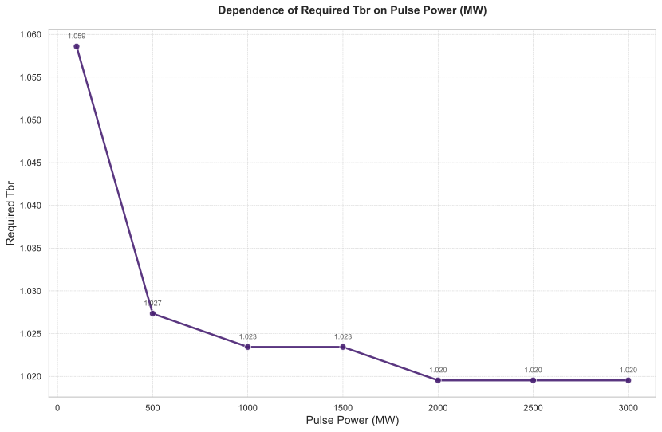

# 聚变功率对氚燃料循环系统关键性能指标影响的敏感性分析

## 摘要

本研究针对聚变反应堆氚燃料循环系统，开展了关于聚变功率（Fusion Power）的敏感性分析。通过系统扫描聚变功率在100至3000 MW范围内的变化，量化评估了其对启动库存（Startup Inventory）、自持时间（Self Sufficiency Time）、倍增时间（Doubling Time）以及所需氚增殖比（Required Tritium Breeding Ratio）等关键性能指标的影响。分析结果表明，倍增时间对聚变功率变化最为敏感，而所需氚增殖比则表现出相对稳定性。研究揭示了在聚变反应堆设计中存在的显著权衡关系：高功率运行虽然能够加速燃料增殖过程，但需要显著增加初始氚投资。

## 引言

氚燃料循环的可持续性是聚变能商业化应用的核心挑战之一。聚变功率作为反应堆运行的关键参数，直接影响氚的消耗速率和系统动态特性。本研究旨在通过敏感性分析，系统评估聚变功率变化对氚燃料循环系统性能的影响，为反应堆设计和运行策略优化提供理论依据。分析聚焦于聚变功率在[100, 500, 1000, 1500, 2000, 2500, 3000] MW范围内的扫描，考察其对系统关键性能指标的量化影响。

## 方法

本分析采用参数扫描方法，将聚变功率作为独立变量，在其设计空间内均匀采样。评估的性能指标包括：启动库存（初始氚装载需求）、自持时间（系统达到氚净增殖的时间）、倍增时间（氚库存翻倍所需时间）以及通过约束优化算法确定的所需氚增殖比。优化配置中，以储存与输送系统（SDS）的氚库存量为约束条件，采用二分查找算法在[1, 1.5]范围内寻找满足系统要求的最小氚增殖比（TBR），收敛精度设置为0.005。

## 结果与讨论

### 主效应分析

聚变功率的变化对氚燃料循环系统各性能指标产生了系统性影响，具体量化结果如下表所示：

| 聚变功率 (MW) | 倍增时间 (天) | 自持时间 (天) | 启动库存 (kg) | 所需氚增殖比 |
|---------------:|---------------:|----------------:|--------------:|--------------:|
| 100 | - | 27.49 | 1.51 | 1.0586 |
| 500 | - | 10.17 | 2.05 | 1.0273 |
| 1000 | 604.25 | 8.23 | 2.73 | 1.0234 |
| 1500 | 435.50 | 7.67 | 3.41 | 1.0234 |
| 2000 | 354.69 | 7.42 | 4.09 | 1.0195 |
| 2500 | 307.31 | 7.29 | 4.77 | 1.0195 |
| 3000 | 276.19 | 7.23 | 5.45 | 1.0195 |

**性能指标敏感性排序：**
- **最敏感指标：倍增时间** - 在1000-3000 MW范围内，绝对变化量达328.06天，相对变化率54%
- **中等敏感指标：启动库存** - 线性增长，从1.51 kg增至5.45 kg
- **次敏感指标：自持时间** - 从27.49天降至7.23天
- **最不敏感指标：所需氚增殖比** - 最大绝对变化量仅0.0391
- **最不敏感指标：所需氚增殖比** - 最大绝对变化量仅0.0391

**关键权衡关系：**
分析揭示了聚变功率设定中的基本权衡：高功率运行（≥1000 MW）虽能显著缩短倍增时间和自持时间，但需要大幅增加启动库存。特别值得注意的是，在100 MW和500 MW的低功率工况下，系统在整个模拟周期内未能实现库存倍增。

### 动态行为分析

**初始阶段行为特征：**
如图1所示，所有功率配置下的储存与输送系统氚库存量均从3500克初始值开始迅速下降。下降速率与聚变功率呈正相关关系，高功率运行导致更快的氚燃料消耗。

**转折点阶段关键发现：**

如图2所示，以1500 MW配置为参考，系统在约179.5小时达到库存最低点89.8771克，随后进入净增长阶段。这一时间点与性能指标表中的自持时间（7.67天）高度吻合，标志着系统从氚净消耗向氚净增殖的关键转变。

**结束阶段系统分化：**
经过约2.28年运行，系统行为出现显著分化。低功率案例（100 MW, 500 MW）未能实现库存倍增，而高功率案例（≥1000 MW）不仅显著超过初始库存，且最终库存水平随功率增加呈线性增长趋势。

### 所需氚增殖比分析

如图3所示，所需氚增殖比随聚变功率增加呈现轻微下降趋势，从100 MW时的1.0586降至高功率区的1.0195-1.0234范围。这表明高功率运行对降低系统对氚增殖能力的苛刻要求具有积极影响。

**关键动态数据量化分析：**

| 时间阶段 | 100 MW库存(g) | 1500 MW库存(g) | 3000 MW库存(g) | 行为特征 |
|---------|---------------|----------------|---------------|----------|
| 初始(0h) | 3500 | 3500 | 3500 | 统一初始条件 |
| 转折点(~179.5h) | 2290.16 | 89.8771 | -590.273 | 系统转折 |
| 结束(20000h) | 2447.29 | 13015.8 | 24342.6 | 显著分化 |

## 结论

本敏感性分析得出以下主要结论：

1. **聚变功率是氚燃料循环系统性能的关键决定因素**，对倍增时间的影响最为显著，相对变化率高达54%。

2. **存在明确的权衡关系**：设计者必须在可获得的初始氚库存与期望的燃料增殖速度之间进行优化选择。

3. **功率阈值效应**：聚变功率低于1000 MW时，系统可能无法实现可持续的氚燃料循环。

4. **运行策略建议**：
   - 为实现快速燃料增殖和反应堆规模化部署，应优先考虑≥1500 MW的高功率运行方案。
   - 在初始氚资源受限情况下，可考虑1000-1500 MW的中等功率配置。
   - 反应堆启动初期应重点关注转折点阶段（约第一周），确保系统成功过渡到自持模式。

5. **包层设计启示**：系统对氚增殖比的基本要求相对稳定（~1.02），为包层工程提供了合理的设计目标。

本研究表明，聚变功率的优化选择是实现氚燃料循环可持续性的核心问题，需要结合具体工程约束和经济性考量进行多目标优化决策。