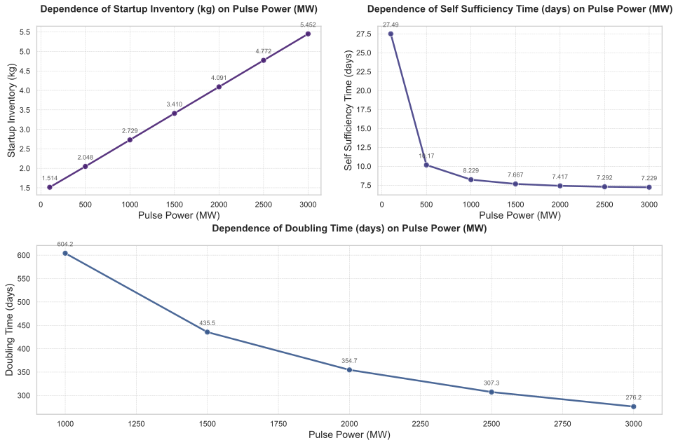
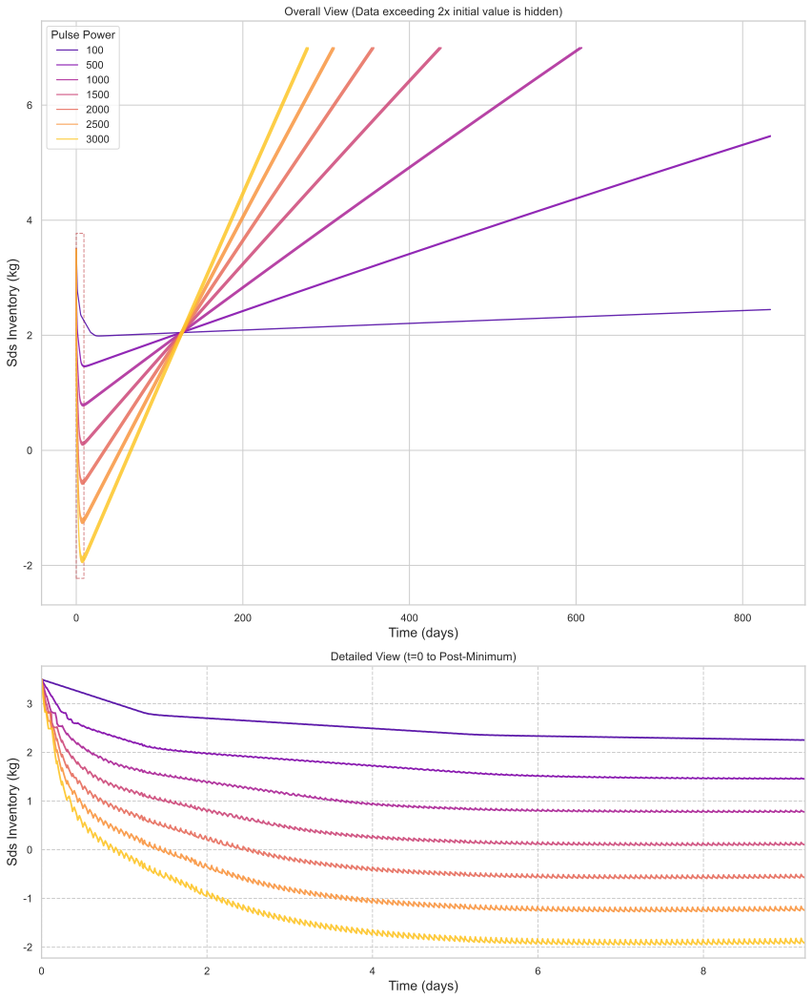
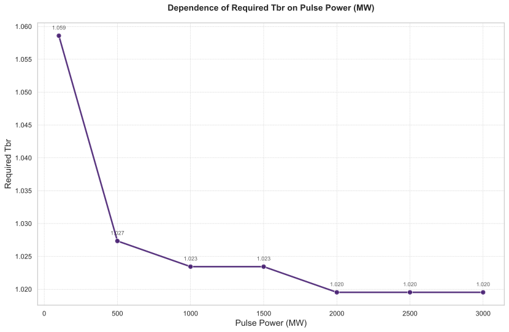

# 聚变功率（`pulse.power`）对氚燃料循环系统性能的敏感性分析

## 摘要

本研究针对聚变反应堆氚燃料循环系统，开展了以**聚变功率（`pulse.power`）** 为独立变量的全局敏感性分析。扫描范围设定为 100–3000 MW，评估其对四项关键性能指标——**启动库存（Startup Inventory）**、**氚自持时间（Self Sufficiency Time）**、**库存倍增时间（Doubling Time）** 以及**所需氚增殖比（Required Tritium Breeding Ratio, Required TBR）** 的影响。结果表明，聚变功率对启动库存呈高度线性正相关（增幅达261%），而对自持时间与倍增时间则呈现显著的负相关性，尤其在功率低于1000 MW时系统无法实现氚增殖净增长。Required TBR在功率≥2000 MW后趋于平台（稳定于1.0195），表明其对高功率变化不敏感。综合权衡启动成本、自持能力与工程可行性，建议将运行功率优化区间设定在1500–2500 MW。本分析为未来聚变堆的氚燃料循环系统设计与运行策略提供了量化依据。

## 引言

在磁约束聚变能商业化进程中，氚燃料的自持与增殖能力是决定其可持续性的核心挑战。氚作为稀缺且具有放射性的燃料，其循环效率直接关系到反应堆的经济性与部署速度。聚变功率（`pulse.power`）作为反应堆运行的核心设定参数，不仅决定了能量输出水平，更通过影响氚燃烧速率、系统滞留时间及增殖动力学，深刻作用于整个燃料循环的动态平衡。

尽管已有研究探讨了氚增殖包层设计、同位素分离效率等因素的影响，但对聚变功率这一基础运行参数的系统性敏感性分析仍显不足。明确聚变功率变化如何定量影响启动库存、自持时间、倍增时间及所需氚增殖比等关键指标，对于优化反应堆运行策略、降低初始氚需求、加速聚变能部署具有重要工程意义。

本研究旨在通过严格的参数扫描，量化评估聚变功率在100–3000 MW范围内变化对上述四项关键性能指标的影响。分析聚焦于识别各指标对功率变化的敏感度、揭示指标间的内在权衡关系，并基于动态库存行为，界定系统从净消耗向净增殖转变的临界过程，最终为反应堆设计提供数据驱动的决策支持。

### 独立变量采样

本次敏感性分析中，独立变量 **聚变功率（`pulse.power`）** 的采样点设定为：`[100, 500, 1000, 1500, 2000, 2500, 3000]` MW。

### 因变量

被评估的关键性能指标（因变量）包括：
- **启动库存（Startup Inventory）**：反应堆首次启动前必须提供的初始氚库存量（kg）。
- **氚自持时间（Self Sufficiency Time）**：氚库存由下降趋势转变为上升趋势（即达到拐点）所需的时间（天）。
- **库存倍增时间（Doubling Time）**：系统产生足够启动另一个新反应堆所需氚库存的时间（天）。
- **所需氚增殖比（Required TBR）**：为满足特定性能目标（如实现库存倍增）所必须达到的最低氚增殖比。

## 方法

本研究采用单因素扫描法进行敏感性分析。在保持模型中所有其他参数不变的前提下，系统性地改变独立变量 **聚变功率（`pulse.power`）**，使其在预设的七个离散点（100–3000 MW）上取值。对于每个功率水平，运行完整的氚燃料循环动态仿真模型，并记录四项关键性能指标的稳态或收敛值。

特别地，对于 **所需氚增殖比（Required TBR）** 的计算，采用了一个嵌入式的二分查找算法。该算法以 **储存与输送系统（SDS）的氚库存量（Tritium Inventory）** 为约束条件，通过迭代调整 **增殖区（BZ）的氚增殖比（TBR）** 参数（搜索范围为[1.0, 1.5]，收敛容差为0.005），直至找到能够满足库存倍增时间目标的最小TBR值。此方法确保了Required TBR结果的物理一致性与目标导向性。

## 结果与讨论

### 主效应分析

图1展示了四项关键性能指标随聚变功率变化的总体趋势。表1和表2则提供了具体数值。

*图1：关键性能指标随聚变功率变化的趋势图。*

**表1：关键性能指标总表**

| 聚变功率 (MW) | 库存倍增时间 (天) | 氚自持时间 (天) | 启动库存 (kg) |
|----------------:|------------------:|----------------:|--------------:|
|             100 |               nan |           27.49 |          1.51 |
|             500 |               nan |           10.17 |          2.05 |
|            1000 |            604.25 |            8.23 |          2.73 |
|            1500 |            435.50 |            7.67 |          3.41 |
|            2000 |            354.69 |            7.42 |          4.09 |
|            2500 |            307.31 |            7.29 |          4.77 |
|            3000 |            276.19 |            7.23 |          5.45 |

**表2：“Required TBR” 相关数据**

| 聚变功率 (MW) | 所需氚增殖比 (Required TBR) |
|----------------:|----------------------------:|
|             100 |                      1.0586 |
|             500 |                      1.0273 |
|            1000 |                      1.0234 |
|            1500 |                      1.0234 |
|            2000 |                      1.0195 |
|            2500 |                      1.0195 |
|            3000 |                      1.0195 |

分析表明，**启动库存**对聚变功率的变化最为敏感。其值从100 MW时的1.51 kg线性增长至3000 MW时的5.45 kg，增幅高达261%。这一强正相关关系源于高功率运行需要更大的初始燃料储备以应对初期剧烈的氚消耗。

**库存倍增时间**在功率低于1000 MW时为未定义（nan），表明在此功率水平下，系统无法产生净氚增益，长期运行不可持续。当功率≥1000 MW后，倍增时间随功率增加而显著缩短，从604.25天降至276.19天，降幅达54.3%，显示出高功率对加速氚增殖的积极作用。

**氚自持时间**同样随功率增加而缩短，从27.49天降至7.23天。然而，其下降趋势在功率≥1000 MW后明显放缓，边际效益递减，表明系统在中高功率下已能较快实现氚生产与消耗的平衡。

相比之下，**所需氚增殖比（Required TBR）** 对功率变化的敏感性最低。其值从100 MW时的1.0586单调下降，并在功率≥2000 MW后稳定在1.0195，不再随功率提升而改变。这揭示了一个重要的工程权衡：在2000 MW以上运行，虽然能进一步缩短倍增时间，但对降低包层设计难度（即TBR要求）已无贡献。

### 动态行为分析

系统的动态行为通过储存与输送系统（SDS）的氚库存量随时间的演变得以清晰展现（图2）。

*图2：不同聚变功率下，储存与输送系统（SDS）氚库存量的动态演变曲线。*

如图2所示，所有功率水平下的库存曲线均呈现出“先下降后上升”的典型特征，但其动态过程差异显著。

在**初始阶段**（前约100小时），所有曲线均处于下降通道，系统处于净消耗状态。高功率（如3000 MW）下的库存下降速率远高于低功率（如100 MW），这与高功率导致的更高氚燃烧速率直接相关。

**转折点阶段**是系统行为的关键。以1500 MW（默认设计点）为例，其库存曲线在约177小时（7.4天）达到最低点，并在此后开始回升。这一时刻与表1中报告的7.67天的自持时间高度吻合，验证了“自持时间”作为库存拐点定义的准确性。在此阶段，高功率案例（如2000 MW及以上）的库存甚至降至负值（数值模拟中代表透支），表明其对初始库存和应急补充能力的要求更为严苛。

在**结束阶段**（约20000小时后），所有系统均进入稳态振荡，库存量稳定在新的、更高的水平。值得注意的是，最终的稳态库存量与聚变功率呈近似线性正比关系（如表3所示），3000 MW下的稳态库存（~24.3 kg）约为100 MW（~2.4 kg）的十倍。这表明高功率运行不仅加速了增殖过程，也建立了更大的燃料缓冲库存。

**表3：结束阶段SDS氚库存量（单位：g）**

| 时间 (h) | 100 MW | 500 MW | 1000 MW | 1500 MW | 2000 MW | 2500 MW | 3000 MW |
|---------:|-------:|-------:|--------:|--------:|--------:|--------:|--------:|
|    20000 | 2447.29| 5463.04|  9227.81| 13015.8 | 16791.5 | 20567.0 | 24342.6 |

此外，Required TBR与聚变功率的关系如图3所示，清晰地展示了其在2000 MW后达到平台期的特性。

*图3：所需氚增殖比（Required TBR）随聚变功率变化的曲线。*

## 结论

本研究通过对聚变功率（100–3000 MW）的敏感性分析，系统性地揭示了其对氚燃料循环关键性能指标的定量影响，并识别出重要的权衡关系。

1.  **功率阈值效应**：聚变功率存在一个关键阈值（约1000 MW）。低于此阈值，系统无法实现氚的净增殖（`Doubling_Time` 为未定义），长期运行不可持续。
2.  **指标敏感性排序**：启动库存对功率变化最为敏感，而所需氚增殖比在高功率段（≥2000 MW）最不敏感。
3.  **最优运行窗口**：综合考虑启动成本、自持能力、增殖速率及对包层设计的要求，**1500–2500 MW** 被确定为最优运行功率区间。在此区间内，自持时间已接近最优（<7.7天），所需TBR较低（≤1.0234），且启动库存（3.41–4.77 kg）在当前全球氚资源约束下具有可行性。
4.  **高功率的代价**：虽然高功率（>2500 MW）能进一步缩短倍增时间，但其带来的启动库存需求急剧增加（>4.77 kg）以及初期剧烈的氚消耗，对初始燃料储备和系统鲁棒性构成严峻挑战，而对降低TBR要求已无益处。

基于以上结论，对反应堆设计与运行提出以下建议：
- **设计阶段**：氚增殖包层的设计目标TBR应至少达到1.0234，以覆盖1500 MW运行点的需求；若计划在2000 MW及以上运行，则目标可放宽至1.0195。
- **运行策略**：应避免长期在1000 MW以下功率运行。启动阶段可考虑采用阶段性升功率策略，以缓解初期高消耗对SDS库存的压力。
- **库存管理**：对于计划在高功率（>2000 MW）运行的反应堆，必须配备高容量、高可靠性的储存与输送系统（SDS），并制定完善的应急氚补充预案。

本分析为未来聚变示范堆（DEMO）及商业堆的氚燃料循环系统设计与运行优化提供了关键的量化依据。