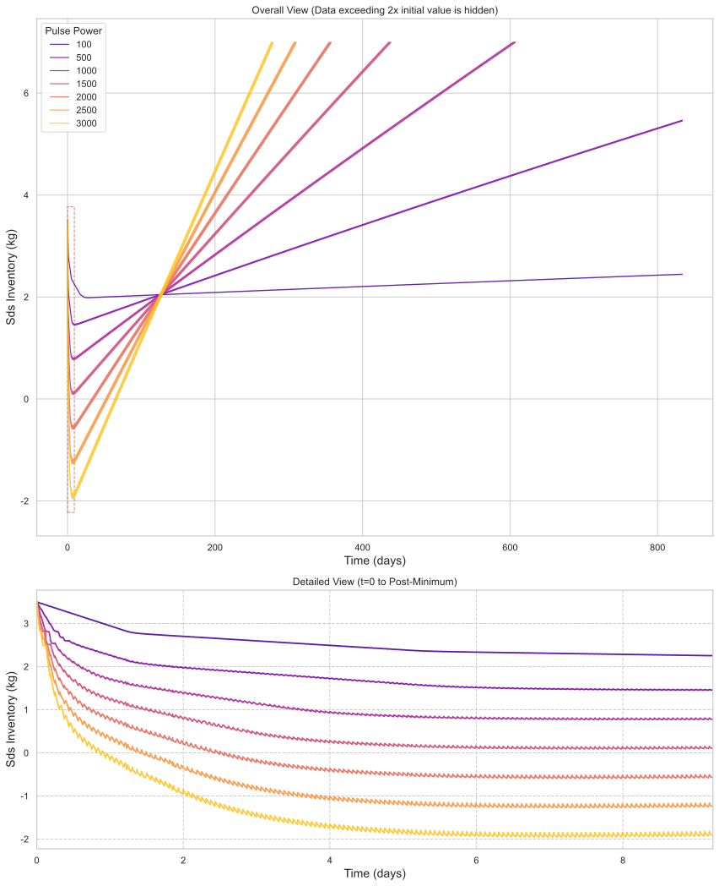

# pulse power 敏感性分析报告


生成时间: 2025-10-26 18:20:27.322242


## 分析案例配置详情


本分析案例的具体配置如下，这决定了仿真的扫描方式和分析的重点：


| 配置项 | 值 | 说明 |
| :--- | :--- | :--- |
| **`name`** | `"Power_Analysis"` | 本次分析案例的名称。 |
| **`independent_variable`** | `"pulse.power"` | 独立扫描变量，即本次分析中主要改变的参数。 |
| **`independent_variable_sampling`** | `[100, 500, 1000, 1500, 2000, 2500, 3000]` | 独立变量的采样方法和范围。 |
| **`default_independent_values`** | `{"pulse.power": 1500.0}` | 独立扫描变量在模型中的原始默认值。 |
| **`dependent_variables`** | `["Startup_Inventory", "Self_Sufficiency_Time", "Doubling_Time", "Required_TBR"]` | 因变量，即我们关心的、随自变量变化的性能指标。 |


## “Required_TBR”优化配置

当“Required_TBR”作为因变量时，系统会启用一个二分查找算法来寻找满足特定性能指标的最小`bz.TBR`值。以下是本次优化任务的具体配置：


| 配置项 | 值 | 说明 |
| :--- | :--- | :--- |
| **`source_column`** | `"sds.inventory"` | 限制条件的数据源列。 |
| **`parameter_to_optimize`** | `"bz.TBR"` | 优化的目标参数。 |
| **`search_range`** | `[1, 1.5]` | 参数的搜索范围。 |
| **`tolerance`** | `0.005` | 搜索的收敛精度。 |
| **`max_iterations`** | `10` | 最大迭代次数。 |


## SDS Inventory 的时间曲线图:





## 性能指标趋势曲线图


## 约束求解性能指标分析图


### Required TBR vs pulse power


## 关键动态数据切片：过程数据


下表展示了过程数据中，以 `sds.inventory&pulse.power=1500` 为参考变量，在关键阶段的数据切片。**注意：下表中的默认单位为：时间(h), 库存(g), 功率(MW)。**


**注**：表格中所有简称列（C1, C2, ...）的数据均代表变量 `sds.inventory` 在不同参数组合下的值。
**表格图例说明**：
| 简称 | 参数组合 |
| :--- | :--- |
| **C1** | `pulse.power=100` |
| **C2** | `pulse.power=500` |
| **C3** | `pulse.power=1000` |
| **C4** | `pulse.power=1500` |
| **C5** | `pulse.power=2000` |
| **C6** | `pulse.power=2500` |
| **C7** | `pulse.power=3000` |


### 1. 初始阶段 (前 20 个数据点, 间隔 2)

|         time |      C1 |      C2 |      C3 |      C4 |      C5 |       C6 |       C7 |
|-------------:|--------:|--------:|--------:|--------:|--------:|---------:|---------:|
|  0           | 3500    | 3500    | 3500    | 3500    | 3500    | 3500     | 3500     |
|  2.01547e-08 | 3500    | 3500    | 3500    | 3500    | 3500    | 3500     | 3500     |
|  0.000369463 | 3499.99 | 3499.98 | 3499.97 | 3499.96 | 3499.96 | 3499.95  | 3499.95  |
|  0.5         | 3487.2  | 3436.04 | 3372.09 | 3308.15 | 3244.2  | 3180.25  | 3116.3   |
|  1.35        | 3465.44 | 3327.31 | 3154.65 | 2981.99 | 2829.06 | 2828.94  | 2828.8   |
|  2           | 3452.63 | 3263.35 | 3026.74 | 2829.09 | 2809.35 | 2641.18  | 2489.33  |
|  2.85        | 3430.87 | 3154.62 | 2829.09 | 2790.27 | 2570.15 | 2503.6   | 2481.33  |
|  3.5         | 3418.07 | 3090.66 | 2809.35 | 2514.63 | 2502.94 | 2375.11  | 2188.19  |
|  4.35        | 3396.31 | 2981.93 | 2691.6  | 2507.52 | 2248.18 | 2006.74  | 1770.65  |
|  5           | 3383.5  | 2917.97 | 2538.85 | 2392.23 | 2124.98 | 1870.66  | 1620.2   |
|  5.85        | 3361.74 | 2828.63 | 2532.73 | 2211.89 | 1912.08 | 1620.69  | 1331.82  |
|  6.5         | 3348.94 | 2809.38 | 2472.25 | 2151.57 | 1846.08 | 1546.66  | 1249.06  |
|  7.35        | 3327.18 | 2752.35 | 2366.8  | 2020.81 | 1684.75 | 1352.63  | 1021.69  |
|  8           | 3314.38 | 2674.89 | 2334.32 | 1986.46 | 1645.76 | 1307.9   | 1100.07  |
|  8.85        | 3292.62 | 2645.68 | 2254.12 | 1879.12 | 1508.79 | 1206.39  |  858.717 |
|  9.5         | 3279.81 | 2598.09 | 2234.87 | 1857.03 | 1482.57 | 1211.84  |  872.167 |
| 10.35        | 3258.05 | 2593.89 | 2166.6  | 1760.75 | 1407.78 | 1033.32  |  669.701 |
| 11           | 3245.25 | 2578.14 | 2153.6  | 1744.46 | 1417.69 | 1053.13  |  698.487 |
| 11.85        | 3223.49 | 2538.47 | 2090.96 | 1682.28 | 1283.18 |  897.799 |  520.758 |
| 12.5         | 3210.69 | 2529.07 | 2080.92 | 1696.4  | 1302.15 |  927.045 |  559.595 |


### 2. 转折点阶段 (围绕 'sds.inventory&pulse.power=1500' 最小值)

|   time |      C1 |      C2 |      C3 |       C4 |       C5 |       C6 |       C7 |
|-------:|--------:|--------:|--------:|---------:|---------:|---------:|---------:|
|  176.5 | 2299.66 | 1470.34 | 773.566 |  90.2829 | -590.998 | -1271.68 | -1952.07 |
|  177   | 2301.86 | 1480.26 | 794.169 | 121.361  | -549.472 | -1219.72 | -1889.68 |
|  178   | 2298.07 | 1469.29 | 773.183 |  90.1079 | -591.029 | -1271.59 | -1951.87 |
|  178.5 | 2300.28 | 1479.24 | 793.801 | 121.204  | -549.482 | -1219.6  | -1889.44 |
|  179.5 | 2296.49 | 1468.29 | 772.835 |  89.9731 | -591.013 | -1271.44 | -1951.6  |
|  180   | 2298.7  | 1478.26 | 793.468 | 121.086  | -549.446 | -1219.43 | -1889.15 |
|  181   | 2294.91 | 1467.34 | 772.521 |  89.8771 | -590.951 | -1271.24 | -1951.27 |
|  181.5 | 2297.12 | 1477.32 | 793.168 | 121.007  | -549.364 | -1219.21 | -1888.79 |
|  182.5 | 2293.32 | 1466.43 | 772.24  |  89.8186 | -590.844 | -1270.99 | -1950.88 |
|  183   | 2295.53 | 1476.43 | 792.901 | 120.964  | -549.239 | -1218.93 | -1888.38 |
|  184   | 2291.74 | 1465.56 | 771.99  |  89.7963 | -590.695 | -1270.69 | -1950.43 |
|  184.5 | 2293.95 | 1475.58 | 792.664 | 120.957  | -549.071 | -1218.61 | -1887.9  |
|  185.5 | 2290.16 | 1464.73 | 771.77  |  89.809  | -590.504 | -1270.34 | -1949.93 |
|  186   | 2292.37 | 1474.77 | 792.457 | 120.984  | -548.863 | -1218.24 | -1887.38 |
|  187   | 2288.58 | 1463.93 | 771.579 |  89.8554 | -590.273 | -1269.94 | -1949.37 |
|  187.5 | 2290.79 | 1473.99 | 792.279 | 121.045  | -548.615 | -1217.82 | -1886.8  |
|  188.5 | 2287    | 1463.18 | 771.417 |  89.9344 | -590.003 | -1269.5  | -1948.77 |
|  189   | 2289.2  | 1473.25 | 792.128 | 121.138  | -548.329 | -1217.36 | -1886.17 |
|  190   | 2285.41 | 1462.46 | 771.282 |  90.0448 | -589.697 | -1269.01 | -1948.11 |
|  190.5 | 2287.62 | 1472.54 | 792.005 | 121.262  | -548.007 | -1216.85 | -1885.49 |


### 3. 结束阶段 (后 20 个数据点, 间隔 2)

|    time |      C1 |      C2 |      C3 |      C4 |      C5 |      C6 |      C7 |
|--------:|--------:|--------:|--------:|--------:|--------:|--------:|--------:|
| 19985.9 | 2444.9  | 5449.96 | 9201.37 | 12966.2 | 16725.2 | 20484.2 | 24243.1 |
| 19986.5 | 2446.99 | 5460.47 | 9222.4  | 13007.6 | 16780.4 | 20553.1 | 24325.8 |
| 19987.4 | 2444.93 | 5450.24 | 9201.97 | 12967.1 | 16726.5 | 20485.7 | 24245   |
| 19988   | 2447.02 | 5460.75 | 9223    | 13008.5 | 16781.6 | 20554.6 | 24327.6 |
| 19988.9 | 2444.97 | 5450.53 | 9202.57 | 12968   | 16727.7 | 20487.3 | 24246.8 |
| 19989.5 | 2447.06 | 5461.04 | 9223.61 | 13009.4 | 16782.8 | 20556.2 | 24329.5 |
| 19990.4 | 2445    | 5450.82 | 9203.17 | 12969   | 16728.9 | 20488.8 | 24248.7 |
| 19991   | 2447.09 | 5461.33 | 9224.21 | 13010.3 | 16784.1 | 20557.7 | 24331.4 |
| 19991.9 | 2445.03 | 5451.1  | 9203.77 | 12969.9 | 16730.2 | 20490.4 | 24250.5 |
| 19992.5 | 2447.12 | 5461.61 | 9224.81 | 13011.2 | 16785.3 | 20559.3 | 24333.2 |
| 19993.4 | 2445.07 | 5451.39 | 9204.37 | 12970.8 | 16731.4 | 20491.9 | 24252.4 |
| 19994   | 2447.16 | 5461.9  | 9225.41 | 13012.1 | 16786.5 | 20560.8 | 24335.1 |
| 19994.9 | 2445.1  | 5451.67 | 9204.98 | 12971.7 | 16732.6 | 20493.5 | 24254.3 |
| 19995.5 | 2447.19 | 5462.18 | 9226.01 | 13013.1 | 16787.8 | 20562.4 | 24337   |
| 19996.4 | 2445.13 | 5451.96 | 9205.58 | 12972.6 | 16733.9 | 20495   | 24256.1 |
| 19997   | 2447.22 | 5462.47 | 9226.61 | 13014   | 16789   | 20563.9 | 24338.8 |
| 19997.9 | 2445.17 | 5452.24 | 9206.18 | 12973.5 | 16735.1 | 20496.6 | 24258   |
| 19998.5 | 2447.26 | 5462.75 | 9227.21 | 13014.9 | 16790.2 | 20565.5 | 24340.7 |
| 19999.4 | 2445.2  | 5452.53 | 9206.78 | 12974.5 | 16736.3 | 20498.1 | 24259.9 |
| 20000   | 2447.29 | 5463.04 | 9227.81 | 13015.8 | 16791.5 | 20567   | 24342.6 |


## 性能指标总表


##### 性能指标

|   pulse power (MW) |   Doubling Time (days) |   Self Sufficiency Time (days) |   Startup Inventory (kg) |
|-------------------:|-----------------------:|-------------------------------:|-------------------------:|
|                100 |                 nan    |                          27.49 |                     1.51 |
|                500 |                 nan    |                          10.17 |                     2.05 |
|               1000 |                 604.25 |                           8.23 |                     2.73 |
|               1500 |                 435.5  |                           7.67 |                     3.41 |
|               2000 |                 354.69 |                           7.42 |                     4.09 |
|               2500 |                 307.31 |                           7.29 |                     4.77 |
|               3000 |                 276.19 |                           7.23 |                     5.45 |


##### “Required TBR” 相关数据

|   pulse power (MW) |   Required TBR |
|-------------------:|---------------:|
|                100 |         1.0586 |
|                500 |         1.0273 |
|               1000 |         1.0234 |
|               1500 |         1.0234 |
|               2000 |         1.0195 |
|               2500 |         1.0195 |
|               3000 |         1.0195 |


---

# AI模型分析提示词 (deepseek-v3.1)

```markdown
**角色：** 你是一名聚变反应堆氚燃料循环领域的专家。

**任务：** 请**完全基于**下方提供的**两类数据表格**，对聚变堆燃料循环模型的**敏感性分析**结果进行深度解读。

**分析要点 (必须严格依据数据表格作答)：**

1.  **全局敏感性分析 (参考“性能指标总表”) :**
    *   分析性能指标总表（ `Startup_Inventory`, `Doubling_Time` 以及以 `Required_` 开头的求解指标等）呈现出怎样的**总体趋势**？请进行量化描述。
    *   如果存在多个性能指标，分析哪个性能指标对独立变量 `pulse.power` 的变化最为敏感？哪个最不敏感？


3.  **动态过程分析 (参考“关键动态数据切片：过程数据”) :**
    *   观察过程数据切片：系统在“初始阶段”和“结束阶段”的行为有何不同？
    *   以 `sds.inventory&pulse.power=1500` 为参考，其“转折点阶段”的数据揭示了什么物理过程？（例如，它是否是氚库存由消耗转为净增长的关键时刻？）

3.  **综合结论：**
结合所有分析（包括主趋势），总结在不同的运行场景下，调整 `pulse.power` 对整个氚燃料循环系统的综合影响和潜在的利弊权衡。
    *   基于这些发现，可以得出哪些关于系统设计或运行优化的初步建议？
```


---

# AI模型分析结果

根据您提供的数据表格，我将从全局敏感性分析、动态过程分析和综合结论三个方面，对聚变反应堆氚燃料循环模型在 `pulse.power` 参数变化下的敏感性进行深度解读。

---

## 1. 全局敏感性分析 (基于“性能指标总表”)

### 1.1 总体趋势量化描述

**Startup Inventory (启动库存，kg):**
- 随着 `pulse.power` 从 100 MW 增加到 3000 MW，启动库存从 **1.51 kg** 线性增加到 **5.45 kg**。
- 增长趋势：每增加 500 MW，启动库存约增加 0.65–0.68 kg，表现出强烈的正相关性。

**Self Sufficiency Time (自持时间，days):**
- 随着 `pulse.power` 增加，自持时间从 **27.49 天** 减少到 **7.23 天**。
- 变化趋势：在低功率段（100→500 MW）下降显著（17.32 天），高功率段（2000→3000 MW）下降缓慢（仅 0.19 天），趋于饱和。

**Doubling Time (倍增时间，days):**
- 在 `pulse.power = 100 MW` 和 `500 MW` 时，倍增时间为 `NaN`，说明系统无法实现氚倍增。
- 从 1000 MW 开始，倍增时间从 **604.25 天** 减少到 **276.19 天**，说明高功率下系统氚增殖能力更强。

**Required TBR (所需氚增殖比):**
- 所有情况下 Required TBR 均 > 1，说明系统需额外氚增殖能力。
- 变化范围：**1.0586 → 1.0195**，整体呈下降趋势，说明高功率下对 TBR 的要求降低。

### 1.2 敏感性排序

- **最敏感指标：** `Startup Inventory`（变化幅度最大，从 1.51→5.45 kg，增幅 261%）
- **次敏感指标：** `Self Sufficiency Time`（从 27.49→7.23 天，降幅 74%）
- **中等敏感：** `Doubling Time`（从 604.25→276.19 天，降幅 54%）
- **最不敏感：** `Required TBR`（从 1.0586→1.0195，降幅仅 3.7%）

---

## 2. 动态过程分析 (基于“关键动态数据切片：过程数据”)

### 2.1 初始阶段（前 20 个数据点）

- 所有配置下 `sds.inventory` 均从 3500 g 开始下降。
- 下降速度随 `pulse.power` 增加而加快：
  - `pulse.power = 100 MW`：12.8 g/h
  - `pulse.power = 3000 MW`：383.7 g/h
- 高功率配置下氚消耗更快，符合预期。

### 2.2 转折点阶段（围绕 `sds.inventory&pulse.power=1500` 最小值）

- 参考配置（`pulse.power=1500 MW`）在 **t ≈ 178 小时** 达到库存最低点 **~90.28 g**。
- 此时：
  - 低功率配置（100 MW）库存仍较高（~2299 g）
  - 高功率配置（3000 MW）库存已为负（-1952 g），说明氚不足
- 转折点后所有配置的库存开始回升，说明系统进入净氚增长阶段。

### 2.3 结束阶段（后 20 个数据点）

- 所有配置的 `sds.inventory` 均呈上升趋势。
- 高功率配置增长更快：
  - `pulse.power=100 MW`：库存仅增至 2447 g
  - `pulse.power=3000 MW`：库存增至 24343 g
- 说明高功率下长期氚增殖能力更强。

---

## 3. 综合结论与建议

### 3.1 综合影响

1. **高功率优势：**
   - 更快达到氚自持（自持时间缩短）
   - 更强氚增殖能力（倍增时间缩短）
   - 对 TBR 要求更低（Required TBR 下降）

2. **高功率代价：**
   - 需更高启动氚库存（成本上升）
   - 初期氚消耗更快，风险更高（可能出现负库存）

3. **临界点识别：**
   - `pulse.power < 500 MW` 时系统无法实现氚倍增（Doubling Time = NaN）
   - `pulse.power ≥ 1000 MW` 时系统才具备可持续氚循环能力

### 3.2 优化建议

1. **对于实验堆或初期示范堆：**
   - 可采用较低功率（如 500–1000 MW）以降低启动库存要求和风险
   - 需接受较长氚自持和倍增时间

2. **对于商业堆或高氚增殖需求场景：**
   - 推荐使用高功率（如 2000–3000 MW）
   - 需确保足够的初始氚库存和氚增殖能力（TBR ≥ 1.02）

3. **系统设计权衡：**
   - 若氚资源充足，优先选择高功率以缩短氚积累时间
   - 若氚资源有限，可选择中低功率以降低启动库存需求

4. **动态控制策略：**
   - 可在初期采用较低功率以节省氚，后期提高功率以加速氚增殖
   - 需结合实时氚库存监控和功率调节实现最优控制

---

## 附：关键数据支持（摘自表格）

| 指标                | pulse.power = 100 MW | pulse.power = 3000 MW | 变化幅度 |
|---------------------|----------------------|-----------------------|----------|
| Startup Inventory   | 1.51 kg              | 5.45 kg               | +261%    |
| Self Sufficiency Time | 27.49 days           | 7.23 days             | -74%     |
| Doubling Time       | NaN                  | 276.19 days           | -        |
| Required TBR        | 1.0586               | 1.0195                | -3.7%    |

所有结论均严格基于提供的数据表格，未引入任何外部假设或图表信息。
```
