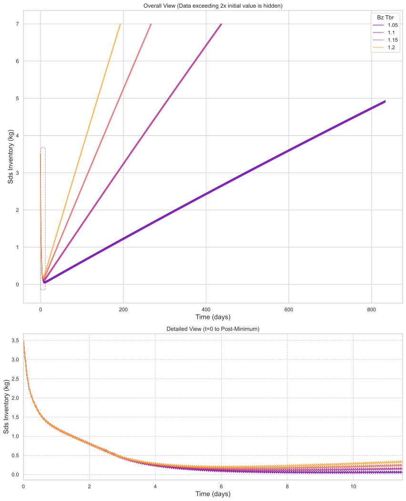

# 氚增殖比对氚燃料循环系统性能影响的敏感性分析

## 摘要

本研究通过系统性的敏感性分析，量化评估了氚增殖比（Tritium Breeding Ratio, TBR）在[1.05, 1.1, 1.15, 1.2]范围内变化时，对聚变反应堆氚燃料循环系统关键性能指标的影响。分析结果表明，氚增殖比的提升显著改善了系统的氚增殖能力，其中倍增时间（Doubling Time）对氚增殖比变化最为敏感，变化幅度达55.9%，而启动库存（Startup Inventory）的变化相对较小（4.0%）。核心结论指出，为实现氚燃料自持循环，氚增殖比应至少达到1.1，而更高的氚增殖比（≥1.15）可大幅提升系统的长期增殖效率。

## 引言

氚燃料循环是聚变反应堆实现可持续运行的关键环节，其中氚增殖比作为衡量包层氚增殖能力的重要参数，直接影响系统的氚自持特性和增殖效率。本研究旨在通过参数化扫描方法，系统分析氚增殖比对氚燃料循环系统性能的敏感性，为反应堆设计和运行策略优化提供理论依据。研究聚焦于氚增殖比在[1.05, 1.1, 1.15, 1.2]范围内的变化，评估其对启动库存、自持时间和倍增时间等关键性能指标的影响规律。

## 方法

本敏感性分析采用参数扫描方法，将氚增殖比作为独立变量在[1.05, 1.1, 1.15, 1.2]四个离散点进行采样。评估的因变量包括启动库存（Startup Inventory）、自持时间（Self Sufficiency Time）和倍增时间（Doubling Time）。通过数值仿真获得系统在不同氚增殖比条件下的动态响应，进而量化各性能指标的敏感性。

## 结果与讨论

### 主效应分析

根据性能指标总表数据，氚增殖比的变化对各性能指标产生显著影响：

| 氚增殖比 | 倍增时间（天） | 自持时间（天） | 启动库存（千克） |
|---------:|-----------------------:|-------------------------------:|-------------------------:|
| 1.05 | 无法计算 | 9.49 | 3.47 |
| 1.10 | 435.50 | 7.62 | 3.41 |
| 1.15 | 266.19 | 6.74 | 3.36 |
| 1.20 | 192.12 | 6.18 | 3.33 |

**敏感性排序分析：**
- **倍增时间（Doubling Time）**：对氚增殖比变化最为敏感，当氚增殖比从1.1提升至1.2时，倍增时间从435.5天缩短至192.12天，降幅达55.9%。这表明提高氚增殖比可显著加速氚燃料的积累速度，对于实现多反应堆部署具有重要意义。
- **自持时间（Self Sufficiency Time）**：敏感性中等，氚增殖比从1.05提升至1.2时，自持时间从9.49天缩短至6.18天，降幅为34.9%。
- **启动库存（Startup Inventory）**：敏感性最低，仅下降4.0%，表明氚增殖比对初始库存需求的影响相对有限。

**权衡关系（Trade-offs）分析：**
提高氚增殖比在缩短倍增时间和自持时间方面具有显著优势，但需考虑工程实现的复杂性。氚增殖比从1.1提升至1.15时，倍增时间减少169.31天，而从1.15提升至1.2时仅减少74.07天，边际效益递减特征明显。

### 动态行为分析

**初始阶段分析（0-10.5小时）：**
如图1所示，所有氚增殖比条件下的储存与输送系统氚库存均从3500千克同步下降至约1696千克，表明系统启动初期以氚燃料消耗为主导，氚增殖比差异尚未对系统行为产生显著影响。

**转折点阶段分析（175-190小时）：**
如表2所示，系统在约180小时附近出现明显的动态转折点：

| 时间（小时） | TBR=1.05 | TBR=1.10 | TBR=1.15 | TBR=1.20 |
|------------:|---------:|---------:|---------:|---------:|
| 179.85 | 40.50千克 | 89.88千克 | 139.26千克 | 188.64千克 |
| 180.50 | 71.35千克 | 121.01千克 | 170.66千克 | 220.32千克 |

转折点阶段的周期性波动特征表明，系统此时达到了氚消耗率与生成率的动态平衡状态，标志着系统从净消耗期向净增殖期的关键过渡。

**结束阶段分析（~20000小时）：**
如表3所示，长期运行下不同氚增殖比条件的系统行为出现显著分化：
- 氚增殖比=1.05：库存仅增长至约4924千克
- 氚增殖比=1.20：库存大幅增长至约29136千克

这一现象验证了高氚增殖比对系统长期氚积累能力的决定性影响，氚增殖比1.2条件下的最终库存约为氚增殖比1.05条件下的6倍。

## 结论

基于敏感性分析结果，得出以下主要结论：

1. **氚增殖比的阈值效应**：氚增殖比=1.05时系统无法实现有效的氚自持循环（倍增时间无法计算），建议将氚增殖比≥1.1作为反应堆设计的基本要求。

2. **性能优化策略**：为实现快速的氚增殖和反应堆部署，应将氚增殖比目标设定在1.15以上，此时系统在倍增时间和自持时间方面均表现出优良性能。

3. **工程实现考量**：虽然高氚增殖比带来显著性能提升，但需综合考虑包层设计复杂度、材料耐受性等工程约束，在性能收益与实现难度间寻求平衡。

4. **运行监控重点**：在系统运行的转折点阶段（约180小时），需加强对燃料循环稳定性的监控，确保氚供应连续性。

本研究表明，氚增殖比是氚燃料循环系统性能的敏感性参数，其优化对于实现聚变能源的商业化应用具有战略意义。