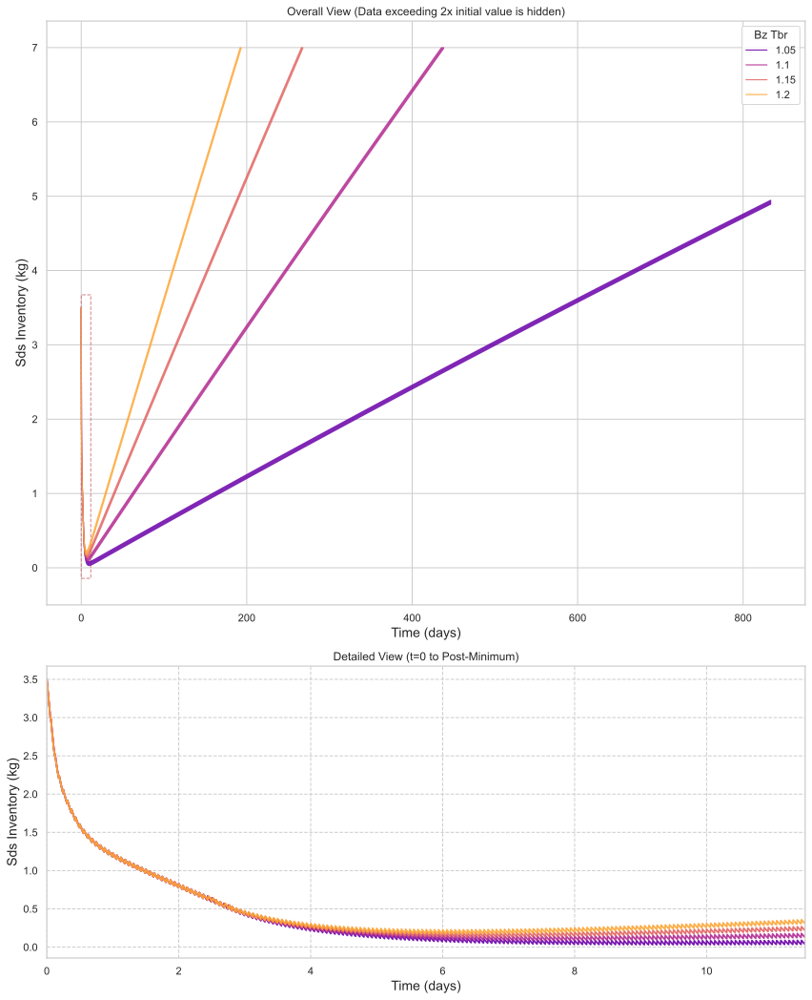
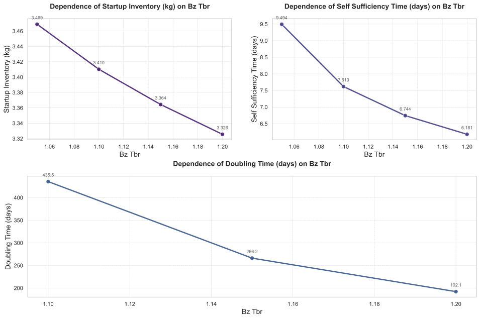

# bz TBR 敏感性分析报告


生成时间: 2025-10-26 18:46:07.731393


## 分析案例配置详情


本分析案例的具体配置如下，这决定了仿真的扫描方式和分析的重点：


| 配置项 | 值 | 说明 |
| :--- | :--- | :--- |
| **`name`** | `"TBR_Analysis"` | 本次分析案例的名称。 |
| **`independent_variable`** | `"bz.TBR"` | 独立扫描变量，即本次分析中主要改变的参数。 |
| **`independent_variable_sampling`** | `[1.05, 1.1, 1.15, 1.2]` | 独立变量的采样方法和范围。 |
| **`default_independent_values`** | `{"bz.TBR": 1.1}` | 独立扫描变量在模型中的原始默认值。 |
| **`dependent_variables`** | `["Startup_Inventory", "Self_Sufficiency_Time", "Doubling_Time"]` | 因变量，即我们关心的、随自变量变化的性能指标。 |


## SDS Inventory 的时间曲线图:





## 性能指标趋势曲线图




## 关键动态数据切片：过程数据


下表展示了过程数据中，以 `sds.inventory&bz.TBR=1.1` 为参考变量，在关键阶段的数据切片。**注意：下表中的默认单位为：时间(h), 库存(g), 功率(MW)。**


**注**：表格中所有简称列（C1, C2, ...）的数据均代表变量 `sds.inventory` 在不同参数组合下的值。
**表格图例说明**：
| 简称 | 参数组合 |
| :--- | :--- |
| **C1** | `bz.TBR=1.05` |
| **C2** | `bz.TBR=1.1` |
| **C3** | `bz.TBR=1.15` |
| **C4** | `bz.TBR=1.2` |


### 1. 初始阶段 (前 20 个数据点, 间隔 2)

|         time |      C1 |      C2 |      C3 |      C4 |
|-------------:|--------:|--------:|--------:|--------:|
|  0           | 3500    | 3500    | 3500    | 3500    |
|  1.34365e-09 | 3500    | 3500    | 3500    | 3500    |
|  9.76397e-05 | 3499.96 | 3499.96 | 3499.96 | 3499.96 |
|  0.5         | 3308.15 | 3308.15 | 3308.15 | 3308.15 |
|  1.35        | 2981.99 | 2981.99 | 2981.99 | 2981.99 |
|  1.89848     | 2829.09 | 2829.09 | 2829.09 | 2829.09 |
|  2           | 2790.27 | 2790.27 | 2790.27 | 2790.27 |
|  2.82507     | 2514.63 | 2514.63 | 2514.63 | 2514.63 |
|  2.85        | 2507.52 | 2507.52 | 2507.52 | 2507.52 |
|  3.5         | 2392.23 | 2392.23 | 2392.23 | 2392.23 |
|  4.35        | 2211.89 | 2211.89 | 2211.89 | 2211.89 |
|  5           | 2151.57 | 2151.57 | 2151.57 | 2151.57 |
|  5.85        | 2020.81 | 2020.81 | 2020.81 | 2020.81 |
|  6.5         | 1986.46 | 1986.46 | 1986.46 | 1986.46 |
|  7.35        | 1879.12 | 1879.12 | 1879.12 | 1879.12 |
|  8           | 1857.03 | 1857.03 | 1857.03 | 1857.03 |
|  8.85        | 1760.75 | 1760.75 | 1760.75 | 1760.75 |
|  9.5         | 1744.46 | 1744.46 | 1744.46 | 1744.46 |
| 10.0681      | 1682.28 | 1682.28 | 1682.28 | 1682.28 |
| 10.5         | 1696.4  | 1696.4  | 1696.4  | 1696.4  |


### 2. 转折点阶段 (围绕 'sds.inventory&bz.TBR=1.1' 最小值)

|   time |      C1 |       C2 |      C3 |      C4 |
|-------:|--------:|---------:|--------:|--------:|
| 175.35 | 42.8153 |  90.2829 | 137.751 | 185.219 |
| 176    | 73.6178 | 121.361  | 169.105 | 216.849 |
| 176.85 | 42.0031 |  90.1079 | 138.213 | 186.318 |
| 177.5  | 72.823  | 121.204  | 169.585 | 217.967 |
| 178.35 | 41.2308 |  89.9731 | 138.716 | 187.458 |
| 179    | 72.0674 | 121.086  | 170.105 | 219.124 |
| 179.85 | 40.4968 |  89.8771 | 139.258 | 188.638 |
| 180.5  | 71.3497 | 121.007  | 170.664 | 220.321 |
| 181.35 | 39.8    |  89.8186 | 139.837 | 189.856 |
| 182    | 70.6686 | 120.964  | 171.26  | 221.555 |
| 182.85 | 39.139  |  89.7963 | 140.454 | 191.111 |
| 183.5  | 70.0227 | 120.957  | 171.891 | 222.826 |
| 184.35 | 38.5126 |  89.809  | 141.105 | 192.402 |
| 185    | 69.411  | 120.984  | 172.558 | 224.131 |
| 185.85 | 37.9197 |  89.8554 | 141.791 | 193.727 |
| 186.5  | 68.8322 | 121.045  | 173.258 | 225.471 |
| 187.35 | 37.359  |  89.9344 | 142.51  | 195.085 |
| 188    | 68.2852 | 121.138  | 173.99  | 226.843 |
| 188.85 | 36.8296 |  90.0448 | 143.26  | 196.476 |
| 189.5  | 67.7689 | 121.262  | 174.754 | 228.247 |


### 3. 结束阶段 (后 20 个数据点, 间隔 2)

|    time |      C1 |      C2 |      C3 |      C4 |
|--------:|--------:|--------:|--------:|--------:|
| 19985.9 | 4889.34 | 12954.8 | 21020.3 | 29085.8 |
| 19986.5 | 4920.65 | 12986.4 | 21052.1 | 29117.8 |
| 19987.4 | 4889.69 | 12955.7 | 21021.8 | 29087.8 |
| 19988   | 4921    | 12987.3 | 21053.6 | 29119.9 |
| 19988.9 | 4890.04 | 12956.7 | 21023.3 | 29089.9 |
| 19989.5 | 4921.35 | 12988.2 | 21055.1 | 29121.9 |
| 19990.4 | 4890.39 | 12957.6 | 21024.8 | 29091.9 |
| 19991   | 4921.7  | 12989.1 | 21056.6 | 29124   |
| 19991.9 | 4890.74 | 12958.5 | 21026.2 | 29094   |
| 19992.5 | 4922.04 | 12990   | 21058   | 29126   |
| 19993.4 | 4891.08 | 12959.4 | 21027.7 | 29096.1 |
| 19994   | 4922.39 | 12991   | 21059.5 | 29128.1 |
| 19994.9 | 4891.43 | 12960.3 | 21029.2 | 29098.1 |
| 19995.5 | 4922.74 | 12991.9 | 21061   | 29130.2 |
| 19996.4 | 4891.78 | 12961.2 | 21030.7 | 29100.2 |
| 19997   | 4923.09 | 12992.8 | 21062.5 | 29132.2 |
| 19997.9 | 4892.13 | 12962.2 | 21032.2 | 29102.2 |
| 19998.5 | 4923.44 | 12993.7 | 21064   | 29134.3 |
| 19999.4 | 4892.47 | 12963.1 | 21033.7 | 29104.3 |
| 20000   | 4923.78 | 12994.6 | 21065.5 | 29136.3 |


## 性能指标总表


##### 性能指标

|   bz TBR |   Doubling Time (days) |   Self Sufficiency Time (days) |   Startup Inventory (kg) |
|---------:|-----------------------:|-------------------------------:|-------------------------:|
|     1.05 |                 nan    |                           9.49 |                     3.47 |
|     1.1  |                 435.5  |                           7.62 |                     3.41 |
|     1.15 |                 266.19 |                           6.74 |                     3.36 |
|     1.2  |                 192.12 |                           6.18 |                     3.33 |


---

# AI模型分析提示词 (qwen3-max)

```markdown
**角色：** 你是一名聚变反应堆氚燃料循环领域的专家。

**任务：** 请**完全基于**下方提供的**两类数据表格**，对聚变堆燃料循环模型的**敏感性分析**结果进行深度解读。

**分析要点 (必须严格依据数据表格作答)：**

1.  **全局敏感性分析 (参考“性能指标总表”) :**
    *   分析性能指标总表（ `Startup_Inventory`, `Doubling_Time` 以及以 `Required_` 开头的求解指标等）呈现出怎样的**总体趋势**？请进行量化描述。
    *   如果存在多个性能指标，分析哪个性能指标对独立变量 `bz.TBR` 的变化最为敏感？哪个最不敏感？


3.  **动态过程分析 (参考“关键动态数据切片：过程数据”) :**
    *   观察过程数据切片：系统在“初始阶段”和“结束阶段”的行为有何不同？
    *   以 `sds.inventory&bz.TBR=1.1` 为参考，其“转折点阶段”的数据揭示了什么物理过程？（例如，它是否是氚库存由消耗转为净增长的关键时刻？）

3.  **综合结论：**
结合所有分析（包括主趋势），总结在不同的运行场景下，调整 `bz.TBR` 对整个氚燃料循环系统的综合影响和潜在的利弊权衡。
    *   基于这些发现，可以得出哪些关于系统设计或运行优化的初步建议？
```


---

# AI模型分析结果

作为聚变反应堆氚燃料循环领域的专家，我将严格依据所提供的两类数据表格（“性能指标总表”和“关键动态数据切片：过程数据”），对以 `bz.TBR` 为独立变量的敏感性分析结果进行深度解读。

---

### 1. 全局敏感性分析（基于“性能指标总表”）

**总体趋势的量化描述：**

性能指标总表展示了在 `bz.TBR` 从 1.05 增加到 1.2 的过程中，三个关键因变量的变化：

- **Startup Inventory（启动库存，单位：kg）**：  
  从 3.47 kg（TBR=1.05）单调下降至 3.33 kg（TBR=1.2），降幅为 **0.14 kg（约 4.0%）**。变化幅度相对平缓。

- **Self Sufficiency Time（自持时间，单位：天）**：  
  从 9.49 天（TBR=1.05）显著缩短至 6.18 天（TBR=1.2），减少了 **3.31 天（约 34.9%）**。下降趋势明显且非线性（每0.05 TBR增量带来的缩短量递减）。

- **Doubling Time（倍增时间，单位：天）**：  
  在 TBR=1.05 时为 `nan`（即系统无法实现氚增殖净盈余，无法倍增）；  
  当 TBR=1.1 时为 435.5 天；  
  TBR=1.15 时降至 266.19 天（降幅 38.9%）；  
  TBR=1.2 时进一步降至 192.12 天（较 TBR=1.1 下降 55.9%）。  
  整体呈现**强非线性负相关**，且仅当 TBR ≥ 1.1 时系统才具备氚倍增能力。

**敏感性排序：**

- **最敏感指标：Doubling Time**  
  其值从“不可实现”（nan）跃变为数百天，并随 TBR 微小提升（+0.1）而大幅缩短（>50%）。这表明系统是否具备可持续扩张能力对 TBR 极其敏感，存在明显的**阈值效应**（临界 TBR ≈ 1.1）。

- **次敏感指标：Self Sufficiency Time**  
  虽无突变，但随 TBR 提升显著缩短（>30%变化），反映系统达到氚收支平衡的速度对 TBR 高度依赖。

- **最不敏感指标：Startup Inventory**  
  仅变化约 4%，表明初始装料需求对 TBR 的依赖性较弱，在该扫描范围内几乎可视为常数。

---

### 2. 动态过程分析（基于“关键动态数据切片”）

**初始阶段 vs. 结束阶段的行为差异：**

- **初始阶段（前 20 小时内）**：  
  所有 TBR 情景（C1–C4）下的 `sds.inventory` 完全一致（如 t=0 时均为 3500 g，t=10.5 h 时均为 1696.4 g）。  
  **解读**：在此阶段，氚库存消耗主要由等离子体运行和燃料循环系统的初始抽气、滞留等过程主导，尚未受到增殖包层产氚速率（即 TBR）的显著影响。系统行为由初始条件和固定运行参数决定，与 TBR 无关。

- **结束阶段（接近 20000 小时）**：  
  库存出现显著分化：  
  - C1（TBR=1.05）：~4924 g  
  - C2（TBR=1.1）：~12995 g  
  - C3（TBR=1.15）：~21066 g  
  - C4（TBR=1.2）：~29136 g  
  库存差值高达 **24.2 kg**（C4 vs C1），且呈近似线性增长趋势。  
  **解读**：长期运行下，TBR 差异通过持续的氚增殖累积效应被显著放大，高 TBR 系统不仅实现自持，还形成大量净盈余库存，支撑未来堆芯启动或燃料输出。

**转折点阶段的物理过程解析（以 C2 为参考）：**

在时间 ≈175–190 小时区间，C2（TBR=1.1）的库存呈现**周期性振荡**，在 ~89.8–121.0 g 之间波动，且整体趋势**由下降转为缓慢上升**（如 t=175.35 h: 90.28 g → t=189.5 h: 121.26 g）。

- 同期，C1（TBR=1.05）库存持续处于低位（~40–74 g），且振幅更大，表明其产氚率不足以稳定补偿消耗；
- C3/C4 库存则显著更高且振幅相对更小，显示更强的缓冲能力。

**关键结论**：该“转折点阶段”正是系统从**净消耗**向**净增殖**过渡的临界窗口。对于 TBR=1.1 的基准情景，此时氚的产生速率（由 TBR 决定）开始略高于总消耗速率（包括燃烧、滞留、衰变等），库存触底后开始恢复，标志着**自持状态的实现**。这也与性能指标中“Self Sufficiency Time = 7.62 天（≈183 小时）”高度吻合——库存最低点出现在 ~175–180 小时，随后回升，183 小时左右进入自持。

---

### 3. 综合结论与初步建议

**综合影响与权衡：**

- **提高 `bz.TBR` 带来显著优势**：  
  - 大幅缩短自持时间（提升运行灵活性）；  
  - 实现氚库存倍增（支撑聚变能规模化部署）；  
  - 长期库存水平显著提升（增强系统鲁棒性与燃料冗余）。

- **存在关键阈值**：  
  TBR 必须 ≥1.1 才能实现氚自持与倍增。TBR=1.05 时虽可短期运行（自持时间为 9.49 天），但无法实现库存增长（Doubling Time 为 nan），长期不可持续。

- **边际效益递减**：  
  从 TBR=1.15 到 1.2，Doubling Time 缩短约 74 天（27.8%），而从 1.1 到 1.15 缩短 169 天（38.9%），说明在高 TBR 区域继续提升的工程代价可能大于收益。

**初步设计与运行建议：**

1. **设计目标应确保 TBR ≥ 1.1**：这是实现氚燃料循环闭合和聚变堆可持续运行的**最低工程门槛**。任何低于此值的设计将无法支持长期运行或堆群扩展。

2. **优先优化增殖包层以提升 TBR 至 1.1–1.15 区间**：此区间 Doubling Time 对 TBR 最敏感，小幅提升可带来倍增时间的大幅缩短，性价比最高。

3. **启动库存可视为弱敏感参数**：在 TBR 1.05–1.2 范围内，启动库存变化不足 5%，因此在初步设计中可采用近似值（~3.4 kg），重点应放在确保 TBR 达标。

4. **运行策略需关注前 200 小时的库存管理**：此阶段为库存最低风险期，尤其对 TBR 接近临界值（如 1.1）的系统，需配备足够的缓冲库存或备用氚源，以防意外中断导致无法达到自持。

综上，`bz.TBR` 是决定聚变堆氚燃料循环可行性的**核心敏感参数**，其设计值必须严格高于临界阈值，并在工程可行性与增殖性能之间寻求最优平衡。
```
