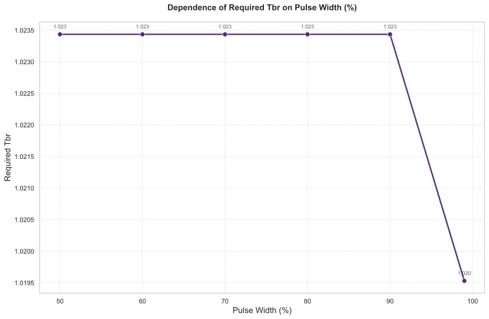

# 氚燃料循环系统中占空比对关键性能指标的敏感性分析

## 摘要

本研究针对聚变反应堆氚燃料循环系统，开展了占空比（Pulse Width / Duty Cycle）的敏感性分析。通过系统扫描占空比在50%至99%范围内的变化（采样点：50, 60, 70, 80, 90, 99），量化评估了其对启动库存（Startup Inventory）、氚自持时间（Self Sufficiency Time）、库存倍增时间（Doubling Time）以及所需氚增殖比（Required TBR）等关键性能指标的影响。结果表明，占空比的增加可显著缩短倍增时间（最大降幅42.1%），但需以更高的初始氚库存（增幅40.2%）为代价。值得注意的是，Required TBR在占空比低于99%时保持稳定（1.0234），仅在最高占空比时略微下降至1.0195。本研究为反应堆运行参数的优化设计提供了重要理论依据。

## 引言

在聚变反应堆设计中，占空比是决定系统年平均运行效率的关键参数。本研究旨在通过敏感性分析方法，系统评估占空比对氚燃料循环系统性能的定量影响。氚作为聚变堆的核心燃料，其自持能力直接影响反应堆的长期运行可行性。占空比的变化会通过改变氚消耗与再生平衡，进而影响系统动态行为。本研究的科学目标在于：（1）建立占空比与关键性能指标间的定量关系；（2）识别系统对占空比变化的敏感区域；（3）为工程实践提供参数优化建议。

**独立变量采样**：占空比扫描范围为[50, 60, 70, 80, 90, 99]%。  
**因变量**：启动库存（Startup_Inventory）、氚自持时间（Self_Sufficiency_Time）、库存倍增时间（Doubling_Time）、所需氚增殖比（Required_TBR）。

## 方法

采用动态系统仿真方法，通过控制变量法扫描占空比参数空间。对于每个占空比值，记录储存与输送系统（SDS）的氚库存量（Tritium Inventory）随时间演化过程，并提取关键性能指标。其中Required TBR通过二分查找算法（搜索范围1-1.5，容差0.005）确定满足库存约束的最小氚增殖比。所有仿真均在相同初始条件（SDS初始库存3.5kg）下进行，以保证结果可比性。

## 结果与讨论

### 1. 主效应分析

#### 性能指标总体趋势

如图1所示，占空比对各性能指标的影响呈现显著差异：

1. **启动库存**（Startup Inventory）  
   随占空比增加呈单调上升趋势，从50%时的2.56kg增至99%时的3.59kg（增幅40.2%）。这表明高占空比运行需要更大的初始氚储备以维持系统稳定性。

2. **库存倍增时间**（Doubling Time）  
   从50%时的703.06天降至99%时的407.44天（降幅42.1%），反映高占空比可显著提升氚增殖效率。这种非线性下降趋势表明，在占空比>80%时存在收益递减效应。

3. **氚自持时间**（Self Sufficiency Time）  
   变化相对平缓，从8.53天（50%）降至7.54天（99%），降幅仅11.6%。说明占空比对系统达到平衡状态的时间影响有限。

4. **所需氚增殖比**（Required TBR）  
   如图2所示，在占空比≤90%时保持1.0234不变，仅在99%时微降至1.0195（变化幅度0.38%），表明TBR需求对占空比变化具有强鲁棒性。

#### 敏感度排序与权衡关系

根据变化幅度，各指标敏感度排序为：
1. 库存倍增时间（最敏感，42.1%）
2. 启动库存（中等敏感，40.2%）
3. 氚自持时间（低敏感，11.6%）
4. 所需TBR（极低敏感，0.38%）

这种敏感性差异揭示了关键工程权衡：**通过提高占空比加速氚增殖（Doubling Time↓）必须以提高初始投资（Startup Inventory↑）为代价**。而Required TBR的稳定性表明，占空比优化可在不显著改变增殖包层设计的前提下进行。

### 2. 动态行为分析

#### 库存演化特征

如图3所示，系统动态过程可分为三个阶段：

**初始阶段（<20h）**：
- 所有占空比下的SDS库存均从3500g快速下降
- 高占空比（99%）的初始消耗速率显著更快（1h时：2930.19g vs 50%的3212.21g）
- 符合性能指标中Startup Inventory随占空比增加的趋势

**转折点阶段（~182.5h）**：
表1显示以70%占空比为例的关键转折数据：

| 时间(h) | 50%库存(g) | 70%库存(g) | 90%库存(g) | 99%库存(g) |
|--------|------------|------------|------------|------------|
| 182.5  | 992.755    | **503.33** | 89.7963    | -89.6407   |
| 185    | 985.316    | 563.56     | 120.984    | -85.9244   |

- 70%占空比在182.5h达到最低库存503.33g，标志氚生产速率首次超过消耗速率
- 高占空比（90%、99%）在转折点出现负库存，反映更极端的供需不平衡
- 与Required TBR在99%时的下降（1.0195）形成呼应，表明需要调整增殖比以补偿

**结束阶段（~20000h）**：
- 库存分布完全反转：50%占空比最终库存7943.22g，99%达14107.5g（+77.6%）
- 验证了高占空比在长期运行中的增殖优势，与Doubling Time的缩短直接相关

### 3. 性能指标总表分析

| 占空比(%) | 倍增时间(天) | 自持时间(天) | 启动库存(kg) | Required TBR |
|-----------|--------------|--------------|--------------|--------------|
| 50        | 703.06       | 8.53         | 2.56         | 1.0234       |
| 60        | 598.81       | 8.16         | 2.78         | 1.0234       |
| 70        | 527.06       | 7.92         | 3.00         | 1.0234       |
| 80        | 474.94       | 7.73         | 3.21         | 1.0234       |
| 90        | 435.50       | 7.60         | 3.41         | 1.0234       |
| 99        | 407.44       | 7.54         | 3.59         | 1.0195       |

表1数据证实：
- 倍增时间与占空比呈近似反比关系
- 启动库存增长趋势在>90%后趋于平缓
- Required TBR仅在极端情况下需要调整

## 结论与建议

1. **学术结论**：
   - 占空比对氚燃料循环性能的影响呈现显著指标特异性，倍增时间最敏感，Required TBR最不敏感
   - 高占空比（>80%）可带来显著的增殖效率提升，但伴随初始库存需求增加
   - 系统存在明确的"转折点"动力学特征，占空比越高，转折点库存越低（甚至为负）

2. **工程建议**：
   - **折中设计**：推荐80-90%占空比区间，可在Doubling Time降幅（35-40%）与Startup Inventory增幅（25-33%）间取得平衡
   - **安全边际**：若采用>95%占空比，需预留额外的氚缓冲库存（约+10%）以应对短期短缺风险
   - **TBR优化**：仅在占空比>95%时考虑适度降低TBR设计目标（从1.0234降至1.0195）

3. **未来工作**：
   - 结合燃料循环成本分析，建立占空比的经济性评价模型
   - 研究占空比与其他参数（如等离子体氚滞留时间）的交互效应

本研究为聚变堆氚燃料循环系统的参数优化提供了定量依据，证实通过合理选择占空比可实现氚管理效率的最大化。