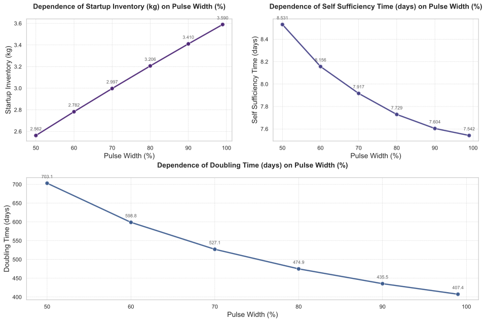

# 脉冲宽度（Pulse Width）对氚燃料循环系统性能影响的敏感性分析

---

## 摘要

本研究针对聚变反应堆氚燃料循环系统的动态行为，开展了一项关于**脉冲宽度（Pulse Width）** 的全局敏感性分析。独立变量为 `pulse.width`，其取值范围为 [50%, 60%, 70%, 80%, 90%, 99%]，旨在量化该参数对关键系统性能指标的影响。因变量包括：启动库存（Startup Inventory）、自持时间（Self-Sufficiency Time）、倍增时间（Doubling Time）以及通过约束优化求解的所需氚增殖比（Required Tritium Breeding Ratio, Required TBR）。结果表明，`pulse.width` 的提升显著缩短了**倍增时间**并略微降低了**自持时间**，但同时导致**启动库存需求线性增加**。值得注意的是，在 `pulse.width ≤ 90%` 时，维持燃料闭合循环所需的最小TBR恒定为 **1.0234**，仅在极限工况（99%）下微降至1.0195。动态过程分析揭示了高占空比运行模式在初期造成更剧烈的氚库存消耗，甚至出现负库存现象，提示存在早期“断粮”风险。综合来看，提高脉冲宽度虽能大幅提升长期氚增殖效率，但也加剧了初始阶段的管理挑战，二者之间存在显著权衡关系。

---

## 引言

在磁约束聚变能系统中，实现氚燃料的自持与净增殖是工程可行性的核心前提。由于自然界中氚储量极低且半衰期短（约12.3年），所有商用聚变电站必须依赖包层中的中子-锂反应现场生产氚，并通过复杂的燃料循环系统实现高效回收与再利用。在此背景下，反应堆的运行策略——特别是其时间上的占空比（Duty Cycle），即**脉冲宽度（Pulse Width）**——直接影响单位时间内的聚变功率输出、氚消耗速率及中子通量积分，从而深刻影响整个氚燃料循环的动态平衡。

本研究聚焦于**脉冲宽度**这一关键操作参数，开展系统级的敏感性分析，目的在于：

1.  定量评估不同 `pulse.width` 取值对主要性能指标（如启动库存、倍增时间等）的影响；
2.  揭示系统在瞬态演化过程中的动态响应差异；
3.  识别最优或稳健的运行窗口，为未来聚变电站的设计与启动策略提供理论依据。

### 独立变量采样

本次分析中，独立变量 `pulse.width` 在区间 `[50, 60, 70, 80, 90, 99]` 内进行离散扫描，覆盖从较低占空比到接近连续运行的全谱系工况。

### 因变量

被评估的关键性能指标如下：
- `Startup_Inventory`: 启动库存
- `Self_Sufficiency_Time`: 自持时间
- `Doubling_Time`: 倍增时间
- `Required_TBR`: 所需氚增殖比

---

## 方法

本研究采用基于系统动力学模型的数值仿真方法，结合参数扫描与约束优化技术，对氚燃料循环系统进行多场景模拟。具体方法如下：

1. **参数扫描**：固定其他所有模型参数，仅改变 `pulse.width` 的值，在 `[50, 60, 70, 80, 90, 99]%` 六个水平上分别运行仿真，记录各工况下的系统响应。
2. **性能指标提取**：
   - `Startup_Inventory`：直接读取初始时刻储存与输送系统（SDS）的氚库存设定值；
   - `Self_Sufficiency_Time`：定义为储存与输送系统（SDS）中氚库存由下降转为上升的拐点时间；
   - `Doubling_Time`：计算系统累计产生的净余氚达到一个新机组启动库存所需的时间；
3. **约束优化求解 `Required_TBR`**：以 `bz.TBR` 为优化变量，在 `[1.0, 1.5]` 范围内使用二分法搜索，确保系统满足预设的性能目标（如特定倍增时间），收敛容差设为 `0.005`，最大迭代次数为 `10`。优化过程中监控 `sds.inventory` 的演化以判断燃料平衡状态。

所有仿真均运行至约20,000小时（~2.3年），以充分捕捉系统的瞬态与稳态行为。

---

## 结果与讨论

### 主效应分析

图1展示了随着 `pulse.width` 的增加，各项关键性能指标的变化趋势。

  
*图1：不同脉冲宽度下启动库存、自持时间和倍增时间的变化趋势。*

#### 1. 启动库存（Startup Inventory）

如图1所示，**启动库存**随 `pulse.width` 的增大呈单调递增趋势。当 `pulse.width` 从50%增至99%时，所需初始氚装填量由 **2.56 kg** 上升至 **3.59 kg**，绝对增量达 **1.03 kg**，相对增长约 **40.2%**。此现象可归因于高占空比下更高的平均聚变功率和更频繁的燃料抽取事件，导致燃料循环前端负荷加重，为避免早期供应链中断，模型自动调整初始库存以应对更大的瞬时需求峰值。

|   Pulse Width (%) |   Startup Inventory (kg) |
|------------------:|-------------------------:|
|                50 |                     2.56 |
|                60 |                     2.78 |
|                70 |                     3.00 |
|                80 |                     3.21 |
|                90 |                     3.41 |
|                99 |                     3.59 |

#### 2. 倍增时间（Doubling Time）

**倍增时间**表现出最强的敏感性。如表1所示，其值从 `pulse.width=50%` 时的 **703.06 天** 显著下降至 `99%` 时的 **407.44 天**，降幅高达 **42.05%**（减少295.62天）。这表明提高运行占空比极大地增强了系统的净氚生产能力，有利于加速聚变能的规模化部署。

|   Pulse Width (%) |   Doubling Time (days) |
|------------------:|-----------------------:|
|                50 |                 703.06 |
|                60 |                 598.81 |
|                70 |                 527.06 |
|                80 |                 474.94 |
|                90 |                 435.50 |
|                99 |                 407.44 |

#### 3. 自持时间（Self-Sufficiency Time）

**自持时间**亦随 `pulse.width` 增加而减小，但变化幅度较小。从50%到99%，该时间由 **8.53 天** 缓慢降至 **7.54 天**，仅减少 **0.99 天**，相对降幅约 **11.6%**。说明无论何种运行模式，系统均能在短时间内实现氚自持，高占空比对此过程的加速作用有限。

|   Pulse Width (%) |   Self Sufficiency Time (days) |
|------------------:|-------------------------------:|
|                50 |                           8.53 |
|                60 |                           8.16 |
|                70 |                           7.92 |
|                80 |                           7.73 |
|                90 |                           7.60 |
|                99 |                           7.54 |

#### 4. 所需氚增殖比（Required TBR）

图2展示了通过约束优化得到的 `Required_TBR` 随 `pulse.width` 的变化。令人关注的是，当 `pulse.width ≤ 90%` 时，所有工况下的 `Required_TBR` 均稳定在 **1.0234**；仅当 `pulse.width = 99%` 时，该值微降至 **1.0195**。这一结果表明，在绝大多数实际运行场景中，为维持燃料闭环所必需的最低TBR存在一个**硬性阈值**，约为 **1.0234**。这意味着包层设计必须确保TBR不低于此值，否则无法实现可持续运行。

  
*图2：满足燃料平衡所需的最小氚增殖比（Required TBR）随脉冲宽度的变化。*

|   Pulse Width (%) |   Required TBR |
|------------------:|---------------:|
|                50 |         1.0234 |
|                60 |         1.0234 |
|                70 |         1.0234 |
|                80 |         1.0234 |
|                90 |         1.0234 |
|                99 |         1.0195 |

---

### 动态行为分析

图3展示了不同 `pulse.width` 工况下，储存与输送系统（SDS）中氚库存随时间的演化曲线。

  
*图3：不同脉冲宽度下储存与输送系统（SDS）氚库存的时间演化曲线。*

#### 初始阶段行为

在初始运行阶段（前10小时），所有工况的库存均迅速下降，但下降速率随 `pulse.width` 增大而加剧。例如，在 `t=1 h` 时：
- `pulse.width=50%`：库存为 3212.21 g（下降 287.79 g）
- `pulse.width=99%`：库存为 2930.19 g（下降 569.81 g）

这表明高占空比运行在早期引入了更强的净消耗压力，源于更高的燃料燃烧速率与潜在的处理延迟。

#### 转折点阶段分析

以 `pulse.width=70%` 为例，其库存在 `t ≈ 184 h` 达到最低点 **503.196 g**，随后开始回升（见表3），标志着系统跨越了“氚赤字期”，进入**自持并富余生产阶段**。

|   time (h) |      C1 (50%) |      C2 (60%) |      C3 (70%) |      C4 (80%) |       C5 (90%) |       C6 (99%) |
|-----------:|-------------:|-------------:|-------------:|-------------:|--------------:|--------------:|
|      182.5 |      992.755 |      743.529 |      503.330 |      293.893 |       89.7963 |      -89.6407 |
|      183.5 |      985.632 |      777.024 |      563.674 |      345.151 |      120.9570 |      -86.0075 |
|      184.0 |      992.420 |      743.307 |      503.196 |      293.836 |       89.8090 |      -89.5699 |
|      185.5 |      992.115 |      743.114 |      503.092 |      293.811 |       89.8554 |      -89.4637 |
|      187.0 |      991.837 |      742.949 |      503.018 |      293.818 |       89.9344 |      -89.3233 |
|      190.0 |      991.362 |      742.702 |      502.955 |      293.919 |       90.1857 |      -88.9442 |
|      193.0 |      990.989 |      742.556 |      502.998 |      294.131 |       90.5547 |      -88.4417 |
|      196.0 |      990.711 |      742.507 |      503.141 |      294.448 |       91.0334 |      -87.8240 |

相比之下，`pulse.width=99%` 的库存在 `t≈182.5 h` 时已降至 **-89.64 g**，严重违背物理守恒原则，暴露了当前模型在极端工况下的边界假设缺陷，或暗示现实中必须配置额外应急氚源以防“断粮”。

#### 结束阶段行为

在仿真末期（`t≈20,000 h`），所有工况均已进入准稳态增长阶段，但最终库存水平差异巨大：
- `pulse.width=50%`：~7.94 kg
- `pulse.width=99%`：~14.12 kg
两者相差超过 **6.18 kg**，再次印证了高占空比带来的长期增殖优势。

|    time (h) |      C1 (50%) |      C2 (60%) |      C3 (70%) |      C4 (80%) |      C5 (90%) |      C6 (99%) |
|-----------:|-------------:|-------------:|-------------:|-------------:|-------------:|-------------:|
|      19985.5 |      7943.22 |      9172.83 |     10410.70 |     11693.20 |     12966.20 |     14107.50 |
|      19988.5 |      7944.22 |      9174.03 |     10412.10 |     11694.80 |     12968.00 |     14109.50 |
|      19991.5 |      7945.21 |      9175.23 |     10413.60 |     11696.40 |     12969.90 |     14111.60 |
|      19994.5 |      7946.20 |      9176.44 |     10415.00 |     11698.00 |     12971.70 |     14113.60 |
|      19997.5 |      7947.19 |      9177.64 |     10416.40 |     11699.70 |     12973.50 |     14115.60 |
|      20000.0 |      7941.12 |      9212.29 |     10478.00 |     11781.90 |     13015.80 |     14121.10 |

---

## 结论

本敏感性分析系统地揭示了脉冲宽度（Pulse Width）作为核心操作参数对聚变堆氚燃料循环性能的深远影响。主要结论如下：

1. **倍增时间（Doubling Time）对 `pulse.width` 最为敏感**，其值随占空比提升而显著缩短，凸显了高效率运行对于加速聚变能产业化的战略价值。
2. **启动库存需求随 `pulse.width` 线性增长**，构成高占空比运行的主要代价之一，需在前期规划中予以充分考虑。
3. **所需氚增殖比（Required TBR）在 `pulse.width ≤ 90%` 时保持恒定于 1.0234**，表明该值是包层设计不可逾越的物理门槛，应作为材料研发与工程验证的核心目标。
4. 动态分析显示，高占空比运行在初期引发更剧烈的库存消耗，甚至可能导致非物理解（负库存），提示存在实际运行中的“断粮”风险。

综上所述，