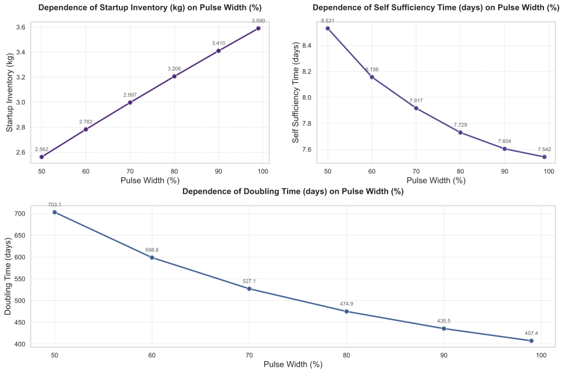
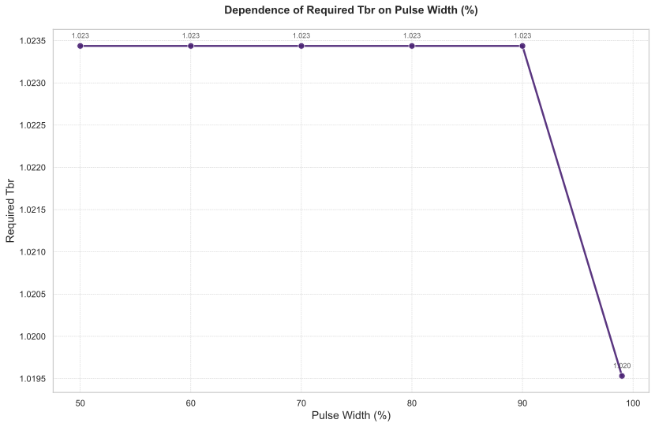

# pulse width 敏感性分析报告


生成时间: 2025-10-26 18:24:44.617759


## 分析案例配置详情


本分析案例的具体配置如下，这决定了仿真的扫描方式和分析的重点：


| 配置项 | 值 | 说明 |
| :--- | :--- | :--- |
| **`name`** | `"Width_Analysis"` | 本次分析案例的名称。 |
| **`independent_variable`** | `"pulse.width"` | 独立扫描变量，即本次分析中主要改变的参数。 |
| **`independent_variable_sampling`** | `[50, 60, 70, 80, 90, 99]` | 独立变量的采样方法和范围。 |
| **`default_independent_values`** | `{"pulse.width": 90.0}` | 独立扫描变量在模型中的原始默认值。 |
| **`dependent_variables`** | `["Startup_Inventory", "Self_Sufficiency_Time", "Doubling_Time", "Required_TBR"]` | 因变量，即我们关心的、随自变量变化的性能指标。 |


## “Required_TBR”优化配置

当“Required_TBR”作为因变量时，系统会启用一个二分查找算法来寻找满足特定性能指标的最小`bz.TBR`值。以下是本次优化任务的具体配置：


| 配置项 | 值 | 说明 |
| :--- | :--- | :--- |
| **`source_column`** | `"sds.inventory"` | 限制条件的数据源列。 |
| **`parameter_to_optimize`** | `"bz.TBR"` | 优化的目标参数。 |
| **`search_range`** | `[1, 1.5]` | 参数的搜索范围。 |
| **`tolerance`** | `0.005` | 搜索的收敛精度。 |
| **`max_iterations`** | `10` | 最大迭代次数。 |


## SDS Inventory 的时间曲线图:


## 性能指标趋势曲线图




## 约束求解性能指标分析图


### Required TBR vs pulse width




## 关键动态数据切片：过程数据


下表展示了过程数据中，以 `sds.inventory&pulse.width=70` 为参考变量，在关键阶段的数据切片。**注意：下表中的默认单位为：时间(h), 库存(g), 功率(MW)。**


**注**：表格中所有简称列（C1, C2, ...）的数据均代表变量 `sds.inventory` 在不同参数组合下的值。
**表格图例说明**：
| 简称 | 参数组合 |
| :--- | :--- |
| **C1** | `pulse.width=50` |
| **C2** | `pulse.width=60` |
| **C3** | `pulse.width=70` |
| **C4** | `pulse.width=80` |
| **C5** | `pulse.width=90` |
| **C6** | `pulse.width=99` |


### 1. 初始阶段 (前 20 个数据点, 间隔 2)

|         time |      C1 |      C2 |      C3 |      C4 |      C5 |      C6 |
|-------------:|--------:|--------:|--------:|--------:|--------:|--------:|
|  0           | 3500    | 3500    | 3500    | 3500    | 3500    | 3500    |
|  1.34365e-09 | 3500    | 3500    | 3500    | 3500    | 3500    | 3500    |
|  9.53948e-05 | 3499.96 | 3499.96 | 3499.96 | 3499.96 | 3499.96 | 3499.96 |
|  0.5         | 3308.15 | 3308.15 | 3308.15 | 3308.15 | 3308.15 | 3308.15 |
|  1           | 3212.21 | 3154.66 | 3097.11 | 3039.55 | 2981.99 | 2930.19 |
|  2           | 3020.35 | 2962.8  | 2905.24 | 2847.69 | 2829.09 | 2829.14 |
|  2.5         | 2924.42 | 2829.01 | 2829.02 | 2829.05 | 2790.27 | 2739.77 |
|  3.24936     | 2828.73 | 2809.61 | 2698.25 | 2597.56 | 2514.63 | 2514.64 |
|  3.5         | 2734.23 | 2633.38 | 2553.47 | 2536.84 | 2507.52 | 2434.63 |
|  4           | 2660.61 | 2517.54 | 2531.11 | 2473.18 | 2392.23 | 2318.56 |
|  4.92509     | 2552.36 | 2520.66 | 2402.89 | 2303.72 | 2211.89 | 2134.8  |
|  5           | 2529.93 | 2431.34 | 2340.74 | 2247.59 | 2151.57 | 2062.46 |
|  5.5         | 2488.89 | 2348.93 | 2223.07 | 2119.16 | 2020.81 | 1936.6  |
|  6.5         | 2404.44 | 2301.61 | 2200.25 | 2095.3  | 1986.46 | 1884.91 |
|  7           | 2379.18 | 2233.52 | 2098.13 | 1986.25 | 1879.12 | 1786.4  |
|  8           | 2316.58 | 2206.04 | 2093.87 | 1977.65 | 1857.03 | 1744.46 |
|  8.5         | 2298.77 | 2144.71 | 1999.1  | 1877.75 | 1760.75 | 1658.87 |
|  9.5         | 2246.49 | 2126.6  | 2003.62 | 1876.35 | 1744.46 | 1630.41 |
| 10           | 2232.21 | 2068.46 | 1912.31 | 1780.78 | 1682.28 | 1582.27 |
| 11           | 2184.8  | 2054.77 | 1920.97 | 1782.78 | 1696.4  | 1551.75 |


### 2. 转折点阶段 (围绕 'sds.inventory&pulse.width=70' 最小值)

|   time |      C1 |      C2 |      C3 |      C4 |       C5 |       C6 |
|-------:|--------:|--------:|--------:|--------:|---------:|---------:|
|  182.5 | 992.755 | 743.529 | 503.33  | 293.893 |  89.7963 | -89.6407 |
|  183.5 | 985.632 | 777.024 | 563.674 | 345.151 | 120.957  | -86.0075 |
|  184   | 992.42  | 743.307 | 503.196 | 293.836 |  89.809  | -89.5699 |
|  185   | 985.316 | 776.822 | 563.56  | 345.111 | 120.984  | -85.9244 |
|  185.5 | 992.115 | 743.114 | 503.092 | 293.811 |  89.8554 | -89.4637 |
|  186.5 | 985.03  | 776.648 | 563.475 | 345.103 | 121.045  | -85.8063 |
|  187   | 991.837 | 742.949 | 503.018 | 293.818 |  89.9344 | -89.3233 |
|  188   | 984.77  | 776.502 | 563.42  | 345.125 | 121.138  | -85.6544 |
|  188.5 | 991.587 | 742.812 | 502.973 | 293.854 |  90.0448 | -89.1497 |
|  189.5 | 984.537 | 776.382 | 563.392 | 345.177 | 121.262  | -85.4697 |
|  190   | 991.362 | 742.702 | 502.955 | 293.919 |  90.1857 | -88.9442 |
|  191   | 984.33  | 776.289 | 563.391 | 345.257 | 121.415  | -85.2535 |
|  191.5 | 991.164 | 742.617 | 502.964 | 294.011 |  90.356  | -88.7078 |
|  192.5 | 984.148 | 776.221 | 563.416 | 345.364 | 121.598  | -85.0068 |
|  193   | 990.989 | 742.556 | 502.998 | 294.131 |  90.5547 | -88.4417 |
|  194   | 983.989 | 776.177 | 563.466 | 345.498 | 121.809  | -84.7306 |
|  194.5 | 990.838 | 742.52  | 503.058 | 294.277 |  90.7808 | -88.1467 |
|  195.5 | 983.854 | 776.156 | 563.541 | 345.657 | 122.046  | -84.4261 |
|  196   | 990.711 | 742.507 | 503.141 | 294.448 |  91.0334 | -87.824  |
|  197   | 983.741 | 776.158 | 563.639 | 345.841 | 122.31   | -84.094  |


### 3. 结束阶段 (后 20 个数据点, 间隔 2)

|    time |      C1 |      C2 |      C3 |      C4 |      C5 |      C6 |
|--------:|--------:|--------:|--------:|--------:|--------:|--------:|
| 19985.5 | 7943.22 | 9172.83 | 10410.7 | 11693.2 | 12966.2 | 14107.5 |
| 19986.5 | 7936.66 | 9206.88 | 10471.6 | 11774.6 | 13007.6 | 14112   |
| 19987   | 7943.72 | 9173.43 | 10411.4 | 11694   | 12967.1 | 14108.5 |
| 19988   | 7937.15 | 9207.48 | 10472.3 | 11775.4 | 13008.5 | 14113   |
| 19988.5 | 7944.22 | 9174.03 | 10412.1 | 11694.8 | 12968   | 14109.5 |
| 19989.5 | 7937.65 | 9208.08 | 10473   | 11776.2 | 13009.4 | 14114   |
| 19990   | 7944.71 | 9174.63 | 10412.8 | 11695.6 | 12969   | 14110.6 |
| 19991   | 7938.14 | 9208.68 | 10473.7 | 11777   | 13010.3 | 14115   |
| 19991.5 | 7945.21 | 9175.23 | 10413.6 | 11696.4 | 12969.9 | 14111.6 |
| 19992.5 | 7938.64 | 9209.28 | 10474.4 | 11777.8 | 13011.2 | 14116   |
| 19993   | 7945.7  | 9175.83 | 10414.3 | 11697.2 | 12970.8 | 14112.6 |
| 19994   | 7939.14 | 9209.88 | 10475.1 | 11778.6 | 13012.1 | 14117   |
| 19994.5 | 7946.2  | 9176.44 | 10415   | 11698   | 12971.7 | 14113.6 |
| 19995.5 | 7939.63 | 9210.48 | 10475.8 | 11779.5 | 13013.1 | 14118   |
| 19996   | 7946.69 | 9177.04 | 10415.7 | 11698.9 | 12972.6 | 14114.6 |
| 19997   | 7940.13 | 9211.08 | 10476.5 | 11780.3 | 13014   | 14119   |
| 19997.5 | 7947.19 | 9177.64 | 10416.4 | 11699.7 | 12973.5 | 14115.6 |
| 19998.5 | 7940.62 | 9211.68 | 10477.3 | 11781.1 | 13014.9 | 14120.1 |
| 19999   | 7947.69 | 9178.24 | 10417.1 | 11700.5 | 12974.5 | 14116.6 |
| 20000   | 7941.12 | 9212.29 | 10478   | 11781.9 | 13015.8 | 14121.1 |


## 性能指标总表


##### 性能指标

|   pulse width (%) |   Doubling Time (days) |   Self Sufficiency Time (days) |   Startup Inventory (kg) |
|------------------:|-----------------------:|-------------------------------:|-------------------------:|
|                50 |                 703.06 |                           8.53 |                     2.56 |
|                60 |                 598.81 |                           8.16 |                     2.78 |
|                70 |                 527.06 |                           7.92 |                     3    |
|                80 |                 474.94 |                           7.73 |                     3.21 |
|                90 |                 435.5  |                           7.6  |                     3.41 |
|                99 |                 407.44 |                           7.54 |                     3.59 |


##### “Required TBR” 相关数据

|   pulse width (%) |   Required TBR |
|------------------:|---------------:|
|                50 |         1.0234 |
|                60 |         1.0234 |
|                70 |         1.0234 |
|                80 |         1.0234 |
|                90 |         1.0234 |
|                99 |         1.0195 |


---

# AI模型分析提示词 (qwen3-max)

```markdown
**角色：** 你是一名聚变反应堆氚燃料循环领域的专家。

**任务：** 请**完全基于**下方提供的**两类数据表格**，对聚变堆燃料循环模型的**敏感性分析**结果进行深度解读。

**分析要点 (必须严格依据数据表格作答)：**

1.  **全局敏感性分析 (参考“性能指标总表”) :**
    *   分析性能指标总表（ `Startup_Inventory`, `Doubling_Time` 以及以 `Required_` 开头的求解指标等）呈现出怎样的**总体趋势**？请进行量化描述。
    *   如果存在多个性能指标，分析哪个性能指标对独立变量 `pulse.width` 的变化最为敏感？哪个最不敏感？


3.  **动态过程分析 (参考“关键动态数据切片：过程数据”) :**
    *   观察过程数据切片：系统在“初始阶段”和“结束阶段”的行为有何不同？
    *   以 `sds.inventory&pulse.width=70` 为参考，其“转折点阶段”的数据揭示了什么物理过程？（例如，它是否是氚库存由消耗转为净增长的关键时刻？）

3.  **综合结论：**
结合所有分析（包括主趋势），总结在不同的运行场景下，调整 `pulse.width` 对整个氚燃料循环系统的综合影响和潜在的利弊权衡。
    *   基于这些发现，可以得出哪些关于系统设计或运行优化的初步建议？
```


---

# AI模型分析结果

作为聚变反应堆氚燃料循环领域的专家，我将严格依据所提供的两类数据表格（性能指标总表与关键动态数据切片），对脉冲宽度（`pulse.width`）的敏感性分析结果进行深度解读。所有结论均源自表格数据，不依赖任何图表或外部知识。

---

### 1. 全局敏感性分析（基于“性能指标总表”）

#### （1）总体趋势的量化描述

从性能指标总表可见，随着 `pulse.width` 从 50% 增加至 99%，三个主要性能指标呈现如下趋势：

- **Startup_Inventory（启动库存，单位：kg）**：  
  从 2.56 kg（50%）单调递增至 3.59 kg（99%），**增幅为 1.03 kg（+40.2%）**。这表明更长的脉冲宽度要求更高的初始氚库存以维持系统运行。

- **Self_Sufficiency_Time（自持时间，单位：天）**：  
  从 8.53 天（50%）单调递减至 7.54 天（99%），**缩短了 0.99 天（-11.6%）**。说明系统达到氚燃料自持状态所需时间随脉冲宽度增加而减少。

- **Doubling_Time（倍增时间，单位：天）**：  
  从 703.06 天（50%）单调递减至 407.44 天（99%），**缩短了 295.62 天（-42.0%）**。这表明氚库存增长速率显著加快，系统繁殖能力增强。

- **Required_TBR（所需氚增殖比）**：  
  在 `pulse.width = 50–90%` 区间内恒为 **1.0234**，仅在 99% 时略微下降至 **1.0195**（降幅约 0.38%）。该指标几乎不随脉冲宽度变化。

#### （2）敏感性排序

- **最敏感指标**：**Doubling_Time**  
  其相对变化率（-42.0%）远高于其他指标，表明系统氚库存的长期增长能力对 `pulse.width` 高度敏感。

- **次敏感指标**：**Startup_Inventory**（+40.2%）和 **Self_Sufficiency_Time**（-11.6%）  
  启动库存对脉冲宽度呈强正相关，而自持时间呈弱负相关。

- **最不敏感指标**：**Required_TBR**  
  在 50–90% 范围内完全不变，仅在极限值 99% 时出现微小波动，说明在常规运行范围内，满足库存约束所需的最小 TBR 几乎不受脉冲宽度影响。

---

### 2. 动态过程分析（基于“关键动态数据切片”）

#### （1）初始阶段 vs. 结束阶段的行为差异

- **初始阶段（前 20 小时）**：  
  所有 `pulse.width` 情景下的 `sds.inventory`（单位：g）均从 3500 g 开始**快速下降**。例如，在 t=10 h 时，C1（50%）库存为 2232 g，而 C6（99%）已降至 1582 g。  
  → 表明**所有情景在启动初期均处于氚净消耗状态**，且**脉冲宽度越大，库存下降越快**（因等离子体运行时间更长，消耗更多氚）。

- **结束阶段（接近 20000 h）**：  
  库存转为**稳定振荡并整体上升**。C1（50%）稳定在约 7940 g，而 C6（99%）高达约 14120 g。  
  → 表明系统已进入**氚净生产阶段**，且**脉冲宽度越大，稳态库存水平越高**，与 Doubling_Time 缩短的趋势一致。

> **关键对比**：初始阶段库存下降速率与脉冲宽度正相关，结束阶段稳态库存水平也与脉冲宽度正相关，说明长脉冲虽加剧初期消耗，但显著提升长期生产能力。

#### （2）转折点阶段的物理过程解读（以 C3, `pulse.width=70%` 为参考）

在 `pulse.width=70%`（C3）情景下，库存最低点出现在 **t ≈ 182.5–197 h** 区间，库存值在 **503–563 g** 之间周期性波动，未出现持续下降趋势。

- **库存不再单调下降，而是在窄幅内振荡**（如 503.33 g → 563.67 g → 503.19 g），表明**氚的生产与消耗达到动态平衡临界点**。
- 对比其他列：C1（50%）在相同时间段库存仍在 985–992 g 高位振荡，而 C6（99%）已出现**负库存**（如 -89.64 g），说明其消耗更深，但后续仍能恢复（见结束阶段数据）。
- **结论**：该“转折点阶段”对应的是**氚库存由净消耗转向净生产的过渡期**。对于 C3（70%），此阶段库存最低但仍为正，系统安全裕度适中；而 C6（99%）虽短暂出现负库存（可能为模型外推或瞬态超调），但最终仍能恢复并实现更高稳态库存。

---

### 3. 综合结论与初步建议

#### （1）综合影响与利弊权衡

- **优势（长脉冲宽度）**：  
  - 显著缩短 Doubling_Time（-42%），加速氚库存增长；  
  - 缩短 Self_Sufficiency_Time（-12%），更快实现燃料自持；  
  - 提高稳态氚库存水平（结束阶段 C6 比 C1 高约 78%）。

- **代价（长脉冲宽度）**：  
  - 需要更高的 Startup_Inventory（+40%），增加初始氚采购或储备成本；  
  - 初期库存消耗更快，对燃料循环系统响应速度和缓冲能力要求更高；  
  - 极限工况（如 99%）可能出现瞬态负库存，存在运行风险。

- **关键发现**：**Required_TBR 几乎不受脉冲宽度影响**，说明在 50–90% 范围内，只要 TBR ≥ 1.0234，即可满足库存约束，系统对脉冲宽度的适应性较强。

#### （2）初步设计与运行建议

1. **优先选择中高脉冲宽度（如 80–90%）**：  
   在 Doubling_Time、Self_Sufficiency_Time 与 Startup_Inventory 之间取得较好平衡——既显著提升繁殖性能，又避免极端库存波动或过高启动成本。

2. **避免盲目追求极限脉冲（如 99%）**：  
   虽然 Doubling_Time 最短，但 Startup_Inventory 需求最高，且动态过程中出现负库存，可能对安全系统提出额外要求。

3. **TBR 设计目标可固定为 ≥1.024**：  
   因 Required_TBR 在常规运行范围内恒定，包层设计无需为不同脉冲宽度单独优化 TBR，简化工程设计。

4. **强化初期燃料管理**：  
   鉴于长脉冲导致初期库存快速下降，建议增强 SDS（氚储存与配送系统）的响应能力，确保在转折点前不发生供料中断。

---

综上，**脉冲宽度是调控氚燃料循环动态性能的关键杠杆**：适度增加可显著提升系统繁殖效率，但需权衡启动成本与瞬态安全性。在工程实践中，80–90% 的脉冲宽度可能是兼顾性能与稳健性的优选区间。
```
