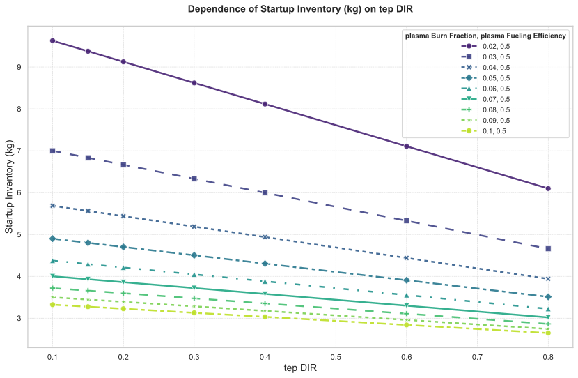
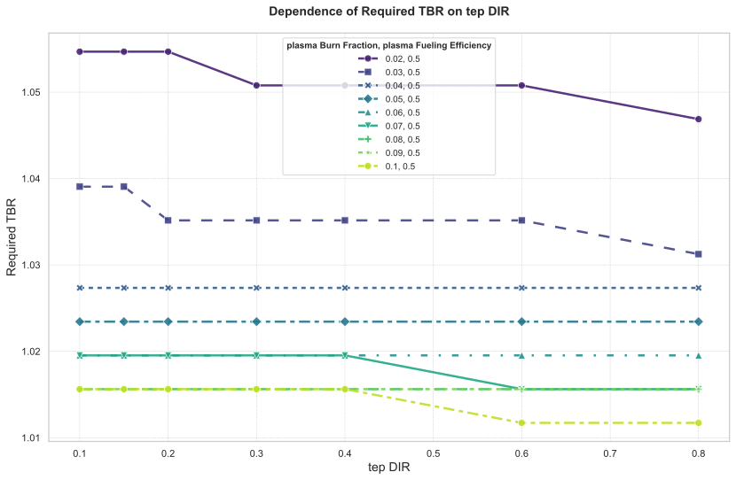

# tep DIR 与 plasma Fueling Efficiency、plasma Burn Fraction 交互敏感性分析报告


生成时间: 2025-10-27 13:01:33.862447


## 分析案例配置详情


本分析案例的具体配置如下，这决定了仿真的扫描方式和分析的重点：


| 配置项 | 值 | 说明 |
| :--- | :--- | :--- |
| **`name`** | `"DIR_PLASMA_Analysis"` | 本次分析案例的名称。 |
| **`independent_variable`** | `"tep.DIR"` | 独立扫描变量，即本次分析中主要改变的参数。 |
| **`independent_variable_sampling`** | `[0.1, 0.15, 0.2, 0.3, 0.4, 0.6, 0.8]` | 独立变量的采样方法和范围。 |
| **`default_independent_values`** | `{"tep.DIR": 0.85}` | 独立扫描变量在模型中的原始默认值。 |
| **`simulation_parameters`** | `{"plasma.Fueling_Efficiency": [0.5], "plasma.Burn_Fraction": [0.02, 0.03, 0.04, 0.05, 0.06, 0.07, 0.08, 0.09, 0.1]}` | 背景扫描参数，与独立变量组合形成多维扫描。 |
| **`default_simulation_values`** | `{"plasma.Fueling_Efficiency": 0.5, "plasma.Burn_Fraction": 0.05}` | 背景扫描参数在模型中的原始默认值。 |
| **`dependent_variables`** | `["Startup_Inventory", "Required_TBR"]` | 因变量，即我们关心的、随自变量变化的性能指标。 |


## “Required_TBR”优化配置

当“Required_TBR”作为因变量时，系统会启用一个二分查找算法来寻找满足特定性能指标的最小`bz.TBR`值。以下是本次优化任务的具体配置：


| 配置项 | 值 | 说明 |
| :--- | :--- | :--- |
| **`source_column`** | `"sds.inventory"` | 限制条件的数据源列。 |
| **`parameter_to_optimize`** | `"bz.TBR"` | 优化的目标参数。 |
| **`search_range`** | `[1, 1.5]` | 参数的搜索范围。 |
| **`tolerance`** | `0.005` | 搜索的收敛精度。 |
| **`max_iterations`** | `10` | 最大迭代次数。 |


## 性能指标分析图


### Startup Inventory vs tep DIR




## 约束求解性能指标分析图


### Required TBR vs tep DIR




## 性能指标总表 (分组: `plasma.Fueling_Efficiency`, `plasma.Burn_Fraction`)


#### 数据子表 (原始默认值: `plasma.Fueling_Efficiency=0.5` & `plasma.Burn_Fraction=0.05`)

##### 性能指标

|   tep DIR |   Startup Inventory (kg) |
|----------:|-------------------------:|
|      0.1  |                     4.9  |
|      0.15 |                     4.8  |
|      0.2  |                     4.7  |
|      0.3  |                     4.5  |
|      0.4  |                     4.3  |
|      0.6  |                     3.91 |
|      0.8  |                     3.51 |


##### “Required TBR” 相关数据

|   tep DIR |   Required TBR |
|----------:|---------------:|
|      0.1  |         1.0234 |
|      0.15 |         1.0234 |
|      0.2  |         1.0234 |
|      0.3  |         1.0234 |
|      0.4  |         1.0234 |
|      0.6  |         1.0234 |
|      0.8  |         1.0234 |


---

> 其他参数组合下的数据子表：

#### 数据子表 (当 `plasma.Fueling_Efficiency=0.5` & `plasma.Burn_Fraction=0.02` 时)

##### 性能指标

|   tep DIR |   Startup Inventory (kg) |
|----------:|-------------------------:|
|      0.1  |                     9.63 |
|      0.15 |                     9.38 |
|      0.2  |                     9.12 |
|      0.3  |                     8.62 |
|      0.4  |                     8.12 |
|      0.6  |                     7.11 |
|      0.8  |                     6.1  |


##### “Required TBR” 相关数据

|   tep DIR |   Required TBR |
|----------:|---------------:|
|      0.1  |         1.0547 |
|      0.15 |         1.0547 |
|      0.2  |         1.0547 |
|      0.3  |         1.0508 |
|      0.4  |         1.0508 |
|      0.6  |         1.0508 |
|      0.8  |         1.0469 |


#### 数据子表 (当 `plasma.Fueling_Efficiency=0.5` & `plasma.Burn_Fraction=0.03` 时)

##### 性能指标

|   tep DIR |   Startup Inventory (kg) |
|----------:|-------------------------:|
|      0.1  |                     7    |
|      0.15 |                     6.83 |
|      0.2  |                     6.66 |
|      0.3  |                     6.33 |
|      0.4  |                     6    |
|      0.6  |                     5.33 |
|      0.8  |                     4.66 |


##### “Required TBR” 相关数据

|   tep DIR |   Required TBR |
|----------:|---------------:|
|      0.1  |         1.0391 |
|      0.15 |         1.0391 |
|      0.2  |         1.0352 |
|      0.3  |         1.0352 |
|      0.4  |         1.0352 |
|      0.6  |         1.0352 |
|      0.8  |         1.0312 |


#### 数据子表 (当 `plasma.Fueling_Efficiency=0.5` & `plasma.Burn_Fraction=0.04` 时)

##### 性能指标

|   tep DIR |   Startup Inventory (kg) |
|----------:|-------------------------:|
|      0.1  |                     5.69 |
|      0.15 |                     5.56 |
|      0.2  |                     5.44 |
|      0.3  |                     5.19 |
|      0.4  |                     4.94 |
|      0.6  |                     4.44 |
|      0.8  |                     3.94 |


##### “Required TBR” 相关数据

|   tep DIR |   Required TBR |
|----------:|---------------:|
|      0.1  |         1.0273 |
|      0.15 |         1.0273 |
|      0.2  |         1.0273 |
|      0.3  |         1.0273 |
|      0.4  |         1.0273 |
|      0.6  |         1.0273 |
|      0.8  |         1.0273 |


#### 数据子表 (当 `plasma.Fueling_Efficiency=0.5` & `plasma.Burn_Fraction=0.06` 时)

##### 性能指标

|   tep DIR |   Startup Inventory (kg) |
|----------:|-------------------------:|
|      0.1  |                     4.37 |
|      0.15 |                     4.29 |
|      0.2  |                     4.21 |
|      0.3  |                     4.05 |
|      0.4  |                     3.88 |
|      0.6  |                     3.55 |
|      0.8  |                     3.22 |


##### “Required TBR” 相关数据

|   tep DIR |   Required TBR |
|----------:|---------------:|
|      0.1  |         1.0195 |
|      0.15 |         1.0195 |
|      0.2  |         1.0195 |
|      0.3  |         1.0195 |
|      0.4  |         1.0195 |
|      0.6  |         1.0195 |
|      0.8  |         1.0195 |


#### 数据子表 (当 `plasma.Fueling_Efficiency=0.5` & `plasma.Burn_Fraction=0.07` 时)

##### 性能指标

|   tep DIR |   Startup Inventory (kg) |
|----------:|-------------------------:|
|      0.1  |                     4    |
|      0.15 |                     3.93 |
|      0.2  |                     3.86 |
|      0.3  |                     3.72 |
|      0.4  |                     3.58 |
|      0.6  |                     3.3  |
|      0.8  |                     3.02 |


##### “Required TBR” 相关数据

|   tep DIR |   Required TBR |
|----------:|---------------:|
|      0.1  |         1.0195 |
|      0.15 |         1.0195 |
|      0.2  |         1.0195 |
|      0.3  |         1.0195 |
|      0.4  |         1.0195 |
|      0.6  |         1.0156 |
|      0.8  |         1.0156 |


#### 数据子表 (当 `plasma.Fueling_Efficiency=0.5` & `plasma.Burn_Fraction=0.08` 时)

##### 性能指标

|   tep DIR |   Startup Inventory (kg) |
|----------:|-------------------------:|
|      0.1  |                     3.72 |
|      0.15 |                     3.66 |
|      0.2  |                     3.6  |
|      0.3  |                     3.47 |
|      0.4  |                     3.35 |
|      0.6  |                     3.11 |
|      0.8  |                     2.86 |


##### “Required TBR” 相关数据

|   tep DIR |   Required TBR |
|----------:|---------------:|
|      0.1  |         1.0156 |
|      0.15 |         1.0156 |
|      0.2  |         1.0156 |
|      0.3  |         1.0156 |
|      0.4  |         1.0156 |
|      0.6  |         1.0156 |
|      0.8  |         1.0156 |


#### 数据子表 (当 `plasma.Fueling_Efficiency=0.5` & `plasma.Burn_Fraction=0.09` 时)

##### 性能指标

|   tep DIR |   Startup Inventory (kg) |
|----------:|-------------------------:|
|      0.1  |                     3.5  |
|      0.15 |                     3.44 |
|      0.2  |                     3.39 |
|      0.3  |                     3.28 |
|      0.4  |                     3.17 |
|      0.6  |                     2.96 |
|      0.8  |                     2.74 |


##### “Required TBR” 相关数据

|   tep DIR |   Required TBR |
|----------:|---------------:|
|      0.1  |         1.0156 |
|      0.15 |         1.0156 |
|      0.2  |         1.0156 |
|      0.3  |         1.0156 |
|      0.4  |         1.0156 |
|      0.6  |         1.0156 |
|      0.8  |         1.0156 |


#### 数据子表 (当 `plasma.Fueling_Efficiency=0.5` & `plasma.Burn_Fraction=0.1` 时)

##### 性能指标

|   tep DIR |   Startup Inventory (kg) |
|----------:|-------------------------:|
|      0.1  |                     3.32 |
|      0.15 |                     3.27 |
|      0.2  |                     3.23 |
|      0.3  |                     3.13 |
|      0.4  |                     3.03 |
|      0.6  |                     2.84 |
|      0.8  |                     2.65 |


##### “Required TBR” 相关数据

|   tep DIR |   Required TBR |
|----------:|---------------:|
|      0.1  |         1.0156 |
|      0.15 |         1.0156 |
|      0.2  |         1.0156 |
|      0.3  |         1.0156 |
|      0.4  |         1.0156 |
|      0.6  |         1.0117 |
|      0.8  |         1.0117 |


---

# AI模型分析提示词 (deepseek-v3.2-exp)

```markdown
**角色：** 你是一名聚变反应堆氚燃料循环领域的专家。

**任务：** 请**完全基于**下方提供的**两类数据表格**，对聚变堆燃料循环模型的**敏感性分析**结果进行深度解读。

**分析要点 (必须严格依据数据表格作答)：**

1.  **全局敏感性分析 (参考“性能指标总表”) :**
    *   分析性能指标总表（ `Startup_Inventory`, `Doubling_Time` 以及以 `Required_` 开头的求解指标等）呈现出怎样的**总体趋势**？请进行量化描述。
    *   如果存在多个性能指标，分析哪个性能指标对独立变量 `tep.DIR` 的变化最为敏感？哪个最不敏感？

2.  **交互效应分析：** 本次分析包含了多变量的交互效应。请分析独立变量 `tep.DIR` 与背景扫描参数 (`plasma.Fueling_Efficiency`, `plasma.Burn_Fraction`) 之间的交互作用对各项性能指标的影响。请注意，独立变量或背景扫描参数中，可能包含常规的模型参数，也可能包含为满足特定性能目标（限制倍增时间Double_Time达到倍增）而求解出的特殊变量（约束限制变量Double_Time）。请讨论在不同的变量组合下，性能指标的敏感性有何不同？是否存在显著的交互效应？

3.  **综合结论：**
结合所有分析（包括主趋势、背景参数交互效应），总结在不同的运行场景下，调整 `tep.DIR` 对整个氚燃料循环系统的综合影响和潜在的利弊权衡。
    *   基于这些发现，可以得出哪些关于系统设计或运行优化的初步建议？
```


---

# AI模型分析结果

基于提供的“性能指标总表”数据，以下是对聚变堆燃料循环模型敏感性分析结果的深度解读：

---

### **1. 全局敏感性分析**

#### **总体趋势量化描述**

- **Startup Inventory (kg) 启动库存**：
  - **对 `tep.DIR` 的敏感性**：在所有 `plasma.Burn_Fraction` 水平下，`Startup_Inventory` 均随 `tep.DIR` 增加而**单调递减**。
  - **量化幅度**：以默认参数组合（`plasma.Fueling_Efficiency=0.5`, `plasma.Burn_Fraction=0.05`）为例，`tep.DIR` 从 0.1 增至 0.8，启动库存从 **4.9 kg 降至 3.51 kg**，降幅约为 **28.4%**。
  - **敏感性程度**：高。`tep.DIR` 每增加 0.1，启动库存平均减少约 0.2–0.5 kg（具体数值因 `Burn_Fraction` 而异）。

- **Required TBR（所需氚增殖比）**：
  - **对 `tep.DIR` 的敏感性**：在大多数参数组合下，`Required_TBR` 对 `tep.DIR` 的变化**不敏感**，数值基本保持稳定。
  - **量化幅度**：在默认组合中，`tep.DIR` 从 0.1 到 0.8，`Required_TBR` 始终为 **1.0234**，无变化。
  - **例外情况**：仅在极低 `Burn_Fraction`（如 0.02）或高 `Burn_Fraction`（如 0.1）时，`tep.DIR` 在 0.6–0.8 区间内，`Required_TBR` 出现微幅下降（如从 1.0547 降至 1.0469）。

#### **性能指标敏感性排序**

1. **最敏感指标**：**Startup Inventory**  
   - 显著受 `tep.DIR` 影响，变化幅度大且规律性强。

2. **最不敏感指标**：**Required TBR**  
   - 在绝大多数情况下对 `tep.DIR` 变化无响应，仅在少数边界条件下有微小变动。

> **结论**：`tep.DIR` 主要影响系统的**初始氚库存需求**，而对**维持自持所需的TBR**影响极小。

---

### **2. 交互效应分析**

#### **`tep.DIR` 与 `plasma.Burn_Fraction` 的交互作用**

- **对 Startup Inventory 的影响**：
  - **低 Burn_Fraction（如 0.02）**：  
    `tep.DIR` 从 0.1 增至 0.8，启动库存从 **9.63 kg 降至 6.1 kg**，绝对降幅最大（**3.53 kg**），说明在燃烧效率较低时，提升 `tep.DIR` 对降低库存需求的效果更显著。
  - **高 Burn_Fraction（如 0.1）**：  
    启动库存从 **3.32 kg 降至 2.65 kg**，绝对降幅最小（**0.67 kg**），但相对降幅仍接近 20%。
  - **敏感性变化**：`Burn_Fraction` 越高，`Startup_Inventory` 对 `tep.DIR` 变化的**绝对敏感性**越低，但**相对敏感性**（百分比变化）仍保持较高水平。

- **对 Required TBR 的影响**：
  - **低 Burn_Fraction（0.02）**：  
    `Required_TBR` 初始值较高（1.0547），且在 `tep.DIR ≥ 0.3` 后出现微降，表明在燃烧效率极低时，高 `DIR` 可略微缓解对 TBR 的苛求。
  - **高 Burn_Fraction（0.1）**：  
    `Required_TBR` 在 `tep.DIR ≥ 0.6` 后从 1.0156 降至 1.0117，说明在高效燃烧时，提升 `DIR` 也能小幅降低对增殖系统的要求。
  - **交互模式**：`Burn_Fraction` 越高，`Required_TBR` 的基线值越低，且对 `tep.DIR` 的敏感性越晚显现（需要 `tep.DIR` 更高时才发生变化）。

#### **`plasma.Fueling_Efficiency` 的固定作用**

- 本次分析中 `plasma.Fueling_Efficiency` 固定为 **0.5**，未作为变量扫描，因此其交互效应无法从本数据集中直接评估。但可以推断，若其变化，可能会放大或减弱上述趋势。

> **结论**：`plasma.Burn_Fraction` 是调节 `tep.DIR` 对系统性能影响的**关键背景参数**。低燃烧效率下，提升 `tep.DIR` 对降低库存和TBR需求均有更明显收益；高燃烧效率下，提升 `tep.DIR` 的边际效益递减。

---

### **3. 综合结论与优化建议**

#### **综合影响与利弊权衡**

- **优势方向**：  
  提高 `tep.DIR`（即增强氚在燃料循环中的直接内循环能力）能**显著降低启动氚库存**，这对于减少前期投资和氚资源压力至关重要。

- **风险与挑战**：  
  - `tep.DIR` 的提升对 `Required_TBR` 影响甚微，意味着**氚自持的主要矛盾仍在增殖环节**，不能依赖提升 `DIR` 来补偿低TBR。
  - 在低 `Burn_Fraction` 场景下，即使大幅提升 `tep.DIR`，系统仍需要较高的 `Required_TBR`（>1.05），对包层设计提出严峻挑战。

#### **系统设计与运行优化建议**

1. **优先提升 `plasma.Burn_Fraction`**：  
   - 数据显示，提高 `Burn_Fraction` 对降低 `Startup_Inventory` 和 `Required_TBR` 的效益远大于提升 `tep.DIR`。应优先优化等离子体性能，实现高效燃烧。

2. **协同优化 `tep.DIR`**：  
   - 在 `Burn_Fraction` 难以进一步提升时，提高 `tep.DIR` 是降低库存的有效补充手段。
   - 建议将 `tep.DIR` 设置在 **0.3–0.6** 区间，此区间内库存降低效果显著，且技术实现难度相对可控。

3. **TBR设计冗余度**：  
   - 由于 `Required_TBR` 对 `tep.DIR` 不敏感，包层TBR设计应主要基于 `Burn_Fraction` 和 `Fueling_Efficiency` 确定，无需为适应 `DIR` 变化预留过多冗余。

4. **场景化策略**：  
   - **对于燃烧效率低的实验堆或早期堆型**：应尽力提高 `tep.DIR` 至 0.6 以上，以缓解库存压力。
   - **对于燃烧效率高的商用堆**：可适度提高 `tep.DIR`（至 0.4 左右），重点保障TBR实现能力。

---

**总结**：`tep.DIR` 是调控氚启动库存的有效杠杆，但其效果受等离子体燃烧效率的强烈调制。系统优化需以提升燃烧效率为核心，辅以适度的 `DIR` 改进，方能在库存需求与氚自持能力间取得最佳平衡。
```
