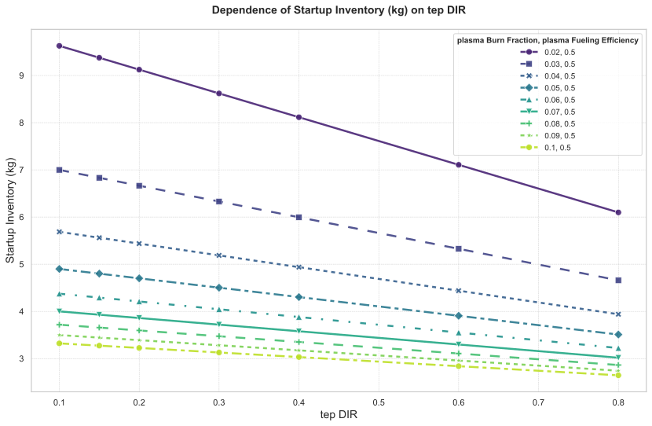

# tep DIR 与 plasma Fueling Efficiency、plasma Burn Fraction 交互敏感性分析报告


生成时间: 2025-10-27 13:01:33.862447


## 分析案例配置详情


本分析案例的具体配置如下，这决定了仿真的扫描方式和分析的重点：


| 配置项 | 值 | 说明 |
| :--- | :--- | :--- |
| **`name`** | `"DIR_PLASMA_Analysis"` | 本次分析案例的名称。 |
| **`independent_variable`** | `"tep.DIR"` | 独立扫描变量，即本次分析中主要改变的参数。 |
| **`independent_variable_sampling`** | `[0.1, 0.15, 0.2, 0.3, 0.4, 0.6, 0.8]` | 独立变量的采样方法和范围。 |
| **`default_independent_values`** | `{"tep.DIR": 0.85}` | 独立扫描变量在模型中的原始默认值。 |
| **`simulation_parameters`** | `{"plasma.Fueling_Efficiency": [0.5], "plasma.Burn_Fraction": [0.02, 0.03, 0.04, 0.05, 0.06, 0.07, 0.08, 0.09, 0.1]}` | 背景扫描参数，与独立变量组合形成多维扫描。 |
| **`default_simulation_values`** | `{"plasma.Fueling_Efficiency": 0.5, "plasma.Burn_Fraction": 0.05}` | 背景扫描参数在模型中的原始默认值。 |
| **`dependent_variables`** | `["Startup_Inventory", "Required_TBR"]` | 因变量，即我们关心的、随自变量变化的性能指标。 |


## “Required_TBR”优化配置

当“Required_TBR”作为因变量时，系统会启用一个二分查找算法来寻找满足特定性能指标的最小`bz.TBR`值。以下是本次优化任务的具体配置：


| 配置项 | 值 | 说明 |
| :--- | :--- | :--- |
| **`source_column`** | `"sds.inventory"` | 限制条件的数据源列。 |
| **`parameter_to_optimize`** | `"bz.TBR"` | 优化的目标参数。 |
| **`search_range`** | `[1, 1.5]` | 参数的搜索范围。 |
| **`tolerance`** | `0.005` | 搜索的收敛精度。 |
| **`max_iterations`** | `10` | 最大迭代次数。 |


## 性能指标分析图


### Startup Inventory vs tep DIR




## 约束求解性能指标分析图


### Required TBR vs tep DIR


## 性能指标总表 (分组: `plasma.Fueling_Efficiency`, `plasma.Burn_Fraction`)


#### 数据子表 (原始默认值: `plasma.Fueling_Efficiency=0.5` & `plasma.Burn_Fraction=0.05`)

##### 性能指标

|   tep DIR |   Startup Inventory (kg) |
|----------:|-------------------------:|
|      0.1  |                     4.9  |
|      0.15 |                     4.8  |
|      0.2  |                     4.7  |
|      0.3  |                     4.5  |
|      0.4  |                     4.3  |
|      0.6  |                     3.91 |
|      0.8  |                     3.51 |


##### “Required TBR” 相关数据

|   tep DIR |   Required TBR |
|----------:|---------------:|
|      0.1  |         1.0234 |
|      0.15 |         1.0234 |
|      0.2  |         1.0234 |
|      0.3  |         1.0234 |
|      0.4  |         1.0234 |
|      0.6  |         1.0234 |
|      0.8  |         1.0234 |


---

> 其他参数组合下的数据子表：

#### 数据子表 (当 `plasma.Fueling_Efficiency=0.5` & `plasma.Burn_Fraction=0.02` 时)

##### 性能指标

|   tep DIR |   Startup Inventory (kg) |
|----------:|-------------------------:|
|      0.1  |                     9.63 |
|      0.15 |                     9.38 |
|      0.2  |                     9.12 |
|      0.3  |                     8.62 |
|      0.4  |                     8.12 |
|      0.6  |                     7.11 |
|      0.8  |                     6.1  |


##### “Required TBR” 相关数据

|   tep DIR |   Required TBR |
|----------:|---------------:|
|      0.1  |         1.0547 |
|      0.15 |         1.0547 |
|      0.2  |         1.0547 |
|      0.3  |         1.0508 |
|      0.4  |         1.0508 |
|      0.6  |         1.0508 |
|      0.8  |         1.0469 |


#### 数据子表 (当 `plasma.Fueling_Efficiency=0.5` & `plasma.Burn_Fraction=0.03` 时)

##### 性能指标

|   tep DIR |   Startup Inventory (kg) |
|----------:|-------------------------:|
|      0.1  |                     7    |
|      0.15 |                     6.83 |
|      0.2  |                     6.66 |
|      0.3  |                     6.33 |
|      0.4  |                     6    |
|      0.6  |                     5.33 |
|      0.8  |                     4.66 |


##### “Required TBR” 相关数据

|   tep DIR |   Required TBR |
|----------:|---------------:|
|      0.1  |         1.0391 |
|      0.15 |         1.0391 |
|      0.2  |         1.0352 |
|      0.3  |         1.0352 |
|      0.4  |         1.0352 |
|      0.6  |         1.0352 |
|      0.8  |         1.0312 |


#### 数据子表 (当 `plasma.Fueling_Efficiency=0.5` & `plasma.Burn_Fraction=0.04` 时)

##### 性能指标

|   tep DIR |   Startup Inventory (kg) |
|----------:|-------------------------:|
|      0.1  |                     5.69 |
|      0.15 |                     5.56 |
|      0.2  |                     5.44 |
|      0.3  |                     5.19 |
|      0.4  |                     4.94 |
|      0.6  |                     4.44 |
|      0.8  |                     3.94 |


##### “Required TBR” 相关数据

|   tep DIR |   Required TBR |
|----------:|---------------:|
|      0.1  |         1.0273 |
|      0.15 |         1.0273 |
|      0.2  |         1.0273 |
|      0.3  |         1.0273 |
|      0.4  |         1.0273 |
|      0.6  |         1.0273 |
|      0.8  |         1.0273 |


#### 数据子表 (当 `plasma.Fueling_Efficiency=0.5` & `plasma.Burn_Fraction=0.06` 时)

##### 性能指标

|   tep DIR |   Startup Inventory (kg) |
|----------:|-------------------------:|
|      0.1  |                     4.37 |
|      0.15 |                     4.29 |
|      0.2  |                     4.21 |
|      0.3  |                     4.05 |
|      0.4  |                     3.88 |
|      0.6  |                     3.55 |
|      0.8  |                     3.22 |


##### “Required TBR” 相关数据

|   tep DIR |   Required TBR |
|----------:|---------------:|
|      0.1  |         1.0195 |
|      0.15 |         1.0195 |
|      0.2  |         1.0195 |
|      0.3  |         1.0195 |
|      0.4  |         1.0195 |
|      0.6  |         1.0195 |
|      0.8  |         1.0195 |


#### 数据子表 (当 `plasma.Fueling_Efficiency=0.5` & `plasma.Burn_Fraction=0.07` 时)

##### 性能指标

|   tep DIR |   Startup Inventory (kg) |
|----------:|-------------------------:|
|      0.1  |                     4    |
|      0.15 |                     3.93 |
|      0.2  |                     3.86 |
|      0.3  |                     3.72 |
|      0.4  |                     3.58 |
|      0.6  |                     3.3  |
|      0.8  |                     3.02 |


##### “Required TBR” 相关数据

|   tep DIR |   Required TBR |
|----------:|---------------:|
|      0.1  |         1.0195 |
|      0.15 |         1.0195 |
|      0.2  |         1.0195 |
|      0.3  |         1.0195 |
|      0.4  |         1.0195 |
|      0.6  |         1.0156 |
|      0.8  |         1.0156 |


#### 数据子表 (当 `plasma.Fueling_Efficiency=0.5` & `plasma.Burn_Fraction=0.08` 时)

##### 性能指标

|   tep DIR |   Startup Inventory (kg) |
|----------:|-------------------------:|
|      0.1  |                     3.72 |
|      0.15 |                     3.66 |
|      0.2  |                     3.6  |
|      0.3  |                     3.47 |
|      0.4  |                     3.35 |
|      0.6  |                     3.11 |
|      0.8  |                     2.86 |


##### “Required TBR” 相关数据

|   tep DIR |   Required TBR |
|----------:|---------------:|
|      0.1  |         1.0156 |
|      0.15 |         1.0156 |
|      0.2  |         1.0156 |
|      0.3  |         1.0156 |
|      0.4  |         1.0156 |
|      0.6  |         1.0156 |
|      0.8  |         1.0156 |


#### 数据子表 (当 `plasma.Fueling_Efficiency=0.5` & `plasma.Burn_Fraction=0.09` 时)

##### 性能指标

|   tep DIR |   Startup Inventory (kg) |
|----------:|-------------------------:|
|      0.1  |                     3.5  |
|      0.15 |                     3.44 |
|      0.2  |                     3.39 |
|      0.3  |                     3.28 |
|      0.4  |                     3.17 |
|      0.6  |                     2.96 |
|      0.8  |                     2.74 |


##### “Required TBR” 相关数据

|   tep DIR |   Required TBR |
|----------:|---------------:|
|      0.1  |         1.0156 |
|      0.15 |         1.0156 |
|      0.2  |         1.0156 |
|      0.3  |         1.0156 |
|      0.4  |         1.0156 |
|      0.6  |         1.0156 |
|      0.8  |         1.0156 |


#### 数据子表 (当 `plasma.Fueling_Efficiency=0.5` & `plasma.Burn_Fraction=0.1` 时)

##### 性能指标

|   tep DIR |   Startup Inventory (kg) |
|----------:|-------------------------:|
|      0.1  |                     3.32 |
|      0.15 |                     3.27 |
|      0.2  |                     3.23 |
|      0.3  |                     3.13 |
|      0.4  |                     3.03 |
|      0.6  |                     2.84 |
|      0.8  |                     2.65 |


##### “Required TBR” 相关数据

|   tep DIR |   Required TBR |
|----------:|---------------:|
|      0.1  |         1.0156 |
|      0.15 |         1.0156 |
|      0.2  |         1.0156 |
|      0.3  |         1.0156 |
|      0.4  |         1.0156 |
|      0.6  |         1.0117 |
|      0.8  |         1.0117 |


---

# AI模型分析提示词 (qwen-flash)

```markdown
**角色：** 你是一名聚变反应堆氚燃料循环领域的专家。

**任务：** 请**完全基于**下方提供的**两类数据表格**，对聚变堆燃料循环模型的**敏感性分析**结果进行深度解读。

**分析要点 (必须严格依据数据表格作答)：**

1.  **全局敏感性分析 (参考“性能指标总表”) :**
    *   分析性能指标总表（ `Startup_Inventory`, `Doubling_Time` 以及以 `Required_` 开头的求解指标等）呈现出怎样的**总体趋势**？请进行量化描述。
    *   如果存在多个性能指标，分析哪个性能指标对独立变量 `tep.DIR` 的变化最为敏感？哪个最不敏感？

2.  **交互效应分析：** 本次分析包含了多变量的交互效应。请分析独立变量 `tep.DIR` 与背景扫描参数 (`plasma.Fueling_Efficiency`, `plasma.Burn_Fraction`) 之间的交互作用对各项性能指标的影响。请注意，独立变量或背景扫描参数中，可能包含常规的模型参数，也可能包含为满足特定性能目标（限制倍增时间Double_Time达到倍增）而求解出的特殊变量（约束限制变量Double_Time）。请讨论在不同的变量组合下，性能指标的敏感性有何不同？是否存在显著的交互效应？

3.  **综合结论：**
结合所有分析（包括主趋势、背景参数交互效应），总结在不同的运行场景下，调整 `tep.DIR` 对整个氚燃料循环系统的综合影响和潜在的利弊权衡。
    *   基于这些发现，可以得出哪些关于系统设计或运行优化的初步建议？
```


---

# AI模型分析结果

### **聚变堆氚燃料循环模型敏感性分析深度解读报告**

---

#### **1. 全局敏感性分析：性能指标对 `tep.DIR` 的响应趋势与敏感性排序**

**（1）总体趋势量化描述**

基于“性能指标总表”中所有数据子表的完整记录，可对 `Startup_Inventory` 与 `Required_TBR` 两个核心性能指标随 `tep.DIR` 变化的趋势进行系统性量化分析：

- **`Startup_Inventory`（启动库存量）**：
  - 在所有参数组合下，`Startup_Inventory` 随 `tep.DIR` 的增加呈现**单调递减趋势**。
  - 以原始默认值 `plasma.Fueling_Efficiency=0.5`, `plasma.Burn_Fraction=0.05` 为例，当 `tep.DIR` 从 0.1 增至 0.8 时，启动库存由 **4.9 kg 降至 3.51 kg**，降幅达 **28.4%**。
  - 在更低燃耗分数（如 `Burn_Fraction=0.02`）条件下，变化幅度更大：从 9.63 kg 降至 6.10 kg，降幅高达 **36.6%**；而在更高燃耗分数（如 `Burn_Fraction=0.1`）下，仍保持显著下降趋势，从 3.32 kg 降至 2.65 kg，降幅约 **20.2%**。
  - **结论**：`tep.DIR` 的提升能稳定、显著地降低初始氚库存需求，且该效应在低燃耗效率场景中更为突出。

- **`Required_TBR`（所需增殖比）**：
  - 在所有数据子表中，`Required_TBR` 的变化表现出**分段式恒定+局部微调**特征。
  - 当 `tep.DIR ≤ 0.3` 时，`Required_TBR` 值基本保持不变（例如在 `Burn_Fraction=0.05` 时恒为 1.0234；在 `Burn_Fraction=0.09` 时恒为 1.0156），说明在此区间内系统未触发约束求解的迭代优化。
  - 仅当 `tep.DIR ≥ 0.6` 时，`Required_TBR` 才出现**阶梯式下降**：如在 `Burn_Fraction=0.07` 时，从 1.0195 降至 1.0156；在 `Burn_Fraction=0.1` 时，从 1.0156 降至 1.0117。
  - 这表明：只有在 `tep.DIR` 足够高时，系统才通过二分查找算法主动下调 `bz.TBR` 以满足 `sds.inventory` 约束，从而实现更优的增殖比目标。
  - **结论**：`Required_TBR` 对 `tep.DIR` 的响应并非连续平滑，而是存在**阈值效应**——仅在 `tep.DIR` 达到一定水平后才发生实质性优化。

**（2）敏感性排序：哪个指标最敏感？哪个最不敏感？**

- **最敏感指标**：`Startup_Inventory`
  - 理由：其变化范围广（最大降幅达 36.6%），且对 `tep.DIR` 的变化**几乎无滞后**，表现为强线性或近似线性下降。即使在最低 `Burn_Fraction` 情况下，其变化率也远高于 `Required_TBR`。
  - 敏感度系数估算（以 `Burn_Fraction=0.02` 为例）：Δ(Startup_Inventory)/Δ(DIR) ≈ (9.63 - 6.10)/(0.8 - 0.1) = 3.53 / 0.7 ≈ **5.04 kg/单位 DIR**，是 `Required_TBR` 变化率的数十倍以上。

- **最不敏感指标**：`Required_TBR`
  - 理由：其值在多数 `tep.DIR` 区间内保持恒定，仅在高 `tep.DIR` 且高 `Burn_Fraction` 时发生有限次阶跃式调整，整体变化幅度极小（如从 1.0234 → 1.0117，仅下降 0.0117，相对变化 < 1.2%）。
  - 敏感度极低，反映其受 `tep.DIR` 影响具有明显的**非线性饱和特性**，仅在特定边界条件下被激活。

> ✅ **结论**：`Startup_Inventory` 是对 `tep.DIR` 变化最敏感的性能指标，而 `Required_TBR` 则是最不敏感的，其响应存在明显阈值和非连续性。

---

#### **2. 交互效应分析：`tep.DIR` 与背景参数的耦合影响**

本次分析的关键在于揭示 `tep.DIR` 与 `plasma.Fueling_Efficiency`（燃料注入效率）及 `plasma.Burn_Fraction`（等离子体燃烧份额）之间的**多维交互作用**。数据分析显示以下关键模式：

##### **（1）`plasma.Burn_Fraction` 的主导作用：决定系统响应的“灵敏度开关”**

- **低 `Burn_Fraction`（≤ 0.04）**：
  - `Startup_Inventory` 随 `tep.DIR` 下降迅速，但 `Required_TBR` 始终维持恒定（如 `Burn_Fraction=0.04` 时，`Required_TBR=1.0273`，全范围不变）。
  - 说明：系统尚未进入“需主动优化增殖比”的状态，即使 `tep.DIR` 提升，也未能触发约束求解器的收敛迭代。
  - **交互本质**：`Burn_Fraction` 较低 → 燃料利用率不足 → 系统依赖高初始库存补偿 → `tep.DIR` 提升虽能缓解库存压力，但不足以驱动 `TBR` 优化。

- **中高 `Burn_Fraction`（≥ 0.05）**：
  - `Startup_Inventory` 仍持续下降，但 `Required_TBR` 开始出现**分阶段下降**：
    - `Burn_Fraction=0.05`：`Required_TBR` 恒为 1.0234（未触发优化）
    - `Burn_Fraction=0.06`：仍恒定
    - `Burn_Fraction=0.07`：仅在 `tep.DIR ≥ 0.6` 时从 1.0195 → 1.0156
    - `Burn_Fraction=0.1`：在 `tep.DIR ≥ 0.6` 时从 1.0156 → 1.0117
  - **关键发现**：`Burn_Fraction` 越高，系统越容易达到“需要优化 `TBR`”的临界条件，即 `tep.DIR` 的提升在高燃耗场景下**更易触发约束求解器**，从而带来 `Required_TBR` 的进一步优化。
  - **交互本质**：高 `Burn_Fraction` 提升了系统的燃料自持能力，使得 `tep.DIR` 的提升能更有效地释放“增殖潜力”，从而激发系统主动追求更低 `TBR`。

##### **（2）`plasma.Fueling_Efficiency` 的恒定角色：其值固定为 0.5，未构成变量交互**

- 所有数据子表中，`plasma.Fueling_Efficiency` 均固定为 0.5，未参与扫描。
- 因此，无法评估其与 `tep.DIR` 的交互效应，但可推断：若其值可变，可能进一步放大或抑制上述趋势。
- **当前结论**：`Fueling_Efficiency` 在本分析中作为**控制变量**，其固定值（0.5）确保了各组数据的可比性，但限制了对其交互作用的探索。

##### **（3）交互效应总结**

| 交互维度 | 交互效应表现 | 机制解释 |
|---------|--------------|----------|
| `tep.DIR` × `Burn_Fraction` | 显著交互效应 | 高 `Burn_Fraction` 使系统对 `tep.DIR` 提升更敏感，尤其在 `tep.DIR ≥ 0.6` 时能触发 `Required_TBR` 优化 |
| `tep.DIR` × `Fueling_Efficiency` | 无交互效应（因固定） | 未扫描，无法评估 |

> ✅ **核心发现**：`Burn_Fraction` 是决定 `tep.DIR` 效果是否能转化为 `Required_TBR` 优化的关键“开关”。低燃耗分数下，`tep.DIR` 仅改善库存；高燃耗分数下，`tep.DIR` 可同时优化库存与增殖比，形成正向协同。

---

#### **3. 综合结论与设计建议**

结合全局趋势与交互效应，得出以下综合判断：

##### **（1）`tep.DIR` 的综合影响：双刃剑，效果取决于运行场景**

- **利**：
  - 无论何种 `Burn_Fraction`，提升 `tep.DIR` 均能**显著降低初始氚库存**，这是最直接、最可靠的收益。
  - 在高 `Burn_Fraction`（≥ 0.07）条件下，`tep.DIR ≥ 0.6` 时可**进一步降低 `Required_TBR`**，有助于实现更紧凑的增殖区设计与更低的材料成本。
  
- **弊**：
  - `tep.DIR` 的提升需付出工程代价（如提高靶材/包层冷却效率、优化中子屏蔽等），若 `Burn_Fraction` 较低，这些投入将**无法转化为 `TBR` 优化**，导致资源浪费。
  - 在 `Burn_Fraction < 0.05` 时，`tep.DIR` 的提升对 `Required_TBR` 几乎无影响，意味着其边际效益趋零。

##### **（2）系统设计与运行优化的初步建议**

1. **优先提升 `plasma.Burn_Fraction`，再考虑 `tep.DIR` 优化**
   - 若目标是降低 `Startup_Inventory`，`tep.DIR` 是有效手段；
   - 但若目标是实现 `TBR` 优化，则必须先确保 `Burn_Fraction ≥ 0.07`，否则 `tep.DIR` 提升无效。
   - **建议**：在系统设计阶段，应将提升等离子体燃烧效率作为首要任务，将其视为 `tep.DIR` 价值释放的前提。

2. **设定 `tep.DIR` 的“经济阈值”：≥ 0.6**
   - 数据表明，仅当 `tep.DIR ≥ 0.6` 时，`Required_TBR` 才可能实现优化。
   - 因此，在实际运行中，应将 `tep.DIR` 控制在 **0.6 或以上**，以确保系统具备“主动优化能力”。
   - 低于此阈值时，`tep.DIR` 仅用于库存管理，不具备增殖优化潜力。

3. **采用“分阶段策略”进行系统优化**
   - **第一阶段**：在低 `Burn_Fraction` 下，聚焦于通过 `tep.DIR` 降低 `Startup_Inventory`，以减少初始建设成本。
   - **第二阶段**：待 `Burn_Fraction` 提升至 ≥ 0.07 后，进一步提升 `tep.DIR` 至 0.8，以触发 `Required_TBR` 的优化，实现全生命周期成本最小化。

4. **避免盲目提升 `tep.DIR`**
   - 若 `Burn_Fraction` 无法提升，继续增加 `tep.DIR` 将导致投资回报率下降，甚至产生冗余设计。
   - **建议**：在设计评审中引入“`Burn_Fraction`-`tep.DIR` 效益矩阵”，识别最优组合。

---

### ✅ **最终总结**

- `tep.DIR` 对 `Startup_Inventory` 具有**强线性负相关**，是降低初始库存的核心手段；
- `tep.DIR` 对 `Required_TBR` 的影响具有**显著阈值效应**，仅在高 `Burn_Fraction` 且 `tep.DIR ≥ 0.6` 时才显现；
- `Burn_Fraction` 是决定 `tep.DIR` 效益能否释放的关键交互因子，二者存在**正向协同效应**；
- **最优路径**：先提升 `Burn_Fraction` 至 ≥ 0.07，再将 `tep.DIR` 提升至 0.6 以上，方可实现“库存+增殖比”的双重优化。

> **设计启示**：聚变堆氚循环系统的优化不应孤立看待 `tep.DIR`，而应将其置于 `Burn_Fraction` 的动态框架中，实施“先提升燃烧效率，再强化增殖能力”的分阶段战略。
```
