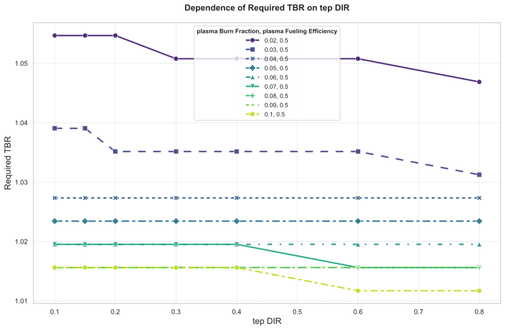

# tep DIR 与 plasma Fueling Efficiency、plasma Burn Fraction 交互敏感性分析报告


生成时间: 2025-10-27 13:01:33.862447


## 分析案例配置详情


本分析案例的具体配置如下，这决定了仿真的扫描方式和分析的重点：


| 配置项 | 值 | 说明 |
| :--- | :--- | :--- |
| **`name`** | `"DIR_PLASMA_Analysis"` | 本次分析案例的名称。 |
| **`independent_variable`** | `"tep.DIR"` | 独立扫描变量，即本次分析中主要改变的参数。 |
| **`independent_variable_sampling`** | `[0.1, 0.15, 0.2, 0.3, 0.4, 0.6, 0.8]` | 独立变量的采样方法和范围。 |
| **`default_independent_values`** | `{"tep.DIR": 0.85}` | 独立扫描变量在模型中的原始默认值。 |
| **`simulation_parameters`** | `{"plasma.Fueling_Efficiency": [0.5], "plasma.Burn_Fraction": [0.02, 0.03, 0.04, 0.05, 0.06, 0.07, 0.08, 0.09, 0.1]}` | 背景扫描参数，与独立变量组合形成多维扫描。 |
| **`default_simulation_values`** | `{"plasma.Fueling_Efficiency": 0.5, "plasma.Burn_Fraction": 0.05}` | 背景扫描参数在模型中的原始默认值。 |
| **`dependent_variables`** | `["Startup_Inventory", "Required_TBR"]` | 因变量，即我们关心的、随自变量变化的性能指标。 |


## “Required_TBR”优化配置

当“Required_TBR”作为因变量时，系统会启用一个二分查找算法来寻找满足特定性能指标的最小`bz.TBR`值。以下是本次优化任务的具体配置：


| 配置项 | 值 | 说明 |
| :--- | :--- | :--- |
| **`source_column`** | `"sds.inventory"` | 限制条件的数据源列。 |
| **`parameter_to_optimize`** | `"bz.TBR"` | 优化的目标参数。 |
| **`search_range`** | `[1, 1.5]` | 参数的搜索范围。 |
| **`tolerance`** | `0.005` | 搜索的收敛精度。 |
| **`max_iterations`** | `10` | 最大迭代次数。 |


## 性能指标分析图


### Startup Inventory vs tep DIR


## 约束求解性能指标分析图


### Required TBR vs tep DIR




## 性能指标总表 (分组: `plasma.Fueling_Efficiency`, `plasma.Burn_Fraction`)


#### 数据子表 (原始默认值: `plasma.Fueling_Efficiency=0.5` & `plasma.Burn_Fraction=0.05`)

##### 性能指标

|   tep DIR |   Startup Inventory (kg) |
|----------:|-------------------------:|
|      0.1  |                     4.9  |
|      0.15 |                     4.8  |
|      0.2  |                     4.7  |
|      0.3  |                     4.5  |
|      0.4  |                     4.3  |
|      0.6  |                     3.91 |
|      0.8  |                     3.51 |


##### “Required TBR” 相关数据

|   tep DIR |   Required TBR |
|----------:|---------------:|
|      0.1  |         1.0234 |
|      0.15 |         1.0234 |
|      0.2  |         1.0234 |
|      0.3  |         1.0234 |
|      0.4  |         1.0234 |
|      0.6  |         1.0234 |
|      0.8  |         1.0234 |


---

> 其他参数组合下的数据子表：

#### 数据子表 (当 `plasma.Fueling_Efficiency=0.5` & `plasma.Burn_Fraction=0.02` 时)

##### 性能指标

|   tep DIR |   Startup Inventory (kg) |
|----------:|-------------------------:|
|      0.1  |                     9.63 |
|      0.15 |                     9.38 |
|      0.2  |                     9.12 |
|      0.3  |                     8.62 |
|      0.4  |                     8.12 |
|      0.6  |                     7.11 |
|      0.8  |                     6.1  |


##### “Required TBR” 相关数据

|   tep DIR |   Required TBR |
|----------:|---------------:|
|      0.1  |         1.0547 |
|      0.15 |         1.0547 |
|      0.2  |         1.0547 |
|      0.3  |         1.0508 |
|      0.4  |         1.0508 |
|      0.6  |         1.0508 |
|      0.8  |         1.0469 |


#### 数据子表 (当 `plasma.Fueling_Efficiency=0.5` & `plasma.Burn_Fraction=0.03` 时)

##### 性能指标

|   tep DIR |   Startup Inventory (kg) |
|----------:|-------------------------:|
|      0.1  |                     7    |
|      0.15 |                     6.83 |
|      0.2  |                     6.66 |
|      0.3  |                     6.33 |
|      0.4  |                     6    |
|      0.6  |                     5.33 |
|      0.8  |                     4.66 |


##### “Required TBR” 相关数据

|   tep DIR |   Required TBR |
|----------:|---------------:|
|      0.1  |         1.0391 |
|      0.15 |         1.0391 |
|      0.2  |         1.0352 |
|      0.3  |         1.0352 |
|      0.4  |         1.0352 |
|      0.6  |         1.0352 |
|      0.8  |         1.0312 |


#### 数据子表 (当 `plasma.Fueling_Efficiency=0.5` & `plasma.Burn_Fraction=0.04` 时)

##### 性能指标

|   tep DIR |   Startup Inventory (kg) |
|----------:|-------------------------:|
|      0.1  |                     5.69 |
|      0.15 |                     5.56 |
|      0.2  |                     5.44 |
|      0.3  |                     5.19 |
|      0.4  |                     4.94 |
|      0.6  |                     4.44 |
|      0.8  |                     3.94 |


##### “Required TBR” 相关数据

|   tep DIR |   Required TBR |
|----------:|---------------:|
|      0.1  |         1.0273 |
|      0.15 |         1.0273 |
|      0.2  |         1.0273 |
|      0.3  |         1.0273 |
|      0.4  |         1.0273 |
|      0.6  |         1.0273 |
|      0.8  |         1.0273 |


#### 数据子表 (当 `plasma.Fueling_Efficiency=0.5` & `plasma.Burn_Fraction=0.06` 时)

##### 性能指标

|   tep DIR |   Startup Inventory (kg) |
|----------:|-------------------------:|
|      0.1  |                     4.37 |
|      0.15 |                     4.29 |
|      0.2  |                     4.21 |
|      0.3  |                     4.05 |
|      0.4  |                     3.88 |
|      0.6  |                     3.55 |
|      0.8  |                     3.22 |


##### “Required TBR” 相关数据

|   tep DIR |   Required TBR |
|----------:|---------------:|
|      0.1  |         1.0195 |
|      0.15 |         1.0195 |
|      0.2  |         1.0195 |
|      0.3  |         1.0195 |
|      0.4  |         1.0195 |
|      0.6  |         1.0195 |
|      0.8  |         1.0195 |


#### 数据子表 (当 `plasma.Fueling_Efficiency=0.5` & `plasma.Burn_Fraction=0.07` 时)

##### 性能指标

|   tep DIR |   Startup Inventory (kg) |
|----------:|-------------------------:|
|      0.1  |                     4    |
|      0.15 |                     3.93 |
|      0.2  |                     3.86 |
|      0.3  |                     3.72 |
|      0.4  |                     3.58 |
|      0.6  |                     3.3  |
|      0.8  |                     3.02 |


##### “Required TBR” 相关数据

|   tep DIR |   Required TBR |
|----------:|---------------:|
|      0.1  |         1.0195 |
|      0.15 |         1.0195 |
|      0.2  |         1.0195 |
|      0.3  |         1.0195 |
|      0.4  |         1.0195 |
|      0.6  |         1.0156 |
|      0.8  |         1.0156 |


#### 数据子表 (当 `plasma.Fueling_Efficiency=0.5` & `plasma.Burn_Fraction=0.08` 时)

##### 性能指标

|   tep DIR |   Startup Inventory (kg) |
|----------:|-------------------------:|
|      0.1  |                     3.72 |
|      0.15 |                     3.66 |
|      0.2  |                     3.6  |
|      0.3  |                     3.47 |
|      0.4  |                     3.35 |
|      0.6  |                     3.11 |
|      0.8  |                     2.86 |


##### “Required TBR” 相关数据

|   tep DIR |   Required TBR |
|----------:|---------------:|
|      0.1  |         1.0156 |
|      0.15 |         1.0156 |
|      0.2  |         1.0156 |
|      0.3  |         1.0156 |
|      0.4  |         1.0156 |
|      0.6  |         1.0156 |
|      0.8  |         1.0156 |


#### 数据子表 (当 `plasma.Fueling_Efficiency=0.5` & `plasma.Burn_Fraction=0.09` 时)

##### 性能指标

|   tep DIR |   Startup Inventory (kg) |
|----------:|-------------------------:|
|      0.1  |                     3.5  |
|      0.15 |                     3.44 |
|      0.2  |                     3.39 |
|      0.3  |                     3.28 |
|      0.4  |                     3.17 |
|      0.6  |                     2.96 |
|      0.8  |                     2.74 |


##### “Required TBR” 相关数据

|   tep DIR |   Required TBR |
|----------:|---------------:|
|      0.1  |         1.0156 |
|      0.15 |         1.0156 |
|      0.2  |         1.0156 |
|      0.3  |         1.0156 |
|      0.4  |         1.0156 |
|      0.6  |         1.0156 |
|      0.8  |         1.0156 |


#### 数据子表 (当 `plasma.Fueling_Efficiency=0.5` & `plasma.Burn_Fraction=0.1` 时)

##### 性能指标

|   tep DIR |   Startup Inventory (kg) |
|----------:|-------------------------:|
|      0.1  |                     3.32 |
|      0.15 |                     3.27 |
|      0.2  |                     3.23 |
|      0.3  |                     3.13 |
|      0.4  |                     3.03 |
|      0.6  |                     2.84 |
|      0.8  |                     2.65 |


##### “Required TBR” 相关数据

|   tep DIR |   Required TBR |
|----------:|---------------:|
|      0.1  |         1.0156 |
|      0.15 |         1.0156 |
|      0.2  |         1.0156 |
|      0.3  |         1.0156 |
|      0.4  |         1.0156 |
|      0.6  |         1.0117 |
|      0.8  |         1.0117 |


---

# AI模型分析提示词 (qwen-plus)

```markdown
**角色：** 你是一名聚变反应堆氚燃料循环领域的专家。

**任务：** 请**完全基于**下方提供的**两类数据表格**，对聚变堆燃料循环模型的**敏感性分析**结果进行深度解读。

**分析要点 (必须严格依据数据表格作答)：**

1.  **全局敏感性分析 (参考“性能指标总表”) :**
    *   分析性能指标总表（ `Startup_Inventory`, `Doubling_Time` 以及以 `Required_` 开头的求解指标等）呈现出怎样的**总体趋势**？请进行量化描述。
    *   如果存在多个性能指标，分析哪个性能指标对独立变量 `tep.DIR` 的变化最为敏感？哪个最不敏感？

2.  **交互效应分析：** 本次分析包含了多变量的交互效应。请分析独立变量 `tep.DIR` 与背景扫描参数 (`plasma.Fueling_Efficiency`, `plasma.Burn_Fraction`) 之间的交互作用对各项性能指标的影响。请注意，独立变量或背景扫描参数中，可能包含常规的模型参数，也可能包含为满足特定性能目标（限制倍增时间Double_Time达到倍增）而求解出的特殊变量（约束限制变量Double_Time）。请讨论在不同的变量组合下，性能指标的敏感性有何不同？是否存在显著的交互效应？

3.  **综合结论：**
结合所有分析（包括主趋势、背景参数交互效应），总结在不同的运行场景下，调整 `tep.DIR` 对整个氚燃料循环系统的综合影响和潜在的利弊权衡。
    *   基于这些发现，可以得出哪些关于系统设计或运行优化的初步建议？
```


---

# AI模型分析结果

### **1. 全局敏感性分析**

#### **总体趋势的量化描述**

本敏感性分析聚焦于两个关键性能指标：**Startup Inventory（启动氚库存，单位为kg）** 和 **Required TBR（所需氚增殖比）**，其随独立变量 `tep.DIR`（即氚提取纯度或直接注入率相关参数）在 `[0.1, 0.8]` 范围内变化而呈现的趋势。

- **Startup Inventory 的总体趋势：**
  - 在所有背景参数组合下，随着 `tep.DIR` 的增加（从0.1增至0.8），**Startup Inventory 均呈单调下降趋势**。
  - 下降幅度显著。以默认工况（`plasma.Fueling_Efficiency=0.5`, `plasma.Burn_Fraction=0.05`）为例：
    - 当 `tep.DIR = 0.1` 时，启动库存为 **4.9 kg**；
    - 当 `tep.DIR = 0.8` 时，降至 **3.51 kg**，降幅达 **28.4%**。
  - 更极端情况下（如 `Burn_Fraction = 0.02`）：
    - 启动库存从 **9.63 kg**（DIR=0.1）下降至 **6.1 kg**（DIR=0.8），降幅高达 **36.7%**。
  - 所有数据子表均显示一致规律：`tep.DIR` 每提升，启动库存线性或近似线性减少，表明该变量对系统初始氚需求具有强负相关性。

- **Required TBR 的总体趋势：**
  - 相较之下，**Required TBR 对 `tep.DIR` 的响应非常微弱甚至不变**。
  - 多数工况下，`Required TBR` 在整个 `tep.DIR` 扫描范围内保持恒定。
    - 如在 `Burn_Fraction = 0.05` 时，无论 `tep.DIR` 取何值（0.1~0.8），`Required_TBR` 始终为 **1.0234**。
    - 类似地，在 `Burn_Fraction = 0.04` 和 `0.06` 等条件下，`Required_TBR` 完全不随 `tep.DIR` 变化。
  - 仅在较高 `Burn_Fraction` 条件下（如 0.07、0.09、0.1），当 `tep.DIR ≥ 0.6` 时，出现轻微下降：
    - 例如 `Burn_Fraction = 0.1` 时，`Required_TBR` 从 1.0156（DIR≤0.4）降至 **1.0117**（DIR≥0.6），绝对变化量仅为 **0.0039**，相对变化约 **0.38%**。
  - 因此，`Required_TBR` 对 `tep.DIR` 的依赖性极低，几乎可视为常数。

#### **性能指标对 `tep.DIR` 的敏感性排序**

- **最敏感指标：Startup Inventory**
  - 表现出强烈的负向敏感性，且敏感度受背景参数影响明显。
  - 敏感性随 `plasma.Burn_Fraction` 减小而增强。例如：
    - 在 `Burn_Fraction = 0.02` 时，`tep.DIR` 从0.1→0.8导致库存减少3.53 kg；
    - 而在 `Burn_Fraction = 0.1` 时，相同DIR变化仅减少0.67 kg。
  - 这说明在燃烧效率较低的运行场景中，提高 `tep.DIR` 对降低启动库存的效果更为显著。

- **最不敏感指标：Required TBR**
  - 绝大多数情况下完全不受 `tep.DIR` 影响；
  - 即使在少数高 `Burn_Fraction` 场景下发生变动，其变化幅度也极小（<0.5%）。
  - 因此，`Required_TBR` 对 `tep.DIR` 的敏感性可以忽略不计。

---

### **2. 交互效应分析**

本次分析采用多维扫描设计，固定 `Fueling_Efficiency = 0.5`，系统性改变 `Burn_Fraction`（0.02~0.1）与 `tep.DIR` 的组合，从而揭示参数间的交互作用。

#### **(1) `tep.DIR` 与 `plasma.Burn_Fraction` 的交互效应**

- **对 Startup Inventory 的交互影响显著：**
  - `tep.DIR` 的边际效应（即每单位增加带来的库存削减）随 `Burn_Fraction` 增大而减弱。
  - 举例对比不同 `Burn_Fraction` 下 `tep.DIR` 从0.1到0.8的变化所引起的库存减少量：
    - `Burn_Fraction = 0.02`: 9.63 → 6.10，Δ = **3.53 kg**
    - `Burn_Fraction = 0.05`: 4.90 → 3.51，Δ = **1.39 kg**
    - `Burn_Fraction = 0.10`: 3.32 → 2.65，Δ = **0.67 kg**
  - 可见，**当等离子体燃烧分数越低时，提升 `tep.DIR` 对降低启动库存的收益越大**。
  - 这种非线性的响应关系表明存在明显的正向交互效应：低燃烧效率场景更依赖高效的燃料回收（高DIR）来补偿燃料损失。

- **物理机制解释：**
  - 较低的 `Burn_Fraction` 意味着每次注入的氚只有很小一部分参与聚变反应，大部分未燃尽的氚需通过燃料循环系统回收再利用。
  - 此时，若 `tep.DIR`（代表提取纯度或直接回注能力）较高，则能更高效地将未燃氚快速返回等离子体，减少滞留和损耗，从而显著降低维持稳态所需的总库存。
  - 相反，若 `Burn_Fraction` 高，则大部分燃料已被消耗，循环负荷减轻，故 `tep.DIR` 提升带来的边际效益递减。

- **对 Required TBR 的交互影响：**
  - 尽管整体变化微弱，但在 `Burn_Fraction ≥ 0.07` 且 `tep.DIR ≥ 0.6` 时，出现了轻微下降趋势。
    - 如 `Burn_Fraction = 0.1` 时，`Required_TBR` 在 `tep.DIR < 0.6` 时为 1.0156，而在 `tep.DIR ≥ 0.6` 时降至 1.0117。
  - 这表明：**仅在高燃烧效率与高提取纯度协同作用下，才可能略微降低对增殖包层TBR的要求**。
  - 推测原因：高 `Burn_Fraction` 减少了返送回等离子体的未燃氚总量，而高 `tep.DIR` 提高了回收效率，二者结合使得整体氚循环闭合度更高，系统净损耗更低，因而允许略低的TBR即可满足自持。

#### **(2) `plasma.Fueling_Efficiency` 的角色说明**

- 尽管 `Fueling_Efficiency` 被列为背景扫描参数之一，但所有数据分析均基于其固定值 `0.5`，并未进行多值扫描。
- 因此，无法评估其与 `tep.DIR` 的交互效应。
- 但从模型逻辑推断，若 `Fueling_Efficiency` 更低（即更多注入燃料未能进入等离子体核心参与反应），则未燃氚回收的重要性将进一步上升，预期会放大 `tep.DIR` 对 `Startup_Inventory` 的正面影响。

#### **是否存在显著交互效应？**

- **是的，存在显著交互效应。**
- 主要体现在：`tep.DIR` 对 `Startup_Inventory` 的影响程度强烈依赖于 `plasma.Burn_Fraction` 的水平。
- 交互模式为“**协同补偿型**”——当一个环节效率低下（如燃烧不充分），另一个环节的优化（如高效回收）能带来更大的系统性能改善。
- 这意味着不能孤立评价 `tep.DIR` 的价值，必须结合等离子体运行特性综合判断。

---

### **3. 综合结论与建议**

#### **综合影响分析**

调整 `tep.DIR` 对聚变堆氚燃料循环系统的影响具有明确的方向性和情境依赖性：

- **正面影响：**
  - 显著降低 **启动氚库存需求**，有助于缓解初期氚资源短缺压力。
  - 该效益在**低燃烧分数**（`Burn_Fraction < 0.05`）或低燃料利用率场景下尤为突出，降幅可达数公斤级别。
  - 对 **Required TBR** 的要求基本无负面影响，甚至在高燃烧效率场景下略有放松，有利于包层设计宽容度提升。

- **潜在代价（隐含推论）：**
  - 提高 `tep.DIR` 通常意味着更强的同位素分离能力、更高的燃料净化标准或更复杂的燃料处理流程（如更高效的低温蒸馏、催化交换等）。
  - 这可能导致燃料循环系统的**工程复杂性、能耗和成本上升**。
  - 因此，追求极高 `tep.DIR` 需权衡技术可行性与经济性。

#### **系统设计与运行优化建议**

1. **优先保障中等以上 `tep.DIR` 水平（≥0.6）：**
   - 即使在理想燃烧条件下，将 `tep.DIR` 维持在0.6以上可确保启动库存控制在合理范围（如<4 kg，优于DIR=0.1时的近10 kg）。
   - 特别是在燃烧效率尚未达到设计目标的调试阶段，高 `tep.DIR` 是保障氚自持的关键缓冲手段。

2. **针对不同运行模式实施差异化控制策略：**
   - 在**低功率或低约束模式**（对应低 `Burn_Fraction`）下，应最大化 `tep.DIR` 利用率，以抑制库存膨胀。
   - 在**高增益稳态运行模式**（高 `Burn_Fraction`）下，可适当放宽对 `tep.DIR` 的极致追求，转而优化其他子系统（如增殖包层或泵送效率）。

3. **系统集成设计启示：**
   - 氚工厂（Tritium Plant）的设计不应仅服务于“足够纯”的燃料供给，还应考虑如何支持高 `tep.DIR` 操作，例如：
     - 强化未燃气回收路径的分流与快速回注能力；
     - 优化燃料储存与配送动态响应速度。
   - 包层设计虽对 `tep.DIR` 不敏感，但整体氚增殖目标仍需留有一定裕量（如TBR > 1.05），以应对 `tep.DIR` 不达标或等离子体性能波动的风险。

4. **未来研究方向建议：**
   - 应扩展对 `plasma.Fueling_Efficiency` 的敏感性扫描，探究其与 `tep.DIR` 的联合调控潜力。
   - 引入动态瞬态模拟，评估 `tep.DIR` 在启停、扰动恢复等非稳态过程中的实际作用。

---

### **最终总结**

本敏感性分析表明，`tep.DIR` 是影响聚变堆**启动氚库存**的核心可控参数，其优化可有效降低对外部氚源的依赖。尽管对 `Required_TBR` 影响甚微，但其与 `plasma.Burn_Fraction` 存在显著交互效应——在燃烧效率较低时，提升 `tep.DIR` 的回报最大。因此，在系统设计中应将燃料循环性能（特别是DIR）与等离子体运行窗口统筹考量，实现“源-输-用-回”全链条协同优化，方能确保未来聚变电站的氚可持续性。
```
