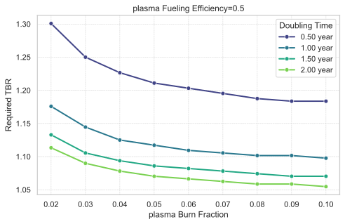

# 等离子体燃烧份额与燃料注入效率、氚增殖比约束的交互敏感性分析

## 摘要

本研究针对聚变反应堆氚燃料循环系统中关键参数——**等离子体燃烧份额（Tritium Burn Fraction）**，开展了一项关于其与背景参数（固定燃料注入效率及不同倍增时间约束）之间交互效应的敏感性分析。研究目标在于量化评估 `plasma.Burn_Fraction` 在范围 [0.02, 0.1] 内变化时，对满足特定 **(库存)倍增时间 (Doubling Time)** 目标所必需的最小 **氚增殖比 (Tritium Breeding Ratio, TBR)** 的影响。通过二分搜索算法求解各工况下的 `Required_TBR` 值，并系统分析其响应趋势与交互机制。

结果表明：`plasma.Burn_Fraction` 的提升显著降低所需的最小 TBR，且该主效应呈现强非线性特征——在低燃烧份额区间改善效果最为明显，随后趋于饱和。进一步分析揭示了显著的交互效应：在更严格的短倍增时间约束下（如 ≤1 年），提高燃烧份额带来的 TBR 减幅更大，表现出正向协同作用；而当燃烧份额超过约 0.08 后，不同运行策略间的性能差异被有效收敛，系统鲁棒性增强。综合结论指出，将 `plasma.Burn_Fraction` 优化至 0.06–0.08 区间可在工程可行性与性能收益间取得最佳平衡，是缓解包层设计压力、加速实现氚自持的关键路径。

---

## 引言

在磁约束聚变能发展进程中，实现并维持**氚自持 (Tritium Self-Sufficiency)** 是商业化部署的核心前提。由于自然界中氚储量极低且半衰期短（12.3年），未来聚变电站必须依赖自身包层通过中子-锂反应实现氚的净增殖。然而，整个燃料循环过程中的物理衰变、工艺损失和系统滞留导致大量氚无法即时回用，因此需要一个足够高的**氚增殖比 (TBR)** 来补偿这些损耗，并支持新反应堆的启动（即“氚点火”问题）。

在此背景下，除提升包层设计性能外，优化前端等离子体运行参数亦成为改善整体氚平衡的重要手段。其中，**等离子体燃烧份额 (plasma.Burn_Fraction)** 定义为注入等离子体的氚中实际参与聚变反应的比例，直接决定了单位时间内氚的有效消耗率与灰积累速率。理论上，更高的燃烧份额意味着更少的未燃燃料需经历复杂的回收流程，从而减少循环延迟与处理损失，间接降低对高TBR的需求。

本研究旨在系统评估 `plasma.Burn_Fraction` 对满足不同 **(库存)倍增时间 (Doubling_Time)** 目标所需的最小 TBR（记为 `Required_TBR`）的影响，并探究其与背景运行条件之间的**交互敏感性**。具体而言：

- **独立变量采样 (Independent Variable Sampling):**  
  `plasma.Burn_Fraction` 扫描范围为 `[0.02, 0.03, 0.04, 0.05, 0.06, 0.07, 0.08, 0.09, 0.1]`。

- **背景扫描参数 (Simulation Parameters):**  
  - `plasma.Fueling_Efficiency`: 固定为 0.5；
  - `Required_TBR` 约束配置：以 `(库存)倍增时间` 作为性能指标，其最大允许值设定为四个水平 —— 4380小时（0.5年）、8760小时（1.0年）、13140小时（1.5年）和17530小时（2.0年）。

- **因变量 (Dependent Variables):**  
  `Required_TBR` —— 即在给定 `plasma.Burn_Fraction` 和 `plasma.Fueling_Efficiency` 条件下，为满足指定倍增时间目标所需达到的最小氚增殖比，由模型内部优化算法自动求解。

通过此项多维敏感性分析，期望为聚变堆运行策略制定与系统集成设计提供定量依据。

---

## 方法

本研究所采用的方法基于一个经过验证的动态氚燃料循环仿真模型，该模型涵盖从燃料注入、等离子体燃烧、排气处理、同位素分离到增殖区提取与冷却剂净化等全链条过程。模型以离散事件或连续微分方程形式模拟各子系统的质量守恒与时间延迟特性。

敏感性分析框架如下：

1. **独立变量控制：** 将 `plasma.Burn_Fraction` 作为主控变量，在预设范围内进行离散采样。
2. **背景参数设定：** 固定 `plasma.Fueling_Efficiency = 0.5`，同时设定四组不同的 `(库存)倍增时间` 上限目标，构成复合背景场景。
3. **因变量求解机制：** 对每一组 `(Burn_Fraction, Doubling_Time_constraint)` 组合，启用二分查找算法对 `bz.TBR` 参数进行迭代优化。搜索范围设定为 [1.0, 1.5]，收敛容差为 0.005，最大迭代次数为 10 次。目标是找到满足以下条件的最小 `bz.TBR` 值：
   $$
   \text{Simulated } \textit{Doubling\_Time} \leq \textit{metric\_max\_value}
   $$
   其中，`Doubling_Time` 由模型根据氚库存动态曲线计算得出，定义为累计氚产量足以支持新建一座相同反应堆启动所需库存的时间。
4. **数据输出与后处理：** 记录每种组合下的收敛 `Required_TBR` 值，并绘制趋势图与生成结构化表格用于后续分析。

所有仿真均假设其他参数保持基准值不变，确保仅考察目标变量的边际效应。

---

## 结果与讨论

### 主效应分析：等离子体燃烧份额对所需氚增殖比的影响

图1展示了在不同 `(库存)倍增时间` 约束条件下，`Required_TBR` 随 `plasma.Burn_Fraction` 变化的趋势。可以清晰观察到一致的主效应模式：随着 `plasma.Burn_Fraction` 的增加，满足相同倍增时间目标所需的最小 TBR 显著下降，表明更高的燃烧效率可有效减轻包层的增殖负担。

*图1：在固定 `plasma.Fueling_Efficiency = 0.5` 条件下，不同倍增时间约束（0.5–2.0年）对应的 `Required_TBR` 随 `plasma.Burn_Fraction` 的变化曲线。*

具体数值关系见表1。例如，在最严苛的 0.5 年倍增时间约束下，当 `plasma.Burn_Fraction` 从 0.02 提升至 0.1 时，`Required_TBR` 从 1.30078 降至 1.18359，绝对降幅达 0.117，相对降幅约为 9.0%。而在较宽松的 2.0 年约束下，同一变化引起的 `Required_TBR` 从 1.11328 降至 1.05469，降幅约 5.3%。

| plasma.Burn_Fraction | Constraint Doubling_Time | Required_TBR |
|---------------------:|:-------------------------|-------------:|
|                  0.02 | 0.50 year                |      1.30078 |
|                  0.03 | 0.50 year                |      1.25000 |
|                  0.04 | 0.50 year                |      1.22656 |
|                  0.05 | 0.50 year                |      1.21094 |
|                  0.06 | 0.50 year                |      1.20312 |
|                  0.07 | 0.50 year                |      1.19531 |
|                  0.08 | 0.50 year                |      1.18750 |
|                  0.09 | 0.50 year                |      1.18359 |
|                  0.10 | 0.50 year                |      1.18359 |
|                  0.02 | 1.00 year                |      1.17578 |
|                  0.03 | 1.00 year                |      1.14453 |
|                  0.04 | 1.00 year                |      1.12500 |
|                  0.05 | 1.00 year                |      1.11719 |
|                  0.06 | 1.00 year                |      1.10938 |
|                  0.07 | 1.00 year                |      1.10547 |
|                  0.08 | 1.00 year                |      1.10156 |
|                  0.09 | 1.00 year                |      1.10156 |
|                  0.10 | 1.00 year                |      1.09766 |
|                  0.02 | 1.50 year                |      1.13281 |
|                  0.03 | 1.50 year                |      1.10547 |
|                  0.04 | 1.50 year                |      1.09375 |
|                  0.05 | 1.50 year                |      1.08594 |
|                  0.06 | 1.50 year                |      1.08203 |
|                  0.07 | 1.50 year                |      1.07812 |
|                  0.08 | 1.50 year                |      1.07422 |
|                  0.09 | 1.50 year                |      1.07031 |
|                  0.10 | 1.50 year                |      1.07031 |
|                  0.02 | 2.00 year                |      1.11328 |
|                  0.03 | 2.00 year                |      1.08984 |
|                  0.04 | 2.00 year                |      1.07812 |
|                  0.05 | 2.00 year                |      1.07031 |
|                  0.06 | 2.00 year                |      1.06641 |
|                  0.07 | 2.00 year                |      1.06250 |
|                  0.08 | 2.00 year                |      1.05859 |
|                  0.09 | 2.00 year                |      1.05859 |
|                  0.10 | 2.00 year                |      1.05469 |

*表1：在 `plasma.Fueling_Efficiency = 0.5` 条件下，不同 `plasma.Burn_Fraction` 与 `Doubling_Time` 约束组合对应的 `Required_TBR` 数值表。*

值得注意的是，所有曲线均表现出明显的**边际效益递减**特征。当 `plasma.Burn_Fraction` 超过约 0.08 后，`Required_TBR` 的下降速率显著放缓，并在 0.09–0.10 区间趋于稳定甚至不再变化（如 0.5 年约束下在 0.09 后持平）。这说明存在一个“技术收益拐点”，继续提升燃烧份额所带来的系统级改进有限，可能受限于其他环节（如燃料回收延迟、库存分布瓶颈）的制约。

此外，在任意给定 `plasma.Burn_Fraction` 水平下，更短的倍增时间目标均要求更高的 `Required_TBR`。例如，当 `Burn_Fraction = 0.05` 时，为实现 0.5 年倍增时间需 `TBR ≥ 1.211`，而若接受 2.0 年周期则仅需 `TBR ≥ 1.070`。这一对比凸显了**快速部署战略**对包层技术提出的更高挑战。

### 交互效应分析：燃烧份额与倍增时间约束的协同作用

尽管 `plasma.Fueling_Efficiency` 在本次分析中未作变动，因而无法评估其交互效应，但 `plasma.Burn_Fraction` 与 `Doubling_Time` 约束之间展现出显著的非加性交互行为。

首先，如图1所示，不同约束水平下的曲线斜率存在差异。在低燃烧份额区域（0.02–0.05），曲线斜率随约束收紧而增大。这意味着在追求短倍增时间的运行模式中，提升 `plasma.Burn_Fraction` 能带来更大的 `Required_TBR` 改善幅度。换言之，**高燃烧效率与快速氚建设目标之间存在正向协同效应**。这种协同源于高燃烧份额减少了未燃燃料在循环链中的滞留量与衰变量，从而更快地释放出可用于新堆启动的净余氚，使得在严苛时间窗口内达成目标成为可能。

其次，随着 `plasma.Burn_Fraction` 的提升，各约束条件之间的 `Required_TBR` 差异逐渐缩小。例如，当 `Burn_Fraction = 0.02` 时，0.5 年与 2.0 年约束间的 `Required_TBR` 差值为 0.1875；而当 `Burn_Fraction = 0.10` 时，该差值缩减至 0.1289。更重要的是，在 `Burn_Fraction ≥ 0.09` 后，多数曲线已进入平台期，彼此接近。这表明**高燃烧效率具有“系统调和”功能**——它能够削弱不同运营策略（激进 vs. 保守）之间的技术分歧，使系统在多种情景下均能以相近的TBR水平运行，增强了整体设计的鲁棒性与适应性。

综上所述，`plasma.Burn_Fraction` 并非孤立地影响系统性能，其有效性高度依赖于顶层运行目标（此处体现为 `Doubling_Time` 约束）。在严苛约束下，其价值被放大；而在高值区间，其作用趋于饱和并促进系统一致性。

---

## 结论

本敏感性分析系统揭示了 `plasma.Burn_Fraction` 在聚变堆氚燃料循环中的核心调控作用及其与系统级目标的复杂交互机制。主要结论如下：

1. **主效应显著：** 提升 `plasma.Burn_Fraction` 可显著降低满足给定倍增时间所需的最小 TBR，最高可减少近 9% 的增殖需求，有效缓解包层设计压力。
2. **存在显著交互效应：** `plasma.Burn_Fraction` 与 `(库存)倍增时间` 约束之间存在正向协同作用。在追求短倍增时间（≤1年）的先进运行模式中，提高燃烧份额的边际效益更大，是实现快速氚自持的关键杠杆。
3. **收益递减与系统收敛：** 当 `plasma.Burn_Fraction` 超过 0.08 后，性能改善趋于饱和，继续提升的技术性价比下降。同时，高燃烧效率可缩小不同运营策略间的性能差距，提升系统鲁棒性。

基于上述发现，提出以下建议：

- **设计优先级：** 应将 `plasma.Burn_Fraction` 的工程实现目标设定在 **0.06–0.08** 区间。此范围既能获得显著的 TBR 降低效益（将 `Required_TBR` 控制在 1.10–1.20），又避免过度追求极限物理性能。
- **运行策略匹配：** 若反应堆定位为“快速部署型”，应重点发展高燃烧份额运行模式，并配套优化燃料注入与灰排出控制；若侧重长期稳定运行，则可适度放宽燃烧效率要求，转而强化包层寿命与安全性。
- **未来研究方向：** 建议开展 `plasma.Burn_Fraction` 与 `plasma.Fueling_Efficiency` 的联合敏感性分析，探索二者协同优化空间；同时引入更多现实约束（如功率密度、热负荷、材料耐受性）进行多目标权衡研究。

总之，本研究表明，**等离子体燃烧效率不仅是物理性能的体现，更是连接等离子体物理与燃料循环工程的关键纽带**。未来的聚变堆设计必须采取系统集成视角，统筹优化前端燃烧性能与后端氚管理能力，方能真正实现可持续的氚燃料循环。