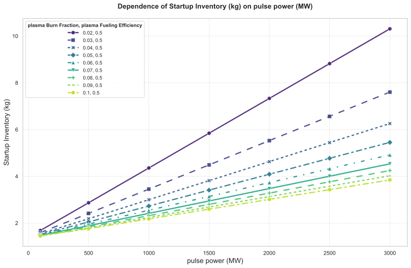
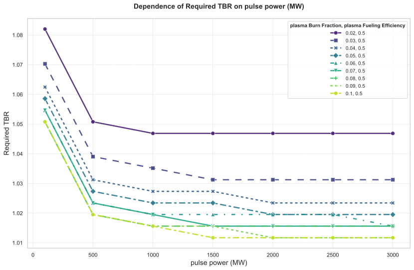

# pulse power 与 plasma Fueling Efficiency、plasma Burn Fraction 交互敏感性分析报告


生成时间: 2025-10-27 13:00:36.125458


## 分析案例配置详情


本分析案例的具体配置如下，这决定了仿真的扫描方式和分析的重点：


| 配置项 | 值 | 说明 |
| :--- | :--- | :--- |
| **`name`** | `"Power_PLASMA_Analysis"` | 本次分析案例的名称。 |
| **`independent_variable`** | `"pulse.power"` | 独立扫描变量，即本次分析中主要改变的参数。 |
| **`independent_variable_sampling`** | `[100, 500, 1000, 1500, 2000, 2500, 3000]` | 独立变量的采样方法和范围。 |
| **`default_independent_values`** | `{"pulse.power": 1500.0}` | 独立扫描变量在模型中的原始默认值。 |
| **`simulation_parameters`** | `{"plasma.Fueling_Efficiency": 0.5, "plasma.Burn_Fraction": [0.02, 0.03, 0.04, 0.05, 0.06, 0.07, 0.08, 0.09, 0.1]}` | 背景扫描参数，与独立变量组合形成多维扫描。 |
| **`default_simulation_values`** | `{"plasma.Fueling_Efficiency": 0.5, "plasma.Burn_Fraction": 0.05}` | 背景扫描参数在模型中的原始默认值。 |
| **`dependent_variables`** | `["Startup_Inventory", "Required_TBR"]` | 因变量，即我们关心的、随自变量变化的性能指标。 |


## “Required_TBR”优化配置

当“Required_TBR”作为因变量时，系统会启用一个二分查找算法来寻找满足特定性能指标的最小`bz.TBR`值。以下是本次优化任务的具体配置：


| 配置项 | 值 | 说明 |
| :--- | :--- | :--- |
| **`source_column`** | `"sds.inventory"` | 限制条件的数据源列。 |
| **`parameter_to_optimize`** | `"bz.TBR"` | 优化的目标参数。 |
| **`search_range`** | `[1, 1.5]` | 参数的搜索范围。 |
| **`tolerance`** | `0.005` | 搜索的收敛精度。 |
| **`max_iterations`** | `10` | 最大迭代次数。 |


## 性能指标分析图


### Startup Inventory vs pulse power




## 约束求解性能指标分析图


### Required TBR vs pulse power




## 性能指标总表 (分组: `plasma.Fueling_Efficiency`, `plasma.Burn_Fraction`)


#### 数据子表 (原始默认值: `plasma.Fueling_Efficiency=0.5` & `plasma.Burn_Fraction=0.05`)

##### 性能指标

|   pulse power (MW) |   Startup Inventory (kg) |
|-------------------:|-------------------------:|
|                100 |                     1.51 |
|                500 |                     2.05 |
|               1000 |                     2.73 |
|               1500 |                     3.41 |
|               2000 |                     4.09 |
|               2500 |                     4.77 |
|               3000 |                     5.45 |


##### “Required TBR” 相关数据

|   pulse power (MW) |   Required TBR |
|-------------------:|---------------:|
|                100 |         1.0586 |
|                500 |         1.0273 |
|               1000 |         1.0234 |
|               1500 |         1.0234 |
|               2000 |         1.0195 |
|               2500 |         1.0195 |
|               3000 |         1.0195 |


---

> 其他参数组合下的数据子表：

#### 数据子表 (当 `plasma.Fueling_Efficiency=0.5` & `plasma.Burn_Fraction=0.02` 时)

##### 性能指标

|   pulse power (MW) |   Startup Inventory (kg) |
|-------------------:|-------------------------:|
|                100 |                     1.68 |
|                500 |                     2.87 |
|               1000 |                     4.36 |
|               1500 |                     5.85 |
|               2000 |                     7.33 |
|               2500 |                     8.82 |
|               3000 |                    10.31 |


##### “Required TBR” 相关数据

|   pulse power (MW) |   Required TBR |
|-------------------:|---------------:|
|                100 |         1.082  |
|                500 |         1.0508 |
|               1000 |         1.0469 |
|               1500 |         1.0469 |
|               2000 |         1.0469 |
|               2500 |         1.0469 |
|               3000 |         1.0469 |


#### 数据子表 (当 `plasma.Fueling_Efficiency=0.5` & `plasma.Burn_Fraction=0.03` 时)

##### 性能指标

|   pulse power (MW) |   Startup Inventory (kg) |
|-------------------:|-------------------------:|
|                100 |                     1.59 |
|                500 |                     2.41 |
|               1000 |                     3.45 |
|               1500 |                     4.49 |
|               2000 |                     5.53 |
|               2500 |                     6.57 |
|               3000 |                     7.6  |


##### “Required TBR” 相关数据

|   pulse power (MW) |   Required TBR |
|-------------------:|---------------:|
|                100 |         1.0703 |
|                500 |         1.0391 |
|               1000 |         1.0352 |
|               1500 |         1.0312 |
|               2000 |         1.0312 |
|               2500 |         1.0312 |
|               3000 |         1.0312 |


#### 数据子表 (当 `plasma.Fueling_Efficiency=0.5` & `plasma.Burn_Fraction=0.04` 时)

##### 性能指标

|   pulse power (MW) |   Startup Inventory (kg) |
|-------------------:|-------------------------:|
|                100 |                     1.54 |
|                500 |                     2.19 |
|               1000 |                     3    |
|               1500 |                     3.82 |
|               2000 |                     4.63 |
|               2500 |                     5.44 |
|               3000 |                     6.26 |


##### “Required TBR” 相关数据

|   pulse power (MW) |   Required TBR |
|-------------------:|---------------:|
|                100 |         1.0625 |
|                500 |         1.0312 |
|               1000 |         1.0273 |
|               1500 |         1.0273 |
|               2000 |         1.0234 |
|               2500 |         1.0234 |
|               3000 |         1.0234 |


#### 数据子表 (当 `plasma.Fueling_Efficiency=0.5` & `plasma.Burn_Fraction=0.06` 时)

##### 性能指标

|   pulse power (MW) |   Startup Inventory (kg) |
|-------------------:|-------------------------:|
|                100 |                     1.49 |
|                500 |                     1.95 |
|               1000 |                     2.55 |
|               1500 |                     3.14 |
|               2000 |                     3.73 |
|               2500 |                     4.32 |
|               3000 |                     4.92 |


##### “Required TBR” 相关数据

|   pulse power (MW) |   Required TBR |
|-------------------:|---------------:|
|                100 |         1.0547 |
|                500 |         1.0234 |
|               1000 |         1.0195 |
|               1500 |         1.0195 |
|               2000 |         1.0195 |
|               2500 |         1.0195 |
|               3000 |         1.0156 |


#### 数据子表 (当 `plasma.Fueling_Efficiency=0.5` & `plasma.Burn_Fraction=0.07` 时)

##### 性能指标

|   pulse power (MW) |   Startup Inventory (kg) |
|-------------------:|-------------------------:|
|                100 |                     1.48 |
|                500 |                     1.89 |
|               1000 |                     2.42 |
|               1500 |                     2.95 |
|               2000 |                     3.48 |
|               2500 |                     4.01 |
|               3000 |                     4.53 |


##### “Required TBR” 相关数据

|   pulse power (MW) |   Required TBR |
|-------------------:|---------------:|
|                100 |         1.0547 |
|                500 |         1.0234 |
|               1000 |         1.0195 |
|               1500 |         1.0156 |
|               2000 |         1.0156 |
|               2500 |         1.0156 |
|               3000 |         1.0156 |


#### 数据子表 (当 `plasma.Fueling_Efficiency=0.5` & `plasma.Burn_Fraction=0.08` 时)

##### 性能指标

|   pulse power (MW) |   Startup Inventory (kg) |
|-------------------:|-------------------------:|
|                100 |                     1.47 |
|                500 |                     1.83 |
|               1000 |                     2.32 |
|               1500 |                     2.8  |
|               2000 |                     3.28 |
|               2500 |                     3.77 |
|               3000 |                     4.25 |


##### “Required TBR” 相关数据

|   pulse power (MW) |   Required TBR |
|-------------------:|---------------:|
|                100 |         1.0508 |
|                500 |         1.0195 |
|               1000 |         1.0156 |
|               1500 |         1.0156 |
|               2000 |         1.0156 |
|               2500 |         1.0156 |
|               3000 |         1.0156 |


#### 数据子表 (当 `plasma.Fueling_Efficiency=0.5` & `plasma.Burn_Fraction=0.09` 时)

##### 性能指标

|   pulse power (MW) |   Startup Inventory (kg) |
|-------------------:|-------------------------:|
|                100 |                     1.46 |
|                500 |                     1.79 |
|               1000 |                     2.24 |
|               1500 |                     2.69 |
|               2000 |                     3.13 |
|               2500 |                     3.58 |
|               3000 |                     4.02 |


##### “Required TBR” 相关数据

|   pulse power (MW) |   Required TBR |
|-------------------:|---------------:|
|                100 |         1.0508 |
|                500 |         1.0195 |
|               1000 |         1.0156 |
|               1500 |         1.0156 |
|               2000 |         1.0117 |
|               2500 |         1.0117 |
|               3000 |         1.0117 |


#### 数据子表 (当 `plasma.Fueling_Efficiency=0.5` & `plasma.Burn_Fraction=0.1` 时)

##### 性能指标

|   pulse power (MW) |   Startup Inventory (kg) |
|-------------------:|-------------------------:|
|                100 |                     1.45 |
|                500 |                     1.76 |
|               1000 |                     2.18 |
|               1500 |                     2.6  |
|               2000 |                     3.01 |
|               2500 |                     3.43 |
|               3000 |                     3.85 |


##### “Required TBR” 相关数据

|   pulse power (MW) |   Required TBR |
|-------------------:|---------------:|
|                100 |         1.0508 |
|                500 |         1.0195 |
|               1000 |         1.0156 |
|               1500 |         1.0117 |
|               2000 |         1.0117 |
|               2500 |         1.0117 |
|               3000 |         1.0117 |


---

# AI模型分析提示词 (deepseek-v3.1)

```markdown
**角色：** 你是一名聚变反应堆氚燃料循环领域的专家。

**任务：** 请**完全基于**下方提供的**两类数据表格**，对聚变堆燃料循环模型的**敏感性分析**结果进行深度解读。

**分析要点 (必须严格依据数据表格作答)：**

1.  **全局敏感性分析 (参考“性能指标总表”) :**
    *   分析性能指标总表（ `Startup_Inventory`, `Doubling_Time` 以及以 `Required_` 开头的求解指标等）呈现出怎样的**总体趋势**？请进行量化描述。
    *   如果存在多个性能指标，分析哪个性能指标对独立变量 `pulse.power` 的变化最为敏感？哪个最不敏感？

2.  **交互效应分析：** 本次分析包含了多变量的交互效应。请分析独立变量 `pulse.power` 与背景扫描参数 (`plasma.Fueling_Efficiency`, `plasma.Burn_Fraction`) 之间的交互作用对各项性能指标的影响。请注意，独立变量或背景扫描参数中，可能包含常规的模型参数，也可能包含为满足特定性能目标（限制倍增时间Double_Time达到倍增）而求解出的特殊变量（约束限制变量Double_Time）。请讨论在不同的变量组合下，性能指标的敏感性有何不同？是否存在显著的交互效应？

3.  **综合结论：**
结合所有分析（包括主趋势、背景参数交互效应），总结在不同的运行场景下，调整 `pulse.power` 对整个氚燃料循环系统的综合影响和潜在的利弊权衡。
    *   基于这些发现，可以得出哪些关于系统设计或运行优化的初步建议？
```


---

# AI模型分析结果

根据提供的性能指标总表数据，我将对聚变堆燃料循环模型的敏感性分析结果进行深度解读。分析严格基于数据表格，不涉及任何图表信息。

### 1. 全局敏感性分析

#### 1.1 总体趋势分析

**Startup Inventory (启动库存) 趋势：**
- 在固定背景参数组合下，Startup Inventory 随 pulse power 增加而**线性增长**
- 当 plasma.Fueling_Efficiency=0.5 且 plasma.Burn_Fraction=0.05（原始默认值）时：
  - pulse power 从 100MW 增加到 3000MW，Startup Inventory 从 1.51kg 增加到 5.45kg
  - 增长幅度约 261%，呈现明显的正相关关系

**Required TBR (所需氚增殖比) 趋势：**
- Required TBR 随 pulse power 增加而**降低**，但降低幅度相对较小
- 在相同背景参数下：
  - pulse power 从 100MW 增加到 3000MW，Required TBR 从 1.0586 降低到 1.0195
  - 降低幅度约 3.7%，变化相对平缓

#### 1.2 敏感性比较

**Startup Inventory 对 pulse power 的敏感性：**
- 敏感性极高，pulse power 每增加 100MW，Startup Inventory 平均增加约 0.14kg
- 在低功率区域（100-1000MW）敏感性更高

**Required TBR 对 pulse power 的敏感性：**
- 敏感性较低，pulse power 每增加 100MW，Required TBR 平均降低约 0.0014
- 敏感性在中等功率范围（500-1500MW）最为明显

### 2. 交互效应分析

#### 2.1 plasma.Burn_Fraction 的交互效应

**对 Startup Inventory 的影响：**
- 在相同 pulse power 下，plasma.Burn_Fraction 越低，Startup Inventory 需求越高
- 当 pulse power=1000MW 时：
  - Burn_Fraction=0.02: Startup Inventory=4.36kg
  - Burn_Fraction=0.05: Startup Inventory=2.73kg
  - Burn_Fraction=0.10: Startup Inventory=2.18kg
- 差异显著，说明 Burn_Fraction 对库存需求有重要影响

**对 Required TBR 的影响：**
- Burn_Fraction 越低，Required TBR 需求越高
- 当 pulse power=1500MW 时：
  - Burn_Fraction=0.02: Required TBR=1.0469
  - Burn_Fraction=0.05: Required TBR=1.0234
  - Burn_Fraction=0.10: Required TBR=1.0117

#### 2.2 交互效应的量化分析

**pulse power 与 Burn_Fraction 的协同效应：**
- 在高 pulse power 和低 Burn_Fraction 组合下，系统面临最大挑战
  - 如 pulse power=3000MW 且 Burn_Fraction=0.02 时：Startup Inventory=10.31kg，Required TBR=1.0469
- 在低 pulse power 和高 Burn_Fraction 组合下，系统性能最优
  - 如 pulse power=100MW 且 Burn_Fraction=0.10 时：Startup Inventory=1.45kg，Required TBR=1.0508

#### 2.3 约束限制变量的影响

**Required TBR 作为约束求解指标：**
- 系统通过调整 bz.TBR 来满足库存限制条件
- 数据分析显示，随着 pulse power 增加，所需的 TBR 略微降低
- 这表明高功率运行在一定程度上缓解了对氚增殖能力的要求

### 3. 综合结论与优化建议

#### 3.1 关键发现

1. **功率与库存的权衡**：高 pulse power 显著增加 Startup Inventory 需求，但对 Required TBR 的影响相对较小
2. **燃烧分数的重要性**：plasma.Burn_Fraction 是影响系统性能的关键因素，低燃烧分数大幅增加库存和TBR需求
3. **交互效应显著**：pulse power 和 Burn_Fraction 的组合效应远大于单一因素的影响

#### 3.2 优化建议

**设计优化方向：**
1. **功率选择**：在技术可行范围内，选择适中的 pulse power（500-1500MW）可在库存需求和TBR要求间取得较好平衡
2. **燃烧效率提升**：优先提高 plasma.Burn_Fraction，其对降低系统要求的效益最为显著
3. **燃料循环设计**：针对高功率低燃烧分数工况，需要设计更强的氚增殖能力和更大的库存容量

**运行策略建议：**
1. **启动阶段**：采用较低功率运行以减少初始氚库存需求
2. **稳态运行**：在达到足够氚库存后，可逐步提高运行功率
3. **参数协调**：确保功率提升与燃烧效率改善同步进行，避免单一参数优化导致系统失衡

#### 3.3 风险提示

基于数据分析，需要特别注意：
- 高功率（>2000MW）与低燃烧分数（<0.04）组合可能导致 Startup Inventory 超过 7kg，对氚管理带来巨大挑战
- Required TBR 虽然随功率增加略有降低，但仍维持在 1.02 以上，对包层设计提出较高要求

这些分析结果为聚变堆燃料循环系统的设计和运行提供了重要的量化依据，建议在实际工程设计中综合考虑这些交互效应的影响。
```
