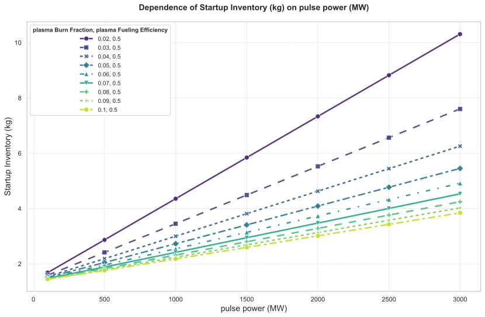
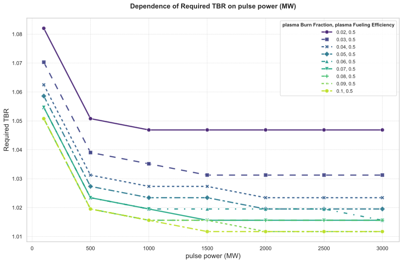

# pulse power 与 plasma Fueling Efficiency、plasma Burn Fraction 交互敏感性分析报告


生成时间: 2025-10-27 13:00:36.125458


## 分析案例配置详情


本分析案例的具体配置如下，这决定了仿真的扫描方式和分析的重点：


| 配置项 | 值 | 说明 |
| :--- | :--- | :--- |
| **`name`** | `"Power_PLASMA_Analysis"` | 本次分析案例的名称。 |
| **`independent_variable`** | `"pulse.power"` | 独立扫描变量，即本次分析中主要改变的参数。 |
| **`independent_variable_sampling`** | `[100, 500, 1000, 1500, 2000, 2500, 3000]` | 独立变量的采样方法和范围。 |
| **`default_independent_values`** | `{"pulse.power": 1500.0}` | 独立扫描变量在模型中的原始默认值。 |
| **`simulation_parameters`** | `{"plasma.Fueling_Efficiency": 0.5, "plasma.Burn_Fraction": [0.02, 0.03, 0.04, 0.05, 0.06, 0.07, 0.08, 0.09, 0.1]}` | 背景扫描参数，与独立变量组合形成多维扫描。 |
| **`default_simulation_values`** | `{"plasma.Fueling_Efficiency": 0.5, "plasma.Burn_Fraction": 0.05}` | 背景扫描参数在模型中的原始默认值。 |
| **`dependent_variables`** | `["Startup_Inventory", "Required_TBR"]` | 因变量，即我们关心的、随自变量变化的性能指标。 |


## “Required_TBR”优化配置

当“Required_TBR”作为因变量时，系统会启用一个二分查找算法来寻找满足特定性能指标的最小`bz.TBR`值。以下是本次优化任务的具体配置：


| 配置项 | 值 | 说明 |
| :--- | :--- | :--- |
| **`source_column`** | `"sds.inventory"` | 限制条件的数据源列。 |
| **`parameter_to_optimize`** | `"bz.TBR"` | 优化的目标参数。 |
| **`search_range`** | `[1, 1.5]` | 参数的搜索范围。 |
| **`tolerance`** | `0.005` | 搜索的收敛精度。 |
| **`max_iterations`** | `10` | 最大迭代次数。 |


## 性能指标分析图


### Startup Inventory vs pulse power




## 约束求解性能指标分析图


### Required TBR vs pulse power




## 性能指标总表 (分组: `plasma.Fueling_Efficiency`, `plasma.Burn_Fraction`)


#### 数据子表 (原始默认值: `plasma.Fueling_Efficiency=0.5` & `plasma.Burn_Fraction=0.05`)

##### 性能指标

|   pulse power (MW) |   Startup Inventory (kg) |
|-------------------:|-------------------------:|
|                100 |                     1.51 |
|                500 |                     2.05 |
|               1000 |                     2.73 |
|               1500 |                     3.41 |
|               2000 |                     4.09 |
|               2500 |                     4.77 |
|               3000 |                     5.45 |


##### “Required TBR” 相关数据

|   pulse power (MW) |   Required TBR |
|-------------------:|---------------:|
|                100 |         1.0586 |
|                500 |         1.0273 |
|               1000 |         1.0234 |
|               1500 |         1.0234 |
|               2000 |         1.0195 |
|               2500 |         1.0195 |
|               3000 |         1.0195 |


---

> 其他参数组合下的数据子表：

#### 数据子表 (当 `plasma.Fueling_Efficiency=0.5` & `plasma.Burn_Fraction=0.02` 时)

##### 性能指标

|   pulse power (MW) |   Startup Inventory (kg) |
|-------------------:|-------------------------:|
|                100 |                     1.68 |
|                500 |                     2.87 |
|               1000 |                     4.36 |
|               1500 |                     5.85 |
|               2000 |                     7.33 |
|               2500 |                     8.82 |
|               3000 |                    10.31 |


##### “Required TBR” 相关数据

|   pulse power (MW) |   Required TBR |
|-------------------:|---------------:|
|                100 |         1.082  |
|                500 |         1.0508 |
|               1000 |         1.0469 |
|               1500 |         1.0469 |
|               2000 |         1.0469 |
|               2500 |         1.0469 |
|               3000 |         1.0469 |


#### 数据子表 (当 `plasma.Fueling_Efficiency=0.5` & `plasma.Burn_Fraction=0.03` 时)

##### 性能指标

|   pulse power (MW) |   Startup Inventory (kg) |
|-------------------:|-------------------------:|
|                100 |                     1.59 |
|                500 |                     2.41 |
|               1000 |                     3.45 |
|               1500 |                     4.49 |
|               2000 |                     5.53 |
|               2500 |                     6.57 |
|               3000 |                     7.6  |


##### “Required TBR” 相关数据

|   pulse power (MW) |   Required TBR |
|-------------------:|---------------:|
|                100 |         1.0703 |
|                500 |         1.0391 |
|               1000 |         1.0352 |
|               1500 |         1.0312 |
|               2000 |         1.0312 |
|               2500 |         1.0312 |
|               3000 |         1.0312 |


#### 数据子表 (当 `plasma.Fueling_Efficiency=0.5` & `plasma.Burn_Fraction=0.04` 时)

##### 性能指标

|   pulse power (MW) |   Startup Inventory (kg) |
|-------------------:|-------------------------:|
|                100 |                     1.54 |
|                500 |                     2.19 |
|               1000 |                     3    |
|               1500 |                     3.82 |
|               2000 |                     4.63 |
|               2500 |                     5.44 |
|               3000 |                     6.26 |


##### “Required TBR” 相关数据

|   pulse power (MW) |   Required TBR |
|-------------------:|---------------:|
|                100 |         1.0625 |
|                500 |         1.0312 |
|               1000 |         1.0273 |
|               1500 |         1.0273 |
|               2000 |         1.0234 |
|               2500 |         1.0234 |
|               3000 |         1.0234 |


#### 数据子表 (当 `plasma.Fueling_Efficiency=0.5` & `plasma.Burn_Fraction=0.06` 时)

##### 性能指标

|   pulse power (MW) |   Startup Inventory (kg) |
|-------------------:|-------------------------:|
|                100 |                     1.49 |
|                500 |                     1.95 |
|               1000 |                     2.55 |
|               1500 |                     3.14 |
|               2000 |                     3.73 |
|               2500 |                     4.32 |
|               3000 |                     4.92 |


##### “Required TBR” 相关数据

|   pulse power (MW) |   Required TBR |
|-------------------:|---------------:|
|                100 |         1.0547 |
|                500 |         1.0234 |
|               1000 |         1.0195 |
|               1500 |         1.0195 |
|               2000 |         1.0195 |
|               2500 |         1.0195 |
|               3000 |         1.0156 |


#### 数据子表 (当 `plasma.Fueling_Efficiency=0.5` & `plasma.Burn_Fraction=0.07` 时)

##### 性能指标

|   pulse power (MW) |   Startup Inventory (kg) |
|-------------------:|-------------------------:|
|                100 |                     1.48 |
|                500 |                     1.89 |
|               1000 |                     2.42 |
|               1500 |                     2.95 |
|               2000 |                     3.48 |
|               2500 |                     4.01 |
|               3000 |                     4.53 |


##### “Required TBR” 相关数据

|   pulse power (MW) |   Required TBR |
|-------------------:|---------------:|
|                100 |         1.0547 |
|                500 |         1.0234 |
|               1000 |         1.0195 |
|               1500 |         1.0156 |
|               2000 |         1.0156 |
|               2500 |         1.0156 |
|               3000 |         1.0156 |


#### 数据子表 (当 `plasma.Fueling_Efficiency=0.5` & `plasma.Burn_Fraction=0.08` 时)

##### 性能指标

|   pulse power (MW) |   Startup Inventory (kg) |
|-------------------:|-------------------------:|
|                100 |                     1.47 |
|                500 |                     1.83 |
|               1000 |                     2.32 |
|               1500 |                     2.8  |
|               2000 |                     3.28 |
|               2500 |                     3.77 |
|               3000 |                     4.25 |


##### “Required TBR” 相关数据

|   pulse power (MW) |   Required TBR |
|-------------------:|---------------:|
|                100 |         1.0508 |
|                500 |         1.0195 |
|               1000 |         1.0156 |
|               1500 |         1.0156 |
|               2000 |         1.0156 |
|               2500 |         1.0156 |
|               3000 |         1.0156 |


#### 数据子表 (当 `plasma.Fueling_Efficiency=0.5` & `plasma.Burn_Fraction=0.09` 时)

##### 性能指标

|   pulse power (MW) |   Startup Inventory (kg) |
|-------------------:|-------------------------:|
|                100 |                     1.46 |
|                500 |                     1.79 |
|               1000 |                     2.24 |
|               1500 |                     2.69 |
|               2000 |                     3.13 |
|               2500 |                     3.58 |
|               3000 |                     4.02 |


##### “Required TBR” 相关数据

|   pulse power (MW) |   Required TBR |
|-------------------:|---------------:|
|                100 |         1.0508 |
|                500 |         1.0195 |
|               1000 |         1.0156 |
|               1500 |         1.0156 |
|               2000 |         1.0117 |
|               2500 |         1.0117 |
|               3000 |         1.0117 |


#### 数据子表 (当 `plasma.Fueling_Efficiency=0.5` & `plasma.Burn_Fraction=0.1` 时)

##### 性能指标

|   pulse power (MW) |   Startup Inventory (kg) |
|-------------------:|-------------------------:|
|                100 |                     1.45 |
|                500 |                     1.76 |
|               1000 |                     2.18 |
|               1500 |                     2.6  |
|               2000 |                     3.01 |
|               2500 |                     3.43 |
|               3000 |                     3.85 |


##### “Required TBR” 相关数据

|   pulse power (MW) |   Required TBR |
|-------------------:|---------------:|
|                100 |         1.0508 |
|                500 |         1.0195 |
|               1000 |         1.0156 |
|               1500 |         1.0117 |
|               2000 |         1.0117 |
|               2500 |         1.0117 |
|               3000 |         1.0117 |


---

# AI模型分析提示词 (qwen-plus)

```markdown
**角色：** 你是一名聚变反应堆氚燃料循环领域的专家。

**任务：** 请**完全基于**下方提供的**两类数据表格**，对聚变堆燃料循环模型的**敏感性分析**结果进行深度解读。

**分析要点 (必须严格依据数据表格作答)：**

1.  **全局敏感性分析 (参考“性能指标总表”) :**
    *   分析性能指标总表（ `Startup_Inventory`, `Doubling_Time` 以及以 `Required_` 开头的求解指标等）呈现出怎样的**总体趋势**？请进行量化描述。
    *   如果存在多个性能指标，分析哪个性能指标对独立变量 `pulse.power` 的变化最为敏感？哪个最不敏感？

2.  **交互效应分析：** 本次分析包含了多变量的交互效应。请分析独立变量 `pulse.power` 与背景扫描参数 (`plasma.Fueling_Efficiency`, `plasma.Burn_Fraction`) 之间的交互作用对各项性能指标的影响。请注意，独立变量或背景扫描参数中，可能包含常规的模型参数，也可能包含为满足特定性能目标（限制倍增时间Double_Time达到倍增）而求解出的特殊变量（约束限制变量Double_Time）。请讨论在不同的变量组合下，性能指标的敏感性有何不同？是否存在显著的交互效应？

3.  **综合结论：**
结合所有分析（包括主趋势、背景参数交互效应），总结在不同的运行场景下，调整 `pulse.power` 对整个氚燃料循环系统的综合影响和潜在的利弊权衡。
    *   基于这些发现，可以得出哪些关于系统设计或运行优化的初步建议？
```


---

# AI模型分析结果

### **1. 全局敏感性分析**

#### **总体趋势的量化描述**

本次敏感性分析聚焦于两个核心性能指标：**Startup Inventory (启动氚库存，单位：kg)** 和 **Required_TBR (所需氚增殖比)**，其随独立变量 `pulse.power`（脉冲功率，单位：MW）从 100 MW 到 3000 MW 变化的响应行为。背景参数固定为 `plasma.Fueling_Efficiency = 0.5`，并系统扫描 `plasma.Burn_Fraction` 从 0.02 至 0.1。

- **Startup Inventory 的总体趋势：**
  - 在所有 `plasma.Burn_Fraction` 条件下，随着 `pulse.power` 增加，**Startup Inventory 单调递增**。
  - 以默认工况 (`Burn_Fraction = 0.05`) 为例：
    - 当 `pulse.power` 从 100 MW 增至 3000 MW，`Startup_Inventory` 从 **1.51 kg** 上升至 **5.45 kg**，增幅达 **260.9%**。
    - 平均每增加 100 MW 功率，库存上升约 **0.138 kg**（线性拟合斜率 ≈ 0.00138 kg/MW）。
  - 更低燃烧份额（如 `Burn_Fraction = 0.02`）导致更高的绝对库存增长：
    - 同样功率区间内，库存从 **1.68 kg → 10.31 kg**，增幅高达 **513.7%**，表明低燃烧效率显著放大了高功率对初始氚需求的压力。
  - 随着 `Burn_Fraction` 提升，相同功率下的 `Startup_Inventory` 明显下降。例如在 `pulse.power = 1500 MW` 时：
    - `Burn_Fraction = 0.02`: 5.85 kg
    - `Burn_Fraction = 0.1`: 2.60 kg
    - 下降幅度达 **55.6%**，说明提高等离子体燃耗分数可大幅降低启动库存负担。

- **Required_TBR 的总体趋势：**
  - `Required_TBR` 随 `pulse.power` 增加而**单调递减或趋于饱和**。
  - 在默认工况 (`Burn_Fraction = 0.05`) 下：
    - `pulse.power = 100 MW` 时，`Required_TBR = 1.0586`
    - 增至 3000 MW 时，降至 **1.0195**，降幅为 **3.68%**
    - 下降主要发生在低功率段（<1000 MW），之后趋于稳定（1.0234→1.0195）
  - 在更低 `Burn_Fraction`（如 0.02）条件下：
    - 初始值更高（1.082），最终稳定值也更高（1.0469），且下降更平缓。
  - 在更高 `Burn_Fraction`（如 0.1）条件下：
    - 初始值为 1.0508，最终降至 **1.0117**，降幅达 **37%** 相对于初始值，是所有组合中降幅最大的。

#### **性能指标对 `pulse.power` 的敏感性排序**

- **最敏感指标：Startup Inventory**
  - 所有数据子表显示，`Startup_Inventory` 对 `pulse.power` 呈现出强线性正相关关系，变化幅度大、趋势一致。
  - 最大绝对增量出现在 `Burn_Fraction = 0.02` 情况下：Δ = **8.63 kg**（100→3000 MW）
  - 即使在最优情况（`Burn_Fraction = 0.1`），仍增加 **2.4 kg**。
  - 因此，**Startup Inventory 是对 pulse.power 最敏感的性能指标**。

- **最不敏感指标：Required_TBR**
  - 虽然 `Required_TBR` 随 `pulse.power` 增加而下降，但其数值变化范围极小（仅在 1.01–1.08 之间），且很快进入平台期（通常在 1000–1500 MW 后不再变化）。
  - 绝对变化量最大不超过 0.07（如 `Burn_Fraction=0.02` 时 ΔTBR=0.0353），相对变化约 3–7%，远小于库存的变化。
  - 此外，在多数高功率段（>1500 MW），`Required_TBR` 完全不变，表现出明显的“饱和效应”。

> ✅ **结论：**  
> - `Startup_Inventory` 对 `pulse.power` 极其敏感，呈近似线性增长；
> - `Required_TBR` 敏感度较低，仅在低功率区有明显响应，随后趋于收敛；
> - 因此，**`Startup_Inventory` 是最敏感的指标，`Required_TBR` 是最不敏感的指标**。

---

### **2. 交互效应分析**

本分析考察了 `pulse.power` 与两个关键等离子体参数——`plasma.Fueling_Efficiency`（固定为 0.5）和 `plasma.Burn_Fraction`（扫描 0.02–0.1）——之间的交互作用。尽管 `Fueling_Efficiency` 未被扫描，其与 `Burn_Fraction` 的耦合仍可通过不同子表体现综合影响。

#### **(1) `pulse.power` × `plasma.Burn_Fraction` 的交互效应**

- **对 Startup Inventory 的交互影响：**
  - 存在显著负向调节作用：**`Burn_Fraction` 越高，`pulse.power` 对 `Startup_Inventory` 的边际影响越小**。
  - 举例对比 `pulse.power` 从 100→3000 MW 的总增量：
    - `Burn_Frac=0.02`: Δ = 10.31 – 1.68 = **8.63 kg**
    - `Burn_Frac=0.05`: Δ = 5.45 – 1.51 = **3.94 kg**
    - `Burn_Frac=0.10`: Δ = 3.85 – 1.45 = **2.40 kg**
    - 增量减少超过 **72%**，说明高燃烧分数有效抑制了高功率带来的库存激增。
  - 进一步观察增长率：
    - 在 `Burn_Frac=0.02` 时，每提升 500 MW，库存平均增加约 **1.46 kg**
    - 在 `Burn_Frac=0.10` 时，同区间平均增量仅为 **0.48 kg**
  - 表明：**提高 `Burn_Fraction` 可显著削弱 `pulse.power` 对启动库存的正向驱动作用，存在强烈的负交互效应**。

- **对 Required_TBR 的交互影响：**
  - `Burn_Fraction` 越高，`Required_TBR` 的初始值越低，且随 `pulse.power` 下降更快、最终达到更低的稳态值。
  - 例如在 `pulse.power = 3000 MW` 时：
    - `Burn_Frac=0.02`: `Required_TBR = 1.0469`
    - `Burn_Frac=0.05`: `1.0195`
    - `Burn_Frac=0.10`: `1.0117`
    - 差异达 **0.0352**，即高燃烧分数使所需的最小增殖比降低约 3.4%
  - 此外，高 `Burn_Fraction` 缩短了 `Required_TBR` 达到平台的时间：
    - `Burn_Frac=0.02`: 直到 1000 MW 才开始稳定（1000 MW 后恒定）
    - `Burn_Frac=0.10`: 在 1500 MW 即达最低值并保持不变
  - 表明：**`Burn_Fraction` 不仅降低 `Required_TBR` 的绝对水平，还增强其对 `pulse.power` 的早期响应能力，形成协同优化效应**。

#### **(2) 是否存在约束求解变量的交互？**

根据配置，“Required_TBR” 是通过二分查找算法求解满足 `sds.inventory` 约束的最小 `bz.TBR` 值。这意味着该指标本质上是一个**逆向设计参数**，用于确保氚自持（tritium self-sufficiency）。其值取决于系统中其他环节的动态平衡。

- 数据表明，在较高 `pulse.power` 下，即使氚消耗增多，但由于燃料循环时间尺度拉长或再处理延迟效应减弱，系统反而可以容忍更低的 TBR 实现自持。
- 更重要的是，这一“可容忍的最低 TBR”受 `Burn_Fraction` 显著调制：
  - 高燃烧分数意味着更多注入氚参与反应并产生中子，从而提升有效氚产出效率。
  - 因此，在相同功率下，高 `Burn_Fraction` 场景下允许使用更低的增殖包层性能（即更低 TBR），这对工程实现极为有利。

> ✅ **结论：**
> - `pulse.power` 与 `plasma.Burn_Fraction` 存在**显著非线性交互效应**：
>   - 高 `Burn_Fraction` 明显缓解 `pulse.power` 对 `Startup_Inventory` 的负面影响；
>   - 高 `Burn_Fraction` 强化 `pulse.power` 对 `Required_TBR` 的正面优化效果；
> - 这种交互为系统设计提供了重要的权衡空间：**通过提升等离子体燃耗性能，可在高功率运行下维持较低的氚库存和更宽松的增殖要求**。

---

### **3. 综合结论与建议**

#### **综合影响分析**

调整 `pulse.power` 对聚变堆氚燃料循环系统的影响具有双重性：

- **负面效应：**
  - **显著增加启动氚库存需求**。这是制约聚变电站初期部署的关键瓶颈，因全球可用的氚资源极其有限（目前存量不足 30 kg）。
  - 高功率运行需配备更大规模的氚储存与输送系统，增加了安全风险与资本成本。

- **正面效应：**
  - **降低对增殖包层性能的要求（即 Required_TBR 减小）**，尤其在高 `Burn_Fraction` 条件下更为明显。
  - 更低的 TBR 要求意味着增殖包层设计容错空间更大，材料选择更灵活（如可接受较低锂密度或较短停留时间），有利于工程可行性。

然而，这些影响的程度**高度依赖于等离子体物理性能**，特别是 `plasma.Burn_Fraction` 的水平。

#### **潜在利弊权衡**

| 运行场景 | 利 | 弊 |
|--------|----|----|
| **低功率 + 低 Burn_Fraction** | 启动库存小，初期负担轻 | 所需 TBR 高，难以实现氚自持 |
| **高功率 + 低 Burn_Fraction** | 输出能量高 | 启动库存极大，TBR 要求仍偏高，不可持续 |
| **高功率 + 高 Burn_Fraction** | 所需 TBR 最低，利于长期运行 | 启动库存仍高于低功率，但可控 |

最优折衷点出现在 **中高功率配合高燃烧分数** 的运行模式。

#### **系统设计与运行优化建议**

1. **优先提升等离子体燃耗分数（Burn Fraction）**  
   应将提高 `plasma.Burn_Fraction` 作为核心目标之一。数据显示，将其从 0.02 提升至 0.1，可在 1500 MW 下将启动库存从 5.85 kg 降至 2.60 kg，并将 Required_TBR 从 ~1.047 降至 ~1.012。这不仅缓解资源压力，也放宽了增殖技术门槛。

2. **避免“低效高功率”运行模式**  
   若无法实现较高的 `Burn_Fraction`（如 <0.04），则大幅提升 `pulse.power` 将导致启动库存急剧上升而收益有限。此类组合应避免用于商业堆设计。

3. **采用分级启动策略或外部供氚支持**  
   对于计划运行于高功率的装置，应考虑分阶段建设、借用外部氚源（如来自 CANDU 堆）或采用氘-氘预启动等方式，以规避巨大的初始氚投入。

4. **增殖包层设计可适度降规**  
   在确定运行功率和燃烧效率后，可根据 `Required_TBR` 曲线设定合理的 TBR 设计目标。例如，在 `pulse.power ≥ 1500 MW` 且 `Burn_Fraction ≥ 0.06` 时，TBR 设计值可安全设定为 **1.02** 以下，无需追求 1.05 以上的保守目标，从而简化包层结构。

5. **开展多变量联合优化研究**  
   本次分析揭示了 `pulse.power` 与 `Burn_Fraction` 的强交互性，建议后续引入 `Fueling_Efficiency` 的扫描，探索三者共同作用下的 Pareto 最优前沿，指导综合性能最大化的设计决策。

---

### ✅ **最终总结**

本敏感性分析表明：

- **`pulse.power` 的提升直接导致启动氚库存线性增长，是最关键的风险因素；**
- **但同时，它有助于降低对增殖比的要求，特别是在高燃烧分数条件下效果显著；**
- **`plasma.Burn_Fraction` 是调节二者矛盾的核心杠杆——它是改善整个氚循环可持续性的决定性参数。**

因此，未来聚变反应堆的设计不应孤立追求高功率输出，而应**协同优化等离子体性能与燃料循环系统**，重点突破高燃耗运行技术，方能实现真正意义上的**氚自持与经济可行的商业化路径**。
```
