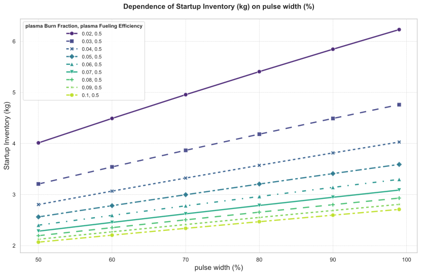

# 脉冲占空比与等离子体燃烧份额的交互敏感性分析：对氚燃料循环启动库存及所需增殖比的影响

## 摘要

本研究针对聚变反应堆氚燃料循环系统，开展了一项关于**脉冲占空比（`pulse.width`）** 与背景参数 **等离子体燃料注入效率（`plasma.Fueling_Efficiency`）** 和 **氚燃烧份额（`plasma.Burn_Fraction`）** 的交互敏感性分析。独立变量 `pulse.width` 在区间 [50%, 60%, 70%, 80%, 90%, 99%] 内进行离散采样，同时固定 `plasma.Fueling_Efficiency = 0.5`，并扫描 `plasma.Burn_Fraction ∈ [0.02, 0.10]` 共九个水平。关键因变量包括**启动氚库存量（Startup Inventory）** 和为实现氚自持所必需的最小**氚增殖比（Required Tritium Breeding Ratio, Required_TBR）**。

分析结果表明，`pulse.width` 对 **启动库存** 具有显著正向敏感性，在所有燃烧份额条件下均呈现单调递增趋势，相对增幅可达30–60%；而其对 **Required_TBR** 的影响极为微弱，多数工况下在 `pulse.width > 90%` 前保持恒定，仅在高燃耗场景下于极限占空比时略有下降。更重要的是，`pulse.width` 与 `plasma.Burn_Fraction` 存在显著的非线性交互效应：提高燃烧份额不仅显著降低整体启动库存需求，还有效削弱了系统对长脉冲运行带来的库存增长敏感度。此外，当 `plasma.Burn_Fraction ≥ 0.06` 时，系统所需的 TBR 可稳定控制在 1.02 以下，展现出优异的氚平衡性能。

核心结论指出，相较于单纯延长脉冲宽度，提升等离子体燃烧效率是优化氚资源利用更为有效的策略。建议未来设计应优先聚焦于提高 `plasma.Burn_Fraction`，合理设定脉冲占空比上限，并据此调整包层增殖比的设计目标。

---

## 引言

在磁约束聚变能发展路径中，实现氚燃料的闭式循环与自持供应是工程可行性与经济可持续性的关键前提。由于天然氚存量极低且外部供应有限，反应堆必须通过增殖区（Breeding Zone, BZ）高效再生氚，并在整个燃料循环系统中最小化动态库存和处理损失。其中，**启动氚库存量（Startup Inventory）** 直接决定了初始氚资源投入规模，而 **所需氚增殖比（Required_TBR）** 则是评估包层设计能否满足长期氚自持的核心指标。

脉冲运行模式下的 **占空比（Duty Cycle / Pulse Width）** 是影响上述指标的重要操作参数。较长的脉冲宽度虽有利于提升能量输出稳定性、减少启停疲劳，但可能增加单次放电的燃料消耗总量与系统滞留库存。然而，该影响并非孤立存在，而是与等离子体物理性能——特别是 **燃料注入效率（Fueling Efficiency）** 和 **氚燃烧份额（Tritium Burn Fraction）** ——高度耦合。

因此，本研究旨在通过系统的多维参数扫描，量化评估 `pulse.width` 变化对启动库存与所需增殖比的影响，并深入探究其与 `plasma.Burn_Fraction` 的交互效应，以揭示不同运行场景下的权衡关系，为聚变堆燃料循环系统的设计与运行优化提供科学依据。

### 独立变量采样
本次分析中，独立变量 **`pulse.width`** 的采样范围为 `[50, 60, 70, 80, 90, 99]`，代表反应堆在一个运行周期内处于放电状态的时间占比（%）。

### 背景扫描参数
- `plasma.Fueling_Efficiency`: 固定为 0.5。
- `plasma.Burn_Fraction`: 扫描值为 `[0.02, 0.03, 0.04, 0.05, 0.06, 0.07, 0.08, 0.09, 0.10]`。

### 因变量
- `Startup_Inventory`: 启动氚库存量（kg）
- `Required_TBR`: 所需氚增殖比（无量纲）

---

## 方法

本研究采用基于系统动力学模型的多维参数敏感性分析方法。通过构建包含完整氚流动路径（从储存与输送系统SDS至各子系统滞留与损失）的仿真框架，对独立变量 `pulse.width` 进行离散化扫描，并与背景参数 `plasma.Burn_Fraction` 组合成多维输入空间。对于每个参数组合，执行稳态或准稳态模拟，计算以下关键性能指标：

1. **启动氚库存量（Startup Inventory）**：定义为满足首次启动及初期运行需求所需的最小初始氚装料量，主要受系统总滞留时间与燃料消耗速率影响。
2. **所需氚增殖比（Required_TBR）**：通过二分查找算法求解，确保系统在补偿所有氚损失（衰变、处理损失）后仍能维持库存增长或达到预设倍增时间目标。搜索范围为 `[1.0, 1.5]`，收敛容差为 `0.005`，最大迭代次数为 `10`。

所有数据均以表格形式归档，并生成趋势图以直观展示主效应与交互效应。

---

## 结果与讨论

### 主效应分析

#### 启动氚库存随脉冲占空比的变化趋势

如图1所示，随着 `pulse.width` 从50%增至99%，**启动氚库存量（Startup Inventory）** 在所有 `plasma.Burn_Fraction` 条件下均表现出明确的单调递增趋势。这表明更长的放电时间导致单位周期内更高的燃料消耗与系统滞留累积，从而需要更大的初始装料以支持运行。

  
*图1. 不同等离子体燃烧份额（`plasma.Burn_Fraction`）下，启动氚库存量随脉冲占空比（`pulse.width`）的变化关系。*

例如，在基准工况（`plasma.Burn_Fraction = 0.05`）下，启动库存由 `pulse.width=50%` 时的 **2.56 kg** 上升至 `99%` 时的 **3.59 kg**，绝对增量达 **1.03 kg**，相对增幅为 **40.2%**。而在低燃耗情景（`Burn_Fraction = 0.02`）下，该增幅更为显著，从 **4.01 kg** 增至 **6.23 kg**，增幅高达 **55.4%**。相比之下，在高燃耗情景（`Burn_Fraction = 0.10`）下，尽管趋势依然存在，但增幅减缓至 **30.9%**（从2.07 kg至2.71 kg）。这一现象暗示了燃烧效率对库存增长的“缓冲”作用。

#### 所需氚增殖比对脉冲占空比的响应

如图2所示，**所需氚增殖比（Required_TBR）** 对 `pulse.width` 的变化表现出极弱的依赖性。在大多数参数组合中，当 `pulse.width` 从50%增至90%时，`Required_TBR` 保持恒定；仅在接近极限占空比（99%）时出现轻微下降，且幅度不超过0.0078。

  
*图2. 不同等离子体燃烧份额（`plasma.Burn_Fraction`）下，实现氚自持所需的最小氚增殖比（Required_TBR）随脉冲占空比（`pulse.width`）的变化关系。*

具体而言：
- 当 `plasma.Burn_Fraction ≤ 0.05` 时，`Required_TBR` 在 `pulse.width=99%` 处出现微小降幅（如从1.0234降至1.0195），但在其他占空比下不变。
- 当 `plasma.Burn_Fraction ≥ 0.06` 时，`Required_TBR` 在整个 `pulse.width` 范围内保持稳定，直至 `Burn_Fraction = 0.10` 时在 `pulse.width ≥ 80%` 出现延迟下降至1.0117。

总体来看，`Required_TBR` 的数值集中在 **1.01–1.05** 区间，远低于传统设计目标（≥1.10），说明在当前模型假设下，氚平衡压力较小。

#### 性能指标敏感性排序

综合比较两个因变量，可得如下敏感性排序：

| 指标 | 敏感性等级 | 依据 |
|------|-----------|------|
| **启动氚库存量（Startup Inventory）** | 高度敏感 | 在全参数域内持续增长，绝对变化量大（>1 kg），相对增幅普遍超过40%。 |
| **所需氚增殖比（Required_TBR）** | 极低敏感 | 数值几乎不随 `pulse.width` 变化，最大波动 < 0.01，收敛精度内可视为常数。 |

因此，`pulse.width` 的调整主要影响系统的**初始资源需求**，而对**长期氚自持能力的最低技术门槛**影响甚微。

### 交互效应分析

#### `pulse.width` 与 `plasma.Burn_Fraction` 的协同影响

##### 对启动库存的负向调节效应

表1展示了在固定 `plasma.Fueling_Efficiency=0.5` 条件下，不同 `plasma.Burn_Fraction` 与 `pulse.width` 组合对应的启动库存数据。可以观察到显著的交互效应：**提高 `plasma.Burn_Fraction` 不仅显著降低启动库存，还削弱了其对 `pulse.width` 的敏感度**。

**表1. 不同燃烧份额与脉冲占空比组合下的启动氚库存量（kg）**

| pulse.width (%) | Burn_Frac=0.02 | Burn_Frac=0.03 | Burn_Frac=0.04 | Burn_Frac=0.05 | Burn_Frac=0.06 | Burn_Frac=0.07 | Burn_Frac=0.08 | Burn_Frac=0.09 | Burn_Frac=0.10 |
|----------------:|---------------:|---------------:|---------------:|---------------:|---------------:|---------------:|---------------:|---------------:|---------------:|
|              50 |           4.01 |           3.21 |           2.80 |           2.56 |           2.40 |           2.28 |           2.19 |           2.13 |           2.07 |
|              60 |           4.49 |           3.54 |           3.07 |           2.78 |           2.59 |           2.46 |           2.35 |           2.27 |           2.20 |
|              70 |           4.96 |           3.87 |           3.32 |           3.00 |           2.78 |           2.62 |           2.51 |           2.41 |           2.34 |
|              80 |           5.41 |           4.18 |           3.57 |           3.21 |           2.96 |           2.79 |           2.66 |           2.55 |           2.47 |
|              90 |           5.85 |           4.49 |           3.82 |           3.41 |           3.14 |           2.95 |           2.80 |           2.69 |           2.60 |
|              99 |           6.23 |           4.76 |           4.03 |           3.59 |           3.30 |           3.09 |           2.93 |           2.81 |           2.71 |

以 `pulse.width=90%` 为例：
- 当 `Burn_Fraction` 从 0.02 提升至 0.10，启动库存从 **5.85 kg** 降至 **2.60 kg**，降幅达 **55.5%**。
- 同时，库存随 `pulse.width` 的增长率也从低燃耗下的 **+55.4%**（50%→99%）降低至高燃耗下的 **+30.9%**。

这表明 `plasma.Burn_Fraction` 充当了一个**负向调节器（moderator）**，有效缓解了长脉冲运行带来的资源负担。

##### 对所需增殖比的阈值型响应

表2显示了相同参数组合下的 `Required_TBR` 数据，揭示出一种**非线性切换行为**：`plasma.Burn_Fraction` 是决定 `Required_TBR` 水平的主要因素，而 `pulse.width` 的影响仅在其达到一定阈值后显现。

**表2. 不同燃烧份额与脉冲占空比组合下的所需氚增殖比（Required_TBR）**

| pulse.width (%) | Burn_Frac=0.02 | Burn_Frac=0.03 | Burn_Frac=0.04 | Burn_Frac=0.05 | Burn_Frac=0.06 | Burn_Frac=0.07 | Burn_Frac=0.08 | Burn_Frac=0.09 | Burn_Frac=0.10 |
|----------------:|---------------:|---------------:|---------------:|---------------:|---------------:|---------------:|---------------:|---------------:|---------------:|
|              50 |          1.0469 |          1.0352 |          1.0273 |          1.0234 |          1.0195 |          1.0195 |          1.0156 |          1.0156 |          1.0156 |
|              60 |          1.0469 |          1.0352 |          1.0273 |          1.0234 |          1.0195 |          1.0195 |          1.0156 |          1.0156 |          1.0156 |
|              70 |          1.0469 |          1.0352 |          1.0273 |          1.0234 |          1.0195 |          1.0156 |          1.0156 |          1.0156 |          1.0156 |
|              80 |          1.0469 |          1.0312 |          1.0273 |          1.0234 |          1.0195 |          1.0156 |          1.0156 |          1.0156 |          1.0117 |
|              90 |          1.0469 |          1.0312 |          1.0273 |          1.0234 |          1.0195 |          1.0156 |          1.0156 |          1.0156 |          1.0117 |
|              99 |          1.0469 |          1.0312 |          1.0273 |          1.0195 |          1.0195 |          1.0156 |          1.0156 |          1.0156 |          1.0117 |

可见：
- 当 `Burn_Fraction ≤ 0.03`，`Required_TBR ≥ 1.0352`，系统对氚增殖能力要求较高；
- 当 `Burn_Fraction ≥ 0.06`，`Required_TBR ≤ 1.0195`，且在更高值时进一步降至 **1.0117**；
- 在 `Burn_Fraction = 0.03` 和 `0.10` 等工况下，`Required_TBR` 仅在 `pulse.width ≥ 80%` 时才开始下降，表现出“延迟响应”。

这种行为说明，只有当**高燃烧效率**与**足够长的脉冲**同时满足时，系统才能实现最优的氚利用率和最低的增殖比需求。

---

## 结论

本交互敏感性分析得出以下主要结论：

1. **`pulse.width` 对启动库存具有强正向敏感性**，其增长直接推高初始氚资源需求，尤其在低燃烧效率场景下更为显著。
2. **`Required_T