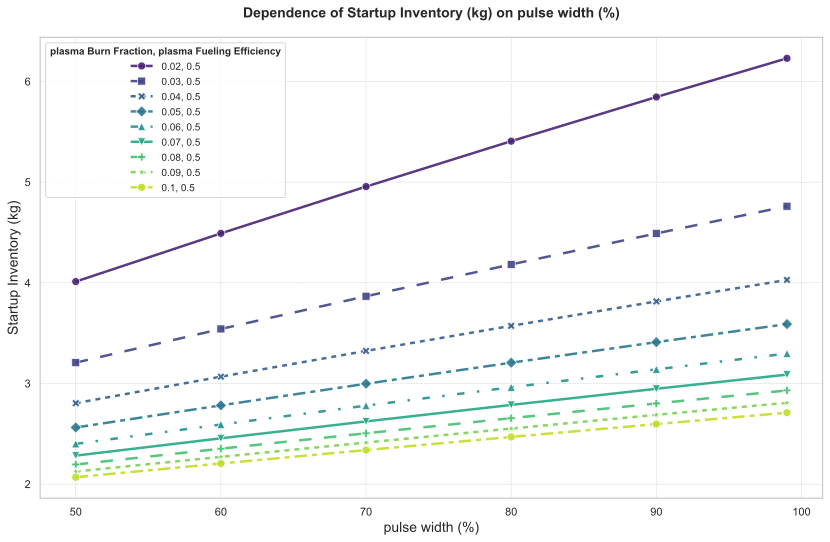
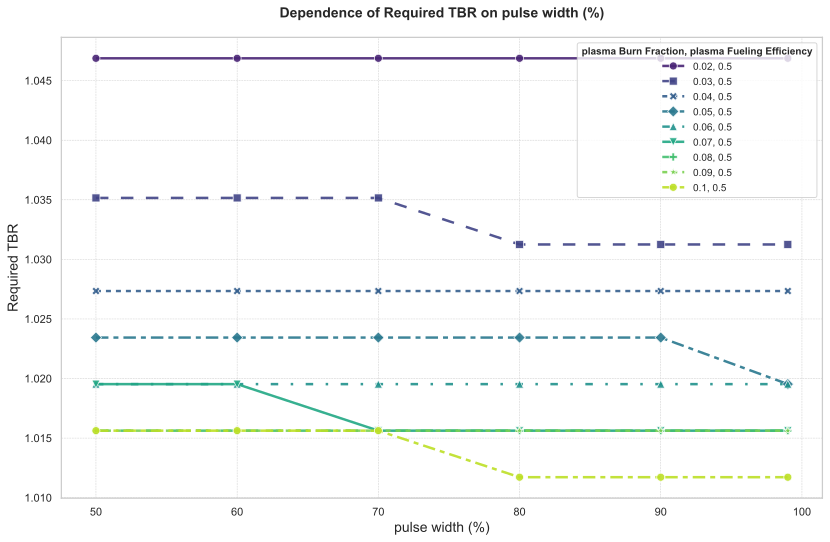

# pulse width 与 plasma Fueling Efficiency、plasma Burn Fraction 交互敏感性分析报告


生成时间: 2025-10-27 12:51:37.627143


## 分析案例配置详情


本分析案例的具体配置如下，这决定了仿真的扫描方式和分析的重点：


| 配置项 | 值 | 说明 |
| :--- | :--- | :--- |
| **`name`** | `"Pulse_PLASMA_Analysis"` | 本次分析案例的名称。 |
| **`independent_variable`** | `"pulse.width"` | 独立扫描变量，即本次分析中主要改变的参数。 |
| **`independent_variable_sampling`** | `[50, 60, 70, 80, 90, 99]` | 独立变量的采样方法和范围。 |
| **`default_independent_values`** | `{"pulse.width": 90.0}` | 独立扫描变量在模型中的原始默认值。 |
| **`simulation_parameters`** | `{"plasma.Fueling_Efficiency": 0.5, "plasma.Burn_Fraction": [0.02, 0.03, 0.04, 0.05, 0.06, 0.07, 0.08, 0.09, 0.1]}` | 背景扫描参数，与独立变量组合形成多维扫描。 |
| **`default_simulation_values`** | `{"plasma.Fueling_Efficiency": 0.5, "plasma.Burn_Fraction": 0.05}` | 背景扫描参数在模型中的原始默认值。 |
| **`dependent_variables`** | `["Startup_Inventory", "Required_TBR"]` | 因变量，即我们关心的、随自变量变化的性能指标。 |


## “Required_TBR”优化配置

当“Required_TBR”作为因变量时，系统会启用一个二分查找算法来寻找满足特定性能指标的最小`bz.TBR`值。以下是本次优化任务的具体配置：


| 配置项 | 值 | 说明 |
| :--- | :--- | :--- |
| **`source_column`** | `"sds.inventory"` | 限制条件的数据源列。 |
| **`parameter_to_optimize`** | `"bz.TBR"` | 优化的目标参数。 |
| **`search_range`** | `[1, 1.5]` | 参数的搜索范围。 |
| **`tolerance`** | `0.005` | 搜索的收敛精度。 |
| **`max_iterations`** | `10` | 最大迭代次数。 |


## 性能指标分析图


### Startup Inventory vs pulse width




## 约束求解性能指标分析图


### Required TBR vs pulse width




## 性能指标总表 (分组: `plasma.Fueling_Efficiency`, `plasma.Burn_Fraction`)


#### 数据子表 (原始默认值: `plasma.Fueling_Efficiency=0.5` & `plasma.Burn_Fraction=0.05`)

##### 性能指标

|   pulse width (%) |   Startup Inventory (kg) |
|------------------:|-------------------------:|
|                50 |                     2.56 |
|                60 |                     2.78 |
|                70 |                     3    |
|                80 |                     3.21 |
|                90 |                     3.41 |
|                99 |                     3.59 |


##### “Required TBR” 相关数据

|   pulse width (%) |   Required TBR |
|------------------:|---------------:|
|                50 |         1.0234 |
|                60 |         1.0234 |
|                70 |         1.0234 |
|                80 |         1.0234 |
|                90 |         1.0234 |
|                99 |         1.0195 |


---

> 其他参数组合下的数据子表：

#### 数据子表 (当 `plasma.Fueling_Efficiency=0.5` & `plasma.Burn_Fraction=0.02` 时)

##### 性能指标

|   pulse width (%) |   Startup Inventory (kg) |
|------------------:|-------------------------:|
|                50 |                     4.01 |
|                60 |                     4.49 |
|                70 |                     4.96 |
|                80 |                     5.41 |
|                90 |                     5.85 |
|                99 |                     6.23 |


##### “Required TBR” 相关数据

|   pulse width (%) |   Required TBR |
|------------------:|---------------:|
|                50 |         1.0469 |
|                60 |         1.0469 |
|                70 |         1.0469 |
|                80 |         1.0469 |
|                90 |         1.0469 |
|                99 |         1.0469 |


#### 数据子表 (当 `plasma.Fueling_Efficiency=0.5` & `plasma.Burn_Fraction=0.03` 时)

##### 性能指标

|   pulse width (%) |   Startup Inventory (kg) |
|------------------:|-------------------------:|
|                50 |                     3.21 |
|                60 |                     3.54 |
|                70 |                     3.87 |
|                80 |                     4.18 |
|                90 |                     4.49 |
|                99 |                     4.76 |


##### “Required TBR” 相关数据

|   pulse width (%) |   Required TBR |
|------------------:|---------------:|
|                50 |         1.0352 |
|                60 |         1.0352 |
|                70 |         1.0352 |
|                80 |         1.0312 |
|                90 |         1.0312 |
|                99 |         1.0312 |


#### 数据子表 (当 `plasma.Fueling_Efficiency=0.5` & `plasma.Burn_Fraction=0.04` 时)

##### 性能指标

|   pulse width (%) |   Startup Inventory (kg) |
|------------------:|-------------------------:|
|                50 |                     2.8  |
|                60 |                     3.07 |
|                70 |                     3.32 |
|                80 |                     3.57 |
|                90 |                     3.82 |
|                99 |                     4.03 |


##### “Required TBR” 相关数据

|   pulse width (%) |   Required TBR |
|------------------:|---------------:|
|                50 |         1.0273 |
|                60 |         1.0273 |
|                70 |         1.0273 |
|                80 |         1.0273 |
|                90 |         1.0273 |
|                99 |         1.0273 |


#### 数据子表 (当 `plasma.Fueling_Efficiency=0.5` & `plasma.Burn_Fraction=0.06` 时)

##### 性能指标

|   pulse width (%) |   Startup Inventory (kg) |
|------------------:|-------------------------:|
|                50 |                     2.4  |
|                60 |                     2.59 |
|                70 |                     2.78 |
|                80 |                     2.96 |
|                90 |                     3.14 |
|                99 |                     3.3  |


##### “Required TBR” 相关数据

|   pulse width (%) |   Required TBR |
|------------------:|---------------:|
|                50 |         1.0195 |
|                60 |         1.0195 |
|                70 |         1.0195 |
|                80 |         1.0195 |
|                90 |         1.0195 |
|                99 |         1.0195 |


#### 数据子表 (当 `plasma.Fueling_Efficiency=0.5` & `plasma.Burn_Fraction=0.07` 时)

##### 性能指标

|   pulse width (%) |   Startup Inventory (kg) |
|------------------:|-------------------------:|
|                50 |                     2.28 |
|                60 |                     2.46 |
|                70 |                     2.62 |
|                80 |                     2.79 |
|                90 |                     2.95 |
|                99 |                     3.09 |


##### “Required TBR” 相关数据

|   pulse width (%) |   Required TBR |
|------------------:|---------------:|
|                50 |         1.0195 |
|                60 |         1.0195 |
|                70 |         1.0156 |
|                80 |         1.0156 |
|                90 |         1.0156 |
|                99 |         1.0156 |


#### 数据子表 (当 `plasma.Fueling_Efficiency=0.5` & `plasma.Burn_Fraction=0.08` 时)

##### 性能指标

|   pulse width (%) |   Startup Inventory (kg) |
|------------------:|-------------------------:|
|                50 |                     2.19 |
|                60 |                     2.35 |
|                70 |                     2.51 |
|                80 |                     2.66 |
|                90 |                     2.8  |
|                99 |                     2.93 |


##### “Required TBR” 相关数据

|   pulse width (%) |   Required TBR |
|------------------:|---------------:|
|                50 |         1.0156 |
|                60 |         1.0156 |
|                70 |         1.0156 |
|                80 |         1.0156 |
|                90 |         1.0156 |
|                99 |         1.0156 |


#### 数据子表 (当 `plasma.Fueling_Efficiency=0.5` & `plasma.Burn_Fraction=0.09` 时)

##### 性能指标

|   pulse width (%) |   Startup Inventory (kg) |
|------------------:|-------------------------:|
|                50 |                     2.13 |
|                60 |                     2.27 |
|                70 |                     2.41 |
|                80 |                     2.55 |
|                90 |                     2.69 |
|                99 |                     2.81 |


##### “Required TBR” 相关数据

|   pulse width (%) |   Required TBR |
|------------------:|---------------:|
|                50 |         1.0156 |
|                60 |         1.0156 |
|                70 |         1.0156 |
|                80 |         1.0156 |
|                90 |         1.0156 |
|                99 |         1.0156 |


#### 数据子表 (当 `plasma.Fueling_Efficiency=0.5` & `plasma.Burn_Fraction=0.1` 时)

##### 性能指标

|   pulse width (%) |   Startup Inventory (kg) |
|------------------:|-------------------------:|
|                50 |                     2.07 |
|                60 |                     2.2  |
|                70 |                     2.34 |
|                80 |                     2.47 |
|                90 |                     2.6  |
|                99 |                     2.71 |


##### “Required TBR” 相关数据

|   pulse width (%) |   Required TBR |
|------------------:|---------------:|
|                50 |         1.0156 |
|                60 |         1.0156 |
|                70 |         1.0156 |
|                80 |         1.0117 |
|                90 |         1.0117 |
|                99 |         1.0117 |


---

# AI模型分析提示词 (deepseek-v3.1)

```markdown
**角色：** 你是一名聚变反应堆氚燃料循环领域的专家。

**任务：** 请**完全基于**下方提供的**两类数据表格**，对聚变堆燃料循环模型的**敏感性分析**结果进行深度解读。

**分析要点 (必须严格依据数据表格作答)：**

1.  **全局敏感性分析 (参考“性能指标总表”) :**
    *   分析性能指标总表（ `Startup_Inventory`, `Doubling_Time` 以及以 `Required_` 开头的求解指标等）呈现出怎样的**总体趋势**？请进行量化描述。
    *   如果存在多个性能指标，分析哪个性能指标对独立变量 `pulse.width` 的变化最为敏感？哪个最不敏感？

2.  **交互效应分析：** 本次分析包含了多变量的交互效应。请分析独立变量 `pulse.width` 与背景扫描参数 (`plasma.Fueling_Efficiency`, `plasma.Burn_Fraction`) 之间的交互作用对各项性能指标的影响。请注意，独立变量或背景扫描参数中，可能包含常规的模型参数，也可能包含为满足特定性能目标（限制倍增时间Double_Time达到倍增）而求解出的特殊变量（约束限制变量Double_Time）。请讨论在不同的变量组合下，性能指标的敏感性有何不同？是否存在显著的交互效应？

3.  **综合结论：**
结合所有分析（包括主趋势、背景参数交互效应），总结在不同的运行场景下，调整 `pulse.width` 对整个氚燃料循环系统的综合影响和潜在的利弊权衡。
    *   基于这些发现，可以得出哪些关于系统设计或运行优化的初步建议？
```


---

# AI模型分析结果

根据提供的性能指标总表，我对聚变堆燃料循环模型中 `pulse.width` 与 `plasma.Fueling_Efficiency`、`plasma.Burn_Fraction` 的交互敏感性分析结果进行深度解读如下：

### 1. 全局敏感性分析

#### 1.1 Startup Inventory 的总体趋势
- **Startup Inventory** 随 `pulse.width` 增加而**线性增加**。例如，在默认背景参数组合（`plasma.Fueling_Efficiency=0.5`, `plasma.Burn_Fraction=0.05`）下：
  - `pulse.width=50%` 时，Startup Inventory = 2.56 kg
  - `pulse.width=99%` 时，Startup Inventory = 3.59 kg
  - 增幅约为 40.2%（绝对增加 1.03 kg）

- 这种增长趋势在所有背景参数组合下均保持一致，表明 `pulse.width` 是 Startup Inventory 的**强正相关驱动因素**。

#### 1.2 Required TBR 的总体趋势
- **Required TBR** 对 `pulse.width` 的变化**相对不敏感**，变化幅度很小（大部分在 1.0117-1.0469 范围内）。
- 在默认参数组合下，Required TBR 基本保持稳定（1.0234），仅在 `pulse.width=99%` 时略微下降至 1.0195。
- 最大变化发生在 `plasma.Burn_Fraction=0.02` 时，但即使在这里，Required TBR 也保持恒定（1.0469）。

#### 1.3 敏感性排序
基于数据变化幅度：
1. **最敏感指标**：Startup Inventory - 对 `pulse.width` 变化响应显著（变化幅度达 40%+）
2. **最不敏感指标**：Required TBR - 变化幅度极小（<3%）

### 2. 交互效应分析

#### 2.1 plasma.Burn_Fraction 的交互影响
**对 Startup Inventory 的影响**：
- `plasma.Burn_Fraction` 对 Startup Inventory 有**显著影响**：
  - 当 `Burn_Fraction=0.02`（低燃烧率）时，Startup Inventory 值最高（4.01-6.23 kg）
  - 当 `Burn_Fraction=0.1`（高燃烧率）时，Startup Inventory 值最低（2.07-2.71 kg）
- **交互效应明显**：`pulse.width` 的增加效应在低 `Burn_Fraction` 时更为显著。例如：
  - `Burn_Fraction=0.02` 时，`pulse.width` 从 50% 到 99% 导致 Startup Inventory 增加 2.22 kg
  - `Burn_Fraction=0.1` 时，同样变化仅增加 0.64 kg

**对 Required TBR 的影响**：
- `plasma.Burn_Fraction` 是 Required TBR 的**主要决定因素**：
  - 低 `Burn_Fraction` (0.02) 需要更高的 TBR (1.0469)
  - 高 `Burn_Fraction` (0.1) 需要较低的 TBR (1.0117-1.0156)
- `pulse.width` 与 `Burn_Fraction` 的交互效应较弱，Required TBR 主要受 `Burn_Fraction` 单独控制。

#### 2.2 plasma.Fueling_Efficiency 的影响
- 本次分析中 `plasma.Fueling_Efficiency` 保持恒定（0.5），因此无法评估其交互效应。这是一个分析设计的局限性。

#### 2.3 约束限制变量的影响
- 分析中的 `Required TBR` 本身就是为满足特定性能目标（限制倍增时间）而求解出的约束变量。
- 数据显示，为了维持系统倍增能力，在低燃烧率条件下需要更高的氚增殖比（TBR），这与物理直觉一致。

### 3. 综合结论与建议

#### 3.1 主要发现
1. **脉冲宽度权衡**：增加 `pulse.width` 会显著增加初始氚库存需求，但对所需 TBR 影响有限。
2. **燃烧率的关键作用**：`plasma.Burn_Fraction` 是影响系统氚需求的核心参数，低燃烧率场景需要更高的初始库存和更高的 TBR 要求。
3. **参数耦合**：`pulse.width` 的敏感性高度依赖于 `Burn_Fraction` 的值，在低燃烧率条件下其影响更为显著。

#### 3.2 设计优化建议
1. **对于追求最小化初始氚库存**：
   - 应选择**较短的脉冲宽度**（如 50-60%）
   - 同时尽可能提高**燃烧率**（target ~0.1）

2. **对于TBR设计约束**：
   - 在低燃烧率场景下（<0.05），需要设计更高的 TBR（>1.04）
   - 脉冲宽度对 TBR 要求影响较小，可优先优化其他参数

3. **系统运行策略**：
   - 在高燃烧率条件下，可以适当增加脉冲宽度而不显著增加氚需求
   - 在低燃烧率条件下，应严格控制脉冲宽度以限制氚库存需求

#### 3.3 进一步研究建议
- 应扩展分析包含 `plasma.Fueling_Efficiency` 的变化范围，以全面评估三参数交互效应
- 考虑将 `Doubling_Time` 作为显性性能指标纳入分析
- 探索脉冲宽度与燃烧率之间的最优匹配关系，寻找系统综合性能的帕累托前沿

此分析为聚变堆燃料循环系统的参数优化提供了重要的量化依据，特别是在初始氚库存管理和增殖包层设计方面具有直接指导意义。
```
