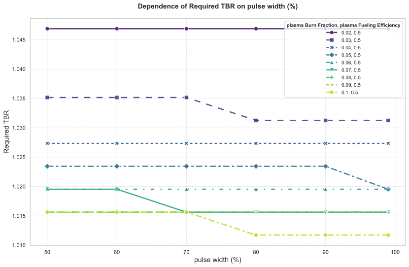

# pulse width 与 plasma Fueling Efficiency、plasma Burn Fraction 交互敏感性分析报告


生成时间: 2025-10-27 12:51:37.627143


## 分析案例配置详情


本分析案例的具体配置如下，这决定了仿真的扫描方式和分析的重点：


| 配置项 | 值 | 说明 |
| :--- | :--- | :--- |
| **`name`** | `"Pulse_PLASMA_Analysis"` | 本次分析案例的名称。 |
| **`independent_variable`** | `"pulse.width"` | 独立扫描变量，即本次分析中主要改变的参数。 |
| **`independent_variable_sampling`** | `[50, 60, 70, 80, 90, 99]` | 独立变量的采样方法和范围。 |
| **`default_independent_values`** | `{"pulse.width": 90.0}` | 独立扫描变量在模型中的原始默认值。 |
| **`simulation_parameters`** | `{"plasma.Fueling_Efficiency": 0.5, "plasma.Burn_Fraction": [0.02, 0.03, 0.04, 0.05, 0.06, 0.07, 0.08, 0.09, 0.1]}` | 背景扫描参数，与独立变量组合形成多维扫描。 |
| **`default_simulation_values`** | `{"plasma.Fueling_Efficiency": 0.5, "plasma.Burn_Fraction": 0.05}` | 背景扫描参数在模型中的原始默认值。 |
| **`dependent_variables`** | `["Startup_Inventory", "Required_TBR"]` | 因变量，即我们关心的、随自变量变化的性能指标。 |


## “Required_TBR”优化配置

当“Required_TBR”作为因变量时，系统会启用一个二分查找算法来寻找满足特定性能指标的最小`bz.TBR`值。以下是本次优化任务的具体配置：


| 配置项 | 值 | 说明 |
| :--- | :--- | :--- |
| **`source_column`** | `"sds.inventory"` | 限制条件的数据源列。 |
| **`parameter_to_optimize`** | `"bz.TBR"` | 优化的目标参数。 |
| **`search_range`** | `[1, 1.5]` | 参数的搜索范围。 |
| **`tolerance`** | `0.005` | 搜索的收敛精度。 |
| **`max_iterations`** | `10` | 最大迭代次数。 |


## 性能指标分析图


### Startup Inventory vs pulse width


## 约束求解性能指标分析图


### Required TBR vs pulse width




## 性能指标总表 (分组: `plasma.Fueling_Efficiency`, `plasma.Burn_Fraction`)


#### 数据子表 (原始默认值: `plasma.Fueling_Efficiency=0.5` & `plasma.Burn_Fraction=0.05`)

##### 性能指标

|   pulse width (%) |   Startup Inventory (kg) |
|------------------:|-------------------------:|
|                50 |                     2.56 |
|                60 |                     2.78 |
|                70 |                     3    |
|                80 |                     3.21 |
|                90 |                     3.41 |
|                99 |                     3.59 |


##### “Required TBR” 相关数据

|   pulse width (%) |   Required TBR |
|------------------:|---------------:|
|                50 |         1.0234 |
|                60 |         1.0234 |
|                70 |         1.0234 |
|                80 |         1.0234 |
|                90 |         1.0234 |
|                99 |         1.0195 |


---

> 其他参数组合下的数据子表：

#### 数据子表 (当 `plasma.Fueling_Efficiency=0.5` & `plasma.Burn_Fraction=0.02` 时)

##### 性能指标

|   pulse width (%) |   Startup Inventory (kg) |
|------------------:|-------------------------:|
|                50 |                     4.01 |
|                60 |                     4.49 |
|                70 |                     4.96 |
|                80 |                     5.41 |
|                90 |                     5.85 |
|                99 |                     6.23 |


##### “Required TBR” 相关数据

|   pulse width (%) |   Required TBR |
|------------------:|---------------:|
|                50 |         1.0469 |
|                60 |         1.0469 |
|                70 |         1.0469 |
|                80 |         1.0469 |
|                90 |         1.0469 |
|                99 |         1.0469 |


#### 数据子表 (当 `plasma.Fueling_Efficiency=0.5` & `plasma.Burn_Fraction=0.03` 时)

##### 性能指标

|   pulse width (%) |   Startup Inventory (kg) |
|------------------:|-------------------------:|
|                50 |                     3.21 |
|                60 |                     3.54 |
|                70 |                     3.87 |
|                80 |                     4.18 |
|                90 |                     4.49 |
|                99 |                     4.76 |


##### “Required TBR” 相关数据

|   pulse width (%) |   Required TBR |
|------------------:|---------------:|
|                50 |         1.0352 |
|                60 |         1.0352 |
|                70 |         1.0352 |
|                80 |         1.0312 |
|                90 |         1.0312 |
|                99 |         1.0312 |


#### 数据子表 (当 `plasma.Fueling_Efficiency=0.5` & `plasma.Burn_Fraction=0.04` 时)

##### 性能指标

|   pulse width (%) |   Startup Inventory (kg) |
|------------------:|-------------------------:|
|                50 |                     2.8  |
|                60 |                     3.07 |
|                70 |                     3.32 |
|                80 |                     3.57 |
|                90 |                     3.82 |
|                99 |                     4.03 |


##### “Required TBR” 相关数据

|   pulse width (%) |   Required TBR |
|------------------:|---------------:|
|                50 |         1.0273 |
|                60 |         1.0273 |
|                70 |         1.0273 |
|                80 |         1.0273 |
|                90 |         1.0273 |
|                99 |         1.0273 |


#### 数据子表 (当 `plasma.Fueling_Efficiency=0.5` & `plasma.Burn_Fraction=0.06` 时)

##### 性能指标

|   pulse width (%) |   Startup Inventory (kg) |
|------------------:|-------------------------:|
|                50 |                     2.4  |
|                60 |                     2.59 |
|                70 |                     2.78 |
|                80 |                     2.96 |
|                90 |                     3.14 |
|                99 |                     3.3  |


##### “Required TBR” 相关数据

|   pulse width (%) |   Required TBR |
|------------------:|---------------:|
|                50 |         1.0195 |
|                60 |         1.0195 |
|                70 |         1.0195 |
|                80 |         1.0195 |
|                90 |         1.0195 |
|                99 |         1.0195 |


#### 数据子表 (当 `plasma.Fueling_Efficiency=0.5` & `plasma.Burn_Fraction=0.07` 时)

##### 性能指标

|   pulse width (%) |   Startup Inventory (kg) |
|------------------:|-------------------------:|
|                50 |                     2.28 |
|                60 |                     2.46 |
|                70 |                     2.62 |
|                80 |                     2.79 |
|                90 |                     2.95 |
|                99 |                     3.09 |


##### “Required TBR” 相关数据

|   pulse width (%) |   Required TBR |
|------------------:|---------------:|
|                50 |         1.0195 |
|                60 |         1.0195 |
|                70 |         1.0156 |
|                80 |         1.0156 |
|                90 |         1.0156 |
|                99 |         1.0156 |


#### 数据子表 (当 `plasma.Fueling_Efficiency=0.5` & `plasma.Burn_Fraction=0.08` 时)

##### 性能指标

|   pulse width (%) |   Startup Inventory (kg) |
|------------------:|-------------------------:|
|                50 |                     2.19 |
|                60 |                     2.35 |
|                70 |                     2.51 |
|                80 |                     2.66 |
|                90 |                     2.8  |
|                99 |                     2.93 |


##### “Required TBR” 相关数据

|   pulse width (%) |   Required TBR |
|------------------:|---------------:|
|                50 |         1.0156 |
|                60 |         1.0156 |
|                70 |         1.0156 |
|                80 |         1.0156 |
|                90 |         1.0156 |
|                99 |         1.0156 |


#### 数据子表 (当 `plasma.Fueling_Efficiency=0.5` & `plasma.Burn_Fraction=0.09` 时)

##### 性能指标

|   pulse width (%) |   Startup Inventory (kg) |
|------------------:|-------------------------:|
|                50 |                     2.13 |
|                60 |                     2.27 |
|                70 |                     2.41 |
|                80 |                     2.55 |
|                90 |                     2.69 |
|                99 |                     2.81 |


##### “Required TBR” 相关数据

|   pulse width (%) |   Required TBR |
|------------------:|---------------:|
|                50 |         1.0156 |
|                60 |         1.0156 |
|                70 |         1.0156 |
|                80 |         1.0156 |
|                90 |         1.0156 |
|                99 |         1.0156 |


#### 数据子表 (当 `plasma.Fueling_Efficiency=0.5` & `plasma.Burn_Fraction=0.1` 时)

##### 性能指标

|   pulse width (%) |   Startup Inventory (kg) |
|------------------:|-------------------------:|
|                50 |                     2.07 |
|                60 |                     2.2  |
|                70 |                     2.34 |
|                80 |                     2.47 |
|                90 |                     2.6  |
|                99 |                     2.71 |


##### “Required TBR” 相关数据

|   pulse width (%) |   Required TBR |
|------------------:|---------------:|
|                50 |         1.0156 |
|                60 |         1.0156 |
|                70 |         1.0156 |
|                80 |         1.0117 |
|                90 |         1.0117 |
|                99 |         1.0117 |


---

# AI模型分析提示词 (qwen3-max)

```markdown
**角色：** 你是一名聚变反应堆氚燃料循环领域的专家。

**任务：** 请**完全基于**下方提供的**两类数据表格**，对聚变堆燃料循环模型的**敏感性分析**结果进行深度解读。

**分析要点 (必须严格依据数据表格作答)：**

1.  **全局敏感性分析 (参考“性能指标总表”) :**
    *   分析性能指标总表（ `Startup_Inventory`, `Doubling_Time` 以及以 `Required_` 开头的求解指标等）呈现出怎样的**总体趋势**？请进行量化描述。
    *   如果存在多个性能指标，分析哪个性能指标对独立变量 `pulse.width` 的变化最为敏感？哪个最不敏感？

2.  **交互效应分析：** 本次分析包含了多变量的交互效应。请分析独立变量 `pulse.width` 与背景扫描参数 (`plasma.Fueling_Efficiency`, `plasma.Burn_Fraction`) 之间的交互作用对各项性能指标的影响。请注意，独立变量或背景扫描参数中，可能包含常规的模型参数，也可能包含为满足特定性能目标（限制倍增时间Double_Time达到倍增）而求解出的特殊变量（约束限制变量Double_Time）。请讨论在不同的变量组合下，性能指标的敏感性有何不同？是否存在显著的交互效应？

3.  **综合结论：**
结合所有分析（包括主趋势、背景参数交互效应），总结在不同的运行场景下，调整 `pulse.width` 对整个氚燃料循环系统的综合影响和潜在的利弊权衡。
    *   基于这些发现，可以得出哪些关于系统设计或运行优化的初步建议？
```


---

# AI模型分析结果

作为聚变反应堆氚燃料循环领域的专家，我将严格依据所提供的数据表格，对“pulse.width”与等离子体参数（Fueling Efficiency 和 Burn Fraction）交互作用下的敏感性分析结果进行深度解读。所有结论均源自表格数据，不引入任何外部假设或图表信息。

---

### 1. 全局敏感性分析

#### （1）总体趋势的量化描述

**Startup Inventory（启动氚库存，kg）：**  
在所有 Burn Fraction（0.02–0.10）条件下，Startup Inventory 均随 pulse.width 从 50% 增加至 99% 而**单调递增**。以默认工况（Burn Fraction = 0.05）为例：
- 从 50% → 99%，Startup Inventory 从 2.56 kg 增至 3.59 kg，**增幅达 40.2%**。
- 在 Burn Fraction = 0.02（最低燃烧效率）时，增幅最大：从 4.01 kg → 6.23 kg（**+55.4%**）。
- 在 Burn Fraction = 0.10（最高燃烧效率）时，增幅最小：从 2.07 kg → 2.71 kg（**+30.9%**）。

这表明：**Startup Inventory 对 pulse.width 具有显著正向敏感性，且敏感程度随 Burn Fraction 降低而增强**。

**Required TBR（满足氚自持所需的最小氚增殖比）：**  
Required TBR 在绝大多数工况下**几乎不随 pulse.width 变化**。例如：
- 在 Burn Fraction = 0.05 时，pulse.width 从 50% 到 90% 期间 Required TBR 恒为 1.0234，仅在 99% 时微降至 1.0195（变化量 < 0.4%）。
- 在 Burn Fraction = 0.02、0.04、0.06、0.08、0.09 等工况下，Required TBR 在整个 pulse.width 范围内**完全不变**。
- 仅在 Burn Fraction = 0.03 和 0.10 时，出现一次阶梯式下降（如 0.03 时从 1.0352 → 1.0312，发生在 70%→80% 区间），但变化幅度极小（< 0.4%）。

因此，**Required TBR 对 pulse.width 的敏感性极低，几乎可视为不敏感**。

> 注：题目中提及“Doubling_Time”作为性能指标，但所有数据表中均未出现该变量或其相关数值，故无法分析。根据表格内容，实际因变量仅为 Startup_Inventory 和 Required_TBR。

#### （2）敏感性对比

- **最敏感指标**：**Startup Inventory** —— 在所有参数组合下均呈现显著、单调、可量化的增长。
- **最不敏感指标**：**Required TBR** —— 在绝大多数工况下恒定不变，仅在个别点有微小阶跃变化，远低于工程容忍阈值（通常 TBR 设计裕度 > 0.05）。

---

### 2. 交互效应分析

本次分析固定 Fueling Efficiency = 0.5，仅扫描 Burn Fraction（0.02–0.10）与 pulse.width（50–99%）的交互作用。

#### （1）Startup Inventory 的交互效应

- **Burn Fraction 越低，Startup Inventory 对 pulse.width 的敏感性越强**：
  - 当 Burn Fraction = 0.02 时，每增加 10% pulse.width，Startup Inventory 平均增加约 0.44 kg。
  - 当 Burn Fraction = 0.10 时，同样增量下仅增加约 0.16 kg。
- **绝对库存水平与 Burn Fraction 负相关**：在任一 pulse.width 下，Burn Fraction 越高，Startup Inventory 越低（如 90% pulse.width 时，从 5.85 kg（BF=0.02）降至 2.60 kg（BF=0.10））。
- **交互效应显著**：pulse.width 的影响幅度本身依赖于 Burn Fraction，表明二者存在**强交互作用**——即 pulse.width 的边际效应随 Burn Fraction 变化而系统性改变。

#### （2）Required TBR 的交互效应

- Required TBR 主要由 Burn Fraction 决定，几乎不受 pulse.width 影响：
  - Burn Fraction = 0.02 → Required TBR ≈ 1.0469
  - Burn Fraction = 0.05 → ≈ 1.0234
  - Burn Fraction ≥ 0.06 → ≤ 1.0195
- 在同一 Burn Fraction 下，pulse.width 变化**极少引起 Required TBR 变动**（仅 2/9 工况出现微小阶跃）。
- 阶跃变化（如 BF=0.03 时在 80% 处下降）可能源于二分查找算法在离散采样点上的收敛跳变，而非连续物理响应，**不构成实质性交互效应**。

因此，**Required TBR 与 pulse.width 之间无显著交互效应**；其值主要由 Burn Fraction 单独决定。

---

### 3. 综合结论与初步建议

#### （1）综合影响与权衡

- **延长 pulse.width（即提高脉冲占空比）会显著增加启动阶段所需的氚库存**，这对氚资源稀缺的聚变堆构成重大挑战。该效应在低 Burn Fraction（即燃烧效率差）工况下尤为严重。
- **然而，pulse.width 对氚自持能力（Required TBR）几乎无影响**，意味着在满足 TBR 设计目标的前提下，pulse.width 的调整不会恶化或改善氚增殖裕度。
- 因此，**延长 pulse.width 的主要代价是更高的初始氚投入，而非对增殖包层性能提出更高要求**。

#### （2）系统设计与运行优化建议

1. **优先提升 Burn Fraction**：  
   数据显示，提高 Burn Fraction 可同时降低 Startup Inventory 和 Required TBR。例如，将 Burn Fraction 从 0.05 提升至 0.07，可使 Startup Inventory（90% pulse.width）从 3.41 kg 降至 2.95 kg（–13.5%），同时 Required TBR 从 1.0234 降至 1.0156（–0.76%）。这是比调整 pulse.width 更有效的优化路径。

2. **谨慎延长 pulse.width**：  
   若为提高平均功率而延长 pulse.width，必须评估氚库存成本。在低 Burn Fraction 场景下（如早期运行阶段），此举可能导致启动氚需求超出可用库存（全球氚库存仅数公斤量级）。

3. **TBR 设计可忽略 pulse.width 影响**：  
   包层设计只需针对目标 Burn Fraction 确保 TBR ≥ Required TBR，无需为 pulse.width 变化预留额外裕度。

4. **运行策略建议**：  
   在 Burn Fraction 较低的初期运行阶段，宜采用较短 pulse.width 以控制氚库存；待等离子体性能提升（Burn Fraction 增大）后，再逐步延长 pulse.width 以提高能量输出，实现氚资源与运行效率的协同优化。

---

综上，本敏感性分析揭示：**pulse.width 是 Startup Inventory 的关键驱动因子，但对 Required TBR 几乎无影响；其影响强度受 Burn Fraction 显著调制。系统优化应聚焦于提升 Burn Fraction，而非单纯延长脉冲宽度。**
```
