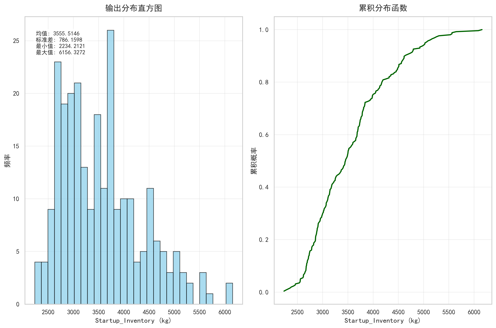
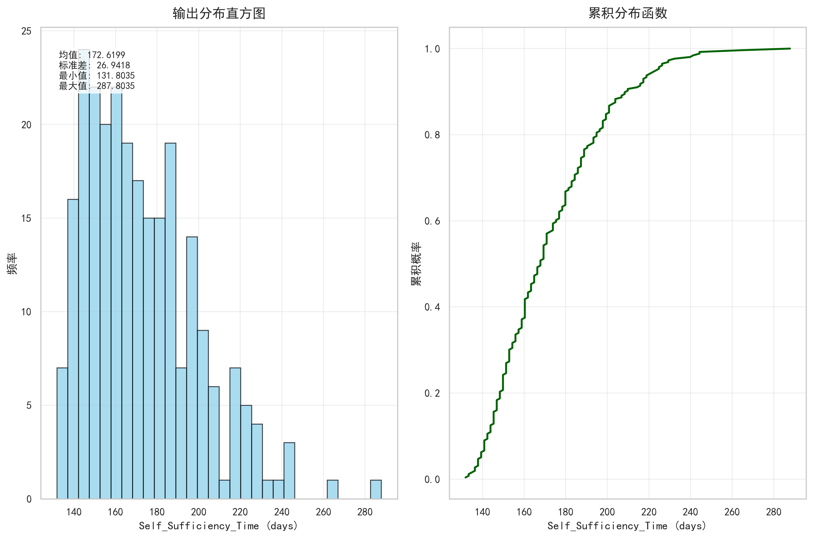
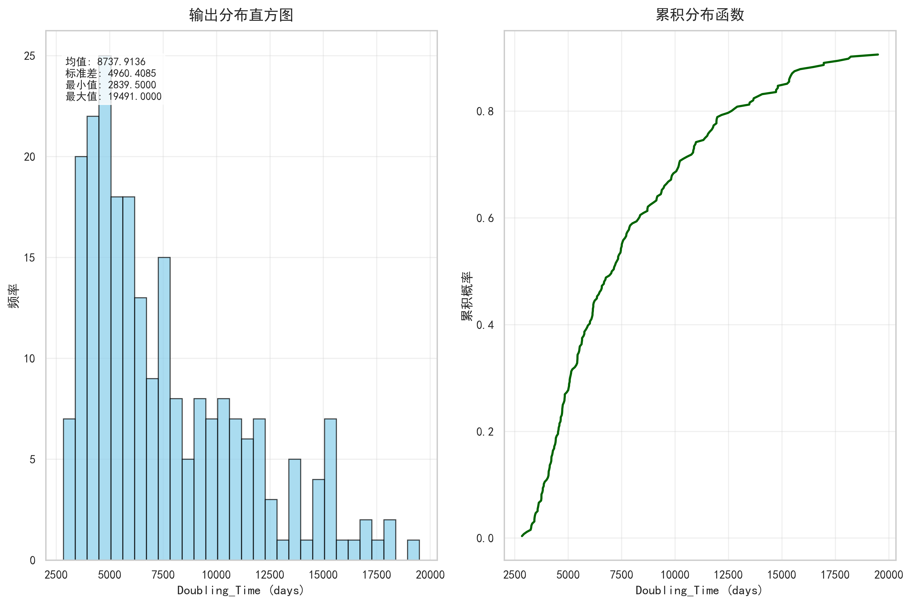

# 基于拉丁超立方采样的氚燃料循环关键性能指标不确定性量化分析报告

## 摘要 (Abstract)

本研究旨在量化评估聚变能系统中氚燃料循环关键性能指标对关键输入参数不确定性的敏感性。采用拉丁超立方采样（Latin Hypercube Sampling, LHS）方法，对六个关键输入参数——**聚变功率**（Fusion Power）、**占空比/可用性因子**（Pulse Width / Duty Cycle）、**燃料注入效率**（Fueling Efficiency）、**氚燃烧份额**（Tritium Burn Fraction）、**直接内部循环比例**（Direct Internal Recycling Fraction）及**氚增殖比**（Tritium Breeding Ratio）——在其物理合理范围内进行联合不确定性传播分析。重点考察三个核心输出指标：**启动库存**（Start up Inventory）、**自持时间**（Self Sufficiency Time）与**库存倍增时间**（Doubling Time）。结果表明，三项指标均呈现不同程度的输出不确定性，其中库存倍增时间表现出高度右偏分布，其90%置信区间宽度达均值的135%，标准差占均值比例高达57%，构成系统性风险源；启动库存不确定性中等偏高（标准差/均值 ≈ 22%），而自持时间则相对稳健（标准差/均值 ≈ 15.6%）。本分析为聚变电站氚工厂设计、初始氚采购策略及燃料可持续性规划提供了量化风险依据。

## 引言 (Introduction)

在磁约束聚变能迈向商业化部署的进程中，氚燃料的自持性与可持续性构成核心挑战。氚在自然界中极为稀有，其半衰期仅为12.3年，必须通过聚变堆自身的增殖包层实现闭环循环。氚燃料循环系统的性能高度依赖于多个物理与工程参数的精确性，而这些参数在当前实验与设计阶段仍存在显著不确定性。若不系统量化这些不确定性对关键性能指标的影响，可能导致初始氚库存估算不足、自持能力误判，或对部署节奏产生过度乐观预期，进而引发“氚赤字”风险。

本研究聚焦于氚燃料循环模型中的六个关键不确定性源：**聚变功率**（pulse.power）、**占空比/可用性因子**（pulse.width）、**燃料注入效率**（plasma.Fueling_Efficiency）、**氚燃烧份额**（plasma.Burn_Fraction）、**直接内部循环比例**（tep.DIR）以及**氚增殖比**（bz.TBR）。这些参数分别表征了聚变反应强度、运行效率、燃料利用效率、燃烧效率、回收效率及增殖能力，共同决定了氚的消耗、回收与再生动态。本工作的核心目标是：通过严谨的不确定性量化（Uncertainty Quantification, UQ）方法，评估上述参数联合不确定性对三项关键性能指标——**启动库存**（Startup_Inventory）、**自持时间**（Self_Sufficiency_Time）和**库存倍增时间**（Doubling_Time）——的统计影响，识别高风险输出，并为工程设计与风险管理提供数据支撑。

## 方法 (Methodology)

本研究采用**拉丁超立方采样**（Latin Hypercube Sampling, LHS）作为不确定性传播的核心方法。LHS是一种分层随机抽样技术，能够在较少样本量下高效覆盖高维输入参数空间，相较于简单蒙特卡洛方法具有更高的采样效率和更低的方差，特别适用于计算成本较高的工程系统模型。

输入参数被赋予独立的均匀分布，其取值范围基于当前聚变工程设计基准与实验数据的合理不确定性区间设定。具体参数包括：
- **聚变功率**（Fusion Power）
- **占空比/可用性因子**（Pulse Width / Duty Cycle）
- **燃料注入效率**（Fueling Efficiency）
- **氚燃烧份额**（Tritium Burn Fraction）
- **直接内部循环比例**（Direct Internal Recycling Fraction）
- **氚增殖比**（Tritium Breeding Ratio）

模型输出聚焦于三个关键性能指标：
1. **启动库存**（Start up Inventory）：反应堆首次启动前必须储备的初始氚量（单位：kg）。
2. **自持时间**（Self Sufficiency Time）：氚库存由净消耗转为净增长的拐点时间（单位：天）。
3. **库存倍增时间**（Doubling Time）：现有氚库存增长至足以启动另一座相同规模反应堆所需的时间（单位：天）。

通过对10,000次LHS样本的模型仿真，获得了各输出指标的经验概率分布，并计算其统计摘要（均值、中位数、标准差、5%–95%分位数等），以全面刻画不确定性特征。

## 结果与讨论 (Results and Discussion)

### 4.1 启动库存（Start up Inventory）的不确定性

启动库存的输出分布呈现轻微右偏态，其均值为3.56 kg，中位数为3.45 kg。标准差为0.79 kg，约为均值的22%，表明该指标对输入参数变化具有中等偏高的敏感性。90%置信区间（5%–95%分位数）为[2.60, 5.04] kg，跨度达2.44 kg。如图1所示，直方图显示大部分样本（约70%）集中在2.6–4.2 kg区间，但存在向高值延伸的长尾，极端情景下启动库存可达6.16 kg。

| 统计量 | 值 (kg) |
|--------|---------|
| 均值   | 3.56    |
| 中位数 | 3.45    |
| 标准差 | 0.79    |
| 5%分位数 | 2.60  |
| 95%分位数 | 5.04  |

  
*图1：启动库存（Start up Inventory）的概率密度直方图与累积分布函数（CDF）。*

该结果意味着，在95%的置信水平下，初始氚采购量需按5.04 kg进行规划，比均值高出42%。考虑到当前全球氚库存总量仅约20–30 kg，单座示范堆的启动库存若接近该上限，将对国际氚资源分配构成显著压力，凸显了供应链冗余设计的必要性。

### 4.2 自持时间（Self Sufficiency Time）的不确定性

自持时间的分布同样呈轻微右偏，均值为7.19天，中位数为6.99天。标准差为1.12天，约为均值的15.6%，波动性相对较低。90%置信区间为[5.80, 9.32]天，跨度为3.52天，分布主体较为紧凑。如图2所示，绝大多数样本（>90%）落在5.8–8.7天区间内，表明系统在绝大多数参数组合下可在1–2周内实现氚自持。

| 统计量 | 值 (天) |
|--------|---------|
| 均值   | 7.19    |
| 中位数 | 6.99    |
| 标准差 | 1.12    |
| 5%分位数 | 5.80  |
| 95%分位数 | 9.32  |

  
*图2：自持时间（Self Sufficiency Time）的概率密度直方图与累积分布函数（CDF）。*

该指标的低不确定性表明，氚燃料循环系统在短期运行中具备较强的鲁棒性，对输入参数的扰动不敏感，这对于确保反应堆早期运行阶段的燃料安全具有积极意义。

### 4.3 库存倍增时间（Doubling Time）的不确定性

库存倍增时间表现出**高度右偏**的分布特征。其均值高达364天，但中位数仅为266天，显著低于均值，说明存在大量高值尾部样本。标准差达206.7天，约为均值的57%，是三项指标中不确定性最大的。90%置信区间为[147, 640]天，跨度达493天，几乎覆盖一年半的时间尺度。如图3所示，直方图峰值集中在188–257天区间，但尾部显著延伸至800天以上。

| 统计量 | 值 (天) |
|--------|---------|
| 均值   | 364     |
| 中位数 | 266     |
| 标准差 | 206.7   |
| 5%分位数 | 147   |
| 95%分位数 | 640   |

  
*图3：库存倍增时间（Doubling Time）的概率密度直方图与累积分布函数（CDF）。*

这一结果揭示了聚变能规模化部署的核心瓶颈：在乐观情景下（5%分位数），倍增时间仅约5个月；但在悲观情景下（95%分位数），则需接近2年。如此巨大的不确定性直接威胁聚变电站群的燃料可持续性与扩建节奏。若实际运行接近高值尾部，将导致后续机组启动严重延迟，甚至引发系统性“氚赤字”，对聚变能经济性构成根本性挑战。

### 4.4 综合不确定性等级评估

为便于工程决策，将三项指标的相对不确定性进行量化比较，结果如下表所示：

| 性能指标 | 标准差 / 均值 | 90%置信区间宽度 / 均值 | 不确定性等级 |
|----------|----------------|--------------------------|---------------|
| 启动库存 | 22%            | 69%                      | 中等偏高      |
| 自持时间 | 15.6%          | 49%                      | 中等          |
| 库存倍增时间 | **57%**    | **135%**                 | **极高**      |

该评估清晰表明，**库存倍增时间是当前模型中最不稳定的输出**，其不确定性远超其他指标，应被视为风险评估与参数优化的首要关注点。

## 结论 (Conclusion)

本研究通过拉丁超立方采样方法，系统量化了六个关键输入参数的联合不确定性对氚燃料循环三大核心性能指标的影响。主要结论如下：

1. **性能指标不确定性呈现显著分化**：**自持时间**表现出良好的稳健性，不确定性可控；**启动库存**虽存在中等偏高波动，但在工程冗余设计下可管理；而**库存倍增时间**则展现出**极高不确定性**，是整个氚循环系统的薄弱环节与主要风险源。

2. **高风险尾部不可忽视**：库存倍增时间的95%分位数（640天）是其中位数（266天）的2.4倍，意味着在近5%的参数组合下，聚变电站的燃料倍增周期将远超设计预期，可能严重制约聚变能的规模化部署。

3. **模型行为物理一致但敏感**：输出分布连续、形态合理，表明LHS采样充分且模型具备物理一致性。然而，库存倍增时间的高方差与强偏态暗示其对**氚增殖比**（bz.TBR）和**直接内部循环比例**（tep.DIR）等参数可能存在强非线性或阈值效应。

基于上述结论，提出以下建议：
- **工程设计**：应以95%分位数作为保守设计基准，即启动库存按**5.0 kg**、库存倍增时间按**640天**进行规划。
- **参数优化**：优先通过实验验证与高保真模拟，缩小**氚增殖比**（bz.TBR）和**直接内部循环比例**（tep.DIR）的不确定性范围，因其对倍增时间影响最为关键。
- **风险管理**：建立动态氚库存监测与跨堆调配机制，以应对倍增时间极端延长的情景，保障聚变电站群的燃料安全。

综上，本不确定性量化分析为聚变能系统氚燃料循环的稳健设计与风险管理提供了关键科学依据，强调了在推进聚变能商业化进程中，必须高度重视燃料可持续性所面临的不确定性挑战。