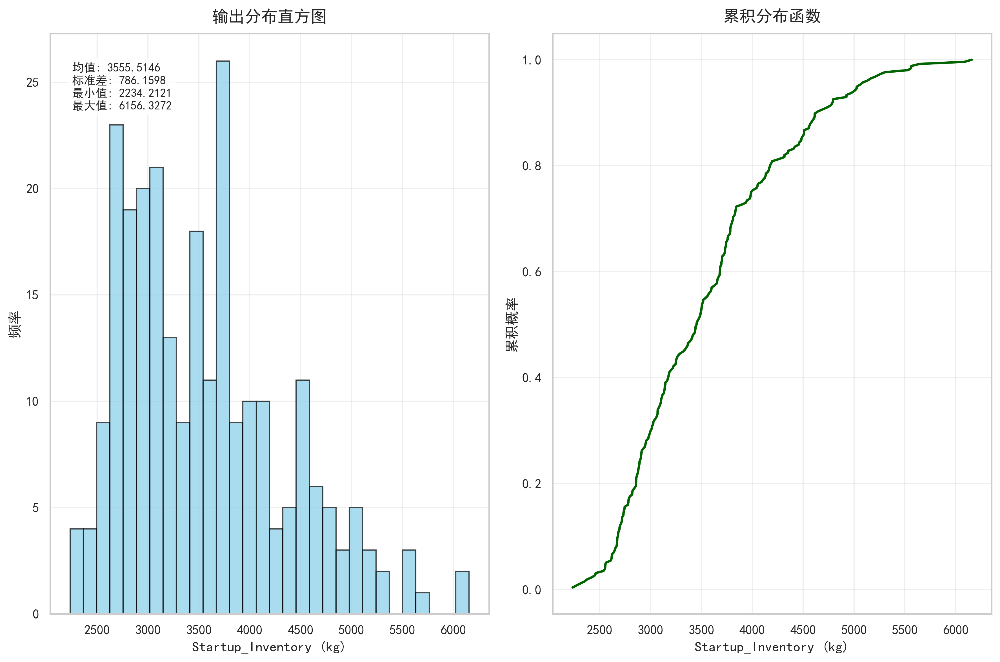
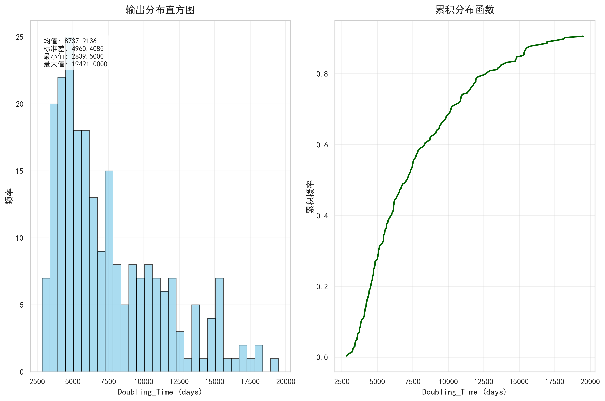

# SALib 不确定性分析报告

生成时间: 2025-10-29 16:09:03.689712

## 分析参数

- **pulse.power**: [1000.0000, 2000.0000] (MW)
- **pulse.width**: [80.0000, 99.0000] (%)
- **plasma.Fueling_Efficiency**: [0.3000, 0.7000]
- **plasma.Burn_Fraction**: [0.0300, 0.0700]
- **tep.DIR**: [0.7500, 0.9500]
- **bz.TBR**: [1.0500, 1.2500]

## Startup_Inventory 不确定性分析结果

### 统计摘要

- 均值: 3.5555 (kg)
- 标准差: 0.7862 (kg)
- 最小值: 2.2342 (kg)
- 最大值: 6.1563 (kg)

### 分布关键点 (CDF)

- 5%分位数: 2.5959 (kg)
- 10%分位数: 2.6812 (kg)
- 25%分位数 (Q1): 2.9075 (kg)
- 50%分位数 (中位数): 3.4530 (kg)
- 75%分位数 (Q3): 3.9922 (kg)
- 90%分位数: 4.6288 (kg)
- 95%分位数: 5.0353 (kg)

### 输出分布 (直方图数据)

| 数值范围 | 频数 |
|:---|---:|
| 2.23 - 2.63 | 17 |
| 2.63 - 3.02 | 62 |
| 3.02 - 3.41 | 43 |
| 3.41 - 3.80 | 55 |
| 3.80 - 4.20 | 29 |
| 4.20 - 4.59 | 20 |
| 4.59 - 4.98 | 14 |
| 4.98 - 5.37 | 10 |
| 5.37 - 5.76 | 4 |
| 5.76 - 6.16 | 2 |



## Self_Sufficiency_Time 不确定性分析结果

### 统计摘要

- 均值: 7.1925 (days)
- 标准差: 1.1226 (days)
- 最小值: 5.4918 (days)
- 最大值: 11.9918 (days)

### 分布关键点 (CDF)

- 5%分位数: 5.8043 (days)
- 10%分位数: 5.9293 (days)
- 25%分位数 (Q1): 6.3043 (days)
- 50%分位数 (中位数): 6.9918 (days)
- 75%分位数 (Q3): 7.8668 (days)
- 90%分位数: 8.7106 (days)
- 95%分位数: 9.3199 (days)

### 输出分布 (直方图数据)

| 数值范围 | 频数 |
|:---|---:|
| 5.49 - 6.14 | 47 |
| 6.14 - 6.79 | 64 |
| 6.79 - 7.44 | 51 |
| 7.44 - 8.09 | 41 |
| 8.09 - 8.74 | 29 |
| 8.74 - 9.39 | 13 |
| 9.39 - 10.04 | 6 |
| 10.04 - 10.69 | 3 |
| 10.69 - 11.34 | 1 |
| 11.34 - 11.99 | 1 |


## Doubling_Time 不确定性分析结果

### 统计摘要

- 均值: 364.0797 (days)
- 标准差: 206.6837 (days)
- 最小值: 118.3125 (days)
- 最大值: 812.1250 (days)

### 分布关键点 (CDF)

- 5%分位数: 147.0344 (days)
- 10%分位数: 159.1125 (days)
- 25%分位数 (Q1): 195.3281 (days)
- 50%分位数 (中位数): 266.2812 (days)
- 75%分位数 (Q3): 411.2792 (days)
- 90%分位数: 562.1492 (days)
- 95%分位数: 639.7574 (days)

### 输出分布 (直方图数据)

| 数值范围 | 频数 |
|:---|---:|
| 118.31 - 187.69 | 49 |
| 187.69 - 257.07 | 61 |
| 257.07 - 326.46 | 37 |
| 326.46 - 395.84 | 21 |
| 395.84 - 465.22 | 22 |
| 465.22 - 534.60 | 16 |
| 534.60 - 603.98 | 7 |
| 603.98 - 673.36 | 12 |
| 673.36 - 742.74 | 4 |
| 742.74 - 812.12 | 3 |




---

# AI模型分析提示词

```markdown
**角色：** 你是一名在氚燃料循环领域具有深厚背景的统计学和不确定性分析专家。

**任务：** 请仔细审查并解读以下这份由拉丁超立方采样（LHS）生成的不确定性分析报告。你的目标是：
1.  **解读统计数据**：对于报告中的每一个输出指标（如“启动氚量”等），解读其均值、标准差、最大/最小值和百分位数。
2.  **评估不确定性**：基于标准差和5%/95%百分位数的范围，评估模型输出结果的不确定性或波动范围有多大。
3.  **提供综合结论**：总结在给定的参数不确定性下，模型的关键性能指标（KPIs）表现如何，是否存在较大的风险（例如，输出值波动范围过大），并对模型的稳定性给出评价。

请确保你的分析聚焦于不确定性的量化和解读，而不是参数的敏感性排序。

```


---

# AI模型分析结果

作为氚燃料循环领域的不确定性分析专家，我对该拉丁超立方采样（LHS）生成的不确定性分析报告进行了系统性解读。以下从**统计解读**、**不确定性评估**和**综合结论**三个方面展开分析，聚焦于输出指标的波动性、风险水平及模型稳定性。

---

### 一、统计解读

#### 1. **Startup_Inventory（启动氚量）**
- **均值**为 3.56 kg，**中位数**为 3.45 kg，略低于均值，表明分布存在轻微右偏（长尾向高值延伸）。
- **标准差**为 0.79 kg，约为均值的 22%，说明输出对输入参数变化较敏感。
- **5%–95% 分位数范围**为 [2.60, 5.04] kg，跨度达 **2.44 kg**，覆盖约 90% 的模拟结果。
- 极值范围 [2.23, 6.16] kg 显示极端情景下启动氚需求可能翻近三倍，但高频区间集中在 2.6–4.2 kg（占样本约 70%）。

#### 2. **Self_Sufficiency_Time（自持时间）**
- **均值**为 7.19 天，**中位数**为 6.99 天，同样略低于均值，分布轻微右偏。
- **标准差**为 1.12 天，约为均值的 15.6%，波动性小于启动氚量。
- **5%–95% 分位数范围**为 [5.80, 9.32] 天，跨度 **3.52 天**，相对集中。
- 极值 [5.49, 11.99] 天虽存在极端长尾，但 90% 的结果落在 5.8–8.7 天之间，分布主体较紧凑。

#### 3. **Doubling_Time（氚倍增时间）**
- **均值**为 364 天，但**中位数**仅为 266 天，显著低于均值，表明分布高度右偏（存在大量高值尾部）。
- **标准差**高达 206.7 天，约为均值的 **57%**，是三个指标中不确定性最大的。
- **5%–95% 分位数范围**为 [147, 640] 天，跨度达 **493 天**，几乎覆盖一年半的时间尺度。
- 极值 [118, 812] 天显示在某些参数组合下，倍增时间可能短至 4 个月或长达 27 个月，差异巨大。
- 直方图显示峰值集中在 188–257 天区间，但尾部延伸显著，说明高倍增时间虽概率较低，但不可忽略。

---

### 二、不确定性评估

| 指标 | 标准差 / 均值 | 90% 置信区间宽度 / 均值 | 不确定性等级 |
|------|----------------|--------------------------|---------------|
| Startup_Inventory | 22% | 69% | 中等偏高 |
| Self_Sufficiency_Time | 15.6% | 49% | 中等 |
| Doubling_Time | 57% | 135% | **极高** |

- **Startup_Inventory** 的不确定性处于**中等偏高水平**。虽然多数情景下需求在 3–4 kg 范围内，但 95% 分位数（5.04 kg）比均值高出 42%，意味着在高风险情景下需准备近 50% 更多的初始氚库存，对氚供应链构成显著压力。
  
- **Self_Sufficiency_Time** 表现出**相对稳健**的特性。90% 的模拟结果集中在约 3.5 天的窗口内（5.8–9.3 天），标准差较小，说明系统在大多数参数组合下能在 1–2 周内实现氚自持，不确定性可控。

- **Doubling_Time** 的不确定性**极高**，是本模型中最不稳定的输出。其分布严重右偏，且 95% 分位数（640 天）是中位数（266 天）的 **2.4 倍**。这意味着：
  - 在乐观情景下，氚库存可在约 5 个月内翻倍；
  - 但在悲观情景下，可能需要接近 **2 年**才能实现倍增。
  - 这对聚变电站的燃料可持续性、扩建节奏和氚经济性构成重大风险。

---

### 三、综合结论与模型稳定性评价

1. **关键性能指标表现分化明显**：
   - **自持时间**表现良好，不确定性较低，表明在给定参数范围内，系统具备较强的短期氚自持能力。
   - **启动氚量**虽有一定波动，但仍在工程可管理范围内，前提是供应链具备约 5 kg 的初始氚储备冗余。
   - **倍增时间**存在**严重不确定性**，是整个氚循环模型的**薄弱环节**，可能成为限制聚变能规模化部署的关键瓶颈。

2. **风险识别**：
   - 最大风险来自 **Doubling_Time 的极端高值尾部**。若实际运行接近 95% 分位数（>600 天），将极大延缓氚库存增长，可能导致后续机组无法按时启动，甚至引发“氚赤字”连锁反应。
   - Startup_Inventory 的上尾（>5 kg）虽概率较低（约 5%），但若发生，可能超出当前全球氚库存的分配能力（当前全球氚库存约 20–30 kg），需在项目规划中预留缓冲。

3. **模型稳定性评价**：
   - 模型整体对输入参数变化**敏感但非病态**。输出分布连续、无异常跳跃，直方图形态合理，表明 LHS 采样充分且模型行为物理一致。
   - 然而，**Doubling_Time 的高方差和强偏态**提示该指标对某些参数（如 TBR、DIR 或 Burn_Fraction）可能存在非线性或阈值效应，建议后续开展局部敏感性分析以识别主导因素。

---

### 建议

- **工程层面**：在设计氚工厂和库存策略时，应以 **95% 分位数**作为保守设计基准，尤其对 Startup_Inventory（5.0 kg）和 Doubling_Time（640 天）。
- **研究层面**：优先降低 Doubling_Time 的不确定性，例如通过实验或高保真模拟缩小 **bz.TBR**（氚增殖比）和 **tep.DIR**（氚回收效率）的参数范围，因其对倍增时间影响可能最为显著。
- **风险管理**：建立动态氚库存监控与调配机制，以应对倍增时间远超预期的情景。

综上，在当前参数不确定性下，模型显示出**中等至高度的输出波动性**，其中**氚倍增时间的不确定性构成主要风险源**，需在系统设计和政策规划中予以高度重视。