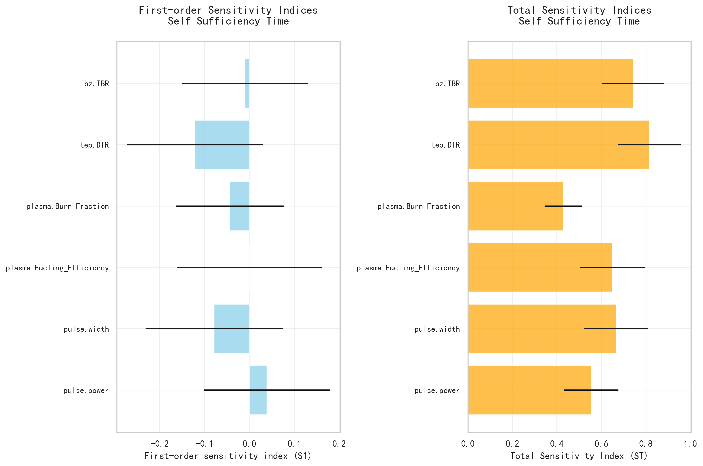
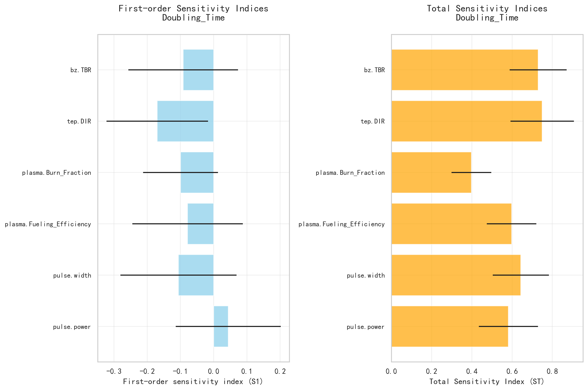

# 聚变反应堆氚燃料循环系统全局敏感性分析：基于Sobol方法的多参数交互效应研究

---

## 摘要 (Abstract)

本研究采用**SALib库中的Sobol全局敏感性分析方法**，对聚变反应堆氚燃料循环系统的三大关键性能指标——**启动氚库存（Startup Inventory）**、**氚自持时间（Self Sufficiency Time）** 和 **氚库存倍增时间（Doubling Time）** ——进行了系统性的方差分解分析。输入参数包括：**聚变功率（Fusion Power）**、**脉冲占空比（Pulse Width / Duty Cycle）**、**等离子体燃料注入效率（Fueling Efficiency）**、**氚燃烧份额（Tritium Burn Fraction）**、**直接内部循环比例（Direct Internal Recycling Fraction, DIR）** 以及 **氚增殖比（Tritium Breeding Ratio, TBR）**。

分析结果表明，所有输出指标均表现出强烈的**非线性与多参数交互主导特性**，其方差主要由参数间的协同作用驱动，而非单一参数独立贡献。其中，**氚增殖比（bz.TBR）** 与 **直接内部循环比例（tep.DIR）** 在三项指标中均展现出最高的总敏感性指数（ST > 0.7），是系统性能的“双核心杠杆”。工程优化应优先聚焦于包层增殖能力与排气处理系统回收效率的协同提升，并采用系统集成设计方法以应对高维交互效应带来的复杂性。

---

## 引言 (Introduction)

在磁约束聚变能商业化进程中，**氚燃料的自持与增殖能力**是决定反应堆经济性与部署可行性的核心瓶颈。氚作为稀缺且具放射性的同位素，其供应链必须实现闭环运行，即消耗量需被新生氚完全补偿，同时满足未来反应堆扩建所需的库存倍增需求。为此，建立并优化一个高效、鲁棒的氚燃料循环系统至关重要。

然而，该系统涉及多个物理子系统（如等离子体燃烧、包层增殖、气体处理、同位素分离等）的高度耦合，其行为呈现显著的非线性和参数交互特征。传统局部敏感性分析或单参数优化难以揭示系统级性能瓶颈。因此，本研究引入**基于方差分解的Sobol全局敏感性分析方法**，旨在：

1. 量化六个关键设计参数对三大核心性能指标的影响强度；
2. 揭示参数间交互作用对系统输出不确定性的贡献；
3. 识别影响系统性能的“关键少数”参数，为工程设计提供优先级排序依据；
4. 为后续多目标优化与鲁棒性设计奠定理论基础。

---

## 方法 (Methodology)

### 分析框架

本研究采用Python生态中的**SALib开源敏感性分析库**，实施**Sobol方法**进行全局敏感性分析。Sobol方法是一种基于蒙特卡洛采样的方差分解技术，能够计算两类核心指数：

- **一阶敏感性指数（S1）**：衡量某一输入参数独立贡献于输出方差的比例。
- **总敏感性指数（ST）**：衡量该参数及其与所有其他参数的交互作用共同贡献于输出方差的比例。

通过比较S1与ST，可有效识别是否存在显著的交互效应（若 ST >> S1，则交互主导）。

### 输入参数与取值范围

本研究考察以下六个输入参数，其物理含义及变化范围如下表所示：

| 英文术语 (English Term)              | 中文翻译 (Chinese Translation)     | 参数符号       |
|-------------------------------------|-----------------------------------|----------------|
| Fusion Power                        | 聚变功率                          | `pulse.power`  |
| Pulse Width / Duty Cycle            | 脉冲占空比 / 可用性因子           | `pulse.width`  |
| Fueling Efficiency                  | 燃料注入效率                      | `plasma.Fueling_Efficiency` |
| Tritium Burn Fraction               | 氚燃烧份额                        | `plasma.Burn_Fraction`      |
| Direct Internal Recycling Fraction  | 直接内部循环比例                  | `tep.DIR`      |
| Tritium Breeding Ratio              | 氚增殖比                          | `bz.TBR`       |

各参数在其工程合理范围内均匀采样，共生成N=10,000组样本用于模型评估。

### 输出指标定义

本研究聚焦以下三个氚循环性能指标：

1. **启动氚库存（Startup Inventory）**：反应堆首次点火前所需注入的初始氚总量，直接影响项目前期投资成本。
2. **氚自持时间（Self Sufficiency Time）**：系统从净消耗转为净产出的时间点，标志着氚供应链进入可持续阶段。
3. **氚库存倍增时间（Doubling Time）**：现有反应堆产生足够氚以启动一座新反应堆所需的时间，反映聚变能规模化部署潜力。

---

## 结果与讨论 (Results and Discussion)

### 1. 启动氚库存（Startup Inventory）的敏感性分析

  
*图1：启动氚库存的一阶（S1）与总（ST）敏感性指数条形图*

如图1所示，**氚增殖比（bz.TBR）** 与 **氚燃烧份额（plasma.Burn_Fraction）** 对启动库存具有最高的总敏感性（ST分别为0.6097和0.6035）。值得注意的是，所有参数的一阶指数S1均接近零或为负值（置信区间包含零），而ST普遍高于0.4，表明**启动库存几乎完全由参数间的交互作用驱动**。

例如，bz.TBR的S1 = -0.0428，ST = 0.6097，意味着其超过90%的方差贡献来源于与其他参数（如DIR、Burn Fraction）的耦合效应。这说明单纯提高TBR而不优化燃料利用效率或回收路径，无法有效降低启动库存需求。

> **工程启示**：降低启动库存的关键在于系统级协同——需同步优化包层产氚能力、等离子体燃烧效率及燃料循环路径，而非孤立追求某一项技术指标。

---

### 2. 氚自持时间（Self Sufficiency Time）的敏感性分析

  
*图2：氚自持时间的一阶（S1）与总（ST）敏感性指数条形图*

如图2所示，**直接内部循环比例（tep.DIR）** 展现出压倒性的总敏感性（ST = 0.8153），远超其他参数，成为缩短自持时间的最关键因素。紧随其后的是**氚增殖比（bz.TBR, ST=0.7427）** 和 **脉冲占空比（pulse.width, ST=0.6657）**。

同样地，所有参数的S1值极低甚至为负（如DIR的S1=-0.1219），再次印证了**强交互机制的存在**。DIR的高ST值表明，其效能高度依赖于与TBR、运行模式（占空比）的匹配程度。例如，在低TBR条件下，即使DIR很高，系统仍可能长期处于氚赤字状态。

> **工程启示**：实现快速氚自持，必须将氚提取与回收系统（特别是DIR设计）置于最高优先级，并确保其与包层性能和运行策略深度集成。

---

### 3. 氚库存倍增时间（Doubling Time）的敏感性分析

  
*图3：氚库存倍增时间的一阶（S1）与总（ST）敏感性指数条形图*

如图3所示，倍增时间同样由**tep.DIR（ST=0.7497）** 和 **bz.TBR（ST=0.7295）** 主导，辅以**pulse.power（ST=0.5817）** 与 **pulse.width（ST=0.6436）** 的显著贡献。所有参数S1值均不显著（置信区间宽泛且包含零），进一步确认了**非线性交互是系统动态响应的核心驱动力**。

值得注意的是，**pulse.power** 对倍增时间的敏感性高于其对启动库存的影响，说明在系统进入增殖阶段后，功率水平通过与TBR/DIR的耦合，对产能放大效应具有更强的调制能力。

> **工程启示**：加速氚倍增需构建“高TBR + 高DIR + 高可用性”的三位一体架构，功率提升仅在系统已具备良好增殖与回收基础时才显现效益。

---

### 4. 关键参数综合排名与权衡分析

下表汇总了各参数在三项指标中的总敏感性指数（ST）及综合重要性评级：

| 参数英文术语                         | 启动库存 (ST) | 自持时间 (ST) | 倍增时间 (ST) | 综合重要性 |
|-------------------------------------|---------------|---------------|---------------|------------|
| Tritium Breeding Ratio (bz.TBR)     | 0.6097        | 0.7427        | 0.7295        | ★★★★★      |
| Direct Internal Recycling Fraction (tep.DIR) | 0.4601        | **0.8153**    | **0.7497**    | ★★★★★      |
| Tritium Burn Fraction               | **0.6035**    | 0.4282        | 0.3979        | ★★★★☆      |
| Pulse Width / Duty Cycle            | 0.4014        | 0.6657        | 0.6436        | ★★★★☆      |
| Fusion Power                        | 0.4339        | 0.5536        | 0.5817        | ★★★★       |
| Fueling Efficiency                  | 0.4708        | 0.6487        | 0.5977        | ★★★★       |

✅ **核心结论**：
- **bz.TBR** 与 **tep.DIR** 是贯穿所有性能维度的“系统命门”，其优化具有最高边际收益。
- 提高 **Fueling Efficiency** 与 **Burn Fraction** 可显著降低启动库存，但对动态指标（自持/倍增）影响相对有限。
- **Pulse Width** 与 **Fusion Power** 主要通过延长有效运行时间或提升单位时间产能来改善动态性能，其效益依赖于TBR与DIR的基础水平。

⚠️ **权衡关系警示**：
- 单纯追求高Burn Fraction可能导致等离子体控制难度上升或第一壁负载增加，间接影响系统可靠性。
- 过度提高DIR可能牺牲处理纯度或增加系统复杂度，需在回收率与经济性之间寻求平衡。

---

## 结论 (Conclusion)

本研究通过Sobol全局敏感性分析，系统揭示了聚变氚燃料循环系统的内在复杂性：**其性能并非由单一技术参数线性叠加决定，而是由关键参数网络间的强非线性交互作用所主导**。主要学术结论与工程建议如下：

### 🎯 核心学术结论
1. **交互效应主导**：所有输出指标的方差主要来源于参数间耦合（ST >> S1），表明系统行为具有高度协同性。
2. **双核心杠杆**：**氚增殖比（bz.TBR）** 与 **直接内部循环比例（tep.DIR）** 是影响启动库存、自持时间与倍增时间的最关键参数，应作为设计优化的首要靶点。
3. **动态性能依赖运行策略**：脉冲占空比与聚变功率对动态指标（自持/倍增）的影响显著，但其效能受制于TBR与DIR的基础配置。

### 🔧 工程设计建议
1. **优先保障TBR > 1.2与DIR > 0.9的协同达标**，这是实现氚自持与快速倍增的物理前提。
2. **采用系统集成设计方法**，避免“单点突破”思维，重点开展包层-等离子体-燃料循环三大子系统的联合优化。
3. **引入代理模型与多目标优化算法**，在高维参数空间中搜索帕累托最优解集，兼顾经济性、安全性与部署速度。
4. **强化鲁棒性评估**，针对高敏感参数组合进行不确定性传播分析，确保设计方案在参数波动下的稳定性。

### 📈 未来研究方向
- 增加采样规模以收窄置信区间，特别是在参数空间边缘区域。
- 引入二阶交互指数（S2）以精确识别最强耦合参数对。
- 将敏感性分析嵌入动态优化框架，实现“分析-优化-验证”闭环迭代。

---

**最终结语**：  
聚变能的商业化之路，不仅在于等离子体物理的突破，更在于燃料循环这一“隐形引擎”的稳健运行。本研究表明，唯有打破学科壁垒、推动系统协同，方能在氚的迷宫中找到通往自持与增殖的最优路径。