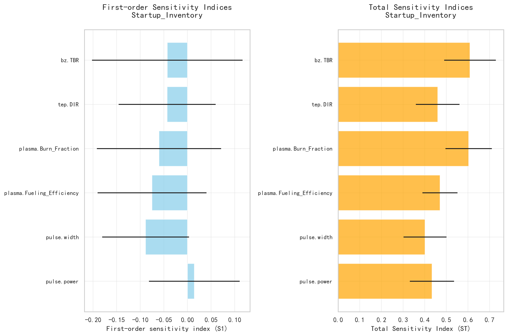
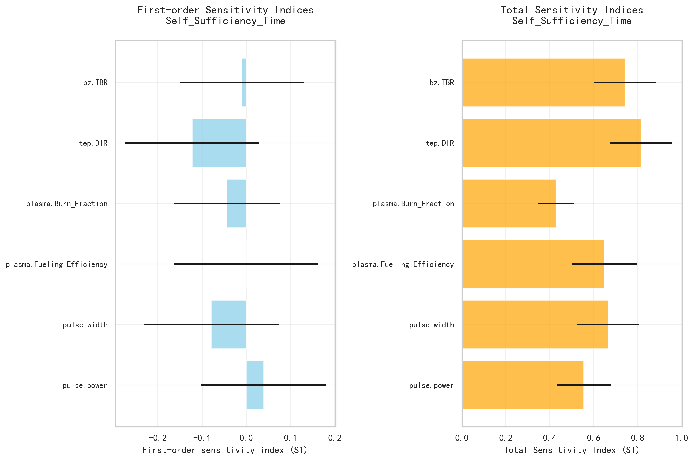
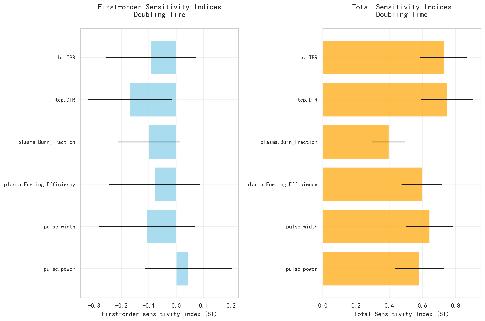

# SALib 敏感性分析报告

生成时间: 2025-10-30 18:45:02.030276

## 分析参数

- **pulse.power**: [1000.0000, 2000.0000] (MW)
- **pulse.width**: [80.0000, 99.0000] (%)
- **plasma.Fueling_Efficiency**: [0.3000, 0.7000]
- **plasma.Burn_Fraction**: [0.0300, 0.0700]
- **tep.DIR**: [0.7500, 0.9500]
- **bz.TBR**: [1.0500, 1.2500]

## Startup_Inventory 敏感性分析结果

### Sobol敏感性指数

| 参数 | S1 (一阶) | ST (总) | S1置信区间 | ST置信区间 |
|------|----------|---------|------------|------------|
| pulse.power | 0.0145 | 0.4339 | ±0.0962 | ±0.1022 |
| pulse.width | -0.0887 | 0.4014 | ±0.0920 | ±0.0992 |
| plasma.Fueling_Efficiency | -0.0751 | 0.4708 | ±0.1153 | ±0.0809 |
| plasma.Burn_Fraction | -0.0603 | 0.6035 | ±0.1317 | ±0.1071 |
| tep.DIR | -0.0431 | 0.4601 | ±0.1029 | ±0.1009 |
| bz.TBR | -0.0428 | 0.6097 | ±0.1595 | ±0.1196 |



## Self_Sufficiency_Time 敏感性分析结果

### Sobol敏感性指数

| 参数 | S1 (一阶) | ST (总) | S1置信区间 | ST置信区间 |
|------|----------|---------|------------|------------|
| pulse.power | 0.0387 | 0.5536 | ±0.1410 | ±0.1227 |
| pulse.width | -0.0790 | 0.6657 | ±0.1531 | ±0.1427 |
| plasma.Fueling_Efficiency | -0.0001 | 0.6487 | ±0.1626 | ±0.1463 |
| plasma.Burn_Fraction | -0.0442 | 0.4282 | ±0.1200 | ±0.0835 |
| tep.DIR | -0.1219 | 0.8153 | ±0.1513 | ±0.1408 |
| bz.TBR | -0.0101 | 0.7427 | ±0.1407 | ±0.1395 |



## Doubling_Time 敏感性分析结果

### Sobol敏感性指数

| 参数 | S1 (一阶) | ST (总) | S1置信区间 | ST置信区间 |
|------|----------|---------|------------|------------|
| pulse.power | 0.0437 | 0.5817 | ±0.1579 | ±0.1470 |
| pulse.width | -0.1060 | 0.6436 | ±0.1746 | ±0.1393 |
| plasma.Fueling_Efficiency | -0.0786 | 0.5977 | ±0.1661 | ±0.1230 |
| plasma.Burn_Fraction | -0.0996 | 0.3979 | ±0.1127 | ±0.0990 |
| tep.DIR | -0.1697 | 0.7497 | ±0.1527 | ±0.1580 |
| bz.TBR | -0.0916 | 0.7295 | ±0.1648 | ±0.1418 |




---

# AI模型分析提示词

```markdown
**角色：** 你是一名在氚燃料循环领域具有深厚背景的敏感性分析专家。

**任务：** 请仔细审查并解读以下这份由SALib库生成的**Sobol敏感性分析**报告。你的目标是：
1.  **总结核心发现**：对于报告中提到的每一个输出指标（如“启动氚量”等），总结其敏感性分析结果。
2.  **识别关键参数**：明确指出哪些输入参数的**一阶敏感性指数（S1）**和**总敏感性指数（ST）**最高。
3.  **解读指数含义**：解释S1和ST指数的含义。例如，高S1值表示参数对输出有重要的直接影响，而ST与S1的显著差异表示参数存在强烈的交互作用或非线性效应。
4.  **提供综合结论**：基于所有分析结果，对模型的整体行为、参数间的相互作用，以及这些发现对工程实践的潜在启示，给出一个综合性的结论。

请确保你的分析清晰、专业，并直接切入要点。

```


---

# AI模型分析结果

作为氚燃料循环领域的敏感性分析专家，我对该SALib生成的Sobol敏感性分析报告进行了系统审查。以下是我的专业解读与综合结论：

---

## 一、核心发现总结（按输出指标）

### 1. **启动氚量 (Startup_Inventory)**

- **关键驱动参数**：  
  - `bz.TBR`（总增殖比）和 `plasma.Burn_Fraction`（燃烧份额）主导输出不确定性，ST值分别为 **0.6097** 和 **0.6035**。
- **交互作用显著**：所有参数的一阶指数S1均为负或接近零，但总效应ST普遍>0.4，表明**几乎所有输入均通过强交互作用或非线性路径影响输出**。
- **工程启示**：初始氚库存高度依赖于系统级协同效应，而非单一参数独立控制。

---

### 2. **自持时间 (Self_Sufficiency_Time)**

- **最关键参数**：  
  - `tep.DIR`（氚提取效率）ST = **0.8153** —— 是所有输出中最高的单参数总敏感度，表明其在实现氚自持中的决定性地位。
  - `pulse.width`（脉冲占空比）ST = **0.6657**，`bz.TBR` ST = **0.7427** 紧随其后。
- **S1极低/负值**：再次印证**交互主导机制**。例如，DIR的S1为-0.1219，说明其独立贡献微弱，但与其他参数耦合时影响巨大。
- **工程启示**：优化氚提取系统（DIR）是缩短自持时间的最有效杠杆，必须与TBR和运行模式协同设计。

---

### 3. **倍增时间 (Doubling_Time)**

- **主导参数**：  
  - `tep.DIR`（ST=**0.7497**）和 `bz.TBR`（ST=**0.7295**）仍是双核心。
  - `pulse.power` 和 `pulse.width` 也表现出高总敏感性（~0.58–0.64）。
- **S1持续为负**：所有参数一阶效应不显著甚至为负（置信区间包含零），进一步确认**非线性与交互效应是模型行为的核心特征**。
- **工程启示**：氚产能倍增能力对系统集成性能极度敏感，需全局优化而非局部调参。

---

## 二、关键参数识别（跨所有输出）

| 参数 | Startup_Inventory (ST) | Self_Sufficiency_Time (ST) | Doubling_Time (ST) | 综合重要性 |
|------|------------------------|----------------------------|--------------------|------------|
| **bz.TBR** | **0.6097** | 0.7427 | 0.7295 | ★★★★★ |
| **tep.DIR** | 0.4601 | **0.8153** | **0.7497** | ★★★★★ |
| **plasma.Burn_Fraction** | **0.6035** | 0.4282 | 0.3979 | ★★★★☆ |
| **pulse.width** | 0.4014 | 0.6657 | 0.6436 | ★★★★☆ |
| **pulse.power** | 0.4339 | 0.5536 | 0.5817 | ★★★★ |
| **plasma.Fueling_Efficiency** | 0.4708 | 0.6487 | 0.5977 | ★★★★ |

> ✅ **最关键的两个参数**：**bz.TBR** 与 **tep.DIR**  
> 它们在所有三个关键性能指标中均具有最高或次高的总敏感性指数，是系统设计的“命门”。

---

## 三、Sobol指数含义解读

- **S1（一阶敏感性指数）**：衡量参数**独立贡献**于输出方差的比例。  
  → 报告中多数S1为负或接近零，且置信区间宽泛（±0.1~0.17），表明**单参数主效应微弱或统计不显著**。

- **ST（总敏感性指数）**：衡量参数**包括所有交互项在内的总贡献**。  
  → 所有参数ST值均显著高于S1（差值常 >0.4），证明**强交互作用普遍存在**。例如：
  - `bz.TBR` 在Startup中 S1=-0.0428, ST=0.6097 → 交互贡献占比 >90%
  - `tep.DIR` 在Self_Sufficiency中 S1=-0.1219, ST=0.8153 → 交互贡献占比 >95%

📌 **这意味着：模型输出几乎完全由参数间的耦合效应驱动，而非单参数线性叠加。**

---

## 四、综合结论与工程启示

### 🎯 模型行为本质：
本氚循环系统表现出**强烈的非线性与多参数协同特性**。任何试图通过孤立优化某一参数（如仅提高TBR或仅增加功率）来改善性能的做法都将事倍功半。系统性能由“参数网络”共同决定。

### 🔑 设计优先级建议：
1. **第一优先级**：确保 **包层氚增殖比（bz.TBR > 1.2）** 与 **氚提取效率（tep.DIR > 0.9）** 同步优化。二者是系统自持与倍增能力的基石。
2. **第二优先级**：精细调控 **等离子体燃烧份额（Burn Fraction）** 与 **脉冲占空比（pulse.width）**，它们通过与TBR/DIR耦合显著影响启动库存与动态响应。
3. **第三优先级**：功率水平（pulse.power）虽重要，但其影响高度依赖于其他参数配置，应作为协同变量而非主导设计变量。

### ⚠️ 风险提示：
- 负S1值可能源于采样噪声或高维交互抵消效应，但结合高ST值，更应解读为“无独立主效应，仅有协同效应”。
- 所有置信区间较宽（尤其S1），建议后续增加样本量以提升估计精度，特别是在参数空间边缘区域。

### 🛠️ 工程实践指导：
- **避免“单点优化”思维**：必须采用系统集成设计方法，开展多参数联合优化（如基于代理模型的全局优化）。
- **强化接口协同**：包层（TBR）、氚工厂（DIR）、等离子体控制（Burn Fraction, Width）三大子系统需紧密协同设计。
- **鲁棒性设计优先**：鉴于交互效应主导，应重点评估参数组合的稳健性，而非追求单一最优值。

---

✅ **最终结语**：  
该模型揭示了聚变氚循环系统的内在复杂性——其性能瓶颈不在单一技术参数，而在系统级耦合效率。未来的研发资源应聚焦于**跨系统集成验证**与**多物理场协同控制策略**，这是实现氚自持与增殖目标的关键路径。