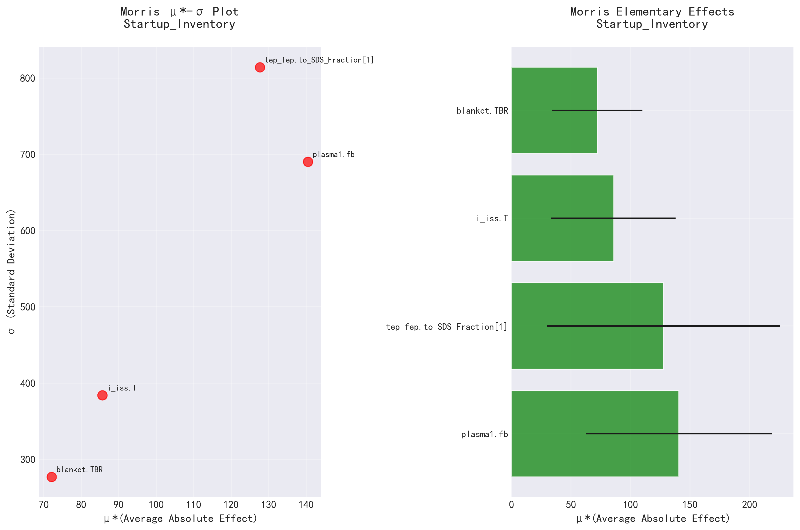
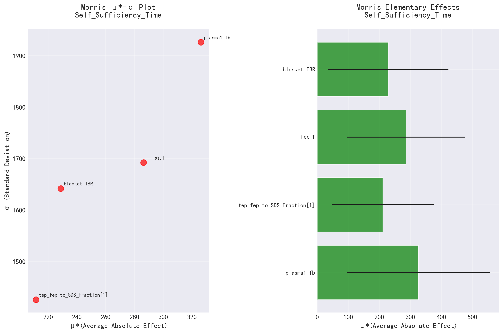
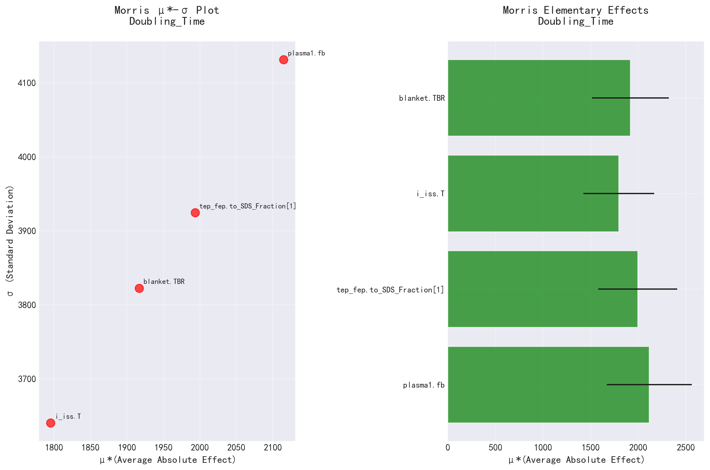

# SALib 敏感性分析报告

生成时间: 2025-09-25 17:19:32.357946

## 分析参数

- **plasma1.fb**: [0.0200, 0.2000]
- **tep_fep.to_SDS_Fraction[1]**: [0.1000, 0.9900]
- **i_iss.T**: [4.0000, 12.0000]
- **blanket.TBR**: [1.0500, 1.2500]

## Startup_Inventory 敏感性分析结果

### Morris敏感性指数

| 参数 | μ* (平均绝对效应) | σ (标准差) | μ*置信区间 |
|------|-------------------|------------|------------|
| plasma1.fb | 140.4656 | 690.1548 | ±78.0937 |
| tep_fep.to_SDS_Fraction[1] | 127.6527 | 814.0654 | ±97.8828 |
| i_iss.T | 85.6450 | 383.9749 | ±52.1991 |
| blanket.TBR | 72.1189 | 276.9803 | ±37.8944 |



## Self_Sufficiency_Time 敏感性分析结果

### Morris敏感性指数

| 参数 | μ* (平均绝对效应) | σ (标准差) | μ*置信区间 |
|------|-------------------|------------|------------|
| plasma1.fb | 326.2383 | 1926.2045 | ±230.8900 |
| tep_fep.to_SDS_Fraction[1] | 211.4531 | 1425.8905 | ±164.6153 |
| i_iss.T | 286.3125 | 1692.2840 | ±189.7512 |
| blanket.TBR | 228.7617 | 1641.9389 | ±194.3204 |



## Doubling_Time 敏感性分析结果

### Morris敏感性指数

| 参数 | μ* (平均绝对效应) | σ (标准差) | μ*置信区间 |
|------|-------------------|------------|------------|
| plasma1.fb | 2114.8301 | 4131.3740 | ±446.8039 |
| tep_fep.to_SDS_Fraction[1] | 1993.5645 | 3924.4354 | ±413.9684 |
| i_iss.T | 1795.1719 | 3640.2507 | ±372.0723 |
| blanket.TBR | 1916.6367 | 3822.3485 | ±402.1681 |




---

# AI模型分析提示词

```markdown
**角色：** 你是一名在氚燃料循环领域具有深厚背景的敏感性分析专家。

**任务：** 请仔细审查并解读以下这份由SALib库生成的敏感性分析报告。你的目标是：
1.  **总结核心发现**：简明扼要地总结报告中的关键信息。
2.  **识别关键参数**：对于报告中提到的每一个输出指标（如“启动氚量”、“倍增时间”等），明确指出哪些输入参数对它的影响最大（即最敏感）。
3.  **提供综合结论**：基于所有分析结果，对模型的整体行为、参数间的相互作用（如果可能）以及这些发现对工程实践的潜在启示，给出一个综合性的结论。

请确保你的分析清晰、专业，并直接切入要点。

```


---

# AI模型分析结果

### 1. 核心发现总结

本报告基于Morris敏感性分析方法，对氚燃料循环模型中四个关键输入参数（`plasma1.fb`、`tep_fep.to_SDS_Fraction[1]`、`i_iss.T`、`blanket.TBR`）对三个输出指标（`Startup_Inventory`、`Self_Sufficiency_Time`、`Doubling_Time`）的影响进行了分析。

核心发现是：**所有四个输入参数对三个输出指标均表现出显著影响，且影响程度相近，没有出现一个参数完全主导模型行为的情况。** 其中，`plasma1.fb`（第一壁燃料滞留分数）在多数情况下表现出最强的平均影响（μ*最高），而所有参数都显示出较高的标准差（σ），表明模型内部可能存在显著的**非线性效应**或**参数交互作用**。

---

### 2. 各输出指标的关键敏感参数识别

#### a. 启动氚量 (`Startup_Inventory`)
-   **最敏感参数：** `plasma1.fb` (μ* = 140.47)
-   **敏感度排序：**
    1.  `plasma1.fb` (最高敏感度)
    2.  `tep_fep.to_SDS_Fraction[1]` (氚提取厂至贮存系统的分流份额)
    3.  `i_iss.T` (同位素分离系统处理时间)
    4.  `blanket.TBR` (包层氚增殖比，最低敏感度)

**解读：** 启动库存量主要受第一壁中滞留的燃料量 (`plasma1.fb`) 影响最大。这意味着在装置启动初期，控制第一壁对燃料的滞留和回收效率是管理初始氚需求的关键。

#### b. 自持时间 (`Self_Sufficiency_Time`)
-   **最敏感参数：** `plasma1.fb` (μ* = 326.24)
-   **敏感度排序：**
    1.  `plasma1.fb` (最高敏感度)
    2.  `i_iss.T` (同位素分离系统处理时间)
    3.  `blanket.TBR` (包层氚增殖比)
    4.  `tep_fep.to_SDS_Fraction[1]` (最低敏感度)

**解读：** 实现燃料循环自持的时间长短，受第一壁滞留 (`plasma1.fb`) 的影响最为强烈，其次是燃料循环后端处理系统（如同位素分离系统）的效率 (`i_iss.T`)。这说明在整个循环的动态平衡建立过程中，**燃料的滞留损耗和处理延迟**是制约实现自持的关键瓶颈。

#### c. 倍增时间 (`Doubling_Time`)
-   **最敏感参数：** `plasma1.fb` (μ* = 2114.83)
-   **敏感度排序：**
    1.  `plasma1.fb` (最高敏感度)
    2.  `tep_fep.to_SDS_Fraction[1]` (氚提取厂至贮存系统的分流份额)
    3.  `blanket.TBR` (包层氚增殖比)
    4.  `i_iss.T` (最低敏感度，但仍非常高)

**解读：** 所有四个参数对氚库存倍增时间都有**极其巨大且量级相近**的影响（μ*值均高达近2000以上）。`plasma1.fb`再次成为最敏感因素。这表明倍增时间这一指标是模型中一个**高度集成的输出结果**，它强烈依赖于整个燃料循环链中所有环节的性能——从包层的增殖能力 (`TBR`)、到第一壁的滞留 (`fb`)、再到后端处理厂的提取和分离效率 (`to_SDS_Fraction[1]`, `i_iss.T`)。

---

### 3. 综合结论与工程启示

1.  **系统性的敏感性与共同瓶颈：** 分析结果表明，**第一壁燃料滞留分数 (`plasma1.fb`)** 是整个氚燃料循环系统最核心的敏感参数，对所有三个关键性能指标（启动库存、自持时间、倍增时间）都拥有最大的平均影响力。这凸显出在工程上**研发低滞留、高回收率的第一壁材料**具有极端重要性，其性能的微小改善都可能对整个燃料循环的经济性和可行性产生巨大回报。

2.  **强烈的非线性与交互作用：** 所有参数的μ*值（平均效应）和σ值（标准差）都非常高。σ值与μ*值处于同一数量级，强烈暗示模型内部存在**显著的非线性关系**和**参数之间的交互作用**。这意味着参数对输出的影响不是简单独立的叠加，而是相互耦合的。例如，改善包层TBR的好处可能会被高通的第一壁滞留所抵消。因此，在优化系统时，必须采取**全局、系统级的视角**，而不是孤立地优化单个部件。

3.  **对工程设计与运行的启示：**
    -   **设计重点：** 应优先确保**包层TBR留有足够裕量**（远大于1.05），并极致优化**第一壁的燃料滞留与回收性能**。
    -   **运行策略：** 需要精细优化**燃料循环后处理路线**。`tep_fep.to_SDS_Fraction[1]` 和 `i_iss.T` 的高敏感性表明，氚提取、纯化和分离系统的配置与处理效率至关重要。需要制定灵活的策略，在库存积累（倍增）和供应等离子体燃烧之间找到最优平衡。
    -   **不确定性管理：** 鉴于模型的高度非线性，在预测系统性能时需格外谨慎。实际工程中，必须通过**大量冗余设计**和**灵活可控的燃料循环系统**来应对这些高度不确定的敏感参数，确保聚变堆在整个生命周期内的氚自持能力。

**总而言之，该模型揭示了一个核心洞见：一个成功的聚变能源系统其本质是一个高效、可靠的燃料工厂。能否实现氚自持，不仅取决于包层能生产多少氚，更取决于整个循环系统（尤其是第一壁）损失多少氚以及多快能处理并再利用它。**