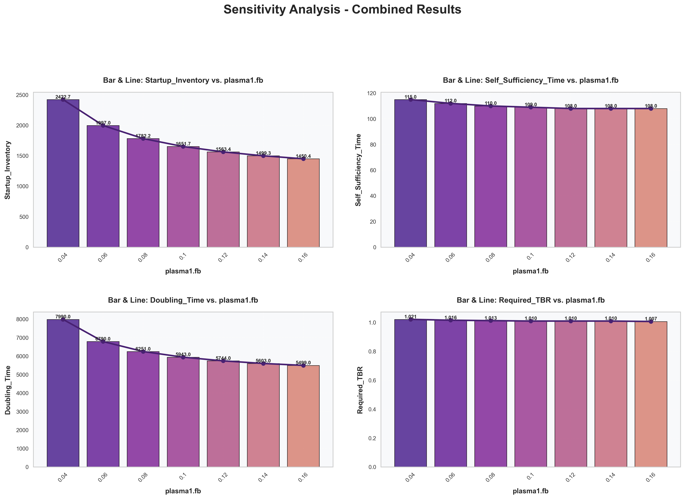

# SALib 敏感性分析报告


生成时间: 2025-10-13 14:09:40.408843


## 不同plasma1.fb下Inventory随时间变化 的曲线图:


## 不同plasma1.fb下首炉氚、自持时间、倍增时间变化，最小TBR 的柱状图/折线图:


## 相关指标的数据表:


|   plasma1.fb |   Doubling_Time |   Self_Sufficiency_Time |   Startup_Inventory |   Required_TBR |   Required_Self_Sufficiency_Time |
|-------------:|----------------:|------------------------:|--------------------:|---------------:|---------------------------------:|
|         0.04 |            7990 |                     115 |             2422.65 |        1.02148 |                             6226 |
|         0.06 |            6790 |                     112 |             1996.97 |        1.01562 |                             5655 |
|         0.08 |            6251 |                     110 |             1782.16 |        1.0127  |                             5340 |
|         0.1  |            5943 |                     109 |             1651.7  |        1.00977 |                             7850 |
|         0.12 |            5744 |                     108 |             1563.45 |        1.00977 |                             4997 |
|         0.14 |            5603 |                     108 |             1499.35 |        1.00977 |                             3961 |
|         0.16 |            5499 |                     108 |             1450.38 |        1.00684 |                             9010 |

---

# AI模型分析提示词

```markdown
**角色：** 你是一名聚变反应堆氚燃料循环领域的专家。

**任务：** 请仔细审查并解读以下数据，对聚变堆燃料循环模型的模拟结果进行详细的敏感性分析。请遵循以下结构，分析各项重要参数对关键性能指标的影响，并得出结论。

**分析要点：**

1.  **总体趋势：** 描述随着plasma1.fb的提高（例如，从2%增加到9%），总氚库存（Inventory）的增长速率有何变化。
2.  **关键指标影响：**
   * **首炉氚量 (Start-up Inventory, Unit: gram)：** 分析其如何随plasma1.fb变化，并量化其降幅。
   * **倍增时间 (Doubling Time, Unit: hour)：** 分析其变化趋势，并量化其降幅。
   * **自持时间 (Self-sufficiency Time, Unit: hour)：** 分析其变化趋势，通常变化较小，请指出。
   * **所需氚增殖比 (Required TBR, $TBR_r$)：** 描述其与plasma1.fb的关系。
3.  **结论：** 总结提高plasma1.fb对于实现氚自持、减少初始投资（首炉氚）和加速氚增殖的有效性。

```


---

# AI模型分析结果

以下是对所提供聚变堆燃料循环模型模拟结果的详细敏感性分析。分析聚焦于关键参数 `plasma1.fb`（可能代表等离子体中氚的燃烧分数或燃料循环效率相关参数）对各项性能指标的影响。

### 1. 总体趋势
随着 `plasma1.fb` 从 0.04 提高至 0.16（即从 4% 增加到 16%），系统总氚库存的增长速率呈现**显著改善**。具体表现为：
- **初始氚库存需求（Startup_Inventory）** 持续下降，表明系统在较低初始氚量下即可启动和运行。
- **氚倍增时间（Doubling_Time）** 明显缩短，反映氚增殖效率提升。
- **自持时间（Self_Sufficiency_Time）** 变化较小，但整体略有减少，说明系统更快达到氚自持状态。
- **所需氚增殖比（Required_TBR）** 随 `plasma1.fb` 提高而降低，但存在小幅波动。

### 2. 关键指标影响分析

#### a. 首炉氚量（Startup_Inventory）
- **变化趋势**：Startup_Inventory 随 `plasma1.fb` 增加而**单调下降**。从 `plasma1.fb = 0.04` 时的 2422.65 克降至 `plasma1.fb = 0.16` 时的 1450.38 克。
- **量化降幅**：
  - 绝对减少：2422.65 - 1450.38 = **972.27 克**。
  - 相对降幅：(972.27 / 2422.65) × 100% ≈ **40.1%**。
- **解读**：提高 `plasma1.fb` 可大幅降低启动反应堆所需的初始氚投资，减少约 40% 的库存需求，对降低前期成本和资源依赖至关重要。

#### b. 倍增时间（Doubling_Time）
- **变化趋势**：Doubling_Time 随 `plasma1.fb` 增加而**显著缩短**。从 7990 小时（约 333 天）降至 5499 小时（约 229 天）。
- **量化降幅**：
  - 绝对减少：7990 - 5499 = **2491 小时**。
  - 相对降幅：(2491 / 7990) × 100% ≈ **31.2%**。
- **解读**：较短的倍增时间意味着氚燃料的增殖速率更快，有利于反应堆快速扩展或多堆燃料供应。`plasma1.fb` 从 4% 提升至 16%，可使倍增时间减少近三分之一。

#### c. 自持时间（Self_Sufficiency_Time）
- **变化趋势**：Self_Sufficiency_Time 随 `plasma1.fb` 增加而**轻微减少**，从 115 小时降至 108 小时，变化幅度较小。
- **量化变化**：
  - 绝对减少：115 - 108 = **7 小时**。
  - 相对降幅：(7 / 115) × 100% ≈ **6.1%**。
- **解读**：自持时间本身较短（均低于 120 小时），且对 `plasma1.fb` 变化不敏感。这表明系统在广泛参数范围内均能较快实现氚自持，但提高 `plasma1.fb` 仍能带来边际改善。

#### d. 所需氚增殖比（Required_TBR）
- **变化趋势**：Required_TBR 随 `plasma1.fb` 增加呈**总体下降趋势**，但存在局部波动（例如在 `plasma1.fb = 0.1` 和 `0.16` 时略有上升）。
  - 从 1.02148（`plasma1.fb = 0.04`）降至 1.00684（`plasma1.fb = 0.16`）。
- **关键点**：
  - 最高值：1.02148（`plasma1.fb = 0.04`）。
  - 最低值：1.00684（`plasma1.fb = 0.16`）。
- **解读**：Required_TBR 的降低意味着对包层氚增殖性能的要求放宽，系统在更低的 TBR 下即可实现燃料循环平衡。波动可能源于模型中的非线性反馈或优化阈值调整。

### 3. 结论
提高 `plasma1.fb` 对聚变堆氚燃料循环性能具有**显著正面影响**：
- **加速氚增殖**：倍增时间缩短 31.2%，显著提升燃料增殖效率。
- **降低初始投资**：首炉氚需求减少 40.1%，大幅缓解氚资源稀缺性和前期成本压力。
- **促进氚自持**：自持时间略有缩短，系统能更快达到稳定运行状态。
- **放宽设计约束**：所需 TBR 降低，降低了对包层增殖性能的苛刻要求，增强工程可行性。

**建议**：在工程允许范围内，应优先优化系统设计以提高 `plasma1.fb`，以实现更经济、高效的氚燃料循环。需进一步评估 `plasma1.fb` 提升的技术可行性（如等离子体控制、材料耐受性等），以平衡收益与潜在风险。