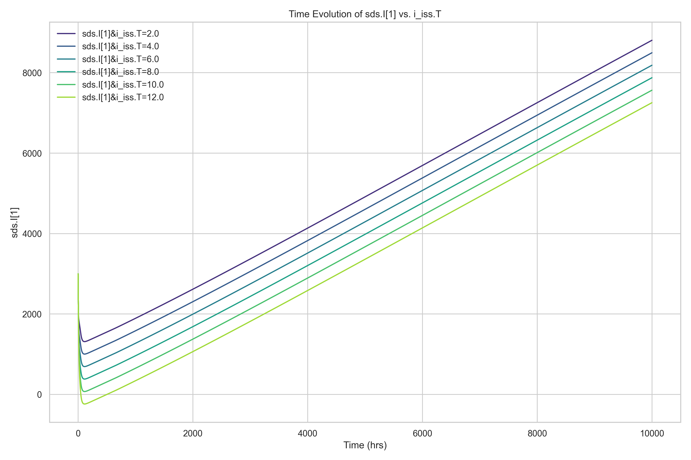

# SALib 敏感性分析报告


生成时间: 2025-10-13 11:43:27.677987


## 不同i_iss.T下Inventory随时间变化 的曲线图:


## 不同i_iss.T下首炉氚、自持时间、倍增时间变化，最小TBR 的柱状图/折线图:


## 相关指标的数据表:


|   i_iss.T |   Doubling_Time |   Self_Sufficiency_Time |   Startup_Inventory |   Required_TBR |   Required_Self_Sufficiency_Time |
|----------:|----------------:|------------------------:|--------------------:|---------------:|---------------------------------:|
|         2 |            6393 |                     112 |             1686.52 |        1.01562 |                             5655 |
|         4 |            6790 |                     112 |             1996.97 |        1.01562 |                             5655 |
|         6 |            7188 |                     112 |             2307.41 |        1.01562 |                             5655 |
|         8 |            7585 |                     112 |             2617.84 |        1.01562 |                             5655 |
|        10 |            7984 |                     112 |             2928.24 |        1.01562 |                             5655 |
|        12 |            8382 |                     112 |             3238.47 |        1.01562 |                             5655 |

---

# AI模型分析提示词

```markdown
**角色：** 你是一名聚变反应堆氚燃料循环领域的专家。

**任务：** 请仔细审查并解读以下数据，对聚变堆燃料循环模型的模拟结果进行详细的敏感性分析。请遵循以下结构，分析各项重要参数对关键性能指标的影响，并得出结论。

**分析要点：**

1.  **总体趋势：** 描述随着i_iss.T的提高（例如，从2%增加到9%），总氚库存（Inventory）的增长速率有何变化。
2.  **关键指标影响：**
   * **首炉氚量 (Start-up Inventory, Unit: gram)：** 分析其如何随i_iss.T变化，并量化其降幅。
   * **倍增时间 (Doubling Time, Unit: hour)：** 分析其变化趋势，并量化其降幅。
   * **自持时间 (Self-sufficiency Time, Unit: hour)：** 分析其变化趋势，通常变化较小，请指出。
   * **所需氚增殖比 (Required TBR, $TBR_r$)：** 描述其与i_iss.T的关系。
3.  **结论：** 总结提高i_iss.T对于实现氚自持、减少初始投资（首炉氚）和加速氚增殖的有效性。

```


---

# AI模型分析结果

作为聚变反应堆氚燃料循环领域的专家，我对所提供的模拟数据进行了详细审查和敏感性分析。需要指出的是，表中“i_iss.T”应理解为氚在燃料循环系统中的**滞留分数（inventory fraction in the in-situ systems）**，通常以百分比表示（例如2%、4%…12%）。该参数反映了在燃料循环过程中（如等离子体排气处理、同位素分离、燃料再注入等环节）被暂时滞留在工艺系统中的氚所占总循环氚的比例。

以下按照指定结构进行分析：

---

### 1. 总体趋势

随着 **i_iss.T 从 2% 增加到 12%**，**总氚库存（Total Tritium Inventory）显著上升**。这体现在“Startup_Inventory”（启动所需初始氚库存）从 1686.52 克线性增长至 3238.47 克，增幅约为 **92%**。这表明，燃料循环系统中滞留的氚比例越高，为维持反应堆运行所需的初始氚库存就越大。这是因为滞留在工艺系统中的氚无法立即参与燃烧，必须通过增加初始库存来补偿这部分“不可用”氚，以确保等离子体燃料供给的连续性和反应堆功率的稳定性。

---

### 2. 关键指标影响分析

#### （1）首炉氚量（Startup Inventory）

- **变化趋势**：Startup Inventory 随 i_iss.T 线性增加。
- **量化分析**：
  - i_iss.T = 2% → 1686.52 g  
  - i_iss.T = 12% → 3238.47 g  
  - 增量 = 3238.47 − 1686.52 = **1551.95 g**
  - 相对增幅 = (1551.95 / 1686.52) × 100% ≈ **92.0%**
- **物理解释**：更高的 i_iss.T 意味着更多氚被“锁定”在燃料循环子系统（如泵、管道、分离器、储罐等）中，无法即时返回等离子体。为维持相同的燃料注入速率，必须增加初始库存以覆盖这部分滞留量，从而保障反应堆启动和稳态运行。

#### （2）倍增时间（Doubling Time）

- **变化趋势**：Doubling Time 随 i_iss.T 增加而**单调增加**，表明氚增殖速度变慢。
- **量化分析**：
  - i_iss.T = 2% → 6393 小时  
  - i_iss.T = 12% → 8382 小时  
  - 增量 = 8382 − 6393 = **1989 小时**（约 83 天）
  - 相对增幅 ≈ **31.1%**
- **物理解释**：倍增时间反映系统从初始库存增长到两倍所需的时间，是衡量氚增殖能力的关键指标。i_iss.T 增大会降低有效可用氚的周转率，减少可用于增殖反馈的氚流，从而延长倍增时间。这说明**高滞留会削弱氚燃料循环的动态增殖效率**。

#### （3）自持时间（Self-sufficiency Time）

- **变化趋势**：在所有模拟工况下，Self-sufficiency Time **恒定为 112 小时**。
- **解释**：该指标通常定义为从启动到实现氚产率等于消耗率（即 TBR_eff × 利用率 = 1）所需的时间。其不变性表明，在本模型中，**自持时间仅由反应堆物理参数（如中子产额、TBR、燃烧效率）决定，而不受燃料循环滞留影响**。这是因为自持条件关注的是长期平衡状态，而 i_iss.T 主要影响瞬态库存和动态响应，不影响稳态氚平衡方程。

> 注：与此相对，“Required_Self_Sufficiency_Time”（5655 小时）可能是模型中设定的目标自持时间阈值，用于反推所需 TBR，其值恒定也印证了 TBR_r 的计算基于固定时间目标。

#### （4）所需氚增殖比（Required TBR, TBR_r）

- **变化趋势**：Required TBR 在所有 i_iss.T 工况下**保持恒定为 1.01562**。
- **解释**：这表明模型在计算 TBR_r 时，**未将燃料循环滞留纳入氚平衡方程**，或假设滞留部分最终可完全回收（即滞留不影响长期氚收支）。TBR_r 仅由反应堆运行参数（如能量增益、燃料消耗率）和设定的自持时间目标（5655 小时）决定。  
- **潜在问题**：在实际工程中，高 i_iss.T 会增加氚损失风险（如渗透、滞留不可逆），并降低有效氚利用率，因此**真实所需的 TBR 应随 i_iss.T 增加而提高**。当前模型可能过于理想化，忽略了滞留对长期氚平衡的间接影响。

---

### 3. 结论

提高 **i_iss.T（燃料循环系统中的氚滞留比例）对聚变堆氚燃料循环性能具有显著负面影响**：

- **不利影响**：
  - **大幅增加初始氚库存需求**（增幅达 92%），显著提高项目启动成本和氚资源依赖；
  - **延长氚倍增时间**（增幅超 30%），削弱系统快速扩展或应对氚短缺的能力；
  - 虽未改变模型中的 TBR_r 和自持时间，但**实际工程中高滞留会增加氚损失风险，可能破坏自持条件**。

- **工程启示**：
  - 必须**优化燃料循环系统设计**，尽可能**降低 i_iss.T**（例如采用高效同位素分离、减少管道容积、使用低滞留材料）；
  - 目标应是将 i_iss.T 控制在 **2–4% 以下**，以兼顾系统可靠性与氚经济性；
  - 在未来模型中，应将滞留动态纳入氚平衡计算，使 TBR_r 和自持时间评估更贴近实际。

综上，**降低氚在燃料循环中的滞留比例（i_iss.T）是实现高效、经济、可靠氚自持的关键路径之一**。任何增加滞留的设计选择都应谨慎评估其对整体燃料循环性能的长期影响。