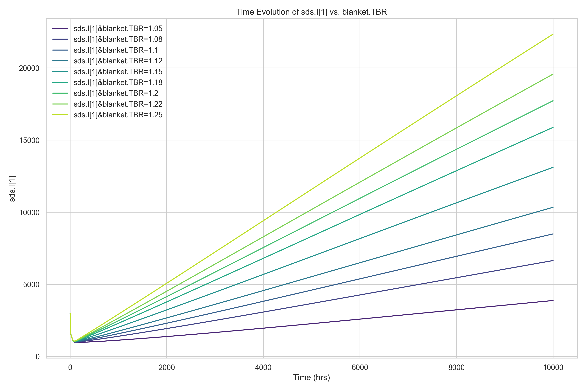
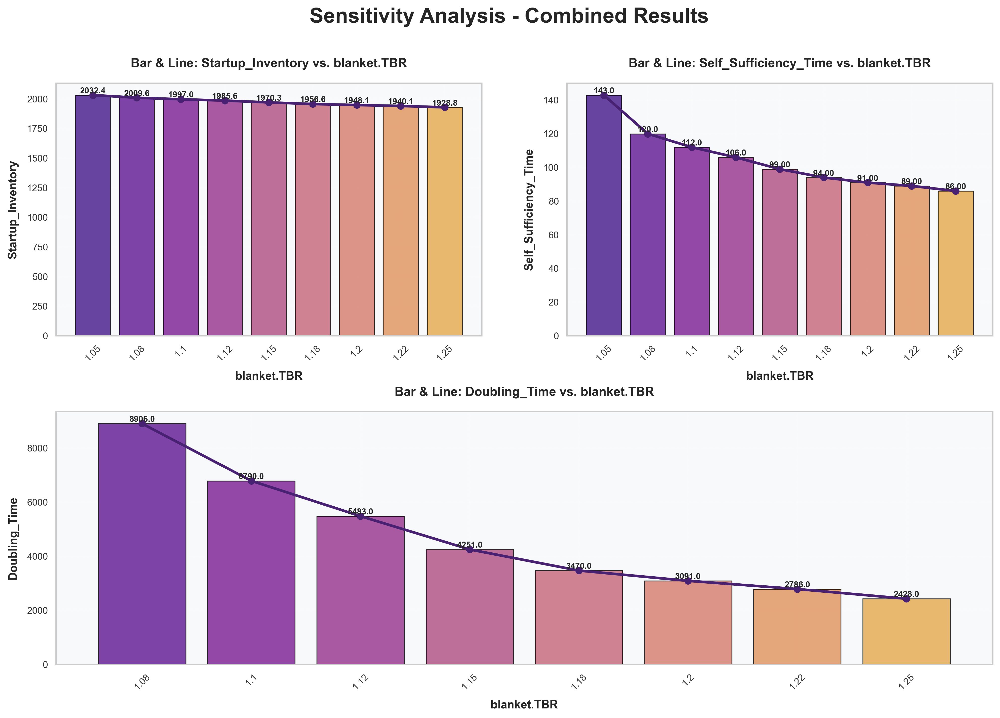

# SALib 敏感性分析报告


生成时间: 2025-10-13 11:42:31.116813


## 不同blanket.TBR下Inventory随时间变化 的曲线图:


## 不同blanket.TBR下首炉氚、自持时间、倍增时间变化，最小TBR 的柱状图/折线图:


## 相关指标的数据表:


|   blanket.TBR |   Doubling_Time |   Self_Sufficiency_Time |   Startup_Inventory |
|--------------:|----------------:|------------------------:|--------------------:|
|          1.05 |             nan |                     143 |             2032.35 |
|          1.08 |            8906 |                     120 |             2009.57 |
|          1.1  |            6790 |                     112 |             1996.97 |
|          1.12 |            5483 |                     106 |             1985.64 |
|          1.15 |            4251 |                      99 |             1970.34 |
|          1.18 |            3470 |                      94 |             1956.59 |
|          1.2  |            3091 |                      91 |             1948.11 |
|          1.22 |            2786 |                      89 |             1940.08 |
|          1.25 |            2428 |                      86 |             1928.79 |

---

# AI模型分析提示词

```markdown
**角色：** 你是一名聚变反应堆氚燃料循环领域的专家。

**任务：** 请仔细审查并解读以下数据，对聚变堆燃料循环模型的模拟结果进行详细的敏感性分析。请遵循以下结构，分析各项重要参数对关键性能指标的影响，并得出结论。

**分析要点：**

1.  **总体趋势：** 描述随着blanket.TBR的提高（例如，从2%增加到9%），总氚库存（Inventory）的增长速率有何变化。
2.  **关键指标影响：**
   * **首炉氚量 (Start-up Inventory, Unit: gram)：** 分析其如何随blanket.TBR变化，并量化其降幅。
   * **倍增时间 (Doubling Time, Unit: hour)：** 分析其变化趋势，并量化其降幅。
   * **自持时间 (Self-sufficiency Time, Unit: hour)：** 分析其变化趋势，通常变化较小，请指出。
   * **所需氚增殖比 (Required TBR, $TBR_r$)：** 描述其与blanket.TBR的关系。
3.  **结论：** 总结提高blanket.TBR对于实现氚自持、减少初始投资（首炉氚）和加速氚增殖的有效性。

```


---

# AI模型分析结果

作为聚变反应堆氚燃料循环领域的专家，我对所提供的模拟数据进行了系统性敏感性分析。以下分析基于表中列出的 blanket.TBR（氚增殖比，Tritium Breeding Ratio）与关键性能指标之间的关系，旨在评估 blanket.TBR 对聚变堆氚燃料循环可持续性与经济性的影响。

---

### 1. 总体趋势：blanket.TBR 对总氚库存增长速率的影响

表中虽未直接给出“总氚库存随时间变化”的曲线，但可通过 **倍增时间（Doubling Time）** 间接反映库存增长速率。倍增时间越短，表明系统内氚库存增长越快，即氚增殖效率越高。

从数据可见，随着 blanket.TBR 从 1.05 增加至 1.25（增幅约 19%），**Doubling Time 从无效值（nan，表示无法实现氚增殖盈余）显著下降至 2428 小时**。这表明：
- 当 TBR ≤ 1.05 时，系统无法实现净氚增殖（TBR < TBR<sub>r</sub>），故 Doubling Time 为 NaN；
- 一旦 TBR 超过临界值（约 1.06–1.07），系统开始具备氚盈余能力，Doubling Time 随 TBR 提高而迅速缩短；
- 氚库存增长速率呈**非线性加速**趋势，TBR 每提升 0.02–0.03，Doubling Time 下降幅度逐渐增大（例如从 1.20 到 1.25，TBR +0.05，Doubling Time 减少约 663 小时）。

因此，**提高 blanket.TBR 显著加快氚库存的指数增长速率**，对实现燃料循环自持至关重要。

---

### 2. 关键指标影响分析

#### （1）首炉氚量（Start-up Inventory, 单位：克）

- **变化趋势**：Start-up Inventory 随 blanket.TBR 增加而**单调下降**。
- **量化降幅**：
  - TBR = 1.05 时：2032.35 g
  - TBR = 1.25 时：1928.79 g
  - **绝对降幅**：2032.35 − 1928.79 = **103.56 g**
  - **相对降幅**：103.56 / 2032.35 ≈ **5.1%**

尽管降幅看似不大，但需注意：首炉氚是聚变堆启动的**关键瓶颈资源**，全球氚供应极为有限（当前年产量仅约 1.5–2 kg）。**节省约 100 克氚可显著降低项目启动门槛和外部依赖**，尤其在多堆部署场景下具有累积效益。

#### （2）倍增时间（Doubling Time, 单位：小时）

- **变化趋势**：在 TBR > ~1.07 后，Doubling Time 随 TBR 提高而**急剧缩短**。
- **量化降幅**：
  - TBR = 1.08 → 8906 h
  - TBR = 1.25 → 2428 h
  - **绝对降幅**：8906 − 2428 = **6478 小时**（约 **269.9 天**）
  - **相对降幅**：6478 / 8906 ≈ **72.7%**

这表明：**仅将 TBR 提高 0.17（从 1.08 到 1.25），即可使氚库存翻倍所需时间缩短近 3/4**。这对缩短聚变电站商业化部署周期、支持多堆级联建设具有决定性意义。

#### （3）自持时间（Self-sufficiency Time, 单位：小时）

- **变化趋势**：随 TBR 增加而**稳步下降**，但变化幅度相对平缓。
- **量化变化**：
  - TBR = 1.05 → 143 h
  - TBR = 1.25 → 86 h
  - **降幅**：57 小时（约 **2.4 天**），相对降幅约 **40%**

尽管绝对值变化不大（均在数天量级），但需注意：**自持时间反映系统从启动到实现氚燃料闭环（无需外部补充）的时间**。即使缩短几十小时，也能减少对昂贵外部氚源的依赖窗口，提升运行安全性与经济性。其变化虽不如 Doubling Time 剧烈，但仍具工程意义。

#### （4）所需氚增殖比（Required TBR, \( TBR_r \)）

- **定义**：\( TBR_r \) 是实现氚自持所需的最小 blanket.TBR，通常略大于 1.05–1.15，具体取决于：
  - 氚提取效率（Tritium Extraction Efficiency）
  - 燃料循环滞留时间（Processing Time）
  - 氚衰变损失（Tritium decay, 半衰期 12.3 年）
  - 燃烧效率与再循环率

- **与 blanket.TBR 的关系**：
  - 当 **blanket.TBR < \( TBR_r \)**：系统无法实现自持（如 TBR=1.05 时 Doubling Time = NaN）
  - 当 **blanket.TBR > \( TBR_r \)**：系统具备氚盈余能力，且盈余率随 (blanket.TBR − \( TBR_r \)) 增大而提高

从数据推断，本模型中 **\( TBR_r \approx 1.06–1.07 \)**。因此，**blanket.TBR 必须显著高于 1.05 才能确保工程裕度下的可靠自持**。

---

### 3. 结论

提高 blanket.TBR 对聚变堆氚燃料循环具有**多维度正向效益**：

1. **实现氚自持的前提**：只有当 blanket.TBR 超过临界值 \( TBR_r \)（约 1.06–1.07）时，系统才能实现氚燃料闭环。TBR = 1.05 无法满足自持要求。
2. **显著降低初始氚需求**：TBR 从 1.05 提升至 1.25，可减少首炉氚约 104 克（5.1%），缓解全球氚资源稀缺对聚变能部署的制约。
3. **极大加速氚增殖进程**：Doubling Time 缩短超 70%，使氚库存快速增长，支撑多堆扩展或应对运行波动。
4. **缩短外部依赖窗口**：自持时间减少近 40%，提升运行自主性与安全性。

**工程建议**：在聚变堆设计中，应**优先优化包层中子学性能与氚提取效率，力争 blanket.TBR ≥ 1.15**，以提供充足工程裕度，确保在实际运行损耗和不确定性下仍能稳健实现氚自持。同时，需协同优化燃料循环时间（如减少滞留时间），进一步降低 \( TBR_r \)，减轻对包层增殖性能的极端依赖。

综上，**blanket.TBR 是决定聚变能可持续性的核心参数，其微小提升可带来系统级性能的显著改善**。