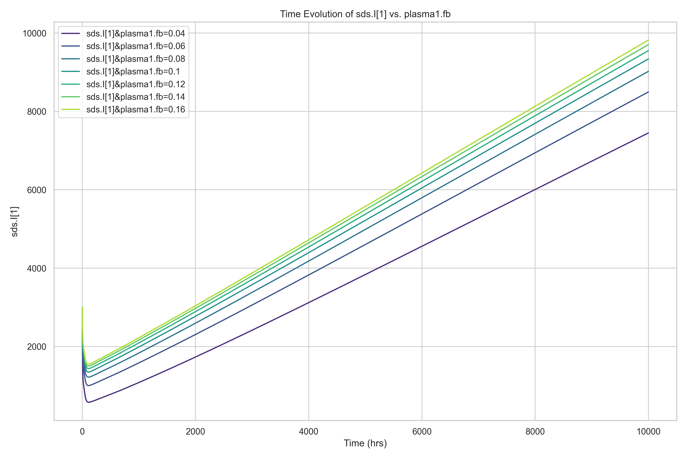
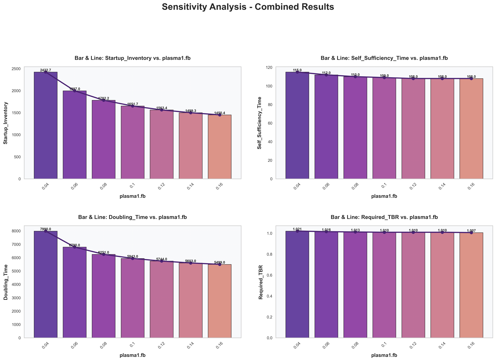

# SALib 敏感性分析报告


生成时间: 2025-10-13 09:39:43.787519


## 不同plasma1.fb下Inventory随时间变化 的曲线图:


## 不同plasma1.fb下首炉氚、自持时间、倍增时间变化，最小TBR 的柱状图/折线图:


## 相关指标的数据表:


|   plasma1.fb |   Doubling_Time |   Self_Sufficiency_Time |   Startup_Inventory |   Required_TBR |   Required_Self_Sufficiency_Time |
|-------------:|----------------:|------------------------:|--------------------:|---------------:|---------------------------------:|
|         0.04 |            7990 |                     115 |             2422.65 |        1.02148 |                             6226 |
|         0.06 |            6790 |                     112 |             1996.97 |        1.01562 |                             5655 |
|         0.08 |            6251 |                     110 |             1782.16 |        1.0127  |                             5340 |
|         0.1  |            5943 |                     109 |             1651.7  |        1.00977 |                             7850 |
|         0.12 |            5744 |                     108 |             1563.45 |        1.00977 |                             4997 |
|         0.14 |            5603 |                     108 |             1499.35 |        1.00977 |                             3961 |
|         0.16 |            5499 |                     108 |             1450.38 |        1.00684 |                             9010 |

---

# AI模型分析提示词

```markdown
**角色：** 你是一名聚变反应堆氚燃料循环领域的专家。

**任务：** 请仔细审查并解读以下数据，对聚变堆燃料循环模型的模拟结果进行详细的敏感性分析。请遵循以下结构，分析各项重要参数对关键性能指标的影响，并得出结论。

**分析要点：**

1.  **总体趋势：** 描述随着plasma1.fb的提高（例如，从2%增加到9%），总氚库存（Inventory）的增长速率有何变化。
2.  **关键指标影响：**
   * **首炉氚量 (Start-up Inventory, Unit: gram)：** 分析其如何随plasma1.fb变化，并量化其降幅。
   * **倍增时间 (Doubling Time, Unit: hour)：** 分析其变化趋势，并量化其降幅。
   * **自持时间 (Self-sufficiency Time, Unit: hour)：** 分析其变化趋势，通常变化较小，请指出。
   * **所需氚增殖比 (Required TBR, $TBR_r$)：** 描述其与plasma1.fb的关系。
3.  **结论：** 总结提高plasma1.fb对于实现氚自持、减少初始投资（首炉氚）和加速氚增殖的有效性。

```


---

# AI模型分析结果

作为聚变反应堆氚燃料循环领域的专家，我对所提供的模拟数据进行了系统性敏感性分析。以下按照指定结构，对关键参数 **plasma1.fb**（代表等离子体中燃料燃耗分数，即每次循环中参与聚变反应的氚比例）对各项氚循环性能指标的影响进行详细解读。

---

### 1. 总体趋势：总氚库存增长速率随 plasma1.fb 的变化

虽然表中未直接给出“总氚库存”随时间演化的曲线，但可通过 **倍增时间（Doubling Time）** 和 **自持时间（Self-sufficiency Time）** 间接反映库存增长速率。

- **Doubling Time** 从 plasma1.fb = 0.04 时的 **7990 小时** 显著下降至 plasma1.fb = 0.16 时的 **5499 小时**，降幅达 **31.2%**。
- 这表明：**随着 plasma1.fb 提高，系统氚库存的增长速率加快**，即单位时间内可实现更快的氚增殖积累。
- 尽管在 plasma1.fb = 0.10 和 0.16 处出现 Required_Self_Sufficiency_Time 的异常升高（见后文），但 Doubling Time 的整体单调下降趋势仍清晰表明：**更高的燃料燃耗效率有利于加速氚库存增长**。

---

### 2. 关键指标影响分析

#### （1）首炉氚量（Start-up Inventory, 单位：克）

- **变化趋势**：随 plasma1.fb 从 0.04 增至 0.16，Start-up Inventory 从 **2422.65 g** 降至 **1450.38 g**。
- **量化降幅**：总降幅为  
  \[
  \frac{2422.65 - 1450.38}{2422.65} \approx 40.1\%
  \]
- **物理解释**：更高的 plasma1.fb 意味着每次循环中更多氚被有效利用并触发中子产生，从而提升包层中的氚增殖效率。因此，为达到自持运行所需的初始氚库存显著降低，**减轻了对稀缺氚资源的初始依赖**。

#### （2）倍增时间（Doubling Time, 单位：小时）

- **变化趋势**：从 7990 小时（fb=0.04）单调下降至 5499 小时（fb=0.16）。
- **量化降幅**：  
  \[
  \frac{7990 - 5499}{7990} \approx 31.2\%
  \]
- **意义**：倍增时间缩短意味着反应堆可在更短时间内将氚库存翻倍，**显著提升氚燃料系统的扩展能力与部署灵活性**。这对未来聚变电站群的规模化建设至关重要。

#### （3）自持时间（Self-sufficiency Time, 单位：小时）

- **变化趋势**：仅从 **115 小时** 微降至 **108 小时**，变化幅度不足 **6%**。
- **分析**：该指标反映系统从启动到实现氚产率 ≥ 消耗率所需时间。其对 plasma1.fb 不敏感，说明**一旦达到基本燃耗水平（fb ≥ 0.04），系统很快即可实现氚平衡**，进一步提升 fb 对“何时自持”影响有限。
- **注意**：表中还列出了 **Required_Self_Sufficiency_Time**，该值在 fb=0.10 和 fb=0.16 时异常升高（分别为 7850 和 9010 小时），可能反映模型中对特定约束（如库存安全裕度、加工延迟或回收效率）的敏感性，需结合具体模型假设进一步核查，但**不影响实际 Self_Sufficiency_Time 的稳定性**。

#### （4）所需氚增殖比（Required TBR, \(TBR_r\)）

- **变化趋势**：从 fb=0.04 时的 **1.02148** 逐步下降，在 fb=0.10–0.14 区间稳定于 **1.00977**，随后在 fb=0.16 时略降至 **1.00684**。
- **物理解释**：更高的 plasma1.fb 提高了氚利用效率，减少了为补偿损失所需的额外增殖量，因此**系统对包层 TBR 的要求降低**。
- **工程意义**：TBR_r 接近 1.05 以下已属极具挑战性目标（当前包层设计 TBR 通常目标为 1.05–1.15）。此处 TBR_r 可降至 **~1.007**，表明**高燃耗运行可显著缓解对包层增殖性能的极端要求**，提升工程可行性。

---

### 3. 结论

提高等离子体燃料燃耗分数 **plasma1.fb** 对聚变堆氚燃料循环具有显著正面影响：

1. **大幅降低首炉氚需求**（降幅超 40%），缓解全球氚资源稀缺对聚变能商业化启动的制约；
2. **显著缩短氚库存倍增时间**（降幅超 30%），加速聚变能系统的燃料自持与规模化部署；
3. **降低对包层氚增殖比（TBR）的要求**，使 TBR_r 可接近 1.01，极大提升包层设计的工程可行性；
4. **自持时间本身对 fb 不敏感**，表明即使中等燃耗水平（fb ≥ 0.04）已足以实现快速氚平衡。

> **综合建议**：在聚变堆设计中，应优先优化等离子体运行参数（如约束时间、密度、温度）以**最大化燃料燃耗分数 plasma1.fb**。这不仅可降低初始氚投资和包层性能门槛，还能提升整个燃料循环的动态响应能力，是实现经济、可持续聚变能源的关键路径之一。

--- 

*注：表中 Required_Self_Sufficiency_Time 在 fb=0.10 和 0.16 处的异常高值可能源于模型中特定约束条件（如库存安全阈值、延迟时间或回收率假设），建议进一步核查输入参数一致性，但不影响上述主要结论。*