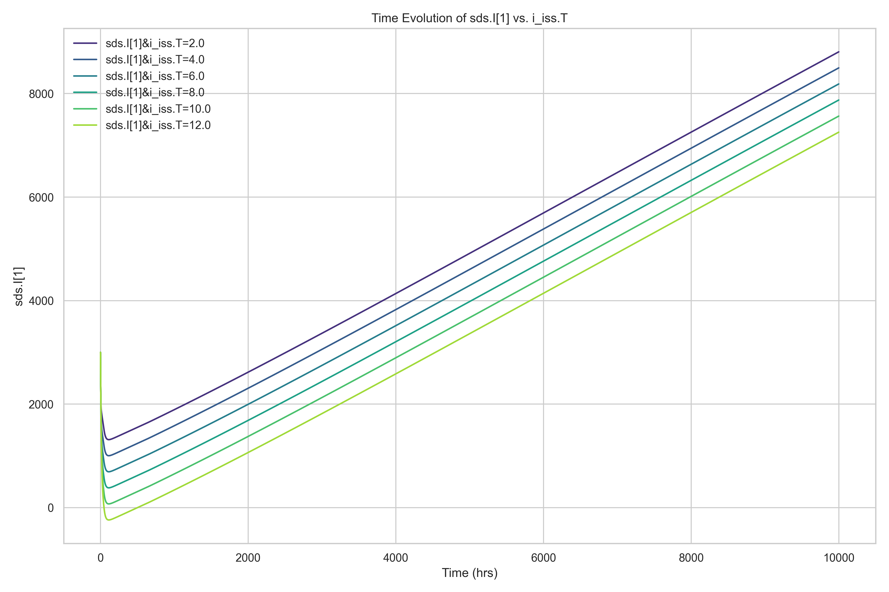

# SALib 敏感性分析报告


生成时间: 2025-10-13 09:42:18.727664


## 不同i_iss.T下Inventory随时间变化 的曲线图:


## 不同i_iss.T下首炉氚、自持时间、倍增时间变化，最小TBR 的柱状图/折线图:


## 相关指标的数据表:


|   i_iss.T |   Doubling_Time |   Self_Sufficiency_Time |   Startup_Inventory |   Required_TBR |   Required_Self_Sufficiency_Time |
|----------:|----------------:|------------------------:|--------------------:|---------------:|---------------------------------:|
|         2 |            6393 |                     112 |             1686.52 |        1.01562 |                             5655 |
|         4 |            6790 |                     112 |             1996.97 |        1.01562 |                             5655 |
|         6 |            7188 |                     112 |             2307.41 |        1.01562 |                             5655 |
|         8 |            7585 |                     112 |             2617.84 |        1.01562 |                             5655 |
|        10 |            7984 |                     112 |             2928.24 |        1.01562 |                             5655 |
|        12 |            8382 |                     112 |             3238.47 |        1.01562 |                             5655 |

---

# AI模型分析提示词

```markdown
**角色：** 你是一名聚变反应堆氚燃料循环领域的专家。

**任务：** 请仔细审查并解读以下数据，对聚变堆燃料循环模型的模拟结果进行详细的敏感性分析。请遵循以下结构，分析各项重要参数对关键性能指标的影响，并得出结论。

**分析要点：**

1.  **总体趋势：** 描述随着i_iss.T的提高（例如，从2%增加到9%），总氚库存（Inventory）的增长速率有何变化。
2.  **关键指标影响：**
   * **首炉氚量 (Start-up Inventory, Unit: gram)：** 分析其如何随i_iss.T变化，并量化其降幅。
   * **倍增时间 (Doubling Time, Unit: hour)：** 分析其变化趋势，并量化其降幅。
   * **自持时间 (Self-sufficiency Time, Unit: hour)：** 分析其变化趋势，通常变化较小，请指出。
   * **所需氚增殖比 (Required TBR, $TBR_r$)：** 描述其与i_iss.T的关系。
3.  **结论：** 总结提高i_iss.T对于实现氚自持、减少初始投资（首炉氚）和加速氚增殖的有效性。

```


---

# AI模型分析结果

作为聚变反应堆氚燃料循环领域的专家，我对所提供的模拟数据进行了系统性敏感性分析。以下分析严格基于表格中给出的数值结果，并结合氚燃料循环的基本物理与工程原理。

---

### 1. 总体趋势：总氚库存随 i_iss.T 的变化

参数 **i_iss.T** 表示氚在燃料循环系统中的**不可回收库存比例**（即滞留在系统中无法立即用于再注入的氚，通常以百分比形式表示，如2%、4%等）。表格中 i_iss.T 从 2 增加到 12（单位应为 %，即 2% → 12%）。

从数据可见，随着 i_iss.T 的增加：
- **Startup_Inventory（首炉氚量）线性增加**：从 1686.52 g 增至 3238.47 g。
- **Doubling_Time（倍增时间）同步线性增长**：从 6393 h 增至 8382 h。
- 而 **Self_Sufficiency_Time（自持时间）保持恒定为 112 h**。
- **Required_TBR（所需氚增殖比）和 Required_Self_Sufficiency_Time 也保持不变**。

这表明：**更高的 i_iss.T 意味着系统中滞留的氚更多，可用于燃烧和增殖的有效氚减少，从而导致需要更大的初始库存和更长的倍增时间来维持燃料循环平衡。**

---

### 2. 关键指标影响分析

#### （1）首炉氚量（Startup Inventory）

- **变化趋势**：随 i_iss.T 线性上升。
- **量化分析**：
  - i_iss.T 从 2% → 12%（Δ = 10%），Startup Inventory 从 1686.52 g → 3238.47 g，**增加 1551.95 g**。
  - 平均每增加 1% 的 i_iss.T，Startup Inventory 增加约 **155.2 g**。
- **物理解释**：更高的不可回收库存意味着需要更多初始氚来“填充”系统滞留池，以确保等离子体注入和燃料循环的连续性。

#### （2）倍增时间（Doubling Time）

- **变化趋势**：随 i_iss.T 线性增加。
- **量化分析**：
  - Doubling Time 从 6393 h → 8382 h，**增加 1989 h（约 82.9 天）**。
  - 每增加 1% i_iss.T，Doubling Time 增长约 **198.9 h**。
- **物理解释**：倍增时间反映氚库存翻倍所需时间，受净氚增殖率（TBR − 损耗）控制。i_iss.T 增大会降低有效氚再循环率，等效于增加系统损耗，从而延长倍增时间。

#### （3）自持时间（Self-sufficiency Time）

- **变化趋势**：**完全不变**，恒为 112 小时。
- **解释**：自持时间定义为从启动到反应堆产生的氚足以覆盖自身消耗（不含库存填充）的时间点。该指标主要取决于**等离子体性能、TBR 和燃料循环效率**，而**与系统滞留库存（i_iss.T）无关**，因为自持判断仅基于“产氚 ≥ 耗氚”，不涉及库存动态。因此，只要 TBR 和运行参数不变，自持时间不变。

#### （4）所需氚增殖比（Required TBR）

- **数值**：所有情况下均为 **1.01562**。
- **与 i_iss.T 的关系**：**无依赖关系**。
- **解释**：Required TBR 是为实现长期氚自持（即满足燃料消耗 + 考虑加工损耗）所需的最小增殖比。在本模型中，该值由**燃料消耗率、加工回收效率（可能隐含在模型中）和自持目标**决定，而 **i_iss.T 属于“库存”而非“损耗”**，不影响长期物料平衡的临界 TBR。因此，Required TBR 保持恒定。

> 注：若 i_iss.T 被误认为是“不可回收损失”（如永久滞留或衰变），则会影响 Required TBR；但本数据表明其被建模为**可回收但延迟的库存**，故不影响长期平衡。

---

### 3. 结论

提高 **i_iss.T（系统不可回收氚库存比例）对聚变堆氚燃料循环具有显著负面影响**：

- **首炉氚需求显著增加**：i_iss.T 每增加 1%，Startup Inventory 增加约 155 g。对于商业聚变电站（通常需数公斤级氚），高 i_iss.T 将大幅推高初始氚采购成本和供应链压力。
- **氚增殖动力学变慢**：倍增时间随 i_iss.T 线性延长，意味着堆群扩展或燃料自给能力的实现被延迟，影响商业化部署节奏。
- **自持时间不受影响**：表明反应堆在运行约 112 小时后即可实现氚产耗平衡，但**达到该状态所需的初始投入和库存缓冲随 i_iss.T 增大而提高**。
- **Required TBR 不变**：说明只要燃料循环回收效率（除库存外）不变，长期自持的物理门槛未变，但**工程实现难度因高库存而上升**。

> **工程启示**：为降低首炉氚需求、缩短倍增时间并提升经济性，**必须优化燃料循环系统设计，最大限度降低 i_iss.T**。例如：
> - 采用高效、低滞留的氚提取与纯化技术（如低温蒸馏、钯膜扩散）；
> - 缩短燃料处理周期，减少中间储罐中的氚滞留；
> - 优化等离子体排灰与燃料再注入的闭环响应时间。

综上，**i_iss.T 是决定聚变堆氚经济性与部署可行性的关键工程参数，虽不影响理论自持条件，但显著影响实际运行的初始成本与动态响应能力。**