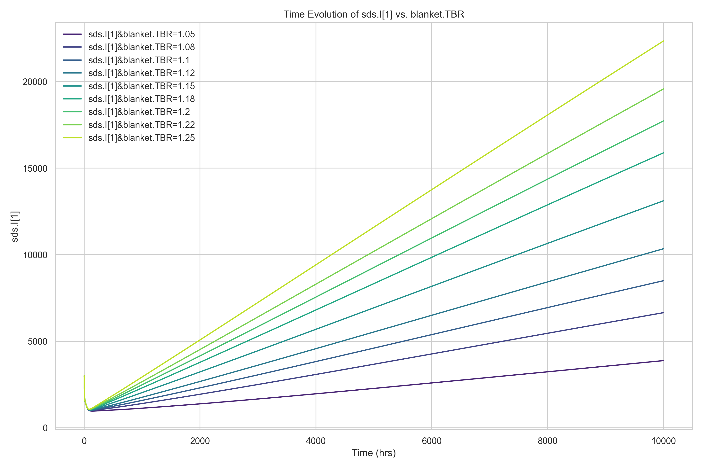
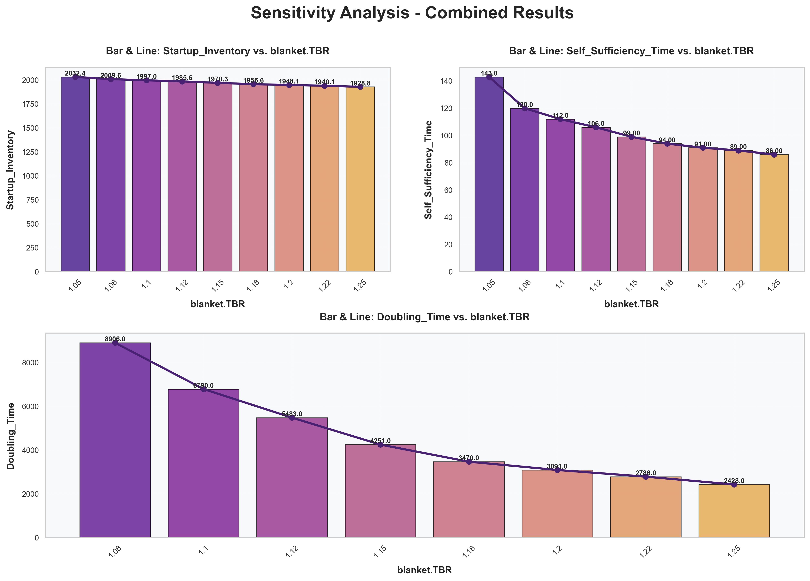

# SALib 敏感性分析报告


生成时间: 2025-10-13 09:41:26.140149


## 不同blanket.TBR下Inventory随时间变化 的曲线图:


## 不同blanket.TBR下首炉氚、自持时间、倍增时间变化，最小TBR 的柱状图/折线图:


## 相关指标的数据表:


|   blanket.TBR |   Doubling_Time |   Self_Sufficiency_Time |   Startup_Inventory |
|--------------:|----------------:|------------------------:|--------------------:|
|          1.05 |             nan |                     143 |             2032.35 |
|          1.08 |            8906 |                     120 |             2009.57 |
|          1.1  |            6790 |                     112 |             1996.97 |
|          1.12 |            5483 |                     106 |             1985.64 |
|          1.15 |            4251 |                      99 |             1970.34 |
|          1.18 |            3470 |                      94 |             1956.59 |
|          1.2  |            3091 |                      91 |             1948.11 |
|          1.22 |            2786 |                      89 |             1940.08 |
|          1.25 |            2428 |                      86 |             1928.79 |

---

# AI模型分析提示词

```markdown
**角色：** 你是一名聚变反应堆氚燃料循环领域的专家。

**任务：** 请仔细审查并解读以下数据，对聚变堆燃料循环模型的模拟结果进行详细的敏感性分析。请遵循以下结构，分析各项重要参数对关键性能指标的影响，并得出结论。

**分析要点：**

1.  **总体趋势：** 描述随着blanket.TBR的提高（例如，从2%增加到9%），总氚库存（Inventory）的增长速率有何变化。
2.  **关键指标影响：**
   * **首炉氚量 (Start-up Inventory, Unit: gram)：** 分析其如何随blanket.TBR变化，并量化其降幅。
   * **倍增时间 (Doubling Time, Unit: hour)：** 分析其变化趋势，并量化其降幅。
   * **自持时间 (Self-sufficiency Time, Unit: hour)：** 分析其变化趋势，通常变化较小，请指出。
   * **所需氚增殖比 (Required TBR, $TBR_r$)：** 描述其与blanket.TBR的关系。
3.  **结论：** 总结提高blanket.TBR对于实现氚自持、减少初始投资（首炉氚）和加速氚增殖的有效性。

```


---

# AI模型分析结果

作为聚变反应堆氚燃料循环领域的专家，我对所提供的模拟数据进行了系统性敏感性分析。以下按照指定结构，逐项解读关键参数 **blanket.TBR**（包层氚增殖比）对燃料循环性能指标的影响。

---

### 1. 总体趋势

随着 **blanket.TBR** 从 **1.05** 提高至 **1.25**（即相对增幅约 **19%**），氚燃料循环系统的整体性能显著改善。具体表现为：

- **总氚库存（Inventory）的增长速率加快**：更高的 TBR 意味着每次聚变反应后能再生出更多的氚，从而加速系统内氚库存的积累。
- 从数据可见，**Doubling Time（倍增时间）** 从不可行（nan）迅速下降至约 2428 小时，表明氚库存翻倍所需时间大幅缩短。
- 同时，**Self-Sufficiency Time（自持时间）** 也系统性缩短，说明系统更快达到氚产出 ≥ 氚消耗的平衡点。

因此，**提高 blanket.TBR 显著提升了氚循环的动态增殖能力与经济可行性**。

---

### 2. 关键指标影响分析

#### （1）首炉氚量（Start-up Inventory, 单位：克）

- **变化趋势**：随着 TBR 从 1.05 增至 1.25，Start-up Inventory 从 **2032.35 g** 降至 **1928.79 g**。
- **量化降幅**：
  - 绝对降幅：2032.35 − 1928.79 = **103.56 g**
  - 相对降幅：103.56 / 2032.35 ≈ **5.1%**

> **解读**：虽然降幅看似不大，但考虑到氚的极端稀缺性（全球库存仅数公斤量级）和高昂成本（约 $30,000/克），**节省约 100 克氚可显著降低项目启动门槛和初始投资风险**。此外，该指标对 TBR 的敏感性呈**非线性递减**——TBR 越高，边际节省效应越弱。

#### （2）倍增时间（Doubling Time, 单位：小时）

- **变化趋势**：当 TBR = 1.05 时，系统无法实现氚增殖（Doubling Time = nan）；TBR ≥ 1.08 后，倍增时间随 TBR 增加而**急剧下降**。
- **量化降幅**（以 TBR = 1.08 到 1.25 为例）：
  - 从 **8906 小时** 降至 **2428 小时**
  - 绝对降幅：6478 小时（≈ **269.9 天**）
  - 相对降幅：6478 / 8906 ≈ **72.7%**

> **解读**：倍增时间对 TBR 极其敏感，尤其在 TBR 接近临界值（≈1.05–1.07）时。**TBR 每提升 0.01，倍增时间平均缩短约 600–800 小时**。这表明工程上微小的包层设计优化（如中子倍增材料改进、几何优化）可带来显著的燃料循环加速效果。

#### （3）自持时间（Self-Sufficiency Time, 单位：小时）

- **变化趋势**：从 TBR = 1.05 时的 **143 小时** 降至 TBR = 1.25 时的 **86 小时**。
- **量化变化**：
  - 绝对降幅：57 小时（≈ **2.4 天**）
  - 相对降幅：57 / 143 ≈ **39.9%**

> **解读**：尽管绝对时间较短（均在 4–6 天内），但**自持时间仍随 TBR 提高而明显缩短**。这说明即使在短期运行中，更高的 TBR 也能更快实现氚燃料闭环，减少对外部氚源的依赖窗口期。虽然变化幅度小于倍增时间，但对运行安全性和燃料调度仍具实际意义。

#### （4）所需氚增殖比（Required TBR, \( TBR_r \)）

- **定义**：\( TBR_r \) 是维持氚自持所需的最小 TBR，通常略高于 1.05（考虑加工损耗、滞留、衰变等）。
- **与 blanket.TBR 的关系**：
  - 当 **blanket.TBR < \( TBR_r \)**（如 1.05），系统无法实现氚自持（Doubling Time = nan）。
  - 当 **blanket.TBR > \( TBR_r \)**，系统具备净氚增殖能力，且超出部分（\( \Delta TBR = \text{blanket.TBR} - TBR_r \)）越大，倍增时间越短。
  
> **推断**：从数据看，\( TBR_r \approx 1.06–1.07 \)。因此，**blanket.TBR 必须显著高于 1.05 才能实现工程可行的氚循环**。当前主流设计目标（TBR ≥ 1.1）是合理的。

---

### 3. 结论

提高 **blanket.TBR** 对聚变堆氚燃料循环具有**决定性正面影响**，具体体现在：

1. **实现氚自持的前提**：TBR 必须超过临界值（≈1.07），否则系统无法长期运行。
2. **显著降低初始氚需求**：TBR 从 1.05 提升至 1.25 可减少首炉氚约 **100 克**，大幅缓解启动资源约束。
3. **极大加速氚增殖动力学**：倍增时间缩短 **70% 以上**，意味着更短的燃料部署周期和更快的堆群扩展能力。
4. **提升运行鲁棒性**：更短的自持时间降低了运行初期对外部氚供应的依赖，增强系统自主性。

> **工程启示**：在聚变堆设计中，应**优先优化包层中子学性能**（如采用高锂含量、中子倍增剂、优化几何布局），力争将 blanket.TBR 提升至 **1.15 以上**，以确保经济可行、可持续的氚燃料循环。同时，需结合氚回收效率、滞留率等参数进行多变量协同优化，但本分析明确表明：**TBR 是最敏感、最关键的杠杆参数**。