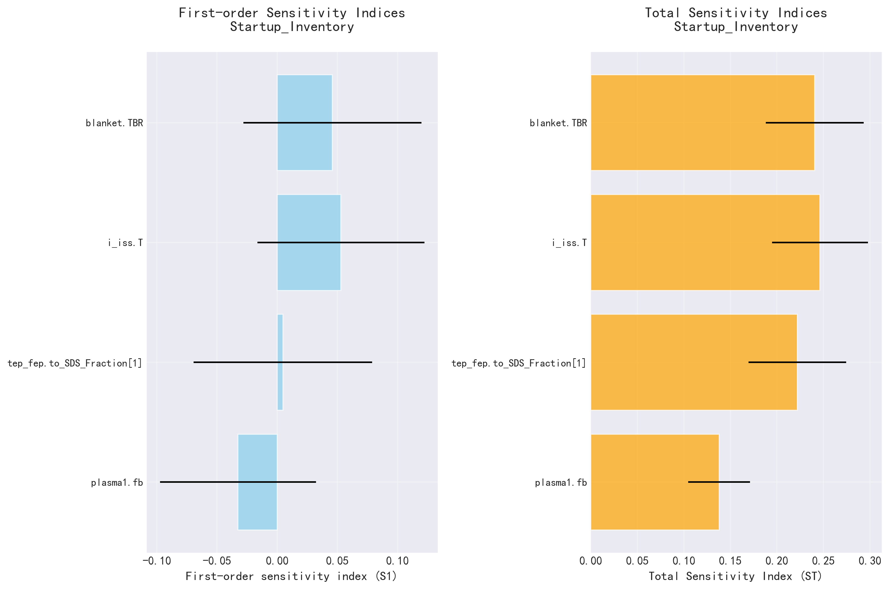
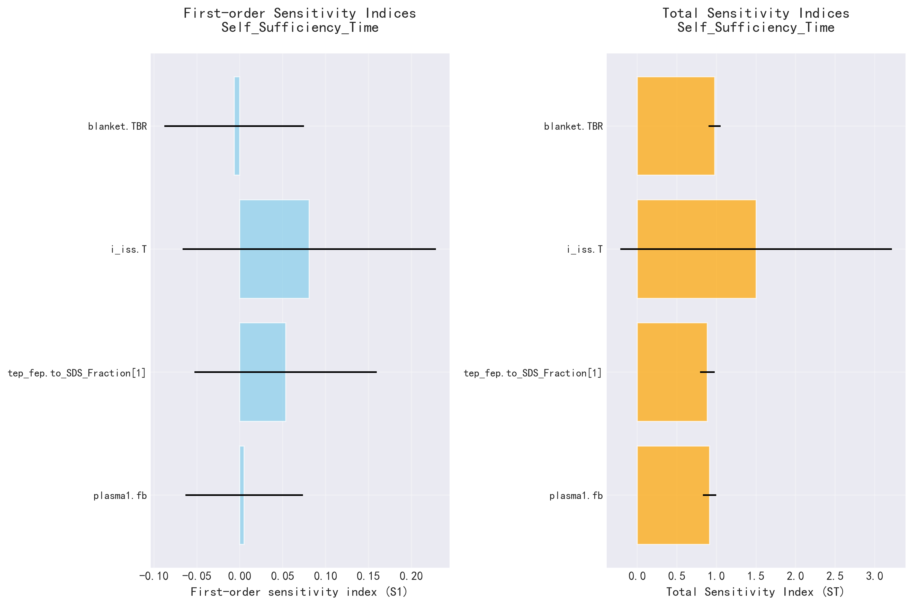
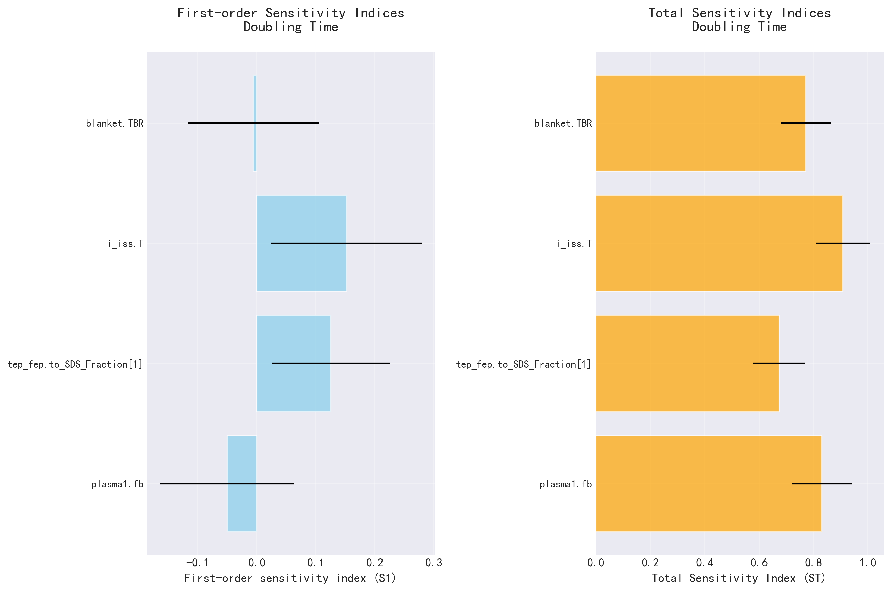

# SALib 敏感性分析报告

生成时间: 2025-10-13 11:30:58.079301

## 分析参数

- **plasma1.fb**: [0.0200, 0.2000]
- **tep_fep.to_SDS_Fraction[1]**: [0.1000, 0.9900]
- **i_iss.T**: [4.0000, 12.0000]
- **blanket.TBR**: [1.0500, 1.2500]

## Startup_Inventory 敏感性分析结果

### Sobol敏感性指数

| 参数 | S1 (一阶) | ST (总) | S1置信区间 | ST置信区间 |
|------|----------|---------|------------|------------|
| plasma1.fb | -0.0325 | 0.1379 | ±0.0647 | ±0.0333 |
| tep_fep.to_SDS_Fraction[1] | 0.0047 | 0.2221 | ±0.0742 | ±0.0525 |
| i_iss.T | 0.0530 | 0.2462 | ±0.0694 | ±0.0515 |
| blanket.TBR | 0.0459 | 0.2406 | ±0.0739 | ±0.0527 |



## Self_Sufficiency_Time 敏感性分析结果

### Sobol敏感性指数

| 参数 | S1 (一阶) | ST (总) | S1置信区间 | ST置信区间 |
|------|----------|---------|------------|------------|
| plasma1.fb | 0.0051 | 0.9128 | ±0.0684 | ±0.0832 |
| tep_fep.to_SDS_Fraction[1] | 0.0535 | 0.8851 | ±0.1063 | ±0.0920 |
| i_iss.T | 0.0809 | 1.5019 | ±0.1477 | ±1.7165 |
| blanket.TBR | -0.0065 | 0.9765 | ±0.0814 | ±0.0769 |



## Doubling_Time 敏感性分析结果

### Sobol敏感性指数

| 参数 | S1 (一阶) | ST (总) | S1置信区间 | ST置信区间 |
|------|----------|---------|------------|------------|
| plasma1.fb | -0.0504 | 0.8307 | ±0.1133 | ±0.1114 |
| tep_fep.to_SDS_Fraction[1] | 0.1255 | 0.6730 | ±0.0993 | ±0.0948 |
| i_iss.T | 0.1521 | 0.9077 | ±0.1279 | ±0.0995 |
| blanket.TBR | -0.0060 | 0.7709 | ±0.1109 | ±0.0911 |




---

# AI模型分析提示词

```markdown
**角色：** 你是一名在氚燃料循环领域具有深厚背景的敏感性分析专家。

**任务：** 请仔细审查并解读以下这份由SALib库生成的敏感性分析报告。你的目标是：
1.  **总结核心发现**：简明扼要地总结报告中的关键信息。
2.  **识别关键参数**：对于报告中提到的每一个输出指标（如“启动氚量”、“倍增时间”等），明确指出哪些输入参数对它的影响最大（即最敏感）。
3.  **提供综合结论**：基于所有分析结果，对模型的整体行为、参数间的相互作用（如果可能）以及这些发现对工程实践的潜在启示，给出一个综合性的结论。

请确保你的分析清晰、专业，并直接切入要点。

```


---

# AI模型分析结果

好的，作为氚燃料循环领域的敏感性分析专家，我将对这份报告进行详细解读。

### 1. 核心发现总结

本报告揭示了氚燃料循环模型的一个关键特征：**所有被考察的输出指标（启动氚量、自持时间、倍增时间）都主要受输入参数之间复杂的非线性相互作用主导，而非单个参数的独立线性影响。**

具体表现为：
*   **相互作用主导**：对于所有输出，参数的总阶指数普遍远高于其一阶指数。这表明参数之间存在着强烈的耦合效应，改变一个参数会显著影响其他参数对输出的作用。
*   **关键驱动参数**：尽管相互作用显著，但`i_iss.T`（同位素分离系统滞留时间）和`blanket.TBR`（包层氚增殖比）在所有三个输出指标中 consistently 显示出最高的总敏感性，是系统行为的核心驱动因素。
*   **燃烧分数影响微弱**：令人意外的是，`plasma1.fb`（燃烧分数）对启动氚量的一阶影响几乎可以忽略，但其通过相互作用对其他指标（自持和倍增时间）的总影响却非常显著。

### 2. 关键参数识别

以下是针对每个输出指标的详细分析：

**A. 启动氚量**
*   **最敏感参数**：`i_iss.T` (ST = 0.246) 和 `blanket.TBR` (ST = 0.241)。
*   **解读**：启动所需的氚库存主要取决于氚在分离系统中的滞留时间（影响循环损失）和包层的增殖能力。`tep_fep.to_SDS_Fraction[1]`的总阶指数也较高，说明从燃料处理到储存的直接分流策略也会通过与其他系统的相互作用影响启动库存。

**B. 自持时间**
*   **最敏感参数**：`i_iss.T` (ST = 1.502) 是**压倒性的最敏感参数**。
*   **解读**：
    *   `i_iss.T`的总阶指数异常高（>1），这通常表明模型存在极强的非线性或交互作用。滞留时间稍作增加，就会极大地延迟系统达到氚自持的时间。
    *   `blanket.TBR` (ST = 0.977) 和 `plasma1.fb` (ST = 0.913) 也是高度敏感的参数。这表明实现自持的速度是氚增殖、燃烧效率和循环滞留时间三者复杂博弈的结果。

**C. 倍增时间**
*   **最敏感参数**：`i_iss.T` (ST = 0.908) 和 `plasma1.fb` (ST = 0.831)。
*   **解读**：在实现自持后，为了积累多余的氚以实现“倍增”（如启动第二个反应堆），系统的**净产氚效率**成为关键。因此，减少在等离子体中的燃烧损失（提高`plasma1.fb`的负相关性）和减少在分离系统中的滞留（`i_iss.T`）变得至关重要。`blanket.TBR`的高总阶指数再次强调了基础增殖能力是倍增的基石。

### 3. 综合结论与工程启示

基于以上分析，我们可以得出以下综合性结论和对工程实践的启示：

1.  **模型行为本质**：该氚燃料循环模型是一个**强非线性、高耦合的系统**。试图通过单独优化某一个参数来改善系统性能的效果是有限的，必须采用系统集成的视角，考虑参数之间的协同与拮抗效应。

2.  **工程优化优先级**：
    *   **首要优化目标**：**同位素分离系统**。`i_iss.T`在三个关键指标中都表现出极高的敏感性，尤其是对自持时间。工程上的首要任务应是尽一切可能**缩短氚在分离系统中的滞留时间**，这将对整个燃料循环的性能产生最大的杠杆效应。
    *   **核心设计指标**：**包层TBR**。`blanket.TBR`是系统氚增益的根本来源，其高总敏感性表明，在设计中确保并尽可能提高TBR是维持循环和实现增长的先决条件。不能仅仅满足于大于1的理论值，应有足够的工程裕度。
    *   **运行策略考量**：**燃烧分数**和**分流策略**。分析表明，`plasma1.fb`主要通过相互作用影响长期性能（自持和倍增）。这意味着在运行中，需要将燃烧效率与整个燃料循环的动态联系起来进行优化。同样，`to_SDS_Fraction`的影响也提示我们，燃料处理的路径选择是一个重要的优化杠杆。

3.  **风险管控启示**：
    *   **重点关注不确定性**：在后续的研发和设计中，应对`i_iss.T`和`blanket.TBR`这两个参数投入最多的资源进行精化测量和不确定性量化，因为其不确定性对模型预测结果的影响最大。
    *   **避免孤立设计**：这份报告强烈警示，不能将包层、燃料循环系统、等离子体物理等部门孤立开来设计。必须建立一个紧密耦合的设计和优化流程，充分考虑各子系统之间的相互影响。

**总结**：本敏感性分析明确指出，一个高效、可靠的聚变堆氚燃料循环，其成功关键在于**构建一个高度集成和优化的系统**，其中**快速高效的氚处理能力**和**稳健强大的氚增殖能力**是两大基石。任何工程设计都必须以理解并驾驭参数间复杂的相互作用为前提。