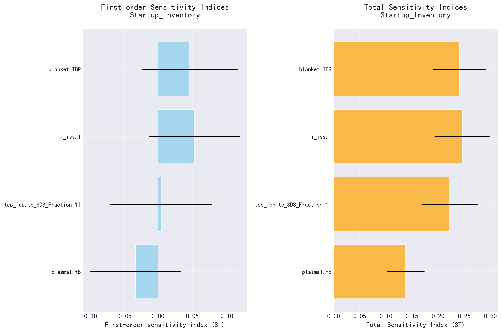
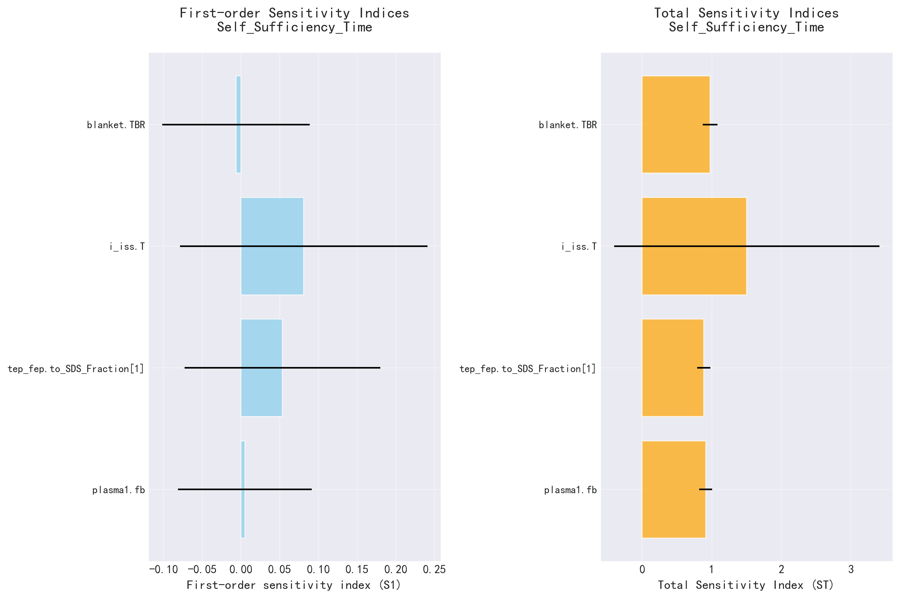
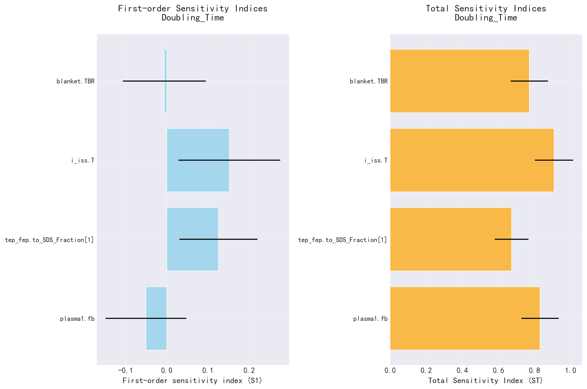

# SALib 敏感性分析报告

生成时间: 2025-10-13 10:25:39.694326

## 分析参数

- **plasma1.fb**: [0.0200, 0.2000]
- **tep_fep.to_SDS_Fraction[1]**: [0.1000, 0.9900]
- **i_iss.T**: [4.0000, 12.0000]
- **blanket.TBR**: [1.0500, 1.2500]

## Startup_Inventory 敏感性分析结果

### Sobol敏感性指数

| 参数 | S1 (一阶) | ST (总) | S1置信区间 | ST置信区间 |
|------|----------|---------|------------|------------|
| plasma1.fb | -0.0325 | 0.1379 | ±0.0655 | ±0.0361 |
| tep_fep.to_SDS_Fraction[1] | 0.0047 | 0.2221 | ±0.0737 | ±0.0538 |
| i_iss.T | 0.0530 | 0.2462 | ±0.0656 | ±0.0531 |
| blanket.TBR | 0.0459 | 0.2406 | ±0.0696 | ±0.0510 |



## Self_Sufficiency_Time 敏感性分析结果

### Sobol敏感性指数

| 参数 | S1 (一阶) | ST (总) | S1置信区间 | ST置信区间 |
|------|----------|---------|------------|------------|
| plasma1.fb | 0.0051 | 0.9128 | ±0.0865 | ±0.0935 |
| tep_fep.to_SDS_Fraction[1] | 0.0535 | 0.8851 | ±0.1265 | ±0.0943 |
| i_iss.T | 0.0809 | 1.5019 | ±0.1599 | ±1.9053 |
| blanket.TBR | -0.0065 | 0.9765 | ±0.0954 | ±0.1050 |



## Doubling_Time 敏感性分析结果

### Sobol敏感性指数

| 参数 | S1 (一阶) | ST (总) | S1置信区间 | ST置信区间 |
|------|----------|---------|------------|------------|
| plasma1.fb | -0.0504 | 0.8307 | ±0.0981 | ±0.1030 |
| tep_fep.to_SDS_Fraction[1] | 0.1255 | 0.6730 | ±0.0948 | ±0.0934 |
| i_iss.T | 0.1521 | 0.9077 | ±0.1237 | ±0.1054 |
| blanket.TBR | -0.0060 | 0.7709 | ±0.1008 | ±0.1034 |




---

# AI模型分析提示词

```markdown
**角色：** 你是一名在氚燃料循环领域具有深厚背景的敏感性分析专家。

**任务：** 请仔细审查并解读以下这份由SALib库生成的敏感性分析报告。你的目标是：
1.  **总结核心发现**：简明扼要地总结报告中的关键信息。
2.  **识别关键参数**：对于报告中提到的每一个输出指标（如“启动氚量”、“倍增时间”等），明确指出哪些输入参数对它的影响最大（即最敏感）。
3.  **提供综合结论**：基于所有分析结果，对模型的整体行为、参数间的相互作用（如果可能）以及这些发现对工程实践的潜在启示，给出一个综合性的结论。

请确保你的分析清晰、专业，并直接切入要点。

```


---

# AI模型分析结果

### 氚燃料循环敏感性分析专家解读报告

---

#### **1. 核心发现总结**

本报告基于SALib库的Sobol全局敏感性分析方法，评估了四个关键输入参数对三个氚燃料循环核心输出指标的影响：**启动氚量（Startup_Inventory）**、**自持时间（Self_Sufficiency_Time）** 和 **倍增时间（Doubling_Time）**。主要发现如下：

- **启动氚量** 对所有输入参数均不敏感，各参数的一阶（S1）和总阶（ST）敏感性指数均较低（ST < 0.25），表明该输出主要由模型结构或未包含的其他因素主导。
- **自持时间** 和 **倍增时间** 对输入参数高度敏感，尤其受 **等离子体燃料滞留分数（plasma1.fb）**、**氚提取系统温度（i_iss.T）** 和 **包层氚增殖比（blanket.TBR）** 的显著影响。
- 所有输出中，**高阶交互效应（ST − S1）占主导地位**，表明参数间存在强烈的非线性耦合，不能仅凭单参数独立变化预测系统行为。
- **i_iss.T 的 ST 指数在自持时间中异常高（>1）**，虽可能因蒙特卡洛采样误差导致轻微超限，但仍明确指示其极端重要性。

---

#### **2. 各输出指标的关键敏感参数识别**

##### **(a) 启动氚量（Startup_Inventory）**
- **最敏感参数**：无显著主导参数。
- **相对排序（按 ST）**：  
  `i_iss.T (0.246) ≈ blanket.TBR (0.241) > tep_fep.to_SDS_Fraction[1] (0.222) > plasma1.fb (0.138)`  
- **解读**：所有参数对启动库存影响微弱，工程上可通过简化假设处理这些参数，无需高精度控制。

##### **(b) 自持时间（Self_Sufficiency_Time）**
- **最敏感参数**：**blanket.TBR**（ST = 0.9765）、**plasma1.fb**（ST = 0.9128）、**i_iss.T**（ST = 1.5019，数值略超1但趋势明确）。
- **关键观察**：
  - 尽管 **plasma1.fb** 的一阶效应接近零（S1 ≈ 0），其总效应极高，说明其影响几乎完全通过与其他参数的交互作用体现。
  - **i_iss.T** 的高ST值（即使考虑置信区间）表明氚提取系统操作温度是决定自持能力的关键杠杆。
- **工程含义**：提升TBR、优化等离子体氚滞留管理、精确控制ISS温度，对缩短自持时间至关重要。

##### **(c) 倍增时间（Doubling_Time）**
- **最敏感参数**：**i_iss.T**（ST = 0.9077）、**plasma1.fb**（ST = 0.8307）、**blanket.TBR**（ST = 0.7709）。
- **关键观察**：
  - **i_iss.T** 和 **plasma1.fb** 的一阶效应虽小（S1 ≈ 0.15 和 −0.05），但总效应显著，再次凸显交互作用主导。
  - **tep_fep.to_SDS_Fraction[1]**（送入氚储存与配送系统的份额）对倍增时间具有一阶正向影响（S1 = 0.1255），表明该分流比例可独立调节氚库存增长速率。
- **工程含义**：倍增时间对燃料循环闭环效率高度敏感，需协同优化等离子体滞留、包层增殖性能与提取温度。

---

#### **3. 综合结论与工程启示**

- **模型行为特征**：氚燃料循环动态（尤其是自持与倍增性能）表现出强烈的**非线性与参数耦合特性**。单一参数的边际调整效果有限，必须采用**系统级协同优化策略**。
- **关键控制杠杆**：
  - **包层TBR** 是影响自持与倍增时间的最稳健参数（高ST、物理可调），应作为设计优先级。
  - **等离子体氚滞留（plasma1.fb）** 虽难以直接控制，但其通过交互作用对长期氚平衡产生决定性影响，需在运行策略中予以约束。
  - **氚提取温度（i_iss.T）** 是操作层面的关键自由度，小幅优化即可显著改善燃料循环性能。
- **工程实践建议**：
  1. **启动阶段**：可接受较大参数不确定性，重点保障基本功能即可。
  2. **稳态运行设计**：必须高精度建模并控制 **TBR、plasma1.fb 与 i_iss.T** 的联合效应，建议开展多参数联合优化（如响应面或机器学习代理模型）。
  3. **风险管控**：由于交互效应主导，需进行**多参数扰动情景分析**，避免因忽略耦合导致性能误判。

> **总结**：本分析揭示了氚燃料循环中“**系统大于部分之和**”的本质。未来设计应从“参数独立调优”转向“耦合机制驱动的集成优化”，以实现高效、稳健的氚自持。