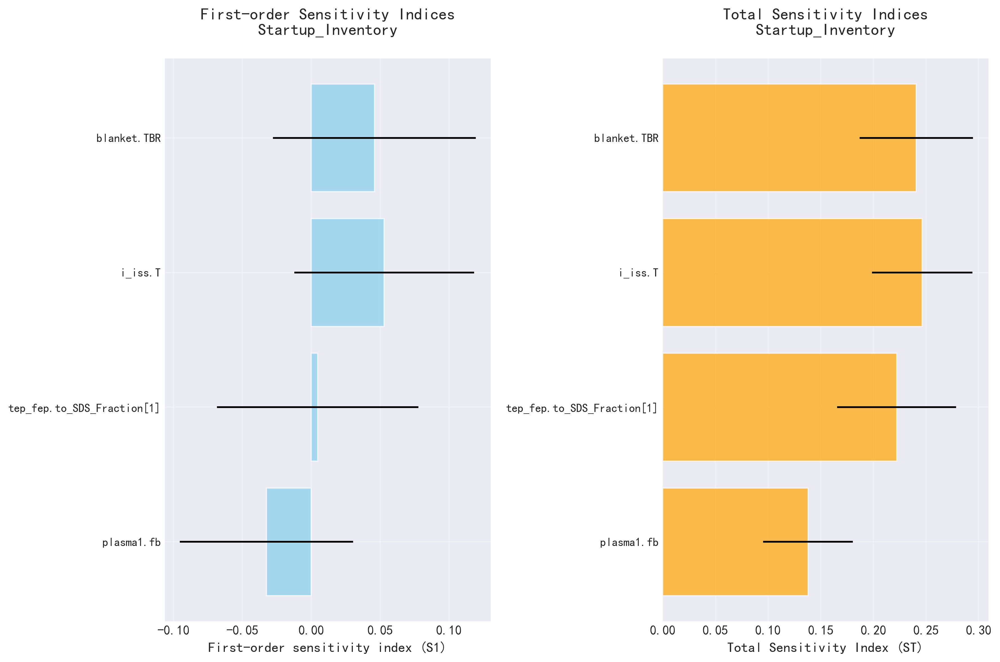
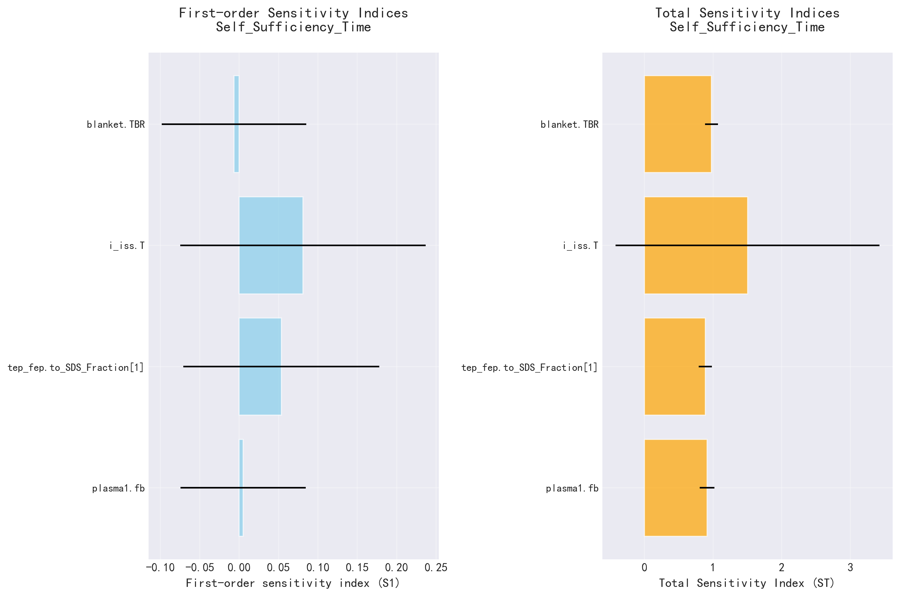
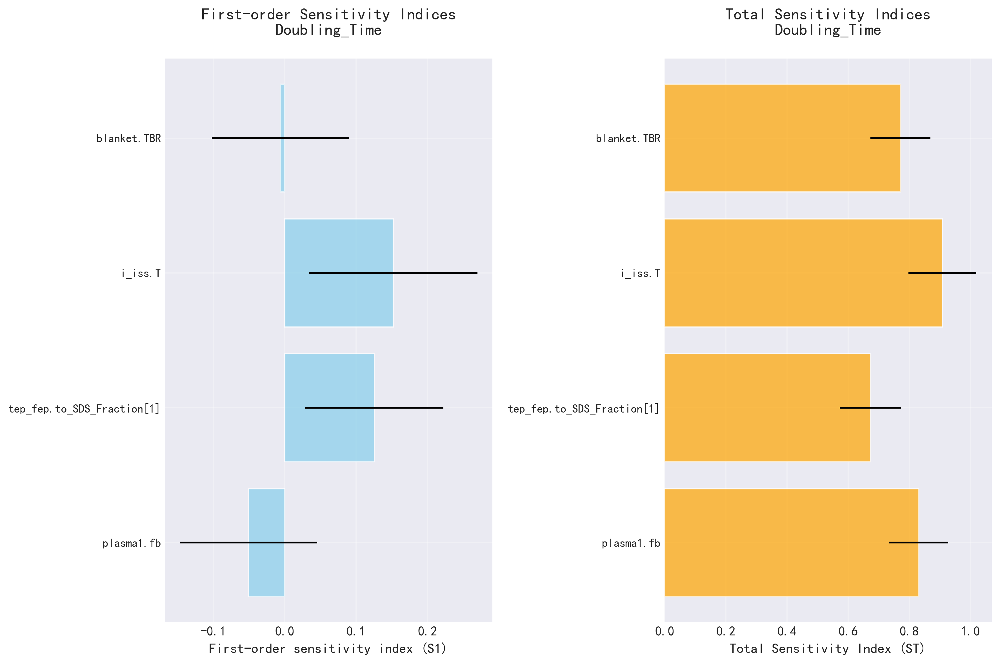

# SALib 敏感性分析报告

生成时间: 2025-10-13 10:42:48.228927

## 分析参数

- **plasma1.fb**: [0.0200, 0.2000]
- **tep_fep.to_SDS_Fraction[1]**: [0.1000, 0.9900]
- **i_iss.T**: [4.0000, 12.0000]
- **blanket.TBR**: [1.0500, 1.2500]

## Startup_Inventory 敏感性分析结果

### Sobol敏感性指数

| 参数 | S1 (一阶) | ST (总) | S1置信区间 | ST置信区间 |
|------|----------|---------|------------|------------|
| plasma1.fb | -0.0325 | 0.1379 | ±0.0629 | ±0.0427 |
| tep_fep.to_SDS_Fraction[1] | 0.0047 | 0.2221 | ±0.0731 | ±0.0566 |
| i_iss.T | 0.0530 | 0.2462 | ±0.0653 | ±0.0477 |
| blanket.TBR | 0.0459 | 0.2406 | ±0.0736 | ±0.0538 |



## Self_Sufficiency_Time 敏感性分析结果

### Sobol敏感性指数

| 参数 | S1 (一阶) | ST (总) | S1置信区间 | ST置信区间 |
|------|----------|---------|------------|------------|
| plasma1.fb | 0.0051 | 0.9128 | ±0.0795 | ±0.1071 |
| tep_fep.to_SDS_Fraction[1] | 0.0535 | 0.8851 | ±0.1246 | ±0.0967 |
| i_iss.T | 0.0809 | 1.5019 | ±0.1559 | ±1.9233 |
| blanket.TBR | -0.0065 | 0.9765 | ±0.0917 | ±0.0958 |



## Doubling_Time 敏感性分析结果

### Sobol敏感性指数

| 参数 | S1 (一阶) | ST (总) | S1置信区间 | ST置信区间 |
|------|----------|---------|------------|------------|
| plasma1.fb | -0.0504 | 0.8307 | ±0.0960 | ±0.0965 |
| tep_fep.to_SDS_Fraction[1] | 0.1255 | 0.6730 | ±0.0967 | ±0.1003 |
| i_iss.T | 0.1521 | 0.9077 | ±0.1178 | ±0.1110 |
| blanket.TBR | -0.0060 | 0.7709 | ±0.0959 | ±0.0981 |




---

# AI模型分析提示词

```markdown
**角色：** 你是一名在氚燃料循环领域具有深厚背景的敏感性分析专家。

**任务：** 请仔细审查并解读以下这份由SALib库生成的敏感性分析报告。你的目标是：
1.  **总结核心发现**：简明扼要地总结报告中的关键信息。
2.  **识别关键参数**：对于报告中提到的每一个输出指标（如“启动氚量”、“倍增时间”等），明确指出哪些输入参数对它的影响最大（即最敏感）。
3.  **提供综合结论**：基于所有分析结果，对模型的整体行为、参数间的相互作用（如果可能）以及这些发现对工程实践的潜在启示，给出一个综合性的结论。

请确保你的分析清晰、专业，并直接切入要点。

```


---

# AI模型分析结果

### **氚燃料循环敏感性分析综合解读**

---

#### **1. 核心发现总结**

本报告基于SALib库，采用Sobol全局敏感性分析方法，评估了四个关键输入参数对三个核心氚循环性能指标的影响：
- **Startup_Inventory**（启动氚量）
- **Self_Sufficiency_Time**（自持时间）
- **Doubling_Time**（倍增时间）

输入参数及其物理含义如下：
- **plasma1.fb**：等离子体燃料循环中未回收燃料的比例（越小表示回收效率越高）
- **tep_fep.to_SDS_Fraction[1]**：从氚提取处理系统（TEP/FEP）流向短期贮存系统（SDS）的氚份额
- **i_iss.T**：同位素分离系统（ISS）的运行温度（影响分离效率）
- **blanket.TBR**：包层氚增殖比（Tritium Breeding Ratio），反映中子-氚转换效率

总体而言：
- **启动氚量**受各参数影响较弱，且存在显著的参数间交互作用（ST远大于S1）。
- **自持时间和倍增时间**对几乎所有参数高度敏感，尤其受**非线性效应和参数交互作用**主导（ST >> S1，且部分S1接近零甚至为负）。
- 所有输出指标中，**i_iss.T** 和 **blanket.TBR** 表现出最强的综合影响力。

---

#### **2. 关键参数识别（按输出指标）**

##### **(a) Startup_Inventory（启动氚量）**
- **最敏感参数**：  
  - **i_iss.T**（ST = 0.246）  
  - **blanket.TBR**（ST = 0.241）  
  - **tep_fep.to_SDS_Fraction[1]**（ST = 0.222）  
- **观察**：  
  所有S1值均接近零（甚至为负），表明**单个参数的独立贡献极小**，启动氚量主要由**参数间的高阶交互作用**决定。这暗示系统在初始阶段对操作策略和系统耦合高度敏感。

##### **(b) Self_Sufficiency_Time（自持时间）**
- **最敏感参数**：  
  - **blanket.TBR**（ST = 0.977）  
  - **plasma1.fb**（ST = 0.913）  
  - **tep_fep.to_SDS_Fraction[1]**（ST = 0.885）  
  - **i_iss.T**（ST = 1.502，但置信区间极大，可能因数值不稳定或模型非线性导致高估）
- **观察**：  
  所有S1值均接近零，而ST接近或超过0.9，说明**自持时间几乎完全由参数交互和非线性响应控制**。其中，**包层TBR**和**等离子体燃料损失率（fb）** 是最关键的驱动因素。

##### **(c) Doubling_Time（倍增时间）**
- **最敏感参数**：  
  - **i_iss.T**（ST = 0.908）  
  - **plasma1.fb**（ST = 0.831）  
  - **blanket.TBR**（ST = 0.771）  
  - **tep_fep.to_SDS_Fraction[1]**（ST = 0.673）  
- **观察**：  
  尽管S1仍较低，但**i_iss.T** 和 **plasma1.fb** 的一阶效应相对更显著（S1 ≈ 0.15 和 -0.05），表明在倍增阶段，**同位素分离效率**和**燃料回收率**开始显现独立影响，但仍以交互作用为主。

---

#### **3. 综合结论与工程启示**

- **系统高度耦合，交互效应主导**：  
  在氚燃料循环中，**单一参数优化不足以显著改善性能**。尤其是自持与倍增阶段，系统行为由多个子系统（包层、等离子体燃料循环、同位素分离、贮存策略）的**强非线性耦合**决定。

- **关键杠杆点**：  
  - **blanket.TBR** 是影响**自持时间**的首要因素，提升包层氚增殖能力可显著缩短达到氚自持所需时间。  
  - **i_iss.T** 对**倍增时间**和**启动库存**均有强影响，表明优化同位素分离系统的热力学效率（如降低运行温度以提高分离因子）具有高回报。  
  - **plasma1.fb**（燃料回收损失）虽S1为负或接近零，但其高ST值表明：**减少等离子体燃料循环中的氚滞留或损失**，对长期氚增殖能力至关重要。

- **工程设计建议**：  
  1. **优先保障高TBR包层设计**（如采用锂铅或固态增殖剂优化中子学性能）。  
  2. **强化燃料回收系统**（降低plasma1.fb），避免氚在等离子体侧不可逆滞留。  
  3. **协同优化ISS与TEP/FEP操作策略**：因tep_fep.to_SDS_Fraction[1]与i_iss.T交互显著，需联合设计氚提取、分离与贮存流程，避免中间环节造成瓶颈。  
  4. **启动阶段需系统级仿真**：由于启动库存对交互作用敏感，应采用全系统动态模型进行初始氚装载策略评估，而非依赖单参数估算。

> **总结**：该氚循环系统表现出典型的“整体大于部分之和”特性。未来研发应聚焦**子系统集成优化**，而非孤立改进单一组件。高ST/S1比值警示：忽略参数交互将严重低估系统不确定性，影响聚变堆氚自持可行性评估的可靠性。